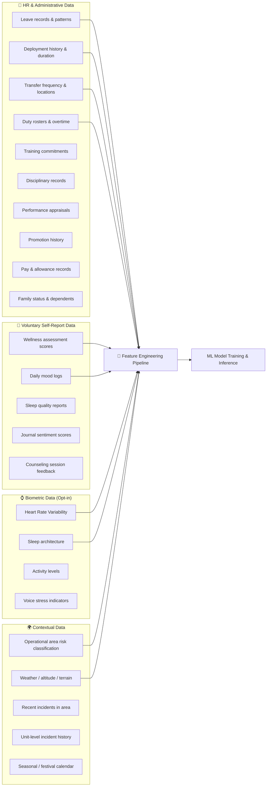
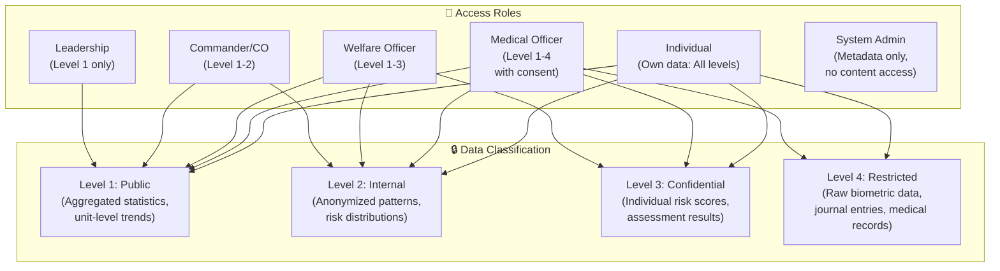
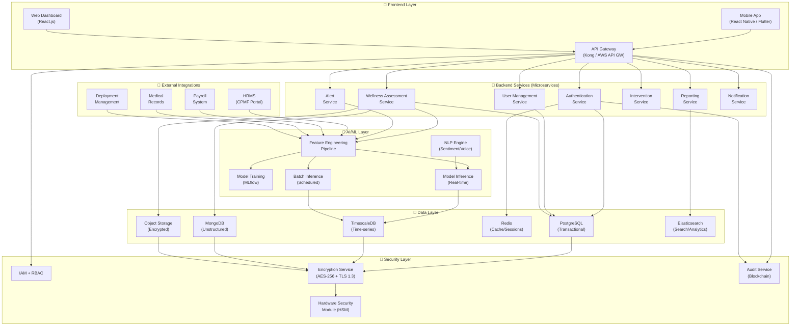
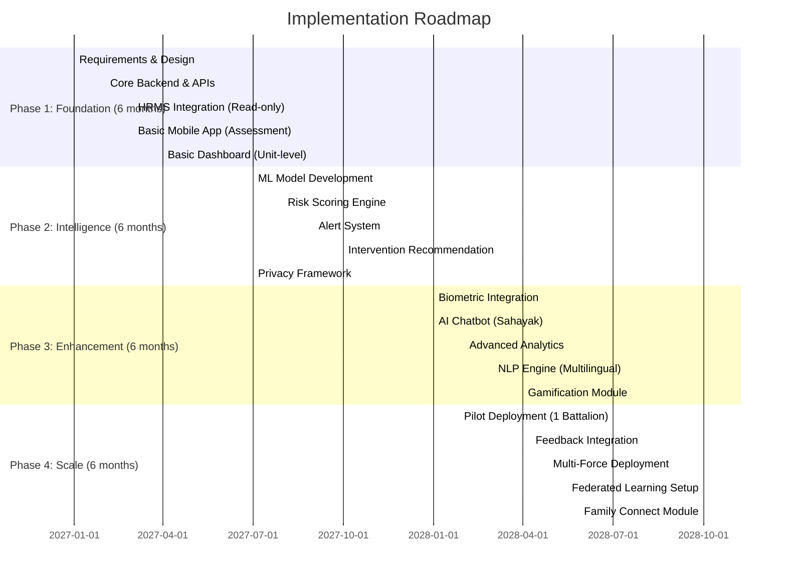

# 🛡️ AI-Powered Personnel Stress & Welfare Monitoring System
## Comprehensive Feature Report & Analysis

---

## 1. WHAT IS THIS APP?

This is an **AI-driven predictive analytics platform** designed to proactively monitor, detect, and address stress, burnout, emotional fatigue, and psychological distress among personnel serving in high-stress uniformed services — primarily India's Central Armed Police Forces (CAPFs), Armed Forces, and other paramilitary/police organizations.

### The Core Problem It Solves

| Current State (Reactive) | Proposed State (Proactive) |
|---|---|
| Stress identified only after visible symptoms or incidents | Early warning signals detected through AI pattern analysis |
| Self-reporting is stigmatized; personnel avoid seeking help | Anonymous, voluntary, non-punitive digital self-assessment |
| Manual observation by commanders — subjective, inconsistent | Data-driven, objective risk scoring with behavioral analytics |
| Interventions happen **after** breakdowns, incidents, or crises | Interventions triggered **before** critical thresholds are reached |
| No centralized welfare data; siloed across units | Unified dashboard with organizational-level and individual-level insights |
| One-size-fits-all welfare programs | Personalized recommendations based on individual risk profiles |

### In One Line
> **A digital welfare officer that never sleeps** — continuously analyzing organizational data, voluntary wellness inputs, and behavioral patterns to ensure no soldier, constable, or officer falls through the cracks.

---

## 2. WHO IS IT FOR?

### Primary Users

| User Role | How They Use It |
|---|---|
| **Individual Personnel** (Constables, Soldiers, Officers) | Mobile app for self-assessment, wellness tracking, accessing counseling resources, anonymous stress reporting |
| **Welfare Officers** | Dashboard to view unit-level risk heatmaps, individual risk scores (authorized), trigger interventions, track counseling outcomes |
| **Unit Commanders / COs** | Aggregated unit wellness reports (anonymized), workload balancing insights, deployment readiness assessments |
| **Medical Officers / Psychologists** | Clinical referral workflows, detailed individual wellness histories (with consent), treatment tracking |
| **HR / Personnel Branch** | Leave pattern analysis, transfer impact assessments, workforce planning based on wellness trends |
| **Senior Leadership / IGPs / GOCs** | Strategic dashboards — force-wide wellness trends, policy impact analysis, resource allocation for welfare programs |
| **System Administrators** | User management, role-based access control, audit logs, data security management |

### Target Organizations

```mermaid
graph TD
    A["🎯 Target Market"] --> B["🇮🇳 Primary"]
    A --> C["🌐 Secondary"]
    A --> D["🏢 Tertiary"]
    
    B --> B1["CRPF - 3.5L personnel"]
    B --> B2["BSF - 2.65L personnel"]
    B --> B3["CISF - 1.8L personnel"]
    B --> B4["ITBP - 90K personnel"]
    B --> B5["SSB - 98K personnel"]
    B --> B6["NSG, NDRF, Assam Rifles"]
    B --> B7["Indian Army, Navy, Air Force - 14L+"]
    
    C --> C1["State Police Forces - 29 States"]
    C --> C2["State Armed Police Battalions"]
    C --> C3["Disaster Response Forces"]
    C --> C4["Fire Services"]
    
    D --> D1["Corporate EAP Programs"]
    D --> D2["International Peacekeeping Forces"]
    D --> D3["Private Security Firms"]
    D --> D4["Healthcare Worker Systems"]
```



---

## 3. COMPLETE FEATURE BREAKDOWN

---

### 📱 MODULE 1: Mobile-Based Wellness & Self-Assessment Application

This is the **personnel-facing** component — the primary touchpoint for individual users.

#### 3.1.1 Wellness Self-Assessment Tools

| Feature | Description | Implementation Approach |
|---|---|---|
| **PHQ-9 Depression Screening** | Validated 9-question Patient Health Questionnaire | Adaptive questionnaire UI with scoring engine; results stored encrypted; trends tracked over time |
| **GAD-7 Anxiety Assessment** | 7-item Generalized Anxiety Disorder scale | Same adaptive engine; combined with PHQ-9 for composite mental health scoring |
| **Perceived Stress Scale (PSS-10)** | 10-item stress perception questionnaire | Periodic push notifications for scheduled assessments; gamified completion streaks |
| **Burnout Inventory (MBI adapted)** | Maslach Burnout Inventory adapted for uniformed services | Measures Emotional Exhaustion, Depersonalization, and Personal Accomplishment dimensions |
| **Custom CAPF Stress Index** | India-specific, culturally adapted stress questionnaire | Developed with NIMHANS/DRDO behavioral scientists; includes factors unique to Indian forces (family separation, LWE operations, border postings, etc.) |
| **Daily Mood Tracker** | Simple 1-tap daily mood logging (emoji-based or 5-point scale) | Minimal friction input; ML detects mood trajectory patterns; alerts on sustained negative trends |
| **Sleep Quality Logger** | Track sleep duration, quality, disturbances | Integration with device health APIs (HealthKit/Google Fit); manual override option |
| **Wellness Journal** | Free-text journaling with optional AI sentiment analysis | End-to-end encrypted; NLP sentiment analysis runs on-device (no server-side text storage); only sentiment scores transmitted |

**How to make it better:**
- 🔹 **Voice-based assessments** in regional languages (Hindi, Tamil, Telugu, Marathi, etc.) using speech-to-text + NLP — many jawans may be less comfortable with text
- 🔹 **Offline-first architecture** — critical for border postings (LoC, LAC, Naxal areas) with no/limited connectivity; sync when network available
- 🔹 **Chatbot counselor** — AI-powered initial triage chatbot (like a digital "buddy") that can provide CBT-based coping techniques, breathing exercises, and escalate to human counselors
- 🔹 **Family wellness module** — optional module for families to report concerns (with personnel's consent)
- 🔹 **Peer buddy system** — anonymous peer-to-peer support matching within the app

#### 3.1.2 Biometric & Wellness Data Integration (Voluntary)

| Data Source | What It Captures | Privacy Approach |
|---|---|---|
| **Smartwatch/Fitness Band** | Heart rate, HRV (Heart Rate Variability), sleep patterns, activity levels | Opt-in only; data processed on-device; only aggregated wellness scores shared |
| **Smartphone Sensors** | Screen time patterns, app usage patterns, movement patterns | Passive sensing with explicit consent; differential privacy applied |
| **Voice Stress Analysis** | Vocal biomarkers during voluntary check-ins | On-device processing only; no audio stored; only stress probability score transmitted |
| **Facial Micro-expression Analysis** | Voluntary video check-ins to detect emotional states | Edge AI processing; no video stored; only emotion classification scores retained |

**How to make it better:**
- 🔹 **Cortisol estimation** from wearable data (emerging research using HRV + skin conductance)
- 🔹 **Ambient environmental sensors** — track noise levels, temperature extremes, sleep environment quality at barracks
- 🔹 **Nutrition tracking** — mess food quality logging; link poor nutrition to stress outcomes

#### 3.1.3 Wellness Resources & Support

| Feature | Description |
|---|---|
| **Guided Meditation Library** | Audio/video meditation sessions (yoga nidra, pranayama — culturally relevant) |
| **CBT Exercise Modules** | Cognitive Behavioral Therapy self-help exercises |
| **Emergency SOS** | One-tap connection to duty psychologist / crisis helpline |
| **Counseling Appointment Booking** | Schedule confidential sessions with unit medical officer or psychologist |
| **Wellness Content Feed** | Curated articles, videos on stress management, family coping, financial wellness |
| **Fitness Challenges** | Unit-level and individual fitness goals with gamification |
| **Peer Stories** | Anonymous success stories of personnel who sought help and recovered |

---

### 📊 MODULE 2: Personnel Wellness Monitoring Dashboard

This is the **command-facing** component — used by welfare officers, commanders, and leadership.

#### 3.2.1 Unit-Level Wellness Overview

| Feature | Description | Implementation |
|---|---|---|
| **Wellness Heatmap** | Color-coded map showing stress levels across units, locations, formations | GIS-integrated visualization; aggregated data (minimum 20 personnel per cell to prevent identification); red/amber/green zones |
| **Risk Distribution Charts** | Pie charts / bar charts showing % of personnel in low/medium/high/critical risk categories | Real-time data pipeline from analytics engine; drill-down by rank, age group, service length, posting area |
| **Trend Analysis** | Time-series graphs showing wellness trends over weeks/months/quarters | Seasonal decomposition to identify cyclical patterns (e.g., stress spikes during election duty, festivals) |
| **Comparative Analytics** | Compare wellness metrics across battalions, sectors, formations | Benchmarking framework; identify best/worst performing units for resource allocation |
| **Deployment Impact Score** | Quantified measure of how current deployments affect unit wellness | Composite score based on deployment duration, area classification, incident frequency, casualty exposure |

**How to make it better:**
- 🔹 **Predictive forecasting view** — "Next 30 days risk forecast" based on upcoming deployments, festivals, elections, weather
- 🔹 **What-if simulator** — "If we rotate Battalion X from Srinagar to Hyderabad, what's the predicted wellness impact?"
- 🔹 **Natural language query** — commanders type questions like "Show me jawans who've done >18 months continuous border posting without leave" and get instant answers
- 🔹 **Integration with ops room** — real-time operational tempo correlation with stress metrics

#### 3.2.2 Individual Risk Profiles (Authorized Access Only)

| Feature | Description | Access Control |
|---|---|---|
| **Individual Risk Score** | 0-100 composite score with contributing factors breakdown | Accessible only by designated welfare officer + unit MO; requires 2FA + audit log |
| **Risk Timeline** | Historical risk trajectory for an individual | Shows how risk score changed over months; correlates with life/service events |
| **Contributing Factors** | Breakdown of what's driving the risk score | e.g., "Leave deficit: 35%, Deployment duration: 25%, Self-reported mood: 20%, Workload: 20%" |
| **Intervention History** | Track what interventions were provided and their outcomes | Closed-loop tracking: recommendation → action → follow-up → outcome |
| **Peer Comparison** | How does this individual compare to their cohort (anonymized) | Never shown to the individual; only to welfare officer for context |

> [!CAUTION]
> Individual-level data is the most sensitive component. Access must be strictly controlled with multi-factor authentication, role verification, and complete audit trails. Any misuse must trigger immediate alerts to the Data Protection Officer.

#### 3.2.3 Alerts & Notification System

| Alert Type | Trigger | Recipient | Priority |
|---|---|---|---|
| **Critical Risk Alert** | Individual risk score exceeds critical threshold (e.g., >85/100) | Welfare Officer + Unit MO | 🔴 Immediate |
| **Escalating Risk Alert** | Risk score increasing >15 points in 7 days | Welfare Officer | 🟠 High |
| **Sustained High Risk** | Risk score >60 for >30 consecutive days | Welfare Officer + CO (anonymized) | 🟠 High |
| **Unit Risk Spike** | >20% of unit personnel in high-risk category | CO + Formation Welfare | 🟡 Medium |
| **Post-Incident Alert** | Triggered after major operational incidents (encounter, IED, casualty) | All welfare personnel for affected unit | 🔴 Immediate |
| **Leave Deficit Alert** | Individual hasn't taken leave in >90 days | Personnel Branch + Welfare | 🟡 Medium |
| **Assessment Overdue** | Scheduled wellness assessment not completed | Individual (gentle reminder) | 🟢 Low |
| **Anomaly Detection** | Unusual behavioral pattern detected (sudden change in digital behavior) | Welfare Officer | 🟠 High |

**How to make it better:**
- 🔹 **Cascade escalation** — if welfare officer doesn't acknowledge critical alert within 4 hours, auto-escalate to next level
- 🔹 **Smart suppression** — prevent alert fatigue by grouping related alerts and prioritizing actionable ones
- 🔹 **Post-incident automatic protocol** — after any major incident, automatically trigger CISD (Critical Incident Stress Debriefing) workflow for entire unit

---

### 🧠 MODULE 3: Predictive Behavioral Analytics Engine

This is the **brain** of the system — the AI/ML core.

#### 3.3.1 Data Sources & Feature Engineering



#### 3.3.2 ML Models & Algorithms

| Model | Purpose | Algorithm Choice | Why This Algorithm |
|---|---|---|---|
| **Stress Risk Predictor** | Predict probability of high stress in next 30 days | Gradient Boosted Trees (XGBoost/LightGBM) + LSTM for temporal patterns | XGBoost handles tabular HR data well; LSTM captures temporal sequences in deployment/leave patterns |
| **Burnout Trajectory Model** | Predict burnout onset timeline | Survival Analysis (Cox Proportional Hazards) | Naturally models "time-to-event" with censored data; provides hazard ratios for each factor |
| **Anomaly Detection** | Identify unusual behavioral shifts | Isolation Forest + Autoencoders | Isolation Forest for tabular anomalies; Autoencoders for multimodal behavioral pattern deviations |
| **Cluster Risk Profiling** | Group personnel into risk archetypes | K-Means + DBSCAN | Identify common risk profiles (e.g., "long-deployment-no-leave", "recent-incident-exposure", "family-crisis") |
| **NLP Sentiment Analyzer** | Analyze self-report text and journal entries | Transformer-based model (multilingual BERT / IndicBERT) | Supports Hindi, Tamil, Telugu + 20 Indian languages; fine-tuned on military/police context |
| **Workload Imbalance Detector** | Identify unfair workload distribution across personnel | Statistical process control + regression | Detect systematic patterns in duty allocation that correlate with stress |
| **Intervention Effectiveness Predictor** | Predict which intervention will work best for a given risk profile | Multi-armed bandit / Reinforcement Learning | Learns from historical intervention outcomes; continuously improves recommendations |
| **Social Network Stress Propagation** | Model how stress spreads through unit social connections | Graph Neural Networks (GNN) | Stress in one team member affects others; GNN can model contagion effects |
| **Attrition Risk Model** | Predict voluntary resignation / premature retirement likelihood | Logistic Regression + Random Forest ensemble | Interpretable model preferred for sensitive predictions; ensemble for accuracy |
| **PTSD Risk Screener** | Identify personnel at risk of PTSD post-incident | Recurrent Neural Network on post-incident behavioral sequences | Captures temporal changes in behavior after traumatic events |

**How to make it better:**
- 🔹 **Explainable AI (XAI)** — every risk score must come with human-readable explanations ("Top 3 reasons for this score: 1. No leave in 120 days, 2. Third consecutive border posting, 3. Declining self-assessment scores")
- 🔹 **Causal inference models** — move beyond correlation to causation (e.g., "Does this deployment *cause* stress, or do already-stressed personnel get assigned there?")
- 🔹 **Federated learning** — train models across forces without centralizing sensitive data
- 🔹 **Fairness-aware ML** — ensure models don't discriminate by rank, region, language, or caste
- 🔹 **Continuous model retraining** — automated MLOps pipeline for model drift detection and retraining

#### 3.3.3 Risk Scoring Framework

```
┌────────────────────────────────────────────────────────────┐
│                 COMPOSITE RISK SCORE (0-100)                │
├────────────────────────────────────────────────────────────┤
│                                                            │
│  ┌─────────────────┐  Weight: 30%                         │
│  │ ORGANIZATIONAL   │  • Leave deficit score               │
│  │ FACTORS          │  • Deployment stress index            │
│  │                  │  • Workload imbalance score           │
│  │                  │  • Transfer disruption index          │
│  └─────────────────┘                                       │
│                                                            │
│  ┌─────────────────┐  Weight: 25%                         │
│  │ SELF-REPORTED    │  • Assessment scores (PHQ-9, GAD-7)  │
│  │ WELLNESS         │  • Mood trajectory                    │
│  │                  │  • Sleep quality trend                │
│  │                  │  • Journal sentiment                  │
│  └─────────────────┘                                       │
│                                                            │
│  ┌─────────────────┐  Weight: 20%                         │
│  │ BEHAVIORAL       │  • Pattern change detection           │
│  │ INDICATORS       │  • Social interaction changes         │
│  │                  │  • Performance trend shifts            │
│  │                  │  • Anomaly scores                     │
│  └─────────────────┘                                       │
│                                                            │
│  ┌─────────────────┐  Weight: 15%                         │
│  │ CONTEXTUAL       │  • Operational area risk              │
│  │ FACTORS          │  • Recent incidents                   │
│  │                  │  • Seasonal stress factors             │
│  │                  │  • Unit-level climate                  │
│  └─────────────────┘                                       │
│                                                            │
│  ┌─────────────────┐  Weight: 10%                         │
│  │ BIOMETRIC        │  • HRV trends (if opted in)          │
│  │ (OPTIONAL)       │  • Sleep architecture                │
│  │                  │  • Activity patterns                  │
│  │                  │  • Physiological stress markers       │
│  └─────────────────┘                                       │
│                                                            │
├────────────────────────────────────────────────────────────┤
│  RISK LEVELS:                                              │
│  🟢 0-25: Low Risk    │  🟡 26-50: Moderate Risk           │
│  🟠 51-75: High Risk  │  🔴 76-100: Critical Risk          │
└────────────────────────────────────────────────────────────┘
```

---

### 🏥 MODULE 4: Welfare Intervention Recommendation System

#### 3.4.1 Intervention Types & Triggers

| Risk Level | Automated Recommendations | Escalation Path |
|---|---|---|
| 🟢 **Low (0-25)** | Wellness tips, meditation suggestions, fitness challenges, appreciation nudges | No escalation; self-managed |
| 🟡 **Moderate (26-50)** | Suggest leave application, buddy pairing, workload review, group wellness session | Notify welfare officer for awareness |
| 🟠 **High (51-75)** | Recommend counseling session, temporary duty adjustment, leave sanction, family connect facilitation | Alert welfare officer + unit MO; mandatory follow-up within 72 hours |
| 🔴 **Critical (76-100)** | Immediate counseling referral, medical evaluation, duty reassignment, crisis intervention protocol | Alert welfare officer + CO + formation medical; mandatory action within 24 hours |

#### 3.4.2 Intervention Catalog

| Category | Specific Interventions |
|---|---|
| **Rest & Recovery** | Mandatory leave sanction, extended rest period, temporary light duty, R&R posting |
| **Counseling & Therapy** | Individual counseling, group therapy, CISD sessions, trauma-focused CBT, EMDR referral |
| **Workload Management** | Duty roster adjustment, overtime reduction, task redistribution, temporary posting change |
| **Social Support** | Buddy pairing, family facilitation (video calls, family visit), peer support group, mentoring |
| **Physical Wellness** | Yoga/meditation program, physical fitness refresher, nutritional counseling, sleep hygiene program |
| **Professional Development** | Skill training (distraction from stressors), career counseling, posting preference consideration |
| **Environmental** | Barrack/accommodation improvement, recreational facilities upgrade, canteen quality review |
| **Financial** | Financial counseling, advance salary facilitation, family welfare fund assistance |

**How to make it better:**
- 🔹 **Intervention effectiveness tracking** — track which interventions actually worked for which risk profiles; feed back into the recommendation engine
- 🔹 **Cultural sensitivity engine** — adapt recommendations based on cultural background, regional practices, and personal preferences
- 🔹 **Resource availability check** — before recommending counseling, verify that a counselor is actually available at the unit/formation level
- 🔹 **Cost-benefit analysis** — for leadership: "Investing ₹X in these interventions is projected to prevent Y incidents and save ₹Z in operational losses"

---

### 🔐 MODULE 5: Privacy & Security Framework

This is arguably the **most critical** module — without trust, the system fails.

#### 3.5.1 Privacy Architecture



#### 3.5.2 Privacy-Preserving Technologies

| Technology | Application | How It Works |
|---|---|---|
| **Differential Privacy** | Aggregate statistics | Adds calibrated noise to query results; ensures no individual can be identified from aggregate data |
| **Homomorphic Encryption** | Computation on encrypted data | ML models can compute risk scores without decrypting individual data |
| **Federated Learning** | Cross-force model training | Models trained locally at each force; only model parameters (not data) shared |
| **k-Anonymity** | Dashboard displays | Any group shown must have ≥k members (e.g., k=20) to prevent identification |
| **On-Device Processing** | Biometric/voice/sentiment analysis | Sensitive processing happens on the user's device; only scores transmitted |
| **Zero-Knowledge Proofs** | Verification without disclosure | Verify a person completed an assessment without revealing their answers |
| **Data Minimization** | All modules | Collect only what's necessary; auto-delete raw data after processing into scores |
| **Blockchain Audit Trail** | Access logging | Immutable, tamper-proof record of who accessed what data and when |

#### 3.5.3 Legal & Ethical Compliance

| Framework | Relevance |
|---|---|
| **IT Act 2000 (India)** | Data protection provisions, reasonable security practices |
| **Digital Personal Data Protection Act 2023** | Consent management, purpose limitation, data retention limits |
| **Armed Forces specific regulations** | Compliance with service-specific data handling protocols |
| **MHA guidelines on CAPF welfare** | Alignment with Ministry of Home Affairs welfare frameworks |
| **WHO guidelines on workplace mental health** | Evidence-based approach to occupational mental health |
| **AI Ethics frameworks (NITI Aayog)** | Responsible AI principles — fairness, transparency, accountability |

#### 3.5.4 Anti-Stigmatization Safeguards

| Safeguard | Description |
|---|---|
| **Welfare-only usage guarantee** | Legal and policy framework ensuring data CANNOT be used for disciplinary action, promotions, or postings |
| **Data firewall** | Complete technical separation between wellness data and personnel management/disciplinary systems |
| **Anonymous mode** | Personnel can use self-assessment tools in fully anonymous mode (no identity linked) |
| **Positive framing** | System language uses "wellness optimization" rather than "mental health screening" to reduce stigma |
| **Mandatory leadership training** | Commanders trained on ethical use of system; certification required before dashboard access |
| **Independent oversight** | External ethics committee reviews system usage quarterly |
| **Right to deletion** | Personnel can request deletion of all their voluntary data at any time |
| **Whistleblower protection** | Protected channel to report system misuse |

---

### ⚙️ MODULE 6: System Integration & Technical Architecture

#### 3.6.1 High-Level Architecture



#### 3.6.2 Technology Stack Recommendations

| Layer | Technology | Justification |
|---|---|---|
| **Mobile App** | Flutter (Dart) | Single codebase for Android/iOS; offline-first capability; Indian language support; Defense-grade security plugins |
| **Web Dashboard** | React.js + D3.js/Recharts | Interactive visualizations; component reusability; large ecosystem |
| **API Gateway** | Kong or APISIX | Rate limiting, authentication, API versioning; can be self-hosted (no cloud dependency for classified networks) |
| **Backend** | Python (FastAPI) + Go (high-performance services) | FastAPI for ML integration; Go for high-throughput alert/notification services |
| **ML/AI** | Python (scikit-learn, XGBoost, PyTorch, HuggingFace Transformers) | Industry standard; IndicBERT for Indian language NLP |
| **MLOps** | MLflow + Kubeflow | Model versioning, experiment tracking, automated retraining pipelines |
| **Database** | PostgreSQL + TimescaleDB + MongoDB | PostgreSQL for ACID compliance; TimescaleDB for time-series wellness data; MongoDB for flexible assessment schemas |
| **Cache** | Redis | Session management, real-time risk score caching |
| **Search** | Elasticsearch | Full-text search across anonymized records, log analysis |
| **Message Queue** | Apache Kafka | Event-driven architecture; reliable alert delivery; data pipeline streaming |
| **Container Orchestration** | Kubernetes (on-premise) | Self-hosted for classified environments; no public cloud dependency for core system |
| **Encryption** | AES-256 (at rest) + TLS 1.3 (in transit) + HSM for key management | Military-grade encryption; HSM prevents key extraction |
| **Monitoring** | Prometheus + Grafana | System health monitoring; SLA tracking |

**How to make it better:**
- 🔹 **Air-gapped deployment option** — for highly sensitive installations (NSG, Special Forces), support fully air-gapped deployment with USB-based data sync
- 🔹 **Edge computing nodes** — deploy lightweight ML inference at remote postings (raspberry pi / edge devices) for low-latency, offline-capable risk assessment
- 🔹 **Multi-cloud / hybrid deployment** — core on government NIC infrastructure; non-sensitive components on Meghraj (GI Cloud)
- 🔹 **API-first design** — enable third-party wellness app integrations (Headspace, Calm, Wysa) for those who prefer them

---

### 📈 MODULE 7: Reporting & Analytics

#### 3.7.1 Report Types

| Report | Audience | Frequency | Content |
|---|---|---|---|
| **Daily Wellness Pulse** | Welfare Officer | Daily | Today's critical/high-risk alerts, assessment completions, pending follow-ups |
| **Weekly Unit Report** | CO / Commandant | Weekly | Unit-level risk distribution, trending indicators, intervention summary |
| **Monthly Wellness Digest** | Formation HQ | Monthly | Cross-unit comparisons, trend analysis, resource utilization, intervention effectiveness |
| **Quarterly Strategic Review** | IG / DG level | Quarterly | Force-wide trends, policy impact analysis, budget recommendations, benchmark comparisons |
| **Annual Wellness Report** | MHA / Ministry level | Annual | Strategic metrics, YoY comparisons, ROI analysis, policy recommendations |
| **Post-Incident Report** | Automatic trigger | Per incident | Unit wellness status, at-risk personnel identification, recommended CISD actions |
| **Individual Wellness Summary** | Individual (self-view) | On-demand | Personal wellness trends, achievement badges, resource recommendations |

#### 3.7.2 Advanced Analytics Features

| Feature | Description |
|---|---|
| **Predictive forecasting** | "Based on current trends, 12% of Sector X personnel will reach high-risk by next quarter" |
| **Root cause analysis** | "Top 3 stress drivers in Eastern sector: 1. Consecutive Naxal area postings, 2. Housing quality, 3. Leave backlog" |
| **Policy impact simulation** | "If we implement 'mandatory 15-day leave after 6 months' policy, predicted 22% reduction in high-risk cases" |
| **Benchmarking** | Compare battalions/formations against each other and against national averages |
| **Demographic insights** | Stress patterns by age group, rank, service length, marital status (all anonymized, k-anonymity enforced) |

---

## 4. ADDITIONAL FEATURES & ENHANCEMENTS (WHAT MAKES IT WORLD-CLASS)

These are **additional features not in the original scope** that would significantly elevate the system:

### 4.1 Family Connect Module
| Feature | Description |
|---|---|
| **Family Wellness App** | Separate app for families to access counseling, report concerns, and stay connected |
| **Children's Support** | Age-appropriate content for children dealing with parent's deployment |
| **Spouse Employment Support** | Job board / skill development resources for service spouses |
| **Family Emergency Alerts** | Instant notification to personnel about family emergencies; auto-trigger compassionate leave workflow |

### 4.2 Post-Retirement Transition Support
| Feature | Description |
|---|---|
| **Retirement Readiness Score** | Assess personnel nearing retirement for transition anxiety |
| **Career Transition Tools** | Resume builder, corporate culture training, civilian job matching |
| **Alumni Wellness Network** | Continue wellness monitoring and peer support post-retirement |
| **Identity Transition Counseling** | Specialized support for the psychological shift from uniformed service to civilian life |

### 4.3 Organizational Health Analytics
| Feature | Description |
|---|---|
| **Unit Culture Score** | ML-derived score measuring unit cohesion, leadership quality, and morale |
| **Leadership Effectiveness Index** | How does a CO's leadership style correlate with unit wellness (anonymized, aggregate) |
| **Policy Impact Tracker** | Before/after analysis of welfare policies |
| **Cross-Force Benchmarking** | Anonymous comparison across CAPFs (CRPF vs BSF vs CISF) |

### 4.4 Gamification & Engagement
| Feature | Description |
|---|---|
| **Wellness Points** | Earn points for completing assessments, meditation, fitness goals |
| **Leaderboards** | Unit-level wellness leaderboards (positive reinforcement) |
| **Badges & Achievements** | "7-day meditation streak", "Wellness Champion", "Peer Support Hero" |
| **Wellness Challenges** | Monthly themed challenges (sleep quality month, fitness February) |

### 4.5 AI Chatbot — "Sahayak" (सहायक)
| Feature | Description |
|---|---|
| **24/7 Availability** | Always-on digital counselor for initial triage |
| **Multilingual** | Supports 22 scheduled languages + English |
| **Crisis Detection** | Detects suicidal ideation in conversations; immediate escalation protocol |
| **CBT Techniques** | Guided breathing, grounding exercises, cognitive reframing |
| **Anonymous Mode** | Can be used without login for complete anonymity |
| **Escalation to Human** | Seamless handoff to duty psychologist when AI detects severity beyond its scope |

### 4.6 Incident Replay & Learning
| Feature | Description |
|---|---|
| **Post-Incident Timeline** | Anonymous aggregate view of how unit wellness changed before/during/after major incidents |
| **Early Warning Pattern Library** | Catalog of behavioral patterns that preceded past incidents across the force |
| **Lessons Learned Database** | What interventions worked after past incidents; institutional memory |

### 4.7 Environmental & Operational Context Engine
| Feature | Description |
|---|---|
| **Operational Tempo Tracker** | Auto-calculate operational intensity from duty logs, patrol schedules, incident reports |
| **Climate Stress Factor** | Factor in extreme weather (Siachen cold, Rajasthan heat, Northeast humidity) |
| **Altitude Adjustment** | Personnel at high altitude postings (>10,000 ft) get adjusted risk thresholds |
| **Area Classification Engine** | Auto-classify posting areas by risk (CI area, border, peaceful, insurgency-affected, disaster-prone) |

### 4.8 Wearable Integration Hub
| Feature | Description |
|---|---|
| **Multi-device Support** | Garmin, Fitbit, Mi Band, Apple Watch, Samsung Galaxy Watch |
| **Custom Force Wearable** | Spec sheet for a custom-designed, ruggedized smartwatch for forces |
| **Continuous HRV Monitoring** | Heart Rate Variability as primary physiological stress biomarker |
| **Fatigue Detection** | Real-time fatigue level estimation for personnel on guard duty |

---

## 5. IMPLEMENTATION ROADMAP



---

## 6. DATASET STRATEGY

### 6.1 Required Datasets

| Dataset | Source | Sensitivity | Format |
|---|---|---|---|
| **Leave Records** | HRMS / CPMF Portal | Confidential | Structured (CSV/DB) |
| **Deployment History** | Posting orders / HRMS | Confidential | Structured |
| **Duty Rosters** | Unit-level records | Internal | Structured |
| **Transfer Records** | Personnel branch | Confidential | Structured |
| **Training Records** | Training directorate | Internal | Structured |
| **Incident Reports** | Ops room records | Restricted | Semi-structured |
| **Medical Records** | Unit MI Room / Hospitals | Restricted | Structured + Unstructured |
| **Self-Assessment Data** | Mobile app | Restricted | Structured |
| **Biometric Data** | Wearables | Restricted | Time-series |
| **Environmental Data** | IMD / Public sources | Public | Time-series |

### 6.2 Synthetic Data Generation

For development and testing (since real data is sensitive):

| Approach | Tool | Purpose |
|---|---|---|
| **Synthetic tabular data** | CTGAN / SDV (Synthetic Data Vault) | Generate realistic HR records with preserved statistical properties |
| **Agent-based simulation** | Mesa (Python) | Simulate a battalion's stress dynamics over 2 years with realistic events |
| **Scenario modeling** | Custom scripts | Generate specific stress scenarios (post-incident, extended deployment, family crisis) |
| **NLP training data** | GPT-based augmentation | Generate training data for sentiment analysis in Hindi/regional languages |

---

## 7. KEY METRICS & KPIs

### 7.1 System Performance Metrics

| Metric | Target |
|---|---|
| Model accuracy (stress prediction) | >85% F1 score |
| False positive rate | <15% |
| False negative rate (critical cases) | <5% (top priority — missing a critical case is unacceptable) |
| Alert response time | <4 hours for critical; <24 hours for high |
| System uptime | >99.5% |
| Mobile app response time | <2 seconds |
| Assessment completion rate | >70% (voluntary) |

### 7.2 Welfare Outcome Metrics

| Metric | Baseline → Target |
|---|---|
| Stress-related incidents | Measure baseline → 30% reduction in 2 years |
| Voluntary counseling uptake | Current rate → 3x increase |
| Leave utilization rate | Current → 90%+ entitled leave utilized |
| Personnel satisfaction score | Measure baseline → 20% improvement |
| Premature retirement rate | Current → 15% reduction |
| Post-incident PTSD cases | Current → 25% reduction through early intervention |
| Suicide rate | Current → significant reduction (primary humanitarian goal) |

---

## 8. RISK MATRIX

| Risk | Probability | Impact | Mitigation |
|---|---|---|---|
| **Personnel distrust / non-adoption** | High | Critical | Extensive sensitization, union engagement, anonymous mode, voluntary participation, visible welfare-only usage |
| **Data breach / cyber attack** | Medium | Critical | Air-gapped options, HSM, AES-256, regular pen testing, CERT-In compliance, SOC monitoring |
| **Model bias against certain groups** | Medium | High | Fairness-aware ML, regular bias audits, diverse training data, ethics committee oversight |
| **Misuse by commanders for disciplinary action** | Medium | Critical | Technical data firewall, legal safeguards, whistleblower mechanism, audit trails, criminal penalties for misuse |
| **False positives causing unnecessary anxiety** | Medium | Medium | High precision thresholds for alerts, human-in-the-loop for all critical alerts, transparent scoring |
| **Budget overruns** | Medium | Medium | Phased rollout, modular architecture, prove ROI with pilot before scaling |
| **Integration challenges with legacy HRMS** | High | Medium | API adapters, ETL pipelines, support for batch data import, graceful degradation |
| **Connectivity issues at remote postings** | High | Medium | Offline-first mobile app, edge computing, satellite data sync capability |

---

## 9. COMPETITIVE ANALYSIS & UNIQUE VALUE PROPOSITION

| Feature | This System | Generic EAP (Employee Assistance Program) | Military Wellness Apps (US DoD) |
|---|---|---|---|
| **AI-driven risk prediction** | ✅ Multi-model ensemble | ❌ No predictive capability | ⚠️ Limited (mainly surveys) |
| **Organizational data integration** | ✅ Deep HRMS/deployment integration | ❌ Standalone | ⚠️ Some integration |
| **Indian language support** | ✅ 22+ languages | ❌ English only | ❌ English only |
| **Cultural relevance** | ✅ Designed for Indian forces context | ❌ Western-centric | ❌ US military context |
| **Privacy-preserving AI** | ✅ Differential privacy + federated learning | ❌ Centralized data | ⚠️ Basic encryption |
| **Offline capability** | ✅ Full offline mode | ❌ Online only | ⚠️ Limited |
| **Welfare-only guarantee** | ✅ Technical + legal firewall | N/A | ⚠️ Policy-based only |
| **Cost model** | Government-owned IP | Recurring SaaS fees | Not available |

---

## 10. BUDGET ESTIMATE

| Phase | Duration | Estimated Cost (₹ Crore) |
|---|---|---|
| Phase 1: Foundation | 6 months | 8-12 |
| Phase 2: Intelligence | 6 months | 10-15 |
| Phase 3: Enhancement | 6 months | 8-12 |
| Phase 4: Scale & Pilot | 6 months | 12-18 |
| **Total Development** | **24 months** | **38-57** |
| Annual Operations & Maintenance | Per year | 8-12 |
| Hardware & Infrastructure (first year) | One-time | 15-25 |

> [!NOTE]
> These are rough estimates. Actual costs will depend on hosting model (government data center vs cloud), team size, and scope finalization.

---

## 11. TEAM COMPOSITION

| Role | Count | Responsibilities |
|---|---|---|
| Project Director (IPS/IAS) | 1 | Strategic oversight, stakeholder management |
| Technical Architect | 1 | System design, technology decisions |
| ML/AI Engineers | 4-6 | Model development, NLP, computer vision |
| Backend Engineers | 4-6 | API development, data pipelines, integrations |
| Frontend Engineers (Web) | 2-3 | Dashboard development |
| Mobile Developers (Flutter) | 2-3 | Mobile app development |
| DevOps/Security Engineers | 2-3 | Infrastructure, CI/CD, security hardening |
| UI/UX Designers | 2 | User research, interface design, accessibility |
| Clinical Psychologists | 2-3 | Assessment design, intervention frameworks, model validation |
| Data Scientists | 2-3 | Data analysis, model evaluation, fairness auditing |
| Privacy/Legal Expert | 1 | Data protection compliance, policy frameworks |
| QA Engineers | 2-3 | Testing, security testing, load testing |
| Domain Experts (Retired Force Officers) | 2-3 | Operational context, user acceptance, training |

---

## 12. CONCLUSION

### What This System Really Is

This is not just an app — it's a **paradigm shift** in how India's uniformed forces approach personnel welfare. It transforms welfare management from:

- **Reactive** → **Proactive**: From responding to crises to preventing them
- **Subjective** → **Data-driven**: From gut feeling to evidence-based assessment
- **Stigmatized** → **Normalized**: From hidden struggles to supported wellness journeys
- **Isolated** → **Systematic**: From individual unit efforts to force-wide intelligence
- **Manual** → **Intelligent**: From human observation to AI-augmented early warning

### The Human Impact

Behind every data point is a constable at a remote border post, a jawan in a CI area, an officer separated from family for months. This system's ultimate measure of success isn't accuracy metrics or dashboard views — it's the number of personnel who receive help before they reach a breaking point.

> [!IMPORTANT]
> **The most critical feature of this entire system is TRUST.** If personnel don't trust that their data is safe and won't be used against them, the most sophisticated AI in the world won't matter. Every technical decision must be made through the lens of building and maintaining that trust.

---

## 13. COMPLETE MOBILE APP SCREENS & PAGES CATALOG

> This section documents **every screen, page, modal, and bottom sheet** the mobile application requires, organized by user flow. Each screen includes its UI elements, data requirements, navigation paths, and access rules.

---

### 📲 SCREEN MAP OVERVIEW

```mermaid
graph TB
    subgraph "🔐 Auth Flow"
        S01["Splash Screen"]
        S02["Language Selection"]
        S03["Login Screen"]
        S04["Biometric Auth"]
        S05["OTP Verification"]
        S06["Force PIN Setup"]
        S07["First-Time Onboarding\n(5 slides)"]
        S08["Consent & Privacy\nAgreement"]
        S09["Profile Setup /\nData Sync"]
    end

    subgraph "🏠 Home & Core Nav"
        S10["Home Dashboard"]
        S11["Bottom Nav Bar"]
        S12["Notification Center"]
        S13["Quick Action FAB Menu"]
    end

    subgraph "📋 Self-Assessment Flow"
        S20["Assessment Hub"]
        S21["PHQ-9 Questionnaire"]
        S22["GAD-7 Questionnaire"]
        S23["PSS-10 Questionnaire"]
        S24["MBI Burnout Inventory"]
        S25["Custom CAPF Stress Index"]
        S26["Assessment Results"]
        S27["Historical Comparison"]
        S28["Assessment Reminder\nSettings"]
    end

    subgraph "📊 Wellness Tracking"
        S30["Daily Mood Tracker"]
        S31["Mood Calendar View"]
        S32["Sleep Logger"]
        S33["Sleep Trends"]
        S34["Activity Dashboard"]
        S35["Wellness Journal"]
        S36["Journal Entry Editor"]
        S37["Wellness Score\nOverview"]
        S38["Trend Charts\n(Weekly/Monthly)"]
    end

    subgraph "🤖 AI Chatbot (Sahayak)"
        S40["Chat Home"]
        S41["Active Chat"]
        S42["Guided Exercise\n(Breathing/CBT)"]
        S43["Crisis Detection\nInterstitial"]
        S44["Escalation to\nHuman Counselor"]
        S45["Chat History"]
    end

    subgraph "🧘 Wellness Resources"
        S50["Resource Library"]
        S51["Meditation Player"]
        S52["CBT Exercise Module"]
        S53["Yoga/Pranayama\nVideo Player"]
        S54["Article Reader"]
        S55["Podcast/Audio\nPlayer"]
        S56["Saved Resources\n(Bookmarks)"]
        S57["Offline Downloads\nManager"]
    end

    subgraph "🏆 Gamification"
        S60["Wellness Points\nDashboard"]
        S61["Badge Collection"]
        S62["Active Challenges"]
        S63["Challenge Detail"]
        S64["Unit Leaderboard"]
        S65["Streak Tracker"]
        S66["Rewards Store /\nRedemption"]
    end

    subgraph "📞 Support & Counseling"
        S70["Support Hub"]
        S71["Emergency SOS\n(Full Screen)"]
        S72["Counselor Directory"]
        S73["Appointment Booking"]
        S74["Appointment\nConfirmation"]
        S75["Video/Audio\nCounseling Room"]
        S76["Post-Session\nFeedback"]
        S77["Peer Support\nMatching"]
        S78["Peer Chat"]
        S79["Anonymous\nHelpline Info"]
    end

    subgraph "⌚ Biometric & Devices"
        S80["Device Connection\nHub"]
        S81["Wearable Pairing"]
        S82["Biometric Dashboard"]
        S83["HRV Detail View"]
        S84["Sleep Architecture\nView"]
        S85["Data Permissions\nManager"]
        S86["Sync Status &\nHistory"]
    end

    subgraph "👪 Family Connect"
        S90["Family Module Home"]
        S91["Family Member\nRegistration"]
        S92["Family Wellness\nCheck-In"]
        S93["Video Call\nScheduler"]
        S94["Family Resource\nLibrary"]
        S95["Children's Corner"]
        S96["Spouse Support\nHub"]
    end

    subgraph "👤 Profile & Settings"
        SA0["Profile View"]
        SA1["Edit Profile"]
        SA2["Privacy Settings"]
        SA3["Data Management\n(Export/Delete)"]
        SA4["Notification\nPreferences"]
        SA5["Language Settings"]
        SA6["Accessibility\nSettings"]
        SA7["App Theme\n(Dark/Light)"]
        SA8["Offline Mode\nSettings"]
        SA9["About & Legal"]
        SAA["Feedback /\nBug Report"]
        SAB["Consent\nManagement"]
    end

    subgraph "📊 Personal Analytics"
        SB0["My Wellness\nReport"]
        SB1["Monthly Summary\nCard"]
        SB2["Factor Breakdown"]
        SB3["Progress Timeline"]
        SB4["Comparative\nInsights"]
        SB5["Export Report\n(PDF)"]
    end

    subgraph "🔔 Welfare Officer Screens (Mobile)"
        SC0["Officer Dashboard\nHome"]
        SC1["Unit Risk\nHeatmap"]
        SC2["Alert Queue"]
        SC3["Individual Profile\nViewer"]
        SC4["Intervention\nAssignment"]
        SC5["Follow-Up\nTracker"]
        SC6["Quick Note /\nObservation"]
        SC7["Reports Generator"]
    end

    S01 --> S02 --> S03
    S03 --> S04 & S05
    S04 & S05 --> S07 --> S08 --> S09 --> S10
    S10 --> S20 & S30 & S40 & S50 & S60 & S70 & S80 & S90 & SA0 & SB0
```



---

### 🔐 FLOW 1: AUTHENTICATION & ONBOARDING (9 Screens)

#### Screen 1.1 — Splash Screen
| Attribute | Detail |
|---|---|
| **Screen ID** | `SPL-001` |
| **Purpose** | Brand introduction, app initialization, token validation |
| **UI Elements** | App logo (animated), force emblem, app name "रक्षा सेतु" / "Raksha Setu", version number, loading indicator |
| **Logic** | Check cached auth token → if valid + biometric enrolled → navigate to Biometric Auth. If expired → Login. If first launch → Language Selection |
| **Duration** | 2-3 seconds max |
| **Offline** | Works fully offline (local token check) |

#### Screen 1.2 — Language Selection
| Attribute | Detail |
|---|---|
| **Screen ID** | `LNG-001` |
| **Purpose** | Select preferred language for the entire app |
| **UI Elements** | Grid of 22+ language tiles (Hindi, English, Tamil, Telugu, Marathi, Bengali, Kannada, Gujarati, Malayalam, Punjabi, Odia, Assamese, Urdu, etc.) with native script labels; search bar; "Continue" button |
| **Logic** | Store language preference locally; load language pack (downloaded on first launch or on-demand); RTL support for Urdu |
| **Data** | `user_preferences.language` — stored in encrypted SharedPreferences/Keychain |
| **Offline** | Pre-bundled language packs for Hindi + English; others downloaded on demand |

#### Screen 1.3 — Login Screen
| Attribute | Detail |
|---|---|
| **Screen ID** | `AUTH-001` |
| **Purpose** | Primary authentication |
| **UI Elements** | Force selection dropdown (CRPF / BSF / CISF / ITBP / SSB / Army / Navy / AF / State Police / Other), Service ID (belt number / service number) input, Password field (masked), "Login" button, "Forgot Password" link, "Login with OTP" toggle, force-specific branding (logo changes based on force selected) |
| **Validation** | Service ID format validation per force; password complexity check; rate limiting (5 attempts → 15 min lockout) |
| **Security** | TLS 1.3 in transit; credentials never stored on device; OAuth 2.0 + PKCE flow; LDAP/AD integration for force authentication |
| **API** | `POST /api/v1/auth/login` → returns JWT access token + refresh token |

#### Screen 1.4 — Biometric Authentication
| Attribute | Detail |
|---|---|
| **Screen ID** | `AUTH-002` |
| **Purpose** | Quick re-authentication via fingerprint / face recognition |
| **UI Elements** | Fingerprint icon (animated), "Use Fingerprint" / "Use Face ID" prompt, "Use Password Instead" fallback, force branding |
| **Logic** | Uses platform biometric API (LocalAuthentication on iOS, BiometricPrompt on Android); 3 failed attempts → fall back to password |
| **Implementation** | `local_auth` Flutter package; biometric keys stored in Secure Enclave (iOS) / StrongBox Keymaster (Android) |

#### Screen 1.5 — OTP Verification
| Attribute | Detail |
|---|---|
| **Screen ID** | `AUTH-003` |
| **Purpose** | Two-factor authentication via SMS/registered phone |
| **UI Elements** | 6-digit OTP input (auto-focus, auto-advance), timer (120 sec resend countdown), "Resend OTP" button (disabled during countdown), "Verify" button |
| **Logic** | OTP generated server-side (TOTP-based, 120s validity); SMS sent via NIC SMS gateway; auto-read OTP on Android (SMS Retriever API) |
| **API** | `POST /api/v1/auth/send-otp`, `POST /api/v1/auth/verify-otp` |

#### Screen 1.6 — Force PIN Setup
| Attribute | Detail |
|---|---|
| **Screen ID** | `AUTH-004` |
| **Purpose** | Set a 6-digit app PIN for quick access (alternative to biometric) |
| **UI Elements** | Numeric keypad, 6-dot PIN display, "Set PIN" → "Confirm PIN" (enter twice), skip option |
| **Security** | PIN hashed with PBKDF2 (100K iterations) + device-specific salt; stored in Keychain/Keystore |

#### Screen 1.7 — First-Time Onboarding (5 Slides)
| Attribute | Detail |
|---|---|
| **Screen ID** | `ONB-001` to `ONB-005` |
| **Purpose** | Explain the app's purpose, build trust, set expectations |
| **Slide 1** | "Welcome to Raksha Setu" — what this app does; illustration of wellness support |
| **Slide 2** | "Your Wellness Matters" — features overview (self-assessment, tracking, resources, chatbot) |
| **Slide 3** | "Complete Privacy" — how data is protected; welfare-only guarantee; no disciplinary use |
| **Slide 4** | "You're In Control" — what's voluntary, what's optional, right to delete data anytime |
| **Slide 5** | "Let's Get Started" — quick overview of first steps; CTA to proceed |
| **UI Elements** | Swipeable carousel, page indicators, "Skip" button, "Next" / "Get Started" button, animated illustrations per slide |

#### Screen 1.8 — Consent & Privacy Agreement
| Attribute | Detail |
|---|---|
| **Screen ID** | `CNS-001` |
| **Purpose** | Obtain explicit, informed, granular consent |
| **UI Elements** | Scrollable legal text (plain language summary + full text toggle), individual toggle switches for each data type: |
| | ☐ "I agree to the Terms of Service" (mandatory) |
| | ☐ "I consent to analysis of my HR data (leave, deployment, duty)" (mandatory for basic functionality) |
| | ☐ "I consent to voluntary self-assessments" (optional) |
| | ☐ "I consent to biometric/wearable data collection" (optional) |
| | ☐ "I consent to AI-based sentiment analysis of my journal entries" (optional) |
| | ☐ "I consent to sharing anonymized data for research" (optional) |
| | "I Agree & Continue" button (enabled only when mandatory consents are checked) |
| **Legal** | Compliant with Digital Personal Data Protection Act 2023; consent receipt generated and stored; can be modified anytime from Settings |
| **API** | `POST /api/v1/consent/submit` — stores consent record with timestamp, IP, device ID |

#### Screen 1.9 — Profile Setup / Data Sync
| Attribute | Detail |
|---|---|
| **Screen ID** | `PRF-001` |
| **Purpose** | Initial profile completion + sync with HRMS data |
| **UI Elements** | Pre-filled fields from HRMS (name, rank, unit, current posting — read-only), editable fields (emergency contact, family status, preferred language for wellness content, wellness goals), profile photo upload (optional), progress bar showing sync status, "Complete Setup" button |
| **Logic** | On login, backend fetches personnel record from HRMS via integration API; pre-populates profile; user confirms/adds personal info |
| **API** | `GET /api/v1/personnel/me` → returns HRMS-synced profile; `PUT /api/v1/personnel/me/preferences` → saves personal preferences |

---

### 🏠 FLOW 2: HOME & NAVIGATION (4 Screens/Components)

#### Screen 2.1 — Home Dashboard
| Attribute | Detail |
|---|---|
| **Screen ID** | `HOM-001` |
| **Purpose** | Central hub — at-a-glance wellness status + quick actions |
| **UI Elements** | |
| | **Header:** Greeting ("शुभ प्रभात, हवलदार सिंह" / "Good Morning, Hav. Singh"), notification bell (badge count), profile avatar |
| | **Wellness Score Card:** Large circular gauge (0-100), color-coded (green/yellow/orange/red), trend arrow (↑↓→), "View Details" link |
| | **Daily Check-In Prompt:** "How are you feeling today?" — 5 emoji options for quick mood log (if not completed today) |
| | **Quick Action Cards (horizontal scroll):** "Take Assessment", "Talk to Sahayak", "Breathing Exercise", "Book Counselor", "Log Sleep" |
| | **Active Challenges Widget:** Current challenge progress bar, points earned |
| | **Streak Counter:** "🔥 12-day wellness streak" |
| | **Upcoming Events:** Next counseling appointment, pending assessment due date |
| | **Wellness Tip of the Day:** Rotating daily wellness micro-content |
| | **Emergency SOS Button:** Persistent floating button (bottom-right), red, always accessible |
| **Data** | Real-time wellness score from `/api/v1/wellness/score/me`; cached offline with last-sync timestamp |
| **Refresh** | Pull-to-refresh; auto-refresh every 30 minutes when online |

#### Screen 2.2 — Bottom Navigation Bar
| Attribute | Detail |
|---|---|
| **Component ID** | `NAV-001` |
| **Type** | Persistent bottom navigation (5 tabs) |
| **Tabs** | 🏠 Home · 📋 Assess · 🤖 Sahayak · 🧘 Resources · 👤 Profile |
| **Behavior** | Badge indicators on tabs (unread notifications, pending assessments); haptic feedback on tap; smooth animated transitions |
| **Welfare Officer variant** | Different nav: 🏠 Dashboard · 🚨 Alerts · 👥 Personnel · 📊 Reports · 👤 Profile |

#### Screen 2.3 — Notification Center
| Attribute | Detail |
|---|---|
| **Screen ID** | `NTF-001` |
| **Purpose** | Central notification inbox |
| **UI Elements** | Segmented tabs: "All" / "Assessments" / "Appointments" / "Challenges" / "System"; notification cards with icon, title, timestamp, read/unread indicator; swipe actions (mark read, dismiss); "Mark All Read" button |
| **Notification Types** | Assessment reminders, counseling confirmations, challenge updates, wellness tips, streak alerts, system announcements, family messages |
| **Implementation** | Firebase Cloud Messaging (FCM) for push; local notification scheduling for reminders; encrypted payload for sensitive notifications |

#### Screen 2.4 — Quick Action FAB (Floating Action Button) Menu
| Attribute | Detail |
|---|---|
| **Component ID** | `FAB-001` |
| **Purpose** | Rapid access to most-used actions from any screen |
| **UI Elements** | Expandable FAB → reveals 4 mini-FABs: 🆘 SOS, 😊 Log Mood, 📝 Quick Journal, 🧘 Quick Breathe |
| **Behavior** | Appears on all main screens; animated expansion; backdrop dim when expanded; collapses on outside tap |

---

### 📋 FLOW 3: SELF-ASSESSMENT (9 Screens)

#### Screen 3.1 — Assessment Hub
| Attribute | Detail |
|---|---|
| **Screen ID** | `ASS-001` |
| **Purpose** | Central page listing all available assessments |
| **UI Elements** | Assessment cards in a list: |
| | Each card shows: assessment name, icon, estimated time ("~5 mins"), last completed date, status badge ("Due" / "Completed" / "Overdue"), recommended frequency |
| | Available assessments: PHQ-9, GAD-7, PSS-10, MBI Burnout, Custom CAPF Stress Index, Sleep Quality Index (PSQI), WHO-5 Well-Being Index |
| | "Start Comprehensive Check-Up" button (runs all assessments in sequence) |
| | Filter tabs: "All" / "Pending" / "Completed" |
| **Logic** | Assessment schedule managed by backend; push reminders for due assessments; offline-capable (cached questionnaires) |

#### Screen 3.2 — PHQ-9 Questionnaire (Template for All Assessments)
| Attribute | Detail |
|---|---|
| **Screen ID** | `ASS-PHQ9` (similar: `ASS-GAD7`, `ASS-PSS10`, `ASS-MBI`, `ASS-CAPF`) |
| **Purpose** | Administer validated screening questionnaire |
| **UI Elements** | |
| | **Progress bar** at top (e.g., "Question 3 of 9") |
| | **Question text** (large, clear font; in selected language) |
| | **Response options** as large tappable cards (not radio buttons — better mobile UX): "Not at all (0)", "Several days (1)", "More than half the days (2)", "Nearly every day (3)" |
| | **"Previous" / "Next"** navigation buttons |
| | **"Save & Exit"** (saves progress for later) |
| | Voice option: 🎤 "Listen to this question" (TTS) + "Answer by voice" (STT) |
| **Scoring** | Client-side scoring after completion; PHQ-9 total 0-27 mapped to: Minimal (0-4), Mild (5-9), Moderate (10-14), Moderately Severe (15-19), Severe (20-27) |
| **Critical Response Handling** | If Question 9 (self-harm ideation) scores ≥1 → immediate interstitial screen with crisis resources + SOS button; auto-notify welfare officer (if consented) |
| **API** | `POST /api/v1/assessments/submit` — payload: `{ assessment_type, responses[], score, severity, timestamp, device_id }` |
| **Offline** | Full questionnaire cached; responses stored locally in encrypted SQLite; synced on next connection |

#### Screen 3.3 — Assessment Results
| Attribute | Detail |
|---|---|
| **Screen ID** | `ASS-RES-001` |
| **Purpose** | Present assessment outcome with context and next steps |
| **UI Elements** | |
| | **Score visualization:** Circular gauge with score number + severity label; color coded |
| | **Interpretation text:** Plain-language explanation ("Your score suggests moderate anxiety. This is common and treatable.") |
| | **Comparison chart:** "Your score vs your last 5 assessments" — line/bar chart showing trajectory |
| | **Factor breakdown** (for multi-dimensional assessments like MBI): radar/spider chart showing sub-dimensions |
| | **Recommended actions** cards: "Talk to a counselor", "Try breathing exercise", "Read about anxiety management" |
| | **Share with counselor** button (opt-in: sends result to assigned welfare officer) |
| | **"Retake in X days"** notice with scheduled reminder option |
| **Privacy** | Results shown ONLY to the individual unless they explicitly share; not auto-transmitted to any officer |

#### Screen 3.4 — Historical Comparison View
| Attribute | Detail |
|---|---|
| **Screen ID** | `ASS-HIS-001` |
| **Purpose** | Long-term assessment trend visualization |
| **UI Elements** | Multi-line chart (date axis vs score); filter by assessment type; pinch-to-zoom on time range; annotation markers for significant events (deployment change, leave period, incident); severity zone bands (green/yellow/orange/red background regions) |
| **Data** | `GET /api/v1/assessments/history?type=PHQ9&range=12m` |

#### Screen 3.5 — Assessment Reminder Settings
| Attribute | Detail |
|---|---|
| **Screen ID** | `ASS-REM-001` |
| **Purpose** | Configure when and how often to be reminded for assessments |
| **UI Elements** | Per-assessment toggle (enable/disable reminders); frequency picker (Weekly / Bi-weekly / Monthly / Quarterly); preferred day and time; notification channel (push / SMS / in-app only) |

---

### 📊 FLOW 4: DAILY WELLNESS TRACKING (9 Screens)

#### Screen 4.1 — Daily Mood Tracker
| Attribute | Detail |
|---|---|
| **Screen ID** | `MOD-001` |
| **Purpose** | Quick daily emotional check-in |
| **UI Elements** | 5 large animated emoji faces: 😄 Great, 🙂 Good, 😐 Okay, 😔 Low, 😢 Struggling; optional "What's influencing your mood?" multi-select tags: Work, Sleep, Family, Health, Social, Financial, Other; optional free-text note (max 200 chars); "Submit" button |
| **Logic** | One submission per day; can be updated until midnight; takes <15 seconds to complete; streak tracking (consecutive days logged) |
| **Implementation** | `mood_entries` table: `{ id, user_id, date, mood_score(1-5), tags[], note(encrypted), created_at }` |
| **Offline** | Stored in local SQLite; synced when online |

#### Screen 4.2 — Mood Calendar View
| Attribute | Detail |
|---|---|
| **Screen ID** | `MOD-CAL-001` |
| **Purpose** | Monthly view of mood history |
| **UI Elements** | Calendar grid with each day colored by mood (gradient: green → yellow → orange → red → dark red); tap a day to see that day's entry and tags; month navigation; "Insights" card at bottom: "You felt best on Sundays. Your mood dips mid-week." |
| **Implementation** | Custom calendar widget with `TableCalendar` (Flutter); background color mapped from mood score; insight generation via simple statistical analysis on client side |

#### Screen 4.3 — Sleep Logger
| Attribute | Detail |
|---|---|
| **Screen ID** | `SLP-001` |
| **Purpose** | Track sleep duration and quality |
| **UI Elements** | **Sleep time picker** (bedtime + wake time — circular clock UI); **Sleep quality** rating (1-5 stars or slider); **Disturbances** multi-select: Nightmares, Noise, Temperature, Pain, Stress/Worry, Guard duty, Other; **"Slept at post?"** toggle (important context for forces); auto-calculated duration display; wearable sync indicator (if connected: "✅ Auto-logged from smartwatch") |
| **API** | `POST /api/v1/wellness/sleep` — `{ bedtime, wake_time, duration_min, quality(1-5), disturbances[], posted_at }` |

#### Screen 4.4 — Sleep Trends Dashboard
| Attribute | Detail |
|---|---|
| **Screen ID** | `SLP-TRD-001` |
| **Purpose** | Visualize sleep patterns over time |
| **UI Elements** | Bar chart (daily sleep hours — last 30 days); line overlay (sleep quality trend); "Average: 5.2 hrs" stat card; "Recommended: 7-9 hrs" reference line; correlation insight: "Your mood is 40% better on days with >7 hours sleep"; weekly pattern heatmap (Mon-Sun) |

#### Screen 4.5 — Activity Dashboard
| Attribute | Detail |
|---|---|
| **Screen ID** | `ACT-001` |
| **Purpose** | Track physical activity levels |
| **UI Elements** | Daily step count (from phone sensor / wearable); activity minutes; distance covered; calories burned; weekly activity chart; PT (Physical Training) log (manual entry for unit PT sessions); "Link Wearable" prompt if not connected |

#### Screen 4.6 — Wellness Journal
| Attribute | Detail |
|---|---|
| **Screen ID** | `JRN-001` |
| **Purpose** | List view of journal entries |
| **UI Elements** | Chronological list of journal entries (preview: first 2 lines + date + mood indicator); search bar; filter by mood tag; FAB "+" button to create new entry; "This journal is private and encrypted" banner at top |

#### Screen 4.7 — Journal Entry Editor
| Attribute | Detail |
|---|---|
| **Screen ID** | `JRN-EDT-001` |
| **Purpose** | Write/edit a journal entry |
| **UI Elements** | Rich text editor (bold, italic, bullet points); mood tag selector; date/time stamp; voice-to-text button (🎤); photo attachment (optional — stored encrypted locally only); word count; "Analyze Sentiment" toggle (opt-in: runs on-device NLP to show emotion tags); "Save" button |
| **Privacy** | Journal text encrypted with user's personal key (derived from PIN/biometric); NEVER transmitted to server in plaintext; only opt-in sentiment scores (happy/sad/anxious/angry/neutral + confidence %) sent to server |
| **Implementation** | On-device NLP: TFLite model (IndicBERT distilled, ~25MB) for sentiment classification; full E2E encryption using AES-256-GCM with key from user's biometric-bound Keystore entry |

#### Screen 4.8 — Wellness Score Overview
| Attribute | Detail |
|---|---|
| **Screen ID** | `WEL-OVR-001` |
| **Purpose** | Comprehensive personal wellness summary |
| **UI Elements** | Large central wellness score (0-100) with animated gauge; 5 sub-dimension scores in a radar chart: Physical, Emotional, Social, Occupational, Psychological; "Contributing Factors" expandable list; comparison to "Your 30-day average" and "Your 90-day average"; "How is this calculated?" info modal |
| **Data** | `GET /api/v1/wellness/score/me/detailed` |

#### Screen 4.9 — Trend Charts (Weekly/Monthly)
| Attribute | Detail |
|---|---|
| **Screen ID** | `WEL-TRD-001` |
| **Purpose** | Long-range wellness trend visualization |
| **UI Elements** | Toggle: Weekly / Monthly / Quarterly / Yearly view; multi-line chart overlaying mood, sleep, activity, assessment scores; event markers (deployment changes, leave periods, incidents); "Your best period was [Date Range] — here's what was different" AI insight card |

---

### 🤖 FLOW 5: AI CHATBOT — "SAHAYAK" (6 Screens)

#### Screen 5.1 — Chat Home
| Attribute | Detail |
|---|---|
| **Screen ID** | `CHT-001` |
| **Purpose** | Chatbot landing page |
| **UI Elements** | Sahayak avatar (friendly, approachable illustrated character in uniform), greeting message, quick action chips: "I'm feeling stressed", "Help me sleep", "Breathing exercise", "I need to talk", "Just chat"; "Anonymous Mode" toggle; "Past Conversations" list; disclaimer: "Sahayak is an AI assistant, not a replacement for professional help" |

#### Screen 5.2 — Active Chat Interface
| Attribute | Detail |
|---|---|
| **Screen ID** | `CHT-002` |
| **Purpose** | Real-time conversation with AI chatbot |
| **UI Elements** | Chat bubble UI (user messages right, bot messages left); typing indicator animation; voice input button (🎤); suggested response chips (contextual); attachment button (share assessment results with bot); "End Chat" button; persistent "🆘 Emergency" button in header |
| **Implementation** | |
| | **Backend:** Fine-tuned LLM (Gemini/PaLM-based) with RAG (Retrieval Augmented Generation) over wellness content library |
| | **Prompt engineering:** System prompt includes: "You are Sahayak, a compassionate AI wellness companion for Indian armed forces personnel. You speak Hindi/English as preferred. You use evidence-based CBT techniques. You NEVER diagnose. You detect crisis signals and escalate." |
| | **Safety layer:** Every user message passes through a classifier: [SAFE / LOW_RISK / MEDIUM_RISK / HIGH_RISK / CRISIS]; CRISIS triggers Screen 5.4 |
| | **Session management:** Conversations stored encrypted; auto-summarized after each session for continuity |
| | **Multilingual:** Language detection on first message; seamless code-switching support (Hindi-English mixed) |
| **API** | WebSocket connection: `wss://api.rakshasetu.gov.in/ws/chat`; fallback to REST polling for low-bandwidth |

#### Screen 5.3 — Guided Exercise (Breathing / CBT)
| Attribute | Detail |
|---|---|
| **Screen ID** | `CHT-EXR-001` |
| **Purpose** | Interactive guided therapeutic exercise within chat context |
| **UI Elements** | **Breathing exercise:** Animated circle expanding/contracting with inhale/hold/exhale timing; audio guide; haptic feedback on transitions; configurable pattern (4-7-8, box breathing, etc.) |
| | **CBT exercise:** Step-by-step interactive cards: 1. "Describe the situation" (text input) → 2. "What were you thinking?" → 3. "What emotions did you feel?" (emotion wheel picker) → 4. "Is there another way to see this?" (cognitive reframing prompt) → 5. "How do you feel now?" (before/after comparison) |
| | **Grounding exercise:** "5-4-3-2-1" sensory grounding with visual cues |
| **Implementation** | Exercises are structured JSON flows; Sahayak triggers them based on conversation context; results saved as part of chat session |

#### Screen 5.4 — Crisis Detection Interstitial
| Attribute | Detail |
|---|---|
| **Screen ID** | `CHT-CRS-001` |
| **Purpose** | Full-screen intervention when suicidal ideation or crisis is detected |
| **UI Elements** | Calming background color (soft blue); message: "I can see you're going through a very difficult time. You don't have to face this alone."; large "Call Crisis Helpline Now" button (auto-dials iCall: 9152987821 or force-specific number); "Talk to a Duty Counselor" button (connects to on-call psychologist); "I'm Safe, Continue Chat" button (logs acknowledgment); national crisis numbers listed |
| **Trigger** | NLP classifier detects crisis keywords/patterns; PHQ-9 Q9 score ≥2; explicit statements of self-harm intent |
| **Backend** | Auto-generates priority-1 alert to welfare officer (if user has consented to data sharing); if anonymous mode → no alert but crisis resources still shown |

#### Screen 5.5 — Escalation to Human Counselor
| Attribute | Detail |
|---|---|
| **Screen ID** | `CHT-ESC-001` |
| **Purpose** | Seamless handoff from AI to human counselor |
| **UI Elements** | "Connecting you with a counselor..." animation; counselor profile card (name, photo, qualification, availability); option to share chat summary with counselor; transition to audio/video call or continued text chat with human; estimated wait time |
| **Implementation** | WebSocket room transfer; chat summary generated by LLM; counselor receives context without reading full transcript (privacy); queue management for multiple simultaneous requests |

#### Screen 5.6 — Chat History
| Attribute | Detail |
|---|---|
| **Screen ID** | `CHT-HIS-001` |
| **Purpose** | Review past conversations with Sahayak |
| **UI Elements** | List of past sessions (date, duration, AI-generated topic summary); tap to view full conversation; "Delete Conversation" option; "Delete All History" option |
| **Privacy** | All chat history stored encrypted on-device; server stores only anonymized metadata (session duration, topics discussed — no content) |

---

### 🧘 FLOW 6: WELLNESS RESOURCES (8 Screens)

#### Screen 6.1 — Resource Library
| Attribute | Detail |
|---|---|
| **Screen ID** | `RES-001` |
| **Purpose** | Categorized wellness content hub |
| **UI Elements** | Category tabs/chips: Meditation, Yoga, Breathing, CBT Skills, Sleep Hygiene, Stress Management, Physical Fitness, Nutrition, Financial Wellness, Family Well-being; featured content carousel; recently accessed; recommended for you (AI-personalized); search bar; offline available indicator (📥) |
| **Content Types** | Audio sessions, video tutorials, articles, infographics, interactive exercises, podcasts |
| **Implementation** | CMS-backed content management (Strapi / custom); CDN for media delivery; progressive download for offline; content tagged with difficulty level, duration, language, category |

#### Screen 6.2 — Meditation Player
| Attribute | Detail |
|---|---|
| **Screen ID** | `RES-MED-001` |
| **UI Elements** | Full-screen calming background (nature imagery); session title; instructor name; play/pause/skip controls; timer (elapsed / total); volume control; background audio toggle (rain, ocean, birds); session progress saving; "Add to Favorites" button; post-session feedback (How do you feel? 1-5) |
| **Content** | Yoga Nidra, Body Scan, Mindful Breathing, Loving Kindness (Metta), Guided Visualization; available in Hindi, English, and regional languages |
| **Implementation** | `just_audio` + `audio_session` Flutter packages; background playback support; Do Not Disturb auto-enable option |

#### Screen 6.3 — CBT Exercise Module
| Attribute | Detail |
|---|---|
| **Screen ID** | `RES-CBT-001` |
| **UI Elements** | Interactive step-through exercise (like a mini-course); types: Thought Record, Behavioral Activation, Cognitive Restructuring, Worry Time, Problem Solving; progress tracking; completion certificate/badge |

#### Screen 6.4 — Video Player (Yoga / Pranayama / Fitness)
| Attribute | Detail |
|---|---|
| **Screen ID** | `RES-VID-001` |
| **UI Elements** | Video player with quality selector (for low bandwidth); chapter markers; instructor overlay; speed control; PiP (Picture-in-Picture) mode; download for offline; related videos |

#### Screen 6.5 — Article Reader
| Attribute | Detail |
|---|---|
| **Screen ID** | `RES-ART-001` |
| **UI Elements** | Clean reading view; font size adjustment; dark/light mode; estimated read time; text-to-speech option; bookmark; share (restricted sharing within app ecosystem only); "Was this helpful?" feedback |

#### Screen 6.6 — Audio Player (Podcasts / Talks)
| Attribute | Detail |
|---|---|
| **Screen ID** | `RES-AUD-001` |
| **UI Elements** | Mini-player (persistent at bottom during navigation); full-screen expanded player; playlist/episode list; speed control (0.5x-2x); sleep timer; download for offline |

#### Screen 6.7 — Saved Resources (Bookmarks)
| Attribute | Detail |
|---|---|
| **Screen ID** | `RES-SAV-001` |
| **UI Elements** | List of bookmarked content; organized by type; offline status indicator; bulk download option; "Remove from Saved" swipe action |

#### Screen 6.8 — Offline Downloads Manager
| Attribute | Detail |
|---|---|
| **Screen ID** | `RES-DWN-001` |
| **UI Elements** | List of downloaded content; storage usage indicator; individual/bulk delete; auto-download settings (download new recommended content on Wi-Fi); quality settings for downloads |
| **Importance** | Critical for personnel at remote border posts with no/limited connectivity |

---

### 🏆 FLOW 7: GAMIFICATION (7 Screens)

#### Screen 7.1 — Wellness Points Dashboard
| Attribute | Detail |
|---|---|
| **Screen ID** | `GAM-001` |
| **Purpose** | Central gamification status |
| **UI Elements** | Total points balance (large number); level indicator (Level 1: Beginner → Level 10: Wellness Warrior); XP progress bar to next level; points history (earned/spent); "How to earn points" info sheet |
| **Points System** | Daily mood log: 10 pts; Complete assessment: 50 pts; 7-day streak: 100 bonus; Meditation session: 20 pts; Journal entry: 15 pts; Complete challenge: 200 pts; Refer buddy: 50 pts |

#### Screen 7.2 — Badge Collection
| Attribute | Detail |
|---|---|
| **Screen ID** | `GAM-BDG-001` |
| **UI Elements** | Grid of badges (earned = color + glow; locked = greyed out with requirements); tap badge for detail (name, description, date earned, requirements); categories: Streaks, Assessments, Meditation, Fitness, Social, Special Events; share badge option |
| **Badges** | "First Steps" (complete first assessment), "Week Warrior" (7-day streak), "Mindful Master" (30 meditation sessions), "Open Book" (50 journal entries), "Social Supporter" (5 peer support sessions), "Wellness Champion" (reach Level 5), "Marathon Runner" (365-day streak) |

#### Screen 7.3 — Active Challenges
| Attribute | Detail |
|---|---|
| **Screen ID** | `GAM-CHL-001` |
| **UI Elements** | List of active challenges (unit-level and individual); each card shows: challenge name, deadline, progress bar, reward points, participants count; "Join Challenge" button; filter: "My Challenges" / "Available" / "Completed" |

#### Screen 7.4 — Challenge Detail
| Attribute | Detail |
|---|---|
| **Screen ID** | `GAM-CHL-002` |
| **UI Elements** | Challenge description; rules; daily tasks; progress tracker; mini-leaderboard (top 10 in unit); days remaining countdown; discussion forum for challenge participants |

#### Screen 7.5 — Unit Leaderboard
| Attribute | Detail |
|---|---|
| **Screen ID** | `GAM-LDB-001` |
| **UI Elements** | Top 10 unit members by wellness points (anonymized option: show rank + initials only); your position highlighted; weekly/monthly/all-time tabs; "Unit vs Unit" tab (battalion-level comparison); celebration animations for top 3 |
| **Privacy** | Participation in leaderboard is opt-in; anonymous mode shows only rank position without names |

#### Screen 7.6 — Streak Tracker
| Attribute | Detail |
|---|---|
| **Screen ID** | `GAM-STR-001` |
| **UI Elements** | Large streak counter (number of consecutive days); "Longest Streak" record; streak calendar (GitHub-style contribution graph); streak milestones with bonus points; "Freeze" option (1 per month — preserves streak if you miss a day) |

#### Screen 7.7 — Rewards Store
| Attribute | Detail |
|---|---|
| **Screen ID** | `GAM-RWD-001` |
| **UI Elements** | Redeemable rewards catalog; examples: "Extra canteen voucher (500 pts)", "Exclusive wellness content unlock (200 pts)", "Custom app theme (300 pts)", "Wellness certificate (1000 pts)", "Recommend for unit wellness champion award (5000 pts)"; points balance; redemption history |

---

### 📞 FLOW 8: SUPPORT & COUNSELING (10 Screens)

#### Screen 8.1 — Support Hub
| Attribute | Detail |
|---|---|
| **Screen ID** | `SUP-001` |
| **Purpose** | Central access to all support options |
| **UI Elements** | Large cards: "🆘 Emergency SOS", "🤖 Talk to Sahayak", "📞 Book Counseling", "👥 Peer Support", "📋 Self-Help Resources", "📞 Helpline Numbers"; each card has brief description and icon; "All support is confidential" banner |

#### Screen 8.2 — Emergency SOS (Full Screen)
| Attribute | Detail |
|---|---|
| **Screen ID** | `SUP-SOS-001` |
| **Purpose** | Immediate crisis assistance |
| **UI Elements** | Full-screen red/calming-blue toggle design; large "CALL NOW" button → auto-dials duty medical officer / crisis helpline; "Text SOS" option (sends pre-configured SOS message with location to welfare officer); crisis helpline numbers listed: iCall (9152987821), Vandrevala Foundation (1860-2662-345), Force-specific welfare numbers; "I'm safe" dismissal button (logs that SOS was opened but not a crisis — prevents false alarm follow-ups) |
| **Implementation** | Direct phone dialer intent; SMS API for text SOS; GPS location attached (if permitted); auto-alert to welfare officer: `POST /api/v1/alerts/sos` |
| **Access** | Available from ANY screen via persistent FAB or shake gesture; works offline (direct dial) |

#### Screen 8.3 — Counselor Directory
| Attribute | Detail |
|---|---|
| **Screen ID** | `SUP-DIR-001` |
| **UI Elements** | Searchable list of available counselors; filters: Specialization (stress, PTSD, family, substance), Language, Availability (online now), Gender preference; each card: name, photo, qualification, specialization, rating, availability status (🟢 Available / 🟡 Busy / 🔴 Offline); "Book Appointment" button |

#### Screen 8.4 — Appointment Booking
| Attribute | Detail |
|---|---|
| **Screen ID** | `SUP-BK-001` |
| **UI Elements** | Calendar with available slots (30-min / 60-min); session type picker: Video call, Audio call, Text chat, In-person (if counselor is at same location); reason for visit (optional, helps counselor prepare); "Share my recent assessments with counselor" opt-in toggle; reminder preferences; "Confirm Booking" button |
| **API** | `POST /api/v1/appointments/book` — creates appointment record; sends confirmation to both parties; adds to calendar |

#### Screen 8.5 — Appointment Confirmation
| Attribute | Detail |
|---|---|
| **Screen ID** | `SUP-CNF-001` |
| **UI Elements** | Confirmation card with: date/time, counselor name, session type, meeting link (for video/audio), preparation tips ("Find a private, quiet space"), "Add to Calendar" button, "Cancel Appointment" option, "Reschedule" option |

#### Screen 8.6 — Video/Audio Counseling Room
| Attribute | Detail |
|---|---|
| **Screen ID** | `SUP-CALL-001` |
| **UI Elements** | Video feed (full screen with PiP self-view); mute/unmute; camera on/off; speaker/earpiece toggle; end call button; session timer; "Chat" side panel (for text notes during call); screen share (counselor only); connection quality indicator |
| **Implementation** | WebRTC with SRTP encryption; TURN/STUN servers for NAT traversal; fallback to audio-only on low bandwidth; end-to-end encrypted — no recording unless both parties consent |
| **Privacy** | No automatic recording; if recording is enabled (both consent), stored encrypted with auto-delete after 30 days |

#### Screen 8.7 — Post-Session Feedback
| Attribute | Detail |
|---|---|
| **Screen ID** | `SUP-FBK-001` |
| **UI Elements** | "How was your session?" rating (1-5 stars); "Did this session help?" (Yes/Somewhat/No); optional text feedback; "Would you like to schedule a follow-up?" with suggested dates; NPS (Net Promoter Score) question periodically |

#### Screen 8.8 — Peer Support Matching
| Attribute | Detail |
|---|---|
| **Screen ID** | `SUP-PEER-001` |
| **Purpose** | Anonymous peer-to-peer support |
| **UI Elements** | "Find a Peer Buddy" — matching based on: similar posting area, similar challenges (opt-in self-select: stress, family, career, health), language preference; matched buddy profile (anonymous: "Buddy #4872", rank category only — JCO/OR/Officer, same force); "Start Chat" button; "Report / Block" option |
| **Privacy** | Fully anonymous — no names, unit, or identifying info shared; moderated by NLP for safety; human moderator review for flagged conversations |

#### Screen 8.9 — Peer Chat
| Attribute | Detail |
|---|---|
| **Screen ID** | `SUP-PCHAT-001` |
| **UI Elements** | Standard chat interface (anonymous); auto-generated anonymous nickname; "End Connection" button; "Escalate to Counselor" button (if buddy suggests); safety guidelines pinned at top |

#### Screen 8.10 — Helpline Information
| Attribute | Detail |
|---|---|
| **Screen ID** | `SUP-HELP-001` |
| **UI Elements** | Comprehensive list of crisis helplines: Force-specific welfare numbers, iCall, NIMHANS, Vandrevala Foundation, Snehi, national 988-equivalent; each with: name, number (tap to call), hours, languages, description; "Save to Contacts" button for each |

---

### ⌚ FLOW 9: BIOMETRIC & WEARABLE INTEGRATION (7 Screens)

#### Screen 9.1 — Device Connection Hub
| Attribute | Detail |
|---|---|
| **Screen ID** | `BIO-001` |
| **UI Elements** | Connected devices list (with status: syncing/synced/error); "Add New Device" button; supported devices showcase: Garmin, Fitbit, Mi Band, Apple Watch, Samsung Galaxy Watch, Google Pixel Watch; phone's built-in sensors status (pedometer, etc.); health app connections: Google Fit, Apple Health, Samsung Health |

#### Screen 9.2 — Wearable Pairing
| Attribute | Detail |
|---|---|
| **Screen ID** | `BIO-PAIR-001` |
| **UI Elements** | Bluetooth scanning animation; discovered devices list; pairing instructions (step-by-step); permissions required explanation; "What data will be collected?" info sheet; consent checkboxes for each data type |
| **Implementation** | `flutter_blue_plus` for BLE; platform health APIs (`health` package) for Google Fit/Apple Health integration; background sync service |

#### Screen 9.3 — Biometric Dashboard
| Attribute | Detail |
|---|---|
| **Screen ID** | `BIO-DASH-001` |
| **UI Elements** | Today's stats cards: Heart Rate (current, resting, max), Steps, Sleep (duration + quality from wearable), HRV score, Activity minutes, Calories; 7-day trend sparklines for each metric; "Your stress level based on biometrics: [Low/Medium/High]" AI insight; last sync timestamp |

#### Screen 9.4 — HRV (Heart Rate Variability) Detail View
| Attribute | Detail |
|---|---|
| **Screen ID** | `BIO-HRV-001` |
| **Purpose** | HRV is the primary physiological stress biomarker |
| **UI Elements** | HRV trend chart (RMSSD metric); "Normal Range" reference band; daily/weekly/monthly toggle; correlation insights: "Your HRV drops 30% during night duty weeks"; explanation: "What is HRV and why it matters for stress"; "Your autonomic nervous system balance" gauge (sympathetic vs parasympathetic) |
| **Implementation** | HRV calculated from RR-interval data from wearable; RMSSD (Root Mean Square of Successive Differences) computation; on-device calculation with `dart:math` or native FFI for performance |

#### Screen 9.5 — Sleep Architecture View
| Attribute | Detail |
|---|---|
| **Screen ID** | `BIO-SLP-001` |
| **UI Elements** | Sleep stages breakdown (Awake, Light, Deep, REM) — stacked bar chart; hypnogram (sleep stage timeline graph); sleep efficiency percentage; comparisons: "vs your average", "vs recommended"; sleep quality score |

#### Screen 9.6 — Data Permissions Manager
| Attribute | Detail |
|---|---|
| **Screen ID** | `BIO-PRM-001` |
| **UI Elements** | Granular toggle for each data type: Heart Rate ☐, HRV ☐, Steps ☐, Sleep ☐, Activity ☐, Location ☐; for each: what it's used for, who can see it, retention period; "Revoke All Biometric Data" button; "Delete All Historical Biometric Data" button with confirmation |

#### Screen 9.7 — Sync Status & History
| Attribute | Detail |
|---|---|
| **Screen ID** | `BIO-SYNC-001` |
| **UI Elements** | Last sync time per device; sync log (dates + data types synced); error log; "Force Sync Now" button; battery level of connected wearable; connectivity status |

---

### 👪 FLOW 10: FAMILY CONNECT (7 Screens)

#### Screen 10.1 — Family Module Home
| Attribute | Detail |
|---|---|
| **Screen ID** | `FAM-001` |
| **UI Elements** | Family members list (registered); "Add Family Member" button; family wellness summary; quick actions: "Schedule Video Call", "Send Family Check-in"; "Family Resources" section; "This module is optional and privacy-protected" banner |

#### Screen 10.2 — Family Member Registration
| Attribute | Detail |
|---|---|
| **Screen ID** | `FAM-REG-001` |
| **UI Elements** | Relationship (Spouse, Parent, Child, Sibling); name; phone number (for separate family app invite); emergency contact designation; consent for family to report welfare concerns about the personnel |

#### Screen 10.3 — Family Wellness Check-In
| Attribute | Detail |
|---|---|
| **Screen ID** | `FAM-CHK-001` |
| **Purpose** | Receive wellness check-ins from family members |
| **UI Elements** | Family member's mood report (submitted from family app); concern flags (if any); message from family; "Schedule Call" quick action; trend of family wellness reports |

#### Screen 10.4 — Video Call Scheduler
| Attribute | Detail |
|---|---|
| **Screen ID** | `FAM-VID-001` |
| **UI Elements** | Calendar with available time slots (considers duty schedule); family member selector; duration picker (15/30/60 min); "Send Invite to Family" button; integration with unit communication infrastructure |

#### Screen 10.5 — Family Resource Library
| Attribute | Detail |
|---|---|
| **Screen ID** | `FAM-RES-001` |
| **UI Elements** | Content for families: "Managing deployment separation", "Supporting your partner's mental health", "Children and military life"; available via family app |

#### Screen 10.6 — Children's Corner
| Attribute | Detail |
|---|---|
| **Screen ID** | `FAM-KID-001` |
| **UI Elements** | Age-appropriate content; games and activities; "Write to Papa/Mama" message feature; "When is Papa/Mama coming home?" countdown (if shared); child psychologist resources |

#### Screen 10.7 — Spouse Support Hub
| Attribute | Detail |
|---|---|
| **Screen ID** | `FAM-SPH-001` |
| **UI Elements** | Spouse peer community (text forums, anonymous); job and skill development resources; financial planning tools; legal aid information; welfare scheme information (canteen, housing, medical, education) |

---

### 👤 FLOW 11: PROFILE & SETTINGS (12 Screens)

#### Screen 11.1 — Profile View
| Attribute | Detail |
|---|---|
| **Screen ID** | `PFL-001` |
| **UI Elements** | Profile photo; name; rank; force; current posting; service ID (masked: BSF-****-1234); service length; "Edit Profile" button; wellness level badge; total points; active streak |

#### Screen 11.2 — Edit Profile
| Attribute | Detail |
|---|---|
| **Screen ID** | `PFL-EDT-001` |
| **UI Elements** | Editable: profile photo, emergency contact, family status, wellness goals, communication preferences; non-editable (HRMS-sourced): name, rank, force, posting; "Save Changes" button |

#### Screen 11.3 — Privacy Settings
| Attribute | Detail |
|---|---|
| **Screen ID** | `PFL-PRI-001` |
| **UI Elements** | Data sharing toggles: "Share risk score with welfare officer" ☐; "Share assessment results with MO" ☐; "Participate in anonymized research" ☐; "Show me on unit leaderboard" ☐; "Allow peer matching" ☐; "Anonymous mode for all interactions" ☐; data retention period selector; "View My Data" button; "Privacy Policy" link |

#### Screen 11.4 — Data Management (Export/Delete)
| Attribute | Detail |
|---|---|
| **Screen ID** | `PFL-DAT-001` |
| **UI Elements** | "Download My Data" (export all personal data as encrypted ZIP — DPDP Act compliance); "Delete All Voluntary Data" (assessments, journals, mood logs — with confirmation and 30-day grace period); "Delete Account" (permanent, irreversible); data storage breakdown (how much data, what types); last data access audit log |
| **API** | `GET /api/v1/data/export/me` → generates download link; `DELETE /api/v1/data/me` → soft delete with 30-day retention |

#### Screen 11.5 — Notification Preferences
| Attribute | Detail |
|---|---|
| **Screen ID** | `PFL-NTF-001` |
| **UI Elements** | Toggle per notification type: Assessment reminders ☐, Wellness tips ☐, Challenge updates ☐, Appointment reminders ☐, Streak alerts ☐, System announcements ☐; quiet hours (e.g., 22:00-06:00); vibration/sound preferences; DND (Do Not Disturb) sync |

#### Screen 11.6 — Language Settings
| Attribute | Detail |
|---|---|
| **Screen ID** | `PFL-LNG-001` |
| **UI Elements** | Current language; change language (same grid as onboarding); separate setting for content language (can be different from UI language); TTS voice selection |

#### Screen 11.7 — Accessibility Settings
| Attribute | Detail |
|---|---|
| **Screen ID** | `PFL-ACC-001` |
| **UI Elements** | Font size slider (Small → Extra Large); high contrast mode toggle; screen reader optimization toggle; reduce animations toggle; voice navigation toggle; color-blind friendly mode (deuteranopia, protanopia, tritanopia options) |
| **Implementation** | Flutter `MediaQuery.textScaleFactor`; `Semantics` widgets for screen reader; `AnimationController` disable flag; custom color palettes per color-blind type |

#### Screen 11.8 — App Theme
| Attribute | Detail |
|---|---|
| **Screen ID** | `PFL-THM-001` |
| **UI Elements** | Light mode / Dark mode / System default toggle; accent color picker (olive green/navy blue/maroon — force-specific colors); preview of selected theme |

#### Screen 11.9 — Offline Mode Settings
| Attribute | Detail |
|---|---|
| **Screen ID** | `PFL-OFF-001` |
| **UI Elements** | Offline data storage limit (50MB / 100MB / 200MB / Unlimited); auto-download settings (assessments, wellness content, chatbot model); sync behavior (sync on Wi-Fi only / any network / manual); last sync status; pending upload queue |

#### Screen 11.10 — About & Legal
| Attribute | Detail |
|---|---|
| **Screen ID** | `PFL-ABT-001` |
| **UI Elements** | App version; build number; developer info ("Developed for MHA / Ministry of Defence"); Privacy Policy (full text); Terms of Service; Open Source Licenses; Data Protection Officer contact; Ethics Committee contact |

#### Screen 11.11 — Feedback / Bug Report
| Attribute | Detail |
|---|---|
| **Screen ID** | `PFL-FBK-001` |
| **UI Elements** | Feedback type (Bug / Feature Request / Complaint / Appreciation); description text area; screenshot attachment (auto-capture option); device info (auto-filled); anonymity option; "Submit" button |

#### Screen 11.12 — Consent Management
| Attribute | Detail |
|---|---|
| **Screen ID** | `PFL-CNS-001` |
| **UI Elements** | Identical to onboarding consent screen (Screen 1.8) but with current consent state shown; modify any consent; history of consent changes (timestamped); "What happens if I revoke consent?" info for each item |

---

### 📊 FLOW 12: PERSONAL ANALYTICS (6 Screens)

#### Screen 12.1 — My Wellness Report
| Attribute | Detail |
|---|---|
| **Screen ID** | `ANA-001` |
| **UI Elements** | Executive summary card ("Your wellness has improved 12% this month"); overall score with trend; key metrics summary (mood average, sleep average, assessment scores, activity level); AI-generated insights ("Your stress is lowest on days you meditate"); "Generate Full Report" button |

#### Screen 12.2 — Monthly Summary Card
| Attribute | Detail |
|---|---|
| **Screen ID** | `ANA-MNT-001` |
| **UI Elements** | Beautifully designed shareable card (like Spotify Wrapped); month's stats: total meditation minutes, assessments completed, average mood, best day, worst day, streak, points earned; "Save as Image" / "Share" (within app ecosystem only) |

#### Screen 12.3 — Factor Breakdown
| Attribute | Detail |
|---|---|
| **Screen ID** | `ANA-FCT-001` |
| **UI Elements** | Detailed breakdown of what affects your wellness score; interactive radar chart (Physical / Emotional / Social / Occupational / Psychological); tap each dimension for sub-factors; "What can I improve?" AI recommendations per factor |

#### Screen 12.4 — Progress Timeline
| Attribute | Detail |
|---|---|
| **Screen ID** | `ANA-TML-001` |
| **UI Elements** | Scrollable vertical timeline; milestones: "Joined app", "First assessment", "Started meditation", "Leave period", "Deployment change", "Completed challenge"; wellness score overlaid on timeline; shows impact of each milestone on score |

#### Screen 12.5 — Comparative Insights
| Attribute | Detail |
|---|---|
| **Screen ID** | `ANA-CMP-001` |
| **UI Elements** | "How you compare" (anonymized cohort comparison); compare against: same rank, same posting area, same age group, same service length; shown as percentile ("Your sleep quality is better than 65% of peers"); positive framing only — no negative comparisons |
| **Privacy** | All comparisons use k-anonymized aggregate data; minimum cohort size: 50 people |

#### Screen 12.6 — Export Report (PDF)
| Attribute | Detail |
|---|---|
| **Screen ID** | `ANA-EXP-001` |
| **UI Elements** | Report configuration: date range, include/exclude sections, format (PDF/CSV); "Generate" button; progress indicator; download / share via encrypted channel; option to share with counselor |
| **Implementation** | `pdf` Flutter package for on-device PDF generation; charts rendered as images; encrypted before any transmission |

---

### 🔔 FLOW 13: WELFARE OFFICER MOBILE SCREENS (8 Screens)

> These screens are only available to users with the `WELFARE_OFFICER` or `COMMANDER` role.

#### Screen 13.1 — Officer Dashboard Home
| Attribute | Detail |
|---|---|
| **Screen ID** | `WO-001` |
| **UI Elements** | Unit wellness score (aggregate); risk distribution donut chart (% low/moderate/high/critical); today's critical alerts count (red badge); pending follow-ups count; "Personnel requiring attention: X" highlight; quick stats: assessment completion rate, counseling utilization rate; "View Full Dashboard" link (opens web dashboard) |

#### Screen 13.2 — Unit Risk Heatmap (Mobile)
| Attribute | Detail |
|---|---|
| **Screen ID** | `WO-HEAT-001` |
| **UI Elements** | Simplified map/grid view of unit locations color-coded by aggregate risk; tap location for drill-down; filter by company/platoon; time-range selector |

#### Screen 13.3 — Alert Queue
| Attribute | Detail |
|---|---|
| **Screen ID** | `WO-ALR-001` |
| **UI Elements** | Priority-sorted alert list; each alert: priority badge (🔴🟠🟡🟢), personnel identifier (Service ID, if authorized), alert type, timestamp, "Acknowledge" button, "Take Action" button; filter by priority, type, status (new/acknowledged/resolved); batch acknowledge option |

#### Screen 13.4 — Individual Profile Viewer (Authorized)
| Attribute | Detail |
|---|---|
| **Screen ID** | `WO-PRF-001` |
| **Access** | Requires: welfare officer role + 2FA + biometric confirmation + audit logged |
| **UI Elements** | Personnel basic info (name, rank, unit, posting); risk score with trend chart; contributing factors breakdown; assessment history (scores only, not individual answers); intervention history; recommended actions; "Assign Intervention" button; "Add Observation Note" button; "Schedule Follow-Up" button |

#### Screen 13.5 — Intervention Assignment
| Attribute | Detail |
|---|---|
| **Screen ID** | `WO-INT-001` |
| **UI Elements** | AI-recommended interventions (top 3, ranked by predicted effectiveness); intervention catalog (searchable); selected intervention details; urgency level; assigned to (welfare officer / MO / commander); follow-up schedule; notes field; "Assign" button |
| **API** | `POST /api/v1/interventions/assign` — creates intervention record, notifies relevant personnel |

#### Screen 13.6 — Follow-Up Tracker
| Attribute | Detail |
|---|---|
| **Screen ID** | `WO-FLW-001` |
| **UI Elements** | List of active interventions with follow-up status; overdue follow-ups highlighted in red; each item: personnel ID, intervention type, assigned date, follow-up due date, status (pending/completed/overdue); "Complete Follow-Up" action with outcome recording (improved/stable/worsened/no response) |

#### Screen 13.7 — Quick Observation Note
| Attribute | Detail |
|---|---|
| **Screen ID** | `WO-NOTE-001` |
| **Purpose** | Welfare officer records behavioral observation about personnel |
| **UI Elements** | Personnel selector (search by name/ID); observation type (positive/concern); category (mood, behavior, social, performance); free-text note; severity indicator; "Submit" button |
| **Privacy** | Notes visible only to welfare officers with access to that personnel's profile; audit-logged |

#### Screen 13.8 — Mobile Reports Generator
| Attribute | Detail |
|---|---|
| **Screen ID** | `WO-RPT-001` |
| **UI Elements** | Report type selector (daily pulse, weekly summary, incident report); date range; unit scope; "Generate" button; preview; "Share via Secure Channel" / "Download PDF" |

---

### 🔄 FLOW 14: OFFLINE MODE SCREENS (3 Screens)

#### Screen 14.1 — Offline Mode Banner
| Attribute | Detail |
|---|---|
| **Component ID** | `OFF-BNR-001` |
| **Type** | Persistent banner shown when device is offline |
| **UI Elements** | "📴 You're offline — your data is saved and will sync when connected"; subtle amber background; "X" dismiss (banner reappears on next app launch while offline) |

#### Screen 14.2 — Sync Queue Viewer
| Attribute | Detail |
|---|---|
| **Screen ID** | `OFF-SYNC-001` |
| **UI Elements** | List of pending uploads (mood logs, assessments, journal entries, sleep logs); each item: type, timestamp, size; total pending data size; "Sync Now" button (attempts connection); auto-sync indicator |

#### Screen 14.3 — Offline Feature Availability Matrix
| Attribute | Detail |
|---|---|
| **Screen ID** | `OFF-AVL-001` |
| **UI Elements** | Feature list with availability status: ✅ Available Offline: Mood logging, assessments, journal, breathing exercises, downloaded content, sleep logging; ⚠️ Partial: Sahayak chatbot (limited, using on-device small model); ❌ Online Only: Video counseling, peer chat, wearable sync, leaderboard, appointments |

---

### 📱 FLOW 15: SYSTEM & UTILITY SCREENS (4 Screens)

#### Screen 15.1 — App Update Required
| Attribute | Detail |
|---|---|
| **Screen ID** | `SYS-UPD-001` |
| **UI Elements** | "A new version is available" message; what's new list; "Update Now" button (links to app store / internal MDM); "Skip" (for non-critical updates); forced update for security patches |

#### Screen 15.2 — Session Timeout
| Attribute | Detail |
|---|---|
| **Screen ID** | `SYS-TIMEOUT-001` |
| **UI Elements** | "Your session has expired for security" message; "Login Again" button; auto-redirect to biometric/PIN auth |
| **Logic** | Session timeout: 15 minutes of inactivity for welfare officer screens; 30 minutes for regular users; configurable |

#### Screen 15.3 — Maintenance / Server Down
| Attribute | Detail |
|---|---|
| **Screen ID** | `SYS-DOWN-001` |
| **UI Elements** | "System is under maintenance" message; estimated restoration time; "Use Offline Features" button; emergency helpline numbers still accessible |

#### Screen 15.4 — Permission Request Screens
| Attribute | Detail |
|---|---|
| **Screen ID** | `SYS-PRM-001` |
| **Purpose** | Contextual permission requests (shown before OS permission dialog) |
| **UI Elements** | Explanation of why the permission is needed; what data is collected; how it's protected; "Allow" / "Not Now" / "Never" options |
| **Permissions** | Notifications, Camera (profile photo), Microphone (voice input), Phone (SOS call), Bluetooth (wearable), Location (SOS only), Sensors (step counting), Storage (offline downloads) |

---

### 📊 TOTAL SCREEN COUNT SUMMARY

| Flow | Screens | Description |
|---|---|---|
| **1. Auth & Onboarding** | 9 | Login, biometric, OTP, onboarding, consent, profile |
| **2. Home & Navigation** | 4 | Dashboard, nav bar, notifications, FAB |
| **3. Self-Assessment** | 9 | Hub, 5 questionnaires, results, history, reminders |
| **4. Daily Wellness Tracking** | 9 | Mood, sleep, activity, journal, wellness score, trends |
| **5. AI Chatbot (Sahayak)** | 6 | Chat home, active chat, exercises, crisis, escalation, history |
| **6. Wellness Resources** | 8 | Library, meditation, CBT, video, articles, audio, bookmarks, downloads |
| **7. Gamification** | 7 | Points, badges, challenges, leaderboard, streaks, rewards |
| **8. Support & Counseling** | 10 | Hub, SOS, directory, booking, video call, feedback, peer support |
| **9. Biometric & Wearables** | 7 | Device hub, pairing, dashboard, HRV, sleep, permissions, sync |
| **10. Family Connect** | 7 | Home, registration, check-in, video call, resources, children, spouse |
| **11. Profile & Settings** | 12 | Profile, privacy, data, notifications, language, accessibility, theme, offline, legal, feedback, consent |
| **12. Personal Analytics** | 6 | Report, monthly summary, factors, timeline, comparisons, export |
| **13. Welfare Officer** | 8 | Dashboard, heatmap, alerts, profiles, interventions, follow-ups, notes, reports |
| **14. Offline Mode** | 3 | Banner, sync queue, availability matrix |
| **15. System & Utility** | 4 | Update, timeout, maintenance, permissions |
| **TOTAL** | **109 screens** | |

---

## 14. COMPLETE FEATURE IMPLEMENTATION GUIDE

> This section provides a step-by-step technical implementation guide for **every major feature** in the system. Each feature includes architecture decisions, database schema, API design, algorithm logic, and code-level guidance.

---

### 🔧 14.1 AUTHENTICATION & AUTHORIZATION

#### Implementation Steps

**Step 1: Identity Provider Integration**
```
Architecture: OAuth 2.0 + PKCE flow with force-specific LDAP/Active Directory backends
```
- Each force (CRPF, BSF, CISF, etc.) has its own identity directory
- Build an **Identity Federation Layer** — an abstraction that maps force-specific authentication to a unified JWT token system
- Use Keycloak (open-source) as the identity broker, configured with LDAP connectors per force
- JWT tokens include: `user_id`, `force_id`, `rank`, `unit_id`, `roles[]`, `consents[]`

**Step 2: Role-Based Access Control (RBAC)**
```
Database Schema — roles table:
┌──────────────────────────────────────────────────────┐
│ roles                                                 │
├──────────────────────────────────────────────────────┤
│ id (UUID, PK)                                         │
│ name (VARCHAR) — PERSONNEL, WELFARE_OFFICER,          │
│                   MEDICAL_OFFICER, COMMANDER,          │
│                   ADMIN, SUPER_ADMIN                   │
│ permissions (JSONB) — granular permission set          │
│ data_access_level (INT) — 1 to 4                     │
│ created_at (TIMESTAMP)                                │
└──────────────────────────────────────────────────────┘

│ user_roles (junction)                                 │
├──────────────────────────────────────────────────────┤
│ user_id (UUID, FK → users)                            │
│ role_id (UUID, FK → roles)                            │
│ unit_scope (UUID, FK → units) — limits role to unit   │
│ granted_by (UUID, FK → users)                         │
│ granted_at (TIMESTAMP)                                │
│ expires_at (TIMESTAMP, nullable)                      │
└──────────────────────────────────────────────────────┘
```

**Step 3: Biometric Authentication**
- Flutter: Use `local_auth` package for fingerprint/face recognition
- Biometric key stored in TEE (Trusted Execution Environment) — Secure Enclave (iOS) / StrongBox (Android)
- Fallback chain: Biometric → PIN → Password → OTP

**Step 4: Session Management**
- Access token: 15-minute lifetime (short for security)
- Refresh token: 30-day lifetime (stored encrypted in Keystore/Keychain)
- Silent token refresh via `dio` interceptor in Flutter
- Concurrent session limit: 1 device per user (new login invalidates old session)

---

### 🔧 14.2 WELLNESS SELF-ASSESSMENT ENGINE

#### Implementation Steps

**Step 1: Assessment Configuration System**
```
Database Schema — assessments table:
┌──────────────────────────────────────────────────────┐
│ assessment_templates                                  │
├──────────────────────────────────────────────────────┤
│ id (UUID, PK)                                         │
│ type (VARCHAR) — PHQ9, GAD7, PSS10, MBI, CAPF_STRESS │
│ version (INT)                                         │
│ questions (JSONB) — array of question objects          │
│ scoring_rules (JSONB) — scoring algorithm config      │
│ severity_thresholds (JSONB) — cutoff scores           │
│ recommended_frequency_days (INT)                      │
│ estimated_minutes (INT)                               │
│ is_active (BOOLEAN)                                   │
│ created_at (TIMESTAMP)                                │
└──────────────────────────────────────────────────────┘

Question JSONB structure:
{
  "question_id": "PHQ9_Q1",
  "text": {
    "en": "Little interest or pleasure in doing things?",
    "hi": "काम करने में रुचि या आनंद कम लगना?"
  },
  "options": [
    {"value": 0, "text": {"en": "Not at all", "hi": "बिल्कुल नहीं"}},
    {"value": 1, "text": {"en": "Several days", "hi": "कई दिनों"}},
    {"value": 2, "text": {"en": "More than half the days", "hi": "आधे से अधिक दिन"}},
    {"value": 3, "text": {"en": "Nearly every day", "hi": "लगभग हर दिन"}}
  ],
  "is_critical": false,
  "critical_threshold": null
}
```

**Step 2: Response Collection & Scoring**
```
Database Schema — assessment_responses table:
┌──────────────────────────────────────────────────────┐
│ assessment_responses                                  │
├──────────────────────────────────────────────────────┤
│ id (UUID, PK)                                         │
│ user_id (UUID, FK → users, encrypted)                 │
│ assessment_type (VARCHAR)                             │
│ version (INT)                                         │
│ responses (JSONB, encrypted) — individual answers     │
│ total_score (INT)                                     │
│ severity (VARCHAR) — MINIMAL/MILD/MODERATE/SEVERE     │
│ sub_scores (JSONB) — dimension-wise scores             │
│ critical_flag (BOOLEAN) — true if any critical q hit  │
│ completed_at (TIMESTAMP)                              │
│ device_type (VARCHAR)                                 │
│ is_offline_submission (BOOLEAN)                        │
│ synced_at (TIMESTAMP, nullable)                        │
└──────────────────────────────────────────────────────┘
```

**Step 3: Scoring Algorithm (Server-side + Client-side mirror)**
```python
# Python backend scoring engine
def score_assessment(assessment_type: str, responses: list[dict]) -> dict:
    template = get_template(assessment_type)
    total = sum(r["value"] for r in responses)
    
    # Determine severity
    severity = "MINIMAL"
    for threshold in template.severity_thresholds:
        if total >= threshold["min_score"]:
            severity = threshold["label"]
    
    # Check critical questions
    critical_flag = False
    for r in responses:
        q = template.get_question(r["question_id"])
        if q.is_critical and r["value"] >= q.critical_threshold:
            critical_flag = True
            # Trigger immediate alert
            trigger_critical_alert(user_id, assessment_type, r["question_id"], r["value"])
    
    # Sub-dimension scoring (for MBI)
    sub_scores = {}
    if assessment_type == "MBI":
        sub_scores = {
            "emotional_exhaustion": sum(r["value"] for r in responses if r["question_id"] in EE_QUESTIONS),
            "depersonalization": sum(r["value"] for r in responses if r["question_id"] in DP_QUESTIONS),
            "personal_accomplishment": sum(r["value"] for r in responses if r["question_id"] in PA_QUESTIONS),
        }
    
    return {
        "total_score": total,
        "severity": severity,
        "sub_scores": sub_scores,
        "critical_flag": critical_flag,
    }
```

**Step 4: Offline Assessment Flow (Flutter)**
- Cache all assessment templates in local encrypted SQLite on first sync
- Complete assessment offline → store response in `pending_sync` table
- On network availability → sync pending responses → receive scored results
- Conflict resolution: server timestamp wins; duplicate detection via `device_id + completed_at`

---

### 🔧 14.3 AI RISK SCORING ENGINE

#### Implementation Steps

**Step 1: Feature Engineering Pipeline**
```python
# Feature categories and their extraction logic

class FeatureEngineer:
    def extract_features(self, user_id: str) -> dict:
        features = {}
        
        # --- ORGANIZATIONAL FEATURES (from HRMS) ---
        features["leave_deficit_days"] = self._calc_leave_deficit(user_id)
        features["days_since_last_leave"] = self._days_since_last_leave(user_id)
        features["current_deployment_duration_days"] = self._deployment_duration(user_id)
        features["consecutive_hard_area_postings"] = self._consecutive_hard_postings(user_id)
        features["transfer_count_last_3_years"] = self._transfer_frequency(user_id)
        features["average_weekly_duty_hours"] = self._avg_duty_hours(user_id)
        features["overtime_hours_last_30_days"] = self._overtime(user_id)
        features["night_duty_percentage"] = self._night_duty_ratio(user_id)
        features["years_of_service"] = self._service_length(user_id)
        features["time_since_last_promotion"] = self._promotion_gap(user_id)
        features["disciplinary_actions_count"] = self._disciplinary_count(user_id)
        features["training_load_hours_monthly"] = self._training_load(user_id)
        
        # --- SELF-REPORTED FEATURES ---
        features["latest_phq9_score"] = self._latest_assessment_score(user_id, "PHQ9")
        features["phq9_trend_slope"] = self._assessment_trend(user_id, "PHQ9")
        features["latest_gad7_score"] = self._latest_assessment_score(user_id, "GAD7")
        features["latest_pss10_score"] = self._latest_assessment_score(user_id, "PSS10")
        features["avg_mood_last_7_days"] = self._avg_mood(user_id, days=7)
        features["mood_volatility_7_days"] = self._mood_std_dev(user_id, days=7)
        features["mood_trend_slope_30_days"] = self._mood_trend(user_id, days=30)
        features["avg_sleep_hours_7_days"] = self._avg_sleep(user_id, days=7)
        features["sleep_quality_avg_7_days"] = self._avg_sleep_quality(user_id, days=7)
        features["journal_sentiment_avg_7_days"] = self._journal_sentiment(user_id, days=7)
        features["assessment_completion_rate"] = self._assessment_adherence(user_id)
        features["days_since_last_assessment"] = self._days_since_assessment(user_id)
        
        # --- BEHAVIORAL FEATURES ---
        features["app_usage_frequency_change"] = self._app_usage_change(user_id)
        features["assessment_score_sudden_change"] = self._score_sudden_change(user_id)
        features["counseling_sessions_last_90_days"] = self._counseling_count(user_id)
        features["peer_interaction_change"] = self._social_change(user_id)
        
        # --- CONTEXTUAL FEATURES ---
        features["posting_area_risk_class"] = self._area_risk(user_id)  # 1-5
        features["recent_unit_incidents_30_days"] = self._unit_incidents(user_id)
        features["is_festival_season"] = self._festival_proximity()
        features["is_election_duty"] = self._election_duty_flag(user_id)
        features["altitude_meters"] = self._posting_altitude(user_id)
        features["temperature_extreme_flag"] = self._temp_extreme(user_id)
        
        # --- BIOMETRIC FEATURES (if opted in, else imputed) ---
        features["hrv_rmssd_avg_7_days"] = self._hrv_avg(user_id) or None
        features["hrv_trend_slope"] = self._hrv_trend(user_id) or None
        features["resting_hr_avg_7_days"] = self._resting_hr(user_id) or None
        features["activity_minutes_avg_7_days"] = self._activity_avg(user_id) or None
        
        return features
```

**Step 2: Model Training Pipeline**
```python
# XGBoost + LSTM ensemble for risk prediction

import xgboost as xgb
from tensorflow.keras.models import Sequential
from tensorflow.keras.layers import LSTM, Dense, Dropout

# --- XGBoost for tabular features (current snapshot) ---
def train_xgboost_model(X_train, y_train, X_val, y_val):
    model = xgb.XGBClassifier(
        n_estimators=500,
        max_depth=6,
        learning_rate=0.05,
        subsample=0.8,
        colsample_bytree=0.8,
        scale_pos_weight=3,  # Handle class imbalance (fewer high-risk cases)
        eval_metric="auc",
        early_stopping_rounds=50,
        use_label_encoder=False,
    )
    model.fit(X_train, y_train, eval_set=[(X_val, y_val)], verbose=100)
    return model

# --- LSTM for temporal sequences (behavior over time) ---
def build_lstm_model(sequence_length: int, n_features: int):
    model = Sequential([
        LSTM(128, input_shape=(sequence_length, n_features), return_sequences=True),
        Dropout(0.3),
        LSTM(64, return_sequences=False),
        Dropout(0.3),
        Dense(32, activation="relu"),
        Dense(1, activation="sigmoid"),  # Output: probability of high risk
    ])
    model.compile(optimizer="adam", loss="binary_crossentropy", metrics=["AUC"])
    return model

# --- Ensemble combination ---
def ensemble_predict(xgb_model, lstm_model, tabular_features, temporal_sequence):
    xgb_prob = xgb_model.predict_proba(tabular_features)[:, 1]
    lstm_prob = lstm_model.predict(temporal_sequence).flatten()
    
    # Weighted average (XGBoost handles tabular better; LSTM for temporal patterns)
    ensemble_prob = 0.6 * xgb_prob + 0.4 * lstm_prob
    
    # Convert to 0-100 risk score
    risk_score = int(ensemble_prob * 100)
    return risk_score
```

**Step 3: Risk Score Computation & Storage**
```
Database Schema:
┌──────────────────────────────────────────────────────┐
│ risk_scores                                           │
├──────────────────────────────────────────────────────┤
│ id (UUID, PK)                                         │
│ user_id (UUID, FK, encrypted)                         │
│ score (INT, 0-100)                                    │
│ risk_level (VARCHAR) — LOW/MODERATE/HIGH/CRITICAL     │
│ xgb_contribution (FLOAT)                              │
│ lstm_contribution (FLOAT)                              │
│ top_factors (JSONB) — ranked contributing factors      │
│ factor_weights (JSONB) — SHAP values for XAI          │
│ model_version (VARCHAR)                               │
│ computed_at (TIMESTAMP)                               │
│ feature_snapshot (JSONB, encrypted) — input features   │
└──────────────────────────────────────────────────────┘
```

**Step 4: Explainability (XAI) with SHAP**
```python
import shap

def explain_risk_score(model, features, feature_names):
    explainer = shap.TreeExplainer(model)
    shap_values = explainer.shap_values(features)
    
    # Get top contributing factors
    factor_importance = sorted(
        zip(feature_names, shap_values[0]),
        key=lambda x: abs(x[1]),
        reverse=True
    )
    
    # Human-readable explanations
    explanations = []
    for feature, shap_val in factor_importance[:5]:
        direction = "increasing" if shap_val > 0 else "decreasing"
        explanations.append({
            "factor": FEATURE_LABELS[feature],  # e.g., "Days since last leave"
            "impact": abs(shap_val),
            "direction": direction,
            "value": features[feature],
            "explanation": generate_explanation(feature, features[feature], direction)
        })
    
    return explanations

def generate_explanation(feature, value, direction):
    templates = {
        "leave_deficit_days": f"You have {value} days of leave pending, which is {direction} your stress risk.",
        "current_deployment_duration_days": f"You've been in your current deployment for {value} days without rotation.",
        "avg_mood_last_7_days": f"Your average mood score this week ({value}/5) is {direction} your risk.",
        # ... templates for all features
    }
    return templates.get(feature, f"{feature}: {value}")
```

**Step 5: Batch & Real-Time Scoring**
- **Batch scoring:** Apache Airflow DAG runs nightly at 02:00 IST; computes risk scores for all active personnel; stores in `risk_scores` table; triggers alerts for threshold crossings
- **Real-time scoring:** When a new assessment is submitted or a critical event occurs → Kafka event → real-time scoring microservice → immediate alert if score crosses critical threshold
- **API:** `GET /api/v1/risk/score/{user_id}` (authorized) → returns latest score + explanation

---

### 🔧 14.4 ALERT & NOTIFICATION SYSTEM

#### Implementation Steps

**Step 1: Event-Driven Architecture**
```
Alert Pipeline:
                                                    ┌─→ Push Notification (FCM)
Risk Score → Kafka Topic → Alert Evaluator Service → ├─→ SMS (for critical)
                                                    ├─→ In-App Notification
                                                    ├─→ Dashboard Alert
                                                    └─→ Email (for reports)
```

**Step 2: Alert Rules Engine**
```python
# Configurable alert rules (stored in DB, not hardcoded)

ALERT_RULES = [
    {
        "rule_id": "CRITICAL_RISK",
        "condition": "risk_score >= 76",
        "priority": "CRITICAL",
        "recipients": ["WELFARE_OFFICER", "MEDICAL_OFFICER"],
        "channels": ["push", "sms", "dashboard"],
        "escalation_after_minutes": 240,  # 4 hours
        "escalation_to": ["COMMANDER"],
        "message_template": "⚠️ Critical: Personnel {service_id} risk score {score}/100. Immediate action required.",
    },
    {
        "rule_id": "RAPID_INCREASE",
        "condition": "risk_score_change_7d >= 15",
        "priority": "HIGH",
        "recipients": ["WELFARE_OFFICER"],
        "channels": ["push", "dashboard"],
        "escalation_after_minutes": 1440,  # 24 hours
        "message_template": "📈 Rapid increase: Personnel {service_id} risk increased by {change} points in 7 days.",
    },
    {
        "rule_id": "SUSTAINED_HIGH",
        "condition": "risk_score >= 51 AND days_at_high >= 30",
        "priority": "HIGH",
        "recipients": ["WELFARE_OFFICER", "COMMANDER_ANONYMIZED"],
        "channels": ["push", "dashboard"],
        "message_template": "⏳ Sustained risk: Personnel {service_id} has been at high risk for {days} consecutive days.",
    },
    {
        "rule_id": "POST_INCIDENT",
        "condition": "incident_reported AND unit_match",
        "priority": "CRITICAL",
        "recipients": ["ALL_WELFARE_UNIT"],
        "channels": ["push", "sms", "dashboard"],
        "auto_action": "TRIGGER_CISD_PROTOCOL",
        "message_template": "🚨 Post-incident protocol activated for {unit_name}. CISD debriefing required.",
    },
    {
        "rule_id": "ASSESSMENT_CRITICAL_RESPONSE",
        "condition": "phq9_q9 >= 1 OR suicidal_ideation_detected",
        "priority": "CRITICAL",
        "recipients": ["WELFARE_OFFICER", "MEDICAL_OFFICER"],
        "channels": ["push", "sms", "phone_call"],
        "escalation_after_minutes": 60,
        "message_template": "🆘 URGENT: Personnel {service_id} flagged on self-harm assessment question.",
    },
]
```

**Step 3: Escalation Manager**
```python
# Automated escalation for unacknowledged alerts

class EscalationManager:
    async def monitor_alert(self, alert_id: str):
        alert = await get_alert(alert_id)
        rule = get_rule(alert.rule_id)
        
        # Wait for escalation period
        await asyncio.sleep(rule.escalation_after_minutes * 60)
        
        # Check if acknowledged
        alert = await get_alert(alert_id)
        if alert.status == "NEW":  # Not acknowledged
            # Escalate to next level
            for recipient_role in rule.escalation_to:
                recipients = get_recipients(alert.unit_id, recipient_role)
                await send_alert(alert, recipients, channels=["push", "sms"])
            
            alert.status = "ESCALATED"
            alert.escalated_at = datetime.utcnow()
            await save_alert(alert)
```

**Step 4: Smart Alert Suppression**
```python
# Prevent alert fatigue

class AlertSuppressor:
    MAX_ALERTS_PER_OFFICER_PER_HOUR = 10
    DEDUP_WINDOW_MINUTES = 60
    
    def should_send(self, alert, recipient) -> bool:
        # Deduplicate: same person, same rule, within window
        recent = get_recent_alerts(recipient, alert.rule_id, self.DEDUP_WINDOW_MINUTES)
        if recent:
            return False
        
        # Rate limit: don't overwhelm welfare officer
        hour_count = get_alert_count_last_hour(recipient)
        if hour_count >= self.MAX_ALERTS_PER_OFFICER_PER_HOUR:
            # Queue for batch digest instead
            queue_for_digest(alert, recipient)
            return False
        
        # Critical alerts always go through
        if alert.priority == "CRITICAL":
            return True
        
        return True
```

---

### 🔧 14.5 INTERVENTION RECOMMENDATION ENGINE

#### Implementation Steps

**Step 1: Multi-Armed Bandit for Personalization**
```python
# Thompson Sampling to learn which interventions work best for which profiles

import numpy as np

class InterventionRecommender:
    def __init__(self):
        # For each (risk_profile, intervention) pair, maintain Beta distribution
        # alpha = successes + 1, beta = failures + 1
        self.priors = {}  # {(profile_cluster, intervention_id): (alpha, beta)}
    
    def recommend(self, user_features: dict, top_k: int = 3) -> list:
        profile = self._get_risk_profile(user_features)
        interventions = self._get_eligible_interventions(user_features)
        
        scores = []
        for intervention in interventions:
            key = (profile, intervention.id)
            alpha, beta = self.priors.get(key, (1, 1))
            
            # Thompson sampling: draw from Beta distribution
            sampled_effectiveness = np.random.beta(alpha, beta)
            scores.append((intervention, sampled_effectiveness))
        
        # Sort by sampled effectiveness, return top-k
        scores.sort(key=lambda x: x[1], reverse=True)
        return [
            {
                "intervention": s[0],
                "predicted_effectiveness": f"{s[1]*100:.0f}%",
                "confidence": self._confidence_level(self.priors.get((profile, s[0].id), (1,1)))
            }
            for s in scores[:top_k]
        ]
    
    def update(self, profile, intervention_id, outcome: bool):
        """Called when intervention outcome is recorded"""
        key = (profile, intervention_id)
        alpha, beta = self.priors.get(key, (1, 1))
        if outcome:  # Success
            self.priors[key] = (alpha + 1, beta)
        else:  # Failure
            self.priors[key] = (alpha, beta + 1)
```

**Step 2: Intervention Assignment Workflow**
```
API Endpoint: POST /api/v1/interventions/assign
Request:
{
    "personnel_id": "USR-12345",
    "intervention_type": "COUNSELING_SESSION",
    "urgency": "HIGH",
    "assigned_by": "WO-67890",
    "follow_up_date": "2027-04-15",
    "notes": "Personnel showing increased stress after extended deployment"
}

Database Schema:
┌──────────────────────────────────────────────────────┐
│ interventions                                         │
├──────────────────────────────────────────────────────┤
│ id (UUID, PK)                                         │
│ personnel_id (UUID, FK, encrypted)                    │
│ intervention_type (VARCHAR)                           │
│ urgency (VARCHAR) — LOW/MEDIUM/HIGH/CRITICAL          │
│ status (VARCHAR) — ASSIGNED/IN_PROGRESS/COMPLETED/    │
│                    CANCELLED/OVERDUE                   │
│ assigned_by (UUID, FK → users)                        │
│ assigned_at (TIMESTAMP)                               │
│ follow_up_date (DATE)                                 │
│ completed_at (TIMESTAMP, nullable)                    │
│ outcome (VARCHAR) — IMPROVED/STABLE/WORSENED/NA       │
│ outcome_notes (TEXT, encrypted)                        │
│ risk_score_before (INT)                               │
│ risk_score_after (INT, nullable)                       │
│ ai_recommended (BOOLEAN)                              │
│ effectiveness_score (FLOAT, nullable)                  │
└──────────────────────────────────────────────────────┘
```

---

### 🔧 14.6 AI CHATBOT (SAHAYAK) IMPLEMENTATION

#### Implementation Steps

**Step 1: Architecture**
```
User Message → Safety Classifier → Intent Router → Response Generator → Safety Filter → User

Safety Classifier: Fine-tuned BERT model
    Classes: SAFE, LOW_RISK, MEDIUM_RISK, HIGH_RISK, CRISIS
    If CRISIS → bypass normal flow → Crisis Protocol

Intent Router: Maps to conversation flows
    Intents: CASUAL_CHAT, STRESS_SUPPORT, SLEEP_HELP, BREATHING_EXERCISE,
             ANXIETY_SUPPORT, ANGER_MANAGEMENT, INFORMATION_REQUEST,
             CRISIS, COUNSELOR_REQUEST

Response Generator: Fine-tuned LLM with RAG
    Base model: Gemini Pro (via Google AI API) or PaLM 2
    RAG knowledge base: CBT techniques, wellness content, force-specific resources
    System prompt: Culturally aware, rank-appropriate language, empathetic, non-diagnostic
```

**Step 2: Crisis Detection NLP**
```python
# Multi-signal crisis detection

class CrisisDetector:
    def __init__(self):
        self.keyword_patterns = [
            r"(suicide|suicidal|kill myself|end my life|don't want to live)",
            r"(self.?harm|cut myself|hurt myself)",
            r"(no reason to live|better off dead|everyone would be better)",
            r"(जीना नहीं चाहता|मरना चाहता|आत्महत्या)",  # Hindi patterns
        ]
        self.classifier = load_model("crisis_bert_v3.pt")  # Fine-tuned on crisis text
    
    def detect(self, message: str, session_context: list) -> dict:
        # Signal 1: Keyword matching
        keyword_score = self._keyword_match(message)
        
        # Signal 2: ML classifier
        ml_score = self.classifier.predict_proba(message)[0][1]  # P(crisis)
        
        # Signal 3: Context escalation (mood worsening through conversation)
        context_score = self._context_analysis(session_context)
        
        # Signal 4: Assessment data (if available)
        assessment_score = self._recent_assessment_risk(session_context.get("user_id"))
        
        # Combined score (weighted)
        combined = (0.3 * keyword_score + 0.4 * ml_score + 
                   0.2 * context_score + 0.1 * assessment_score)
        
        if combined > 0.7 or keyword_score > 0.9:
            return {"level": "CRISIS", "score": combined, "trigger": "immediate_intervention"}
        elif combined > 0.5:
            return {"level": "HIGH_RISK", "score": combined, "trigger": "gentle_check_in"}
        else:
            return {"level": "SAFE", "score": combined, "trigger": None}
```

**Step 3: Multilingual Support**
```python
# Language detection and response generation

class MultilingualEngine:
    SUPPORTED_LANGUAGES = {
        "hi": "Hindi", "en": "English", "ta": "Tamil", "te": "Telugu",
        "mr": "Marathi", "bn": "Bengali", "gu": "Gujarati", "kn": "Kannada",
        "ml": "Malayalam", "pa": "Punjabi", "or": "Odia", "as": "Assamese",
        "ur": "Urdu", # ... all 22 scheduled languages
    }
    
    def detect_language(self, text: str) -> str:
        # Use IndicLID (Indian Language Identifier) for accurate detection
        return indic_lid.predict(text)
    
    def generate_response(self, user_message: str, language: str, context: list) -> str:
        # For Hindi and code-mixed Hindi-English: direct generation
        # For other languages: generate in English → translate via IndicTrans2
        
        if language in ["hi", "en"]:
            return self.llm.generate(
                system_prompt=SYSTEM_PROMPTS[language],
                context=context,
                user_message=user_message,
            )
        else:
            english_response = self.llm.generate(
                system_prompt=SYSTEM_PROMPTS["en"],
                context=context,
                user_message=translate_to_english(user_message),
            )
            return indic_trans2.translate(english_response, src="en", tgt=language)
```

---

### 🔧 14.7 PRIVACY-PRESERVING ANALYTICS

#### Implementation Steps

**Step 1: Differential Privacy for Aggregate Queries**
```python
# Using Google's differential privacy library

from pydp.algorithms.laplacian import BoundedMean, Count

class PrivateAnalytics:
    EPSILON = 1.0  # Privacy budget (lower = more private, noisier)
    
    def get_unit_average_risk(self, unit_id: str) -> float:
        """Returns differentially private average risk score for a unit"""
        scores = get_raw_risk_scores(unit_id)
        
        dp_mean = BoundedMean(
            epsilon=self.EPSILON,
            lower_bound=0,
            upper_bound=100,
            dtype="float"
        )
        
        for score in scores:
            dp_mean.add_entry(score)
        
        return dp_mean.result()  # Noisy but private average
    
    def get_risk_distribution(self, unit_id: str) -> dict:
        """Returns differentially private risk level counts"""
        personnel = get_personnel_risk_levels(unit_id)
        
        counts = {}
        for level in ["LOW", "MODERATE", "HIGH", "CRITICAL"]:
            dp_count = Count(epsilon=self.EPSILON / 4)  # Split budget
            for p in personnel:
                if p.risk_level == level:
                    dp_count.add_entry(1)
            counts[level] = max(0, dp_count.result())  # No negative counts
        
        return counts
```

**Step 2: k-Anonymity Enforcement**
```python
class KAnonymityGuard:
    MIN_GROUP_SIZE = 20  # Minimum 20 personnel per displayed group
    
    def validate_query(self, query_result: list, grouping_columns: list) -> list:
        """Remove groups with fewer than k members"""
        groups = group_by(query_result, grouping_columns)
        
        safe_results = []
        suppressed_count = 0
        
        for group_key, members in groups.items():
            if len(members) >= self.MIN_GROUP_SIZE:
                safe_results.extend(members)
            else:
                suppressed_count += len(members)
                # Log suppression for transparency
                log_suppression(group_key, len(members), "k-anonymity")
        
        if suppressed_count > 0:
            # Add note to response
            safe_results.metadata = {
                "suppressed_groups": suppressed_count,
                "reason": f"Groups with fewer than {self.MIN_GROUP_SIZE} members are hidden for privacy"
            }
        
        return safe_results
```

**Step 3: Encryption Architecture**
```
Data Encryption Layers:

Layer 1 — Transport: TLS 1.3 (all API calls)
Layer 2 — Application: AES-256-GCM (sensitive fields in database)
Layer 3 — Storage: Full-disk encryption (LUKS on Linux servers)
Layer 4 — Key Management: HSM-backed (Thales Luna / AWS CloudHSM)

Encryption Key Hierarchy:
Master Key (HSM — never extracted)
  └─→ Data Encryption Keys (DEKs) — per-table, rotated monthly
       └─→ Field-level keys — for PII columns
            └─→ User-specific keys — for journals, chat (derived from user credentials)
```

**Step 4: Audit Trail (Blockchain-based)**
```
Every data access logged immutably:
{
    "timestamp": "2027-03-15T14:23:45Z",
    "accessor_id": "WO-67890",
    "accessor_role": "WELFARE_OFFICER",
    "accessed_data": "risk_score",
    "personnel_id": "USR-12345_HASH",  // Hashed, not raw
    "action": "VIEW",
    "justification": "Follow-up on HIGH risk alert ALR-98765",
    "ip_address": "10.x.x.x",
    "device_fingerprint": "DEV-ABCDE",
    "previous_block_hash": "0x7f3a..."
}
```

---

### 🔧 14.8 HRMS INTEGRATION

#### Implementation Steps

**Step 1: Integration Architecture**
```
Most Indian force HRMS systems are legacy (often Oracle/SAP-based).
Integration approach: ETL + API adapter pattern

                    ┌───────────────┐
                    │ Force HRMS    │
                    │ (Oracle/SAP)  │
                    └──────┬────────┘
                           │ DB Link / File Export
                    ┌──────▼────────┐
                    │ ETL Adapter   │ ← Force-specific connector
                    │ (Apache NiFi) │
                    └──────┬────────┘
                           │ Standardized JSON
                    ┌──────▼────────┐
                    │ Data Staging  │ ← Validate, transform, anonymize
                    │ Layer         │
                    └──────┬────────┘
                           │
                    ┌──────▼────────┐
                    │ Raksha Setu   │
                    │ Core Database │
                    └───────────────┘
```

**Step 2: Data Mapping**
```
HRMS Field                    →  System Field
─────────────────────────────────────────────────────
employee_id / belt_no         →  personnel_id (hashed)
current_posting_station       →  posting_location
posting_start_date            →  deployment_start_date
leave_balance                 →  leave_deficit_days (calculated)
leave_history[]               →  leave_patterns (features)
transfer_orders[]             →  transfer_history
duty_roster                   →  duty_schedule
rank_code                     →  rank
date_of_enrollment            →  years_of_service (calculated)
last_promotion_date           →  promotion_gap (calculated)
family_status                 →  family_context
training_schedule             →  training_load
```

**Step 3: Sync Strategy**
- **Full sync:** Weekly (Sunday 02:00 IST) — reconcile entire personnel database
- **Delta sync:** Daily (02:00 IST) — only changed records (CDC — Change Data Capture)
- **Event-driven:** Real-time triggers for critical events: transfer order issued, incident report filed, leave cancelled
- **Conflict handling:** HRMS is source of truth for organizational data; Raksha Setu is source of truth for wellness data

---

### 🔧 14.9 OFFLINE-FIRST MOBILE ARCHITECTURE

#### Implementation Steps

**Step 1: Local Storage Architecture (Flutter)**
```
┌─────────────────────────────────────────────┐
│ Mobile App Local Storage                     │
├─────────────────────────────────────────────┤
│                                              │
│ ┌─────────────────────┐                      │
│ │ Encrypted SQLite    │ ← Core data store    │
│ │ (sqflite + sqlcipher)│                      │
│ │                     │                      │
│ │ Tables:             │                      │
│ │  - mood_entries     │                      │
│ │  - sleep_logs       │                      │
│ │  - assessment_cache │                      │
│ │  - assessment_resp  │                      │
│ │  - journal_entries  │                      │
│ │  - sync_queue       │                      │
│ │  - cached_scores    │                      │
│ └─────────────────────┘                      │
│                                              │
│ ┌─────────────────────┐                      │
│ │ Encrypted Prefs     │ ← Settings, tokens   │
│ │ (flutter_secure_    │                      │
│ │  storage)           │                      │
│ └─────────────────────┘                      │
│                                              │
│ ┌─────────────────────┐                      │
│ │ File Storage        │ ← Downloaded content │
│ │ (encrypted AES dir) │   TFLite models      │
│ │                     │   Meditation audio    │
│ └─────────────────────┘                      │
│                                              │
│ ┌─────────────────────┐                      │
│ │ Hive Boxes          │ ← Fast key-value     │
│ │ (encrypted)         │   cache, UI state    │
│ └─────────────────────┘                      │
└─────────────────────────────────────────────┘
```

**Step 2: Sync Engine**
```dart
// Dart/Flutter sync engine pseudocode

class SyncEngine {
  final ApiClient _api;
  final LocalDatabase _db;
  
  Future<SyncResult> syncAll() async {
    if (!await _hasNetworkConnectivity()) {
      return SyncResult.offline();
    }
    
    final result = SyncResult();
    
    // 1. Upload pending data (local → server)
    final pendingItems = await _db.getPendingSyncItems();
    for (final item in pendingItems) {
      try {
        await _api.upload(item.type, item.data);
        await _db.markSynced(item.id);
        result.uploaded++;
      } catch (e) {
        if (e is ConflictException) {
          await _resolveConflict(item, e.serverVersion);
        }
        result.errors.add(e);
      }
    }
    
    // 2. Download updated data (server → local)
    final lastSync = await _db.getLastSyncTimestamp();
    final updates = await _api.getUpdates(since: lastSync);
    
    for (final update in updates) {
      await _db.upsert(update.table, update.data);
      result.downloaded++;
    }
    
    // 3. Download latest risk score
    final score = await _api.getMyRiskScore();
    await _db.cacheRiskScore(score);
    
    // 4. Update last sync timestamp
    await _db.setLastSyncTimestamp(DateTime.now());
    
    return result;
  }
  
  // Auto-sync trigger
  void startAutoSync() {
    // Sync when connectivity changes
    Connectivity().onConnectivityChanged.listen((status) {
      if (status != ConnectivityResult.none) {
        syncAll();
      }
    });
    
    // Periodic sync (every 30 minutes when online)
    Timer.periodic(Duration(minutes: 30), (_) => syncAll());
  }
}
```

---

### 🔧 14.10 DASHBOARD (WEB) IMPLEMENTATION

#### Implementation Steps

**Step 1: Technology Stack**
```
Frontend: React 18 + TypeScript
State Management: Zustand (lightweight) or Redux Toolkit
Charts: D3.js (custom) + Recharts (standard charts) + Mapbox GL (heatmaps)
UI Framework: Ant Design (enterprise-grade components)
Data Fetching: TanStack Query (React Query) — caching, polling, pagination
Auth: Keycloak JS adapter
Build: Vite
```

**Step 2: Dashboard Pages**

| Page | Route | Components | Data Source |
|---|---|---|---|
| Login | `/login` | Keycloak redirect | Auth service |
| Unit Overview | `/dashboard` | Wellness gauge, risk distribution chart, trend graphs, alert summary | `/api/v1/dashboard/unit/{id}/overview` |
| Risk Heatmap | `/dashboard/heatmap` | Mapbox map with risk-colored markers; drill-down by location | `/api/v1/dashboard/heatmap?scope=formation` |
| Alert Management | `/dashboard/alerts` | Filterable alert table, acknowledge/action buttons, escalation status | `/api/v1/alerts?status=new&priority=critical` |
| Personnel Profile | `/dashboard/personnel/{id}` | Risk timeline, factor breakdown, intervention history, assessment summary | `/api/v1/personnel/{id}/welfare-profile` (authorized) |
| Intervention Tracker | `/dashboard/interventions` | Kanban board (Assigned → In Progress → Follow-up → Completed) | `/api/v1/interventions?unit={id}` |
| Analytics | `/dashboard/analytics` | Trend analysis, predictive forecasting, root cause analysis, policy simulation | `/api/v1/analytics/*` |
| Reports | `/dashboard/reports` | Report generator, template selection, date range, export (PDF/Excel) | `/api/v1/reports/generate` |
| Settings | `/dashboard/settings` | User management, alert rules config, system settings | `/api/v1/admin/*` |
| Audit Log | `/dashboard/audit` | Searchable, filterable log of all data access events | `/api/v1/audit/logs` |

**Step 3: Real-Time Updates**
```typescript
// WebSocket connection for real-time dashboard updates

class DashboardWebSocket {
  private ws: WebSocket;
  
  connect(unitId: string) {
    this.ws = new WebSocket(`wss://api.rakshasetu.gov.in/ws/dashboard/${unitId}`);
    
    this.ws.onmessage = (event) => {
      const message = JSON.parse(event.data);
      
      switch (message.type) {
        case 'RISK_SCORE_UPDATE':
          // Update unit overview gauge
          store.dispatch(updateUnitScore(message.data));
          break;
        case 'NEW_ALERT':
          // Add to alert queue with notification sound
          store.dispatch(addAlert(message.data));
          playAlertSound(message.data.priority);
          break;
        case 'INTERVENTION_UPDATE':
          // Move card on Kanban board
          store.dispatch(updateIntervention(message.data));
          break;
        case 'ASSESSMENT_COMPLETED':
          // Update completion stats
          store.dispatch(updateAssessmentStats(message.data));
          break;
      }
    };
  }
}
```

---

### 🔧 14.11 API DESIGN (COMPLETE ENDPOINT LIST)

```
BASE URL: https://api.rakshasetu.gov.in/api/v1

── AUTHENTICATION ──────────────────────────────────────
POST   /auth/login                    Login with service ID + password
POST   /auth/otp/send                 Send OTP to registered phone
POST   /auth/otp/verify               Verify OTP
POST   /auth/refresh                  Refresh access token
POST   /auth/logout                   Invalidate tokens
POST   /auth/pin/setup                Set app PIN
POST   /auth/biometric/register       Register biometric key

── PERSONNEL ───────────────────────────────────────────
GET    /personnel/me                  Get own profile (from HRMS)
PUT    /personnel/me/preferences      Update personal preferences
GET    /personnel/me/consents         Get current consents
PUT    /personnel/me/consents         Update consents
GET    /personnel/{id}/welfare-profile Get welfare profile (authorized)

── ASSESSMENTS ─────────────────────────────────────────
GET    /assessments/templates         Get available assessment templates
GET    /assessments/templates/{type}  Get specific template (for caching)
POST   /assessments/submit            Submit completed assessment
GET    /assessments/history           Get own assessment history
GET    /assessments/{id}/result       Get specific assessment result
PUT    /assessments/reminders         Configure assessment reminders
POST   /assessments/batch-submit      Submit multiple offline assessments

── WELLNESS TRACKING ───────────────────────────────────
POST   /wellness/mood                 Submit daily mood entry
GET    /wellness/mood/history         Get mood history
POST   /wellness/sleep                Submit sleep log
GET    /wellness/sleep/history        Get sleep history
POST   /wellness/journal              Submit journal entry (encrypted)
GET    /wellness/journal/list         List journal entries (metadata)
GET    /wellness/journal/{id}         Get journal entry (encrypted)
DELETE /wellness/journal/{id}         Delete journal entry
GET    /wellness/score/me             Get own wellness score
GET    /wellness/score/me/detailed    Get detailed score breakdown
GET    /wellness/trends               Get wellness trends data

── RISK SCORING ────────────────────────────────────────
GET    /risk/score/{id}               Get risk score (authorized)
GET    /risk/score/{id}/explain       Get SHAP explanations (authorized)
GET    /risk/score/{id}/history       Get risk score timeline (authorized)
GET    /risk/unit/{id}/distribution   Get unit risk distribution (DP-protected)
GET    /risk/unit/{id}/heatmap        Get location-based risk heatmap

── ALERTS ──────────────────────────────────────────────
GET    /alerts                        List alerts (filtered by role)
GET    /alerts/{id}                   Get alert detail
PUT    /alerts/{id}/acknowledge       Acknowledge alert
PUT    /alerts/{id}/resolve           Resolve alert with outcome
GET    /alerts/stats                  Alert statistics

── INTERVENTIONS ───────────────────────────────────────
POST   /interventions/recommend       Get AI recommendations for personnel
POST   /interventions/assign          Assign intervention
GET    /interventions                 List interventions (filtered)
PUT    /interventions/{id}/status     Update intervention status
PUT    /interventions/{id}/outcome    Record intervention outcome
GET    /interventions/{id}/follow-ups Get follow-up schedule

── CHATBOT (SAHAYAK) ───────────────────────────────────
WSS    /ws/chat                       WebSocket for chat session
POST   /chat/sessions                 Create new chat session
GET    /chat/sessions                 List past sessions
GET    /chat/sessions/{id}            Get session transcript (encrypted)
DELETE /chat/sessions/{id}            Delete session
POST   /chat/escalate                 Escalate to human counselor

── COUNSELING ──────────────────────────────────────────
GET    /counselors                    List available counselors
GET    /counselors/{id}/availability  Get counselor's available slots
POST   /appointments/book             Book appointment
GET    /appointments                  List own appointments
PUT    /appointments/{id}/cancel      Cancel appointment
PUT    /appointments/{id}/reschedule  Reschedule appointment
POST   /appointments/{id}/feedback    Submit session feedback

── BIOMETRIC ───────────────────────────────────────────
POST   /biometric/sync                Upload wearable data batch
GET    /biometric/dashboard           Get biometric summary
GET    /biometric/hrv/history         Get HRV history
GET    /biometric/sleep/architecture  Get wearable sleep data
PUT    /biometric/permissions         Update biometric data permissions

── FAMILY ──────────────────────────────────────────────
POST   /family/members                Register family member
GET    /family/members                List family members
GET    /family/checkins               Get family wellness check-ins
POST   /family/video-call/schedule    Schedule video call

── GAMIFICATION ────────────────────────────────────────
GET    /gamification/points           Get points balance and history
GET    /gamification/badges           Get badge collection
GET    /gamification/challenges       List active challenges
POST   /gamification/challenges/{id}/join   Join a challenge
GET    /gamification/leaderboard      Get unit leaderboard
GET    /gamification/streaks          Get streak data

── RESOURCES ───────────────────────────────────────────
GET    /resources                     List wellness resources (paginated)
GET    /resources/{id}                Get resource detail
GET    /resources/{id}/download       Download for offline
GET    /resources/recommended         Get AI-personalized recommendations
POST   /resources/{id}/bookmark       Bookmark resource
GET    /resources/bookmarks           List bookmarked resources

── DASHBOARD (WEB) ─────────────────────────────────────
GET    /dashboard/unit/{id}/overview  Unit wellness overview
GET    /dashboard/heatmap             Risk heatmap data
GET    /dashboard/trends              Trend analysis data
GET    /dashboard/forecasts           Predictive forecasts
POST   /dashboard/simulate            Policy impact simulation

── REPORTS ─────────────────────────────────────────────
POST   /reports/generate              Generate report (async)
GET    /reports/{id}/status           Check report generation status
GET    /reports/{id}/download         Download generated report
GET    /reports/templates             List report templates

── DATA MANAGEMENT ─────────────────────────────────────
POST   /data/export/me                Request data export (DPDP compliance)
GET    /data/export/{id}/download     Download exported data
DELETE /data/me                       Delete all voluntary data
DELETE /data/me/biometric             Delete biometric data only
GET    /data/audit-log/me             View who accessed your data

── ADMIN ───────────────────────────────────────────────
GET    /admin/users                   List users (admin only)
PUT    /admin/users/{id}/roles        Assign roles
GET    /admin/audit-logs              Full audit log
GET    /admin/system/health           System health metrics
PUT    /admin/alert-rules             Configure alert rules
GET    /admin/model/metrics           ML model performance metrics
POST   /admin/model/retrain           Trigger model retraining
```

---

### 🔧 14.12 COMPLETE DATABASE SCHEMA SUMMARY

```
┌──────────────────────────────────────────────────────────────┐
│                    CORE TABLES                                │
├──────────────────────────────────────────────────────────────┤
│ users (id, service_id_hash, force_id, rank, unit_id,         │
│        current_posting, enrollment_date, status, created_at)  │
│                                                               │
│ user_profiles (user_id, photo_url, emergency_contact,         │
│               family_status, language_pref, wellness_goals)   │
│                                                               │
│ user_consents (user_id, consent_type, granted, granted_at,    │
│               revoked_at, ip_address, device_id)              │
│                                                               │
│ roles (id, name, permissions, data_access_level)              │
│ user_roles (user_id, role_id, unit_scope, granted_by)         │
├──────────────────────────────────────────────────────────────┤
│                  ASSESSMENT TABLES                            │
├──────────────────────────────────────────────────────────────┤
│ assessment_templates (id, type, version, questions,           │
│                      scoring_rules, severity_thresholds)      │
│                                                               │
│ assessment_responses (id, user_id⚿, type, version,           │
│                      responses⚿, total_score, severity,      │
│                      sub_scores, critical_flag, completed_at) │
├──────────────────────────────────────────────────────────────┤
│                  WELLNESS TABLES                              │
├──────────────────────────────────────────────────────────────┤
│ mood_entries (id, user_id⚿, date, mood_score, tags,          │
│              note⚿, created_at)                              │
│                                                               │
│ sleep_logs (id, user_id⚿, date, bedtime, wake_time,          │
│            duration_min, quality, disturbances, source)        │
│                                                               │
│ journal_entries (id, user_id⚿, content⚿, sentiment_score,   │
│                 emotion_tags, created_at, updated_at)          │
│                                                               │
│ activity_logs (id, user_id⚿, date, steps, active_minutes,    │
│               calories, distance, source)                     │
├──────────────────────────────────────────────────────────────┤
│                  RISK & ANALYTICS                             │
├──────────────────────────────────────────────────────────────┤
│ risk_scores (id, user_id⚿, score, risk_level, top_factors,   │
│             factor_weights, model_version, computed_at)        │
│                                                               │
│ feature_snapshots (id, user_id⚿, features⚿, computed_at)    │
│                                                               │
│ model_registry (id, model_name, version, metrics,             │
│                training_date, is_active, artifact_path)        │
├──────────────────────────────────────────────────────────────┤
│                  ALERTS & INTERVENTIONS                        │
├──────────────────────────────────────────────────────────────┤
│ alerts (id, user_id⚿, rule_id, priority, status,             │
│        message, created_at, acknowledged_at, acknowledged_by, │
│        resolved_at, escalated_at, escalation_level)           │
│                                                               │
│ interventions (id, user_id⚿, type, urgency, status,          │
│               assigned_by, assigned_at, follow_up_date,       │
│               completed_at, outcome, outcome_notes⚿,         │
│               risk_score_before, risk_score_after)            │
│                                                               │
│ follow_ups (id, intervention_id, scheduled_date, status,      │
│            completed_at, notes⚿, outcome)                    │
├──────────────────────────────────────────────────────────────┤
│                  CHATBOT                                      │
├──────────────────────────────────────────────────────────────┤
│ chat_sessions (id, user_id⚿, started_at, ended_at,           │
│               topic_summary, language, message_count,         │
│               crisis_triggered, escalated_to_human)           │
│                                                               │
│ chat_messages (id, session_id, role, content⚿,               │
│              safety_classification, timestamp)                 │
├──────────────────────────────────────────────────────────────┤
│                  COUNSELING                                    │
├──────────────────────────────────────────────────────────────┤
│ counselors (id, name, qualification, specializations,         │
│            languages, availability_schedule, rating)           │
│                                                               │
│ appointments (id, user_id⚿, counselor_id, session_type,      │
│              scheduled_at, duration_min, status,               │
│              feedback_rating, feedback_text⚿)                 │
├──────────────────────────────────────────────────────────────┤
│                  BIOMETRIC                                     │
├──────────────────────────────────────────────────────────────┤
│ biometric_devices (id, user_id⚿, device_type, device_name,   │
│                   paired_at, last_sync_at, status)            │
│                                                               │
│ biometric_data (id, user_id⚿, metric_type, value,            │
│                timestamp, source_device_id)                   │
│                — TimescaleDB hypertable (time-series optimized)│
├──────────────────────────────────────────────────────────────┤
│                  GAMIFICATION                                 │
├──────────────────────────────────────────────────────────────┤
│ user_points (user_id⚿, total_points, level, current_streak,  │
│             longest_streak)                                   │
│                                                               │
│ point_transactions (id, user_id⚿, amount, reason, source,    │
│                    created_at)                                │
│                                                               │
│ user_badges (user_id⚿, badge_id, earned_at)                  │
│ badges (id, name, description, icon, requirements)            │
│                                                               │
│ challenges (id, name, description, start_date, end_date,      │
│            reward_points, rules)                              │
│ challenge_participants (challenge_id, user_id⚿, progress,     │
│                        joined_at, completed_at)               │
├──────────────────────────────────────────────────────────────┤
│                  AUDIT & SECURITY                             │
├──────────────────────────────────────────────────────────────┤
│ audit_logs (id, accessor_id, accessor_role, action,           │
│            resource_type, resource_id_hash, timestamp,        │
│            ip_address, device_fingerprint, justification,     │
│            block_hash) — APPEND-ONLY, immutable               │
│                                                               │
│ data_access_requests (id, requester_id, personnel_id_hash,    │
│                      purpose, approved_by, approved_at,       │
│                      expires_at, revoked_at)                  │
└──────────────────────────────────────────────────────────────┘

⚿ = encrypted field (AES-256-GCM)
```

---

### 🔧 14.13 DEPLOYMENT ARCHITECTURE

```
Production Deployment (Government Data Center):

┌─────────────────────────────────────────────────────────┐
│                  NIC Data Center                         │
│                                                         │
│  ┌───────────────┐    ┌──────────────┐                  │
│  │  Load Balancer │    │  WAF         │                  │
│  │  (HAProxy)    │    │  (ModSecurity)│                  │
│  └───────┬───────┘    └──────┬───────┘                  │
│          │                   │                           │
│  ┌───────▼───────────────────▼───────┐                  │
│  │        Kubernetes Cluster          │                  │
│  │                                    │                  │
│  │  ┌──────────┐  ┌──────────┐       │                  │
│  │  │ API Pods  │  │ Web Pods │       │                  │
│  │  │ (x3-5)   │  │ (x2-3)   │       │                  │
│  │  └──────────┘  └──────────┘       │                  │
│  │                                    │                  │
│  │  ┌──────────┐  ┌──────────┐       │                  │
│  │  │ ML Pods   │  │ Chat Pods│       │                  │
│  │  │ (x2-4)   │  │ (x2-3)   │       │                  │
│  │  └──────────┘  └──────────┘       │                  │
│  │                                    │                  │
│  │  ┌──────────┐  ┌──────────┐       │                  │
│  │  │ Alert Svc │  │ Sync Svc │       │                  │
│  │  │ (x2)     │  │ (x2)     │       │                  │
│  │  └──────────┘  └──────────┘       │                  │
│  └────────────────────────────────────┘                  │
│                                                         │
│  ┌───────────────┐  ┌───────────────┐                   │
│  │  PostgreSQL   │  │  TimescaleDB  │                   │
│  │  (Primary +   │  │  (Time-series)│                   │
│  │   2 Replicas) │  │               │                   │
│  └───────────────┘  └───────────────┘                   │
│                                                         │
│  ┌───────────────┐  ┌───────────────┐                   │
│  │  Redis Cluster│  │  Kafka Cluster│                   │
│  │  (3 nodes)   │  │  (3 brokers)  │                   │
│  └───────────────┘  └───────────────┘                   │
│                                                         │
│  ┌───────────────┐  ┌───────────────┐                   │
│  │  HSM          │  │  Backup       │                   │
│  │  (Key Mgmt)   │  │  (Encrypted,  │                   │
│  │               │  │   3x daily)   │                   │
│  └───────────────┘  └───────────────┘                   │
└─────────────────────────────────────────────────────────┘
```

---

### 🔧 14.14 TESTING STRATEGY

| Test Type | Tools | Coverage Target | What's Tested |
|---|---|---|---|
| **Unit Tests** | pytest (Python), jest (React), flutter_test | >90% code coverage | Individual functions, scoring algorithms, feature engineering |
| **Integration Tests** | pytest + testcontainers | All API endpoints | Service interactions, database queries, auth flows |
| **E2E Tests (Mobile)** | Flutter integration_test + Patrol | All critical user flows | Login → Assessment → Results → Chatbot → SOS |
| **E2E Tests (Web)** | Playwright | All dashboard flows | Login → View alerts → Acknowledge → Assign intervention |
| **Load Tests** | Locust / k6 | 50K concurrent users | API throughput, WebSocket capacity, DB query performance |
| **Security Tests** | OWASP ZAP + Burp Suite | All endpoints | SQL injection, XSS, auth bypass, data leakage, API abuse |
| **Penetration Testing** | External CERT-In empaneled firm | Full system | Red team exercise, social engineering, infrastructure |
| **ML Model Tests** | Custom harness | Per-model | Accuracy, bias detection, fairness metrics, edge cases |
| **Privacy Tests** | Custom audit scripts | All data flows | k-anonymity verification, DP noise calibration, encryption validation |
| **Accessibility Tests** | Flutter accessibility inspector | All mobile screens | Screen reader compatibility, contrast ratios, touch targets |
| **Offline Tests** | Device airplane mode testing | All offline features | Data persistence, sync recovery, conflict resolution |

---

*Report prepared: September 19, 2026*
*Classification: For Planning & Development Purposes*
*Version: 2.0 — Updated with Mobile App Screens Catalog & Implementation Guide*
