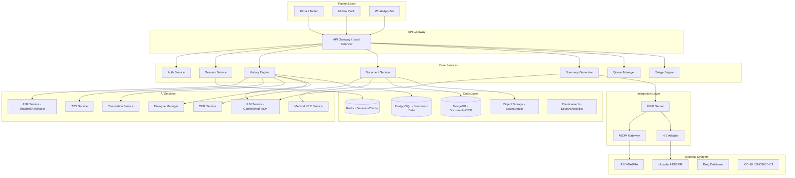
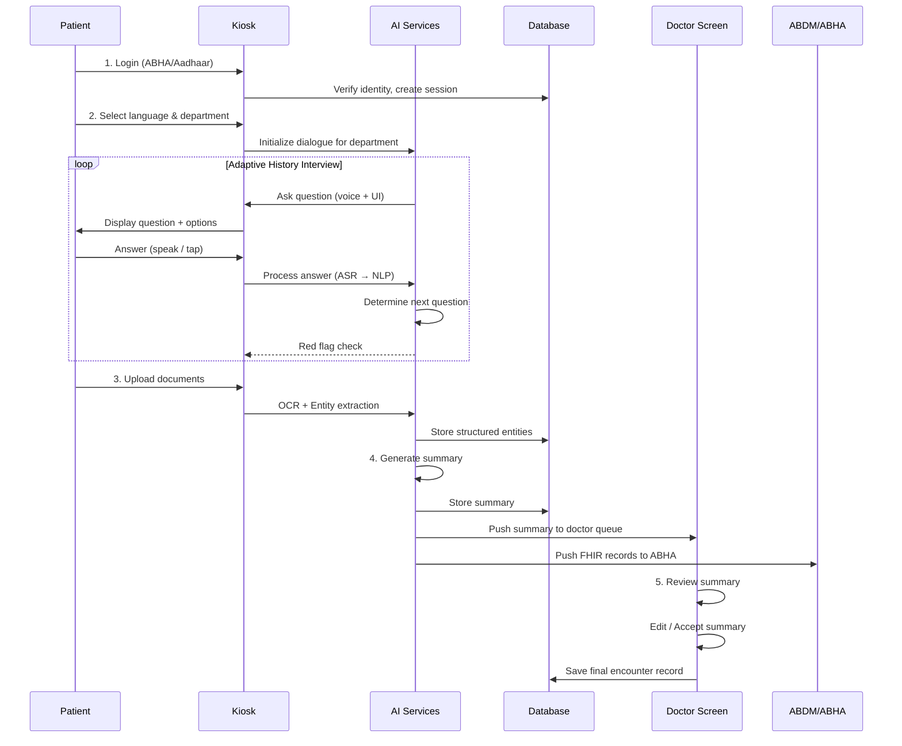

# MediKiosk — Comprehensive Analysis & Feature Report

> **AI-Powered Clinical History Software Platform for Indian Hospitals**

---

## 1. Executive Summary

### What Is MediKiosk?

MediKiosk is a **pre-consultation AI-powered clinical intake software platform** designed specifically for Indian hospitals. It solves the critical bottleneck where doctors in overcrowded OPDs (4,000–10,000 patients/day) have only 2–5 minutes per consultation — far too little to conduct proper history-taking, review prior records, examine, diagnose, and prescribe.

MediKiosk acts as a **"digital clinical intake assistant"** — think of it as an **ATM for medical history**. Before the patient ever enters the doctor's room, MediKiosk:

1. **Conducts a full clinical history interview** via natural voice conversation + touchscreen (in the patient's language)
2. **Scans and digitizes** all physical medical documents (prescriptions, lab reports, discharge summaries)
3. **Generates a structured, physician-ready clinical summary** pushed directly to the doctor's screen
4. **Links everything to India's ABDM/ABHA digital health ecosystem**

### Who Is It For?

| Stakeholder | Role in System | Pain Point Solved |
|---|---|---|
| **Patients** (all demographics) | Primary kiosk user — narrates history, scans documents | No more repeating history at every visit; documents finally organized digitally |
| **Doctors / Physicians** | Consumes structured history on their screen | Gets a complete history in seconds instead of spending 3+ minutes eliciting it |
| **AYUSH Practitioners** | Consumes extended Ayurvedic assessment (Dashavidha Pariksha) | Can finally capture the full depth of Ayurvedic intake within OPD time |
| **Triage Staff / Nurses** | Monitors red-flag alerts, assists patients at kiosk | Automated triage prioritization; emergency cases flagged instantly |
| **Hospital Administrators** | Monitors throughput, analytics, kiosk operations | Data-driven OPD management; reduced patient wait times |
| **IT / System Administrators** | Manages platform deployment, integrations, security | Centralized configuration and monitoring |
| **Help Desk Staff** | Assists patients who need kiosk guidance | Reduced burden — most patients self-serve |

### The Core Insight

> **70–80% of correct diagnoses come from history alone** (classical medical teaching). Yet Indian OPDs systematically under-elicit history due to time pressure. MediKiosk doesn't replace the doctor — it **gives the doctor a complete history before the patient walks in**, transforming a 2-minute rushed interaction into a focused clinical encounter.

---

## 2. Complete Feature Breakdown

### Module A — Conversational Multimodal History Engine

This is the **heart of MediKiosk** — an AI system that conducts a clinical interview with the patient through voice and touch.

---

#### A1. Multilingual Voice-First Interaction

**What it does:** Patient speaks naturally in their preferred language (Hindi, English, Tamil, Telugu, Bengali, Marathi, Kannada, Malayalam, Gujarati, Punjabi, Odia, Assamese, etc.). The system understands, responds, and asks follow-up questions — all by voice.

**How to implement it:**
- **ASR (Automatic Speech Recognition):** Use Bhashini / AI4Bharat IndicASR models or Google Speech-to-Text with Indian language packs. These handle Indian accents, code-switching (Hindi-English), and noisy hospital environments
- **Language Detection:** Auto-detect the patient's language from first few utterances, or let them select from a language grid at start
- **Noise Cancellation:** Apply directional microphone processing and noise-gate algorithms to filter hospital ambient noise (announcements, crowd chatter)
- **Text-to-Speech (TTS):** Use AI4Bharat IndicTTS or Google Cloud TTS for natural-sounding responses in the patient's language
- **Wake Word / Push-to-Talk:** Offer both hands-free ("MediKiosk sun raha hoon") and button-press modes

**How to make it better:**
- Add **lip-sync avatar** — a friendly animated face that "speaks" to the patient, reducing intimidation for first-time users
- Implement **dialect adaptation** — not just "Hindi" but Bhojpuri-accented Hindi, Bundelkhandi, etc.
- Add **emotion detection from voice** — if patient sounds distressed/crying, automatically simplify questions and slow down pace
- Support **sign language input via camera** for deaf patients (future phase)
- **Offline ASR fallback** — lightweight on-device models for when network is unreliable

---

#### A2. Touchscreen Guided Input (Dual-Mode)

**What it does:** Every question the AI asks vocally is simultaneously displayed on screen with tap-friendly options. Patient can answer by speaking OR tapping. This ensures usability for patients who are uncomfortable speaking to a machine, are in a noisy area, or have speech difficulties.

**How to implement it:**
- **Dynamic UI Generation:** Each question from the dialogue manager renders as a card with:
  - The question text (in patient's language)
  - Multiple-choice buttons for common answers
  - A "speak your answer" microphone button
  - A text input field for typing (optional)
- **Icon-Driven Design:** For low-literacy users, every option has an intuitive icon (e.g., body part diagrams for pain location, severity faces 😊😐😟😣😖 for pain scale)
- **Body Map:** Interactive human body diagram where patients tap to indicate pain/symptom location
- **Timeline Slider:** For questions like "when did this start?", provide a visual slider (hours → days → weeks → months → years)

**How to make it better:**
- Add **gesture recognition** — patient can point at their own body and camera captures the location
- **Adaptive font sizing** — auto-enlarge text for elderly patients (detected via ABHA age or explicit setting)
- **High-contrast / color-blind modes** for accessibility
- **Braille-compatible screen regions** for visually impaired (if deployed on kiosks with tactile overlay)

---

#### A3. Adaptive Clinical Questioning (AI Dialogue Manager)

**What it does:** The AI doesn't ask a fixed set of questions. It dynamically branches based on what the patient says — exactly like a skilled physician would. If the patient says "chest pain", the AI probes using the SOCRATES framework (Site, Onset, Character, Radiation, Associated symptoms, Timing, Exacerbating/relieving factors, Severity). If they say "headache", it asks different follow-ups.

**How to implement it:**
- **Clinical History Ontology:** A structured knowledge graph mapping:
  - Chief complaints → relevant HPI questions (branching trees)
  - Chief complaints → associated review-of-systems questions
  - Medications → potential drug interactions to flag
  - Symptoms → red-flag combinations
- **LLM-Powered Dialogue Manager:** A fine-tuned or prompt-engineered LLM (e.g., Gemini, GPT-4, or an open-source medical LLM like MedPaLM) that:
  - Follows the clinical ontology as guardrails
  - Generates natural follow-up questions
  - Summarizes patient responses in real-time
  - Knows when to stop (saturation detection — enough history gathered)
- **State Machine + LLM Hybrid:** Use a deterministic state machine for the high-level flow (Chief Complaint → HPI → Past History → Drug/Allergy → Family → Personal → ROS) with the LLM handling the conversational depth within each state

**How to make it better:**
- **Specialty-specific question sets:** Different depth/focus for Cardiology vs Orthopaedics vs Dermatology vs Psychiatry OPDs
- **Prior-visit awareness:** If the patient has visited before, skip already-known history and focus on "what's changed since last visit?"
- **Symptom co-occurrence intelligence:** If patient mentions diabetes + foot ulcer, automatically ask about neuropathy, vascular symptoms, HbA1c values
- **Patient education micro-moments:** While asking questions, briefly explain why the question matters ("I'm asking about family history because some conditions run in families")
- **Confidence scoring:** Each captured data point gets a confidence score (high if patient clearly stated it, low if ambiguous) — shown to the doctor

---

#### A4. AYUSH / Ayurvedic History Mode

**What it does:** For Ayurvedic OPDs, the system switches to an extended interview capturing the full Dashavidha Pariksha and Ahara-Vihara assessment — something that's practically impossible to do manually in OPD time.

**How to implement it:**
- **Dashavidha Pariksha Module:** Structured capture of:
  1. **Prakriti** (constitution) — Vata/Pitta/Kapha assessment via standardized questionnaire
  2. **Vikriti** (current imbalance) — symptom mapping to dosha imbalance
  3. **Sara** (tissue quality) — questions about skin, hair, nail, bone quality
  4. **Samhanana** (body build) — visual assessment + self-report
  5. **Pramana** (body measurements) — self-reported or measured
  6. **Satmya** (adaptability) — dietary and environmental tolerances
  7. **Sattva** (mental constitution) — psychological assessment questions
  8. **Ahara Shakti** (digestive capacity) — appetite, digestion pattern, meal frequency
  9. **Vyayama Shakti** (exercise capacity) — physical activity tolerance
  10. **Vaya** (age-related assessment) — age-appropriate health markers
- **Ahara-Vihara Assessment:** Detailed diet (what, when, how much, taste preferences, food intolerances) and lifestyle (sleep pattern, exercise, daily routine, seasonal variations) capture
- **Nidana Panchaka:** Causative factors, prodromal symptoms, disease manifestation, disease course, and relief factors
- **Trividha/Ashtavidha Pariksha:** Pulse (Nadi), urine (Mutra), stool (Mala), tongue (Jihva), sound (Shabda), touch (Sparsha), eyes (Drik), general appearance (Aakruti) — structured self-report where applicable, flagged for clinical verification

**How to make it better:**
- **Prakriti AI scoring:** Use validated Prakriti questionnaires (like the CCRAS standardized format) with AI scoring to auto-classify dominant dosha
- **Image-based assessment:** Patient takes a photo of tongue (Jihva Pariksha), nails, eyes — AI performs preliminary visual analysis
- **Seasonal adjustment (Ritucharya):** Auto-adjust questions based on current season (relevant for Ayurvedic practice)
- **Integration with Siddha/Unani/Homeopathy:** Extendable to other AYUSH systems with their own intake frameworks
- **Dual output:** Generate both Ayurvedic assessment AND a mapped allopathic-equivalent summary for interdisciplinary care

---

#### A5. Red-Flag Detection & Emergency Triage

**What it does:** As the patient narrates symptoms, the AI continuously monitors for emergency symptom combinations and triggers immediate priority alerts to triage staff.

**How to implement it:**
- **Red-Flag Rules Engine:** A curated, clinically-validated rule set:
  - Chest pain + dyspnoea + sweating → Suspected ACS → PRIORITY ALERT
  - Sudden severe headache + neck stiffness + vomiting → Suspected meningitis/SAH → PRIORITY ALERT
  - Slurred speech + facial droop + limb weakness → Suspected stroke → PRIORITY ALERT
  - Severe abdominal pain + rigidity → Suspected acute abdomen → PRIORITY ALERT
  - Suicidal ideation keywords → Psychiatric emergency → PRIORITY ALERT
  - Pediatric: high fever + rash + altered consciousness → Suspected meningitis → PRIORITY ALERT
- **Alert Mechanism:** Instant notification to:
  - Triage nurse station (visual + audio alert)
  - Doctor's console (flagged as emergency)
  - Hospital emergency response team (if configured)
- **Bypass Queue:** Red-flagged patients are auto-routed to emergency consultation, bypassing OPD queue

**How to make it better:**
- **Vitals integration:** If kiosk has a blood pressure cuff / pulse oximeter / thermometer attachment, combine symptom + vitals for smarter triage (e.g., chest pain + BP >180/120 = hypertensive emergency)
- **ESI (Emergency Severity Index) scoring:** Assign a 1–5 triage score based on symptoms + vitals
- **Geofencing alert:** If patient collapses near kiosk, motion sensors trigger code blue
- **Post-alert tracking:** Track time from alert to clinical response for hospital quality metrics

---

### Module B — Medical Document Digitization & Intelligence

This module transforms the patient's physical paper trail into structured digital data.

---

#### B1. Document Scanning & Upload

**What it does:** Patient places their physical documents (prescriptions, lab reports, discharge summaries, imaging reports, referral letters) on the kiosk scanner or uploads photos from their phone. The system captures high-quality images.

**How to implement it:**
- **Multi-page flatbed scanner** integrated into kiosk hardware (for physical kiosk deployment)
- **Camera-based capture** with auto-edge-detection, de-skew, and enhancement (for mobile/tablet deployment)
- **Phone upload via QR code:** Patient scans QR on kiosk screen, opens a web upload page on their phone, takes photos of documents → automatically transferred to kiosk session
- **Supported document types:** Prescriptions, lab reports, discharge summaries, imaging reports (X-ray, MRI, CT reports — not the images themselves initially), vaccination records, referral letters, insurance documents

**How to make it better:**
- **Bulk scan mode:** Auto-feed scanner for patients with thick medical file folders
- **WhatsApp integration:** Patient forwards document photos from WhatsApp to a MediKiosk WhatsApp Business number → auto-linked to their session
- **DigiLocker / ABHA PHR pull:** If patient has existing digital documents in DigiLocker or ABHA PHR, auto-fetch them instead of re-scanning
- **Document quality check:** Real-time feedback ("Document too blurry, please re-scan" / "Place document flat")

---

#### B2. OCR & Text Extraction

**What it does:** Extracts text from scanned documents — handling handwritten doctor's notes, printed lab reports, mixed-language documents, and poor-quality photocopies.

**How to implement it:**
- **Multi-engine OCR pipeline:**
  1. **Google Cloud Vision API / Azure Computer Vision** for printed text (high accuracy)
  2. **Specialized handwriting OCR** (custom-trained model on Indian medical handwriting datasets — doctor's handwriting is notoriously difficult)
  3. **Table extraction engine** for lab reports (row-column structure with values and reference ranges)
- **Language handling:** Detect and OCR across English, Hindi, and regional languages (many prescriptions mix English drug names with Hindi instructions)
- **Medical abbreviation expansion:** "Tab" → Tablet, "BD" → Twice daily, "S/P" → Status post, "c/o" → Complaining of

**How to make it better:**
- **Prescription-specific fine-tuning:** Train OCR specifically on Indian prescription formats (medication name, dose, frequency, duration in typical layouts)
- **Confidence highlighting:** Show the doctor which OCR extractions are high-confidence vs low-confidence (uncertain text highlighted in yellow)
- **Human-in-the-loop correction:** If OCR confidence is below threshold, queue the document for manual review by a data entry operator (background task, not blocking patient flow)
- **Continuous learning:** Every doctor correction to OCR output feeds back to improve the model

---

#### B3. Clinical Entity Extraction & Structuring

**What it does:** From the raw OCR text, the AI extracts and categorizes clinical entities into structured data.

**How to implement it:**
- **Medical NER (Named Entity Recognition):** Extract:
  - **Diagnoses** (ICD-10 mapped): "Type 2 Diabetes Mellitus", "Hypertension", "Acute Bronchitis"
  - **Medications** with dose, frequency, duration: "Tab Metformin 500mg BD x 30 days"
  - **Lab investigations** with values and units: "HbA1c: 7.2%", "Serum Creatinine: 1.1 mg/dL"
  - **Procedures / Surgeries**: "Appendectomy (2019)", "CABG (2021)"
  - **Allergies**: "Allergy to Penicillin"
  - **Vital signs**: BP, pulse, weight, height from prior records
- **Reference range mapping:** Map extracted lab values against standard reference ranges to flag abnormals
- **Drug interaction checking:** Cross-check current + past medications against drug interaction databases (e.g., DrugBank)
- **ICD-10 / SNOMED CT coding:** Auto-map extracted diagnoses to standard codes for interoperability

**How to make it better:**
- **Temporal reasoning:** Understand "was on Metformin, now stopped" vs "currently taking Metformin"
- **Dosage change tracking:** Show medication dosage trends over time (e.g., "Metformin increased from 500mg to 1000mg in March 2025")
- **Investigation trend graphing:** Plot lab values over time (e.g., HbA1c trend graph) — visual for the doctor
- **Duplicate detection:** Identify when the same test was done at two labs on the same day (avoid double-counting)
- **Drug-allergy cross-check:** If OCR extracts "Allergy: Sulfa drugs" and another prescription has a sulfa drug prescribed, flag prominently

---

#### B4. Chronological Medical Timeline

**What it does:** All extracted data is organized into a visual, interactive timeline showing the patient's medical journey chronologically.

**How to implement it:**
- **Date extraction & normalization:** Parse various date formats ("15/03/2024", "March 2024", "3 months ago") into standardized dates
- **Timeline visualization:** Interactive horizontal timeline with:
  - Color-coded event types (diagnoses in red, medications in blue, surgeries in purple, labs in green)
  - Zoom in/out (year → month → day)
  - Click on any event for details
- **Gap detection:** Highlight periods with no records ("No records between Jan 2023 – Nov 2024 — ask patient about this period")

**How to make it better:**
- **Episode-of-care grouping:** Group related events into episodes (e.g., "Knee injury episode: X-ray → MRI → Ortho consultation → Surgery → Physiotherapy")
- **Doctor-annotatable timeline:** Physician can add notes directly on the timeline
- **Family timeline view:** Show family medical history alongside patient timeline
- **Predictive gaps:** Flag routine screenings that are overdue based on age/gender/conditions ("No eye exam in 2 years — diabetic patient")

---

#### B5. Abnormal Value Highlighting & Alerts

**What it does:** Flags out-of-range lab values and potential drug interactions prominently for physician attention.

**How to implement it:**
- **Color-coded flagging:**
  - 🔴 Critical abnormal (e.g., Potassium > 6.0 mEq/L)
  - 🟡 Mildly abnormal (e.g., HbA1c 6.5–7.5%)
  - 🟢 Normal
- **Drug interaction severity levels:**
  - Major (contraindicated combination)
  - Moderate (use with caution)
  - Minor (be aware)
- **Trending alerts:** "Creatinine rising over last 3 tests — possible renal function decline"

**How to make it better:**
- **Age/gender-adjusted reference ranges** (pediatric ranges differ significantly)
- **Condition-specific ranges** (target HbA1c for elderly diabetic is different from young diabetic)
- **Polypharmacy alert** for patients on 5+ medications (common in elderly)
- **Allergy cross-reactivity warnings** (e.g., allergic to penicillin → caution with cephalosporins)

---

### Module C — Structured History Summary Generator

This module synthesizes everything into the physician-ready output.

---

#### C1. AI Clinical Summary Generation

**What it does:** Combines the conversational history + digitized documents into a single, concise, structured clinical summary in standard medical format.

**How to implement it:**
- **LLM-based summarization** (fine-tuned on clinical history summaries) that generates:
  ```
  PATIENT: Rajesh Kumar, 58/M, ABHA: XXXX-XXXX-XXXX
  VISIT: Cardiology OPD, 20-Sep-2026
  
  CHIEF COMPLAINT: Chest pain x 3 days
  
  HPI: 58-year-old male presenting with retrosternal chest pain for 3 days,
  squeezing in nature, radiating to left arm, worse on exertion, relieved
  by rest. Associated with breathlessness on climbing 1 flight of stairs.
  No diaphoresis, no syncope. Pain severity 6/10.
  
  PAST MEDICAL HISTORY:
  • Type 2 Diabetes Mellitus — 8 years (on Metformin 1g BD, Glimepiride 2mg OD)
  • Hypertension — 5 years (on Amlodipine 5mg OD)
  • Appendectomy — 2015
  
  DRUG & ALLERGY HISTORY:
  • Current medications: [as above]
  • Known allergy: Penicillin (rash)
  
  FAMILY HISTORY: Father — MI at age 55 (deceased). Mother — Type 2 DM.
  
  PERSONAL HISTORY: Ex-smoker (20 pack-years, quit 2021). Social drinker.
  Vegetarian diet. Sedentary lifestyle.
  
  REVIEW OF SYSTEMS: [Relevant positives and negatives]
  
  PRIOR INVESTIGATIONS SUMMARY:
  • HbA1c: 7.8% (3 months ago) ⚠️ Above target
  • Lipid profile: LDL 145 mg/dL ⚠️ Above target
  • ECG (6 months ago): Normal sinus rhythm
  • Echo (1 year ago): LVEF 55%, no RWMA
  
  ⚠️ RED FLAGS: Chest pain + exertional dyspnoea + DM + smoking history
     + family hx of premature MI — HIGH CARDIOVASCULAR RISK
  
  🔄 DRUG INTERACTIONS: None identified
  
  [AI Confidence: 92% — Some portions of handwritten prescription
   from 2023 had low OCR confidence, marked in yellow]
  ```

**How to make it better:**
- **Differential diagnosis suggestions** (with clear disclaimer — "AI suggestion, not diagnosis"): Based on the history, suggest top 3–5 differentials with likelihood
- **Recommended investigations:** Based on history + gaps, suggest relevant investigations the doctor might want to order
- **Specialty-specific formatting:** Cardiology summary emphasizes cardiovascular risk factors; Orthopaedics summary emphasizes functional assessment; Psychiatry summary emphasizes mental status
- **Voice-read summary for patient:** After generating, read back a simplified patient-friendly version in their language ("We've noted that you have chest pain for 3 days, along with your diabetes and blood pressure history. The doctor will review all of this.")

---

#### C2. Physician Review & Edit Interface

**What it does:** The summary appears on the doctor's screen when the patient enters. The doctor can review, edit, accept, or reject any part of the AI-generated summary.

**How to implement it:**
- **Section-by-section editing:** Each section (CC, HPI, PMH, etc.) is independently editable
- **Accept/Reject per section:** Doctor can accept some sections and edit others
- **Voice-to-edit:** Doctor can dictate corrections ("Change onset from 3 days to 5 days")
- **Template shortcuts:** Predefined templates for common presentations (e.g., "Routine DM follow-up" fills in standard fields)
- **One-click sign-off:** Final accept saves the verified history to the permanent record

**How to make it better:**
- **Smart suggestions during editing:** As doctor edits, AI suggests completions
- **Previous visit comparison:** Side-by-side view of current vs last visit summary
- **Annotation/marking:** Doctor can highlight areas to discuss with patient
- **Quick-add findings:** During examination, doctor can quickly add examination findings to the same summary
- **Dictation mode for clinical notes:** After reviewing history, doctor dictates additional notes (examination findings, diagnosis, plan) — all captured in the same structured record

---

#### C3. Bilingual Output

**What it does:** Patient-facing content is in the patient's chosen language; physician-facing summary is in English (or Hindi/English bilingual).

**How to implement it:**
- **Dual rendering pipeline:** Summary generated once in English (structured), then key patient-facing elements translated using NMT (Neural Machine Translation)
- **Patient discharge summary in local language:** After consultation, generate a patient-understandable summary of what the doctor discussed and prescribed
- **Audio output:** Patient can request an audio readback of their summary in their language

**How to make it better:**
- **Pictographic discharge instructions:** For low-literacy patients, generate visual medication schedules (pill image + clock image showing when to take)
- **SMS/WhatsApp summary delivery:** Send the patient a summary of their visit to their phone
- **Caregiver copy:** If patient has a family caregiver, send a copy to them too (with consent)

---

### Module D — Consent, Privacy & ABDM Integration

---

#### D1. Patient Authentication & ABHA Integration

**What it does:** Patient identifies themselves via ABHA ID, Aadhaar, or manual registration. Session is linked to their digital health identity.

**How to implement it:**
- **ABHA ID authentication:**
  - Scan ABHA card QR code
  - Enter 14-digit ABHA number + OTP verification
  - Aadhaar-based ABHA creation (for new patients)
- **Fallback for non-ABHA patients:**
  - Manual demographic registration (name, age, gender, phone, address)
  - Encourage ABHA creation during session
- **Hospital HIS integration:**
  - Pull existing hospital registration data (UHID — Unique Hospital ID)
  - If new patient, trigger HIS registration via HL7/FHIR

**How to make it better:**
- **Face recognition login** (optional, with consent) for returning patients — instant identification
- **Family account linking:** Register a family group, so when one member visits, the system knows the family context
- **Insurance verification:** Auto-verify Ayushman Bharat (PM-JAY) or private insurance eligibility during registration
- **Appointment linking:** If patient has a pre-booked appointment, auto-fetch appointment details (department, doctor, time)

---

#### D2. Consent Management

**What it does:** Granular, DPDPA-2023 compliant consent management. Patient explicitly consents to what data is collected, how it's used, and who can access it.

**How to implement it:**
- **Audio-visual consent flow:**
  - Consent explanation played as audio in patient's language
  - Simple visual cards showing what data is being collected and why
  - Thumbprint/e-signature/OTP-based consent confirmation
- **Granular consent options:**
  - Consent for voice recording (used for history, then deleted/retained per consent)
  - Consent for document scanning and OCR
  - Consent for sharing with treating doctor
  - Consent for ABHA health record linking
  - Consent for de-identified data use in research (optional)
- **ABDM consent artifact generation:** Create HL7 FHIR Consent resources per ABDM specification

**How to make it better:**
- **Video consent in local language** — short 60-second video explaining everything simply
- **Consent revocation self-service:** Patient can revoke consent later via phone app or next kiosk visit
- **Consent audit trail:** Immutable log of all consent actions (for regulatory compliance)
- **Minor/incapacitated patient handling:** Guardian consent workflow for children and mentally incapacitated patients
- **Research consent tiers:** "No research" / "Anonymous research" / "Contact me for clinical trials" (helps hospitals with ethical research recruitment)

---

#### D3. Data Security & Privacy

**What it does:** Ensures all patient data is handled securely throughout its lifecycle.

**How to implement it:**
- **Encryption:** AES-256 encryption at rest, TLS 1.3 in transit
- **Session isolation:** Each patient session is sandboxed; no cross-session data leakage
- **Auto-purge:** Temporary session data (raw audio, scanner buffer) cleared immediately after processing
- **Access control:** Role-based access (RBAC) — only the assigned doctor sees the full history
- **Audit logging:** Every data access logged with timestamp, user, action
- **DPDPA compliance:** Data minimization, purpose limitation, storage limitation per the Act

**How to make it better:**
- **Zero-knowledge processing option:** Process voice and OCR on-device (edge AI) so raw data never leaves the kiosk
- **Blockchain audit trail** (optional) for tamper-proof consent and access records
- **Penetration testing schedule:** Regular third-party security audits
- **Data residency:** All data stored within India (compliant with data localization norms)
- **Breach notification system:** Automated alerts if anomalous data access detected

---

#### D4. ABDM / FHIR Integration

**What it does:** Structured history is pushed to the hospital HIS/EMR and linked to the patient's ABHA Personal Health Record via FHIR APIs.

**How to implement it:**
- **FHIR R4 resource generation:**
  - `Patient` resource (demographics)
  - `Encounter` resource (this visit)
  - `Condition` resources (diagnoses)
  - `MedicationStatement` resources (current medications)
  - `AllergyIntolerance` resources
  - `Observation` resources (lab values, vitals)
  - `DocumentReference` resources (scanned documents)
  - `DiagnosticReport` resources
  - `Composition` resource (the summary document)
- **ABDM HIP (Health Information Provider) integration:**
  - Register as a HIP with ABDM
  - Push health records to ABHA PHR via HIP APIs
  - Respond to HIU (Health Information User) data requests with consent
- **Hospital HIS integration:**
  - HL7 v2 ADT (Admit/Discharge/Transfer) messages for legacy HIS
  - FHIR API for modern HIS/EMR systems
  - Custom API adapters for popular Indian HIS vendors (e-Hospital, HMIS)

**How to make it better:**
- **Bi-directional sync:** Not just push to HIS, but also pull existing HIS data to enrich the history
- **Cross-hospital data pull:** Via ABDM, pull records from other hospitals the patient has visited (with consent)
- **Offline queue:** If network is down, queue FHIR resources locally and sync when connectivity restores
- **NDHM compliance testing:** Automated ABDM sandbox testing before production deployment

---

## 3. Complete Screen Inventory by Role

### 3.1 Patient Screens (Kiosk / Tablet Interface)

| # | Screen Name | Purpose | Key Elements |
|---|---|---|---|
| P1 | **Welcome / Language Selection** | First screen — warm welcome, language picker | Animated welcome greeting, Language grid (12+ languages with flags/icons), Accessibility options (font size, high contrast), Help button |
| P2 | **Authentication / Login** | Patient identification | ABHA QR scan area, ABHA number entry field, Aadhaar entry option, "New Patient" registration button, OTP input |
| P3 | **New Patient Registration** | First-time registration | Name, Age/DOB, Gender, Phone, Address, Emergency contact, Photo capture, ABHA creation prompt |
| P4 | **Consent Screen** | Data collection consent | Audio/video consent explanation, Checkboxes for each consent type, Thumbprint/signature pad, Consent summary in simple language |
| P5 | **Department / Visit Type Selection** | What are they here for today | Department grid with icons (Cardiology ❤️, Ortho 🦴, etc.), "I have an appointment" button, "Walk-in" option, AYUSH department options |
| P6 | **Chief Complaint Capture** | What brings them today | Large microphone button ("Tell us what's bothering you"), Common complaint quick-select grid (Fever, Pain, Cough, etc.), Body map for tapping location, Text input option |
| P7 | **Conversational History Interview** | The main AI conversation | Chat-style interface (AI message → Patient response), Microphone button (always visible), Multiple-choice answer cards, Progress indicator (Step 3 of 8), "I don't understand" / "Repeat" / "Skip" buttons |
| P8 | **Pain / Severity Assessment** | Specific pain evaluation | Visual Analog Scale (faces), Body map with precise location marking, Duration selector, Character selector (burning, stabbing, dull, etc.) |
| P9 | **AYUSH Extended Assessment** | Ayurvedic intake (if applicable) | Prakriti questionnaire cards, Diet/lifestyle questions, Visual food plate composition, Sleep pattern input, Seasonal variation questions |
| P10 | **Medication Input** | Current medications | Photo scan of current prescriptions, Manual drug name entry with autocomplete, Dose/frequency selectors, "I don't remember" option with AI prompt to describe pill appearance |
| P11 | **Allergy Input** | Known allergies | Common allergen quick-select (Penicillin, Sulfa, NSAID, etc.), Free-text entry, Reaction type selector (rash, swelling, breathing difficulty, etc.) |
| P12 | **Family History** | Family medical background | Family member list (Father, Mother, Siblings, etc.), Common condition checkboxes per member, Age of onset inputs, "Don't know" option |
| P13 | **Personal / Social History** | Lifestyle factors | Smoking/alcohol/tobacco status with quantity, Diet type (veg/non-veg/vegan), Exercise frequency, Occupation, Sleep quality |
| P14 | **Document Upload Screen** | Scan/upload prior documents | Scanner activation button, Phone upload via QR code, Camera capture option, Document list with thumbnails, "No documents to upload" button |
| P15 | **Document Processing Status** | Show OCR progress | Animated processing indicator per document, Extracted text preview, "Is this correct?" verification prompts, Re-scan option for poor quality |
| P16 | **Summary Review (Patient)** | Patient reviews their history | Simplified, patient-language summary, Audio playback of summary, "Something is wrong" correction button, "Looks good" confirmation button |
| P17 | **Completion / Queue Status** | Session complete | Token number display, Estimated wait time, Queue position, "Your history has been sent to Dr. [Name]", Option to add more information |
| P18 | **Emergency Alert Screen** | Red-flag detected | Large red alert banner, "Please stay here, a nurse is coming immediately", Emergency contact notification, Countdown to triage response |
| P19 | **Help / Assistance Request** | Patient needs help | "Call an assistant" button, Video call to help desk, FAQ section, Restart session option |
| P20 | **Feedback Screen** | Post-visit feedback | Star rating, "Was the kiosk easy to use?", Suggestion text box, Language/accessibility feedback |

---

### 3.2 Doctor / Physician Screens

| # | Screen Name | Purpose | Key Elements |
|---|---|---|---|
| D1 | **Doctor Login / Dashboard** | Daily overview | Today's patient queue, Patients with completed MediKiosk histories (highlighted), Pending reviews count, Red-flag alerts banner, Quick stats (patients seen today, avg time) |
| D2 | **Patient Queue** | List of upcoming patients | Patient name, token #, complaint summary (one-liner), Red-flag indicator, MediKiosk completion status (✅ complete / ⏳ in progress / ❌ not done), Click to open full summary |
| D3 | **Clinical Summary View** | The main history summary | Full structured summary (as described in C1), Section-by-section accept/edit/reject, Abnormal values highlighted, Drug interactions panel, AI confidence indicators, Timeline view toggle |
| D4 | **Medical Timeline View** | Chronological patient journey | Interactive timeline visualization, Color-coded events, Click-to-expand details, Date range filter, Episode grouping |
| D5 | **Document Viewer** | Review scanned documents | Side-by-side: Original scan + OCR extracted text, Confidence highlighting (yellow = uncertain), Manual correction interface, Zoom/rotate/enhance controls |
| D6 | **Comparison View** | Current vs previous visit | Side-by-side comparison of current and last visit summaries, Changes highlighted (new symptoms, medication changes, lab value changes), Trend graphs for tracked values |
| D7 | **Examination & Notes Entry** | Add clinical findings | Voice dictation for examination findings, Structured examination templates (CVS, RS, PA, CNS, etc.), Diagram markup (mark findings on body diagram), Quick-add common findings |
| D8 | **Prescription / Plan Entry** | Treatment planning | Medication prescriber with drug database, Investigation ordering with common panels, Referral generation, Follow-up scheduling, Integration with e-prescription system |
| D9 | **AYUSH Assessment Review** | Review Ayurvedic intake | Prakriti analysis summary with dosha chart, Vikriti assessment, Ahara-Vihara analysis, Nidana Panchaka mapping, Suggested treatment principles (Chikitsa Sutra) |
| D10 | **Sign-off & Submit** | Finalize the encounter | Final review of complete encounter record, Digital signature, Submit to HIS/ABHA, Generate patient discharge summary, Print/send prescription |

---

### 3.3 Triage Staff / Nurse Screens

| # | Screen Name | Purpose | Key Elements |
|---|---|---|---|
| T1 | **Triage Dashboard** | Monitor all active kiosks | Live status of all kiosks (idle / in-use / alert), Red-flag alert panel (real-time), Queue statistics, Kiosk health monitoring |
| T2 | **Emergency Alert Detail** | Respond to red-flag | Patient details, Detected emergency symptoms, Kiosk location, Response timer (time since alert), Acknowledge + respond button, Escalation option |
| T3 | **Patient Assistance Queue** | Help requests from patients | List of patients requesting help, Kiosk number, Nature of issue, Priority ranking |
| T4 | **Vitals Entry** | Record vitals (if kiosk doesn't have sensors) | Patient ID + name, BP, Pulse, Temperature, SpO2, Weight, Height, BMI auto-calculate, Respiratory rate |
| T5 | **Triage Assessment** | ESI scoring & routing | Symptom summary from MediKiosk, ESI score assignment (1-5), Department routing, Priority adjustment |

---

### 3.4 Hospital Administrator Screens

| # | Screen Name | Purpose | Key Elements |
|---|---|---|---|
| A1 | **Admin Dashboard** | High-level metrics | Daily patient throughput, Average kiosk session time, Kiosk utilization rate, Department-wise load, Doctor workload distribution, Red-flag response metrics |
| A2 | **Analytics & Reports** | Deep-dive analytics | Time-series graphs (daily/weekly/monthly), Top chief complaints analysis, Language distribution, Completion rate (% patients who finish kiosk session), Dropout analysis (where patients abandon), Average history quality score |
| A3 | **Kiosk Management** | Manage kiosk fleet | Kiosk status (online/offline/maintenance), Uptime statistics, Error logs, Remote restart, Software version management |
| A4 | **Department Configuration** | Configure departments | Add/edit departments, Assign question sets per department, Configure AYUSH modes, Set operating hours |
| A5 | **Doctor Management** | Manage doctor profiles | Doctor roster, Department assignment, Schedule management, Workload analytics per doctor |
| A6 | **Patient Flow Monitor** | Real-time OPD flow | Live patient journey map (registered → kiosk → waiting → consultation → done), Bottleneck detection, Wait time alerts, Queue rebalancing suggestions |
| A7 | **Consent & Compliance Dashboard** | Regulatory compliance | Consent statistics, Data access audit logs, DPDPA compliance checklist, ABDM integration health, Data breach incident tracker |
| A8 | **Feedback Analysis** | Patient satisfaction | Aggregate ratings, Common complaints, Feature requests, Sentiment analysis trends |

---

### 3.5 IT / System Administrator Screens

| # | Screen Name | Purpose | Key Elements |
|---|---|---|---|
| S1 | **System Health Dashboard** | Infrastructure monitoring | Server status, API response times, Database performance, AI model latency, ASR accuracy metrics, OCR accuracy metrics |
| S2 | **Integration Management** | Manage external connections | ABDM connection status, HIS integration health, API key management, Webhook configurations, Error queue |
| S3 | **User & Role Management** | Access control | User accounts CRUD, Role assignment (doctor, nurse, admin, etc.), Permission matrix, Session management |
| S4 | **AI Model Management** | Manage AI components | Model version tracking, ASR language model status, OCR model performance, LLM configuration, A/B testing setup |
| S5 | **Audit Log Viewer** | Security audit | Complete access logs, Filter by user/action/resource, Export for compliance, Anomaly detection alerts |
| S6 | **Configuration Management** | System configuration | Language pack management, Clinical ontology editor, Red-flag rules editor, Template management, Feature flags |
| S7 | **Backup & Recovery** | Data protection | Backup schedule status, Recovery testing, Data retention policies, Purge management |

---

### 3.6 Help Desk / Support Staff Screens

| # | Screen Name | Purpose | Key Elements |
|---|---|---|---|
| H1 | **Support Dashboard** | Monitor patient issues | Active assistance requests, Kiosk camera feed (if available), Remote session viewing, Issue resolution tracker |
| H2 | **Remote Assistance** | Help patient remotely | Screen mirror of patient's kiosk, Voice communication with patient, Remote input capability, Guided walkthrough mode |
| H3 | **Issue Logging** | Track common problems | Issue categorization, Resolution steps taken, Escalation pathway, Knowledge base |

---

## 4. Complete API Inventory

### 4.1 Patient-Facing APIs

| # | API Endpoint | Method | Purpose | Request | Response |
|---|---|---|---|---|---|
| 1 | `/api/v1/auth/abha/verify` | POST | Verify ABHA ID | `{ abha_id, otp? }` | `{ verified, patient_demographics }` |
| 2 | `/api/v1/auth/aadhaar/verify` | POST | Aadhaar-based auth | `{ aadhaar_number, otp }` | `{ verified, abha_id_created? }` |
| 3 | `/api/v1/auth/abha/create` | POST | Create new ABHA ID | `{ aadhaar_number, otp, demographics }` | `{ abha_id, abha_address }` |
| 4 | `/api/v1/patients/register` | POST | New patient registration | `{ name, age, gender, phone, address, photo?, emergency_contact }` | `{ patient_id, uhid }` |
| 5 | `/api/v1/patients/{id}` | GET | Get patient profile | Path: patient_id | `{ demographics, abha_id, visit_history_summary }` |
| 6 | `/api/v1/patients/{id}` | PUT | Update patient profile | `{ updated_fields }` | `{ updated_patient }` |
| 7 | `/api/v1/sessions/create` | POST | Create new kiosk session | `{ patient_id, kiosk_id, language, department }` | `{ session_id, session_token }` |
| 8 | `/api/v1/sessions/{id}/status` | GET | Get session status | Path: session_id | `{ status, current_step, progress_pct }` |
| 9 | `/api/v1/sessions/{id}/end` | POST | End/submit session | `{ session_id, confirmation }` | `{ summary_id, queue_token }` |
| 10 | `/api/v1/consent/grant` | POST | Record patient consent | `{ patient_id, session_id, consent_types[], signature_data }` | `{ consent_id, abdm_consent_artifact }` |
| 11 | `/api/v1/consent/revoke` | POST | Revoke consent | `{ consent_id, consent_types[] }` | `{ revoked_status }` |
| 12 | `/api/v1/consent/{patient_id}` | GET | Get consent status | Path: patient_id | `{ active_consents[], revoked_consents[] }` |
| 13 | `/api/v1/languages` | GET | List supported languages | — | `[{ code, name, native_name, icon }]` |
| 14 | `/api/v1/departments` | GET | List hospital departments | Query: `hospital_id` | `[{ dept_id, name, icon, type: 'allopathic'|'ayush' }]` |
| 15 | `/api/v1/queue/{department_id}/status` | GET | Get queue status | Path: department_id | `{ current_token, estimated_wait, queue_length }` |

---

### 4.2 Conversational History Engine APIs

| # | API Endpoint | Method | Purpose | Request | Response |
|---|---|---|---|---|---|
| 16 | `/api/v1/history/start` | POST | Start history interview | `{ session_id, department, mode: 'allopathic'|'ayush' }` | `{ interview_id, first_question }` |
| 17 | `/api/v1/history/respond` | POST | Submit answer (text) | `{ interview_id, question_id, answer_text, input_mode: 'voice'|'touch'|'text' }` | `{ next_question, options[], progress }` |
| 18 | `/api/v1/history/voice/stream` | WebSocket | Stream voice input | Binary audio stream | Real-time transcription + next question |
| 19 | `/api/v1/history/voice/upload` | POST | Upload voice recording | `{ interview_id, question_id, audio_file (multipart) }` | `{ transcription, next_question }` |
| 20 | `/api/v1/history/skip` | POST | Skip current question | `{ interview_id, question_id }` | `{ next_question }` |
| 21 | `/api/v1/history/back` | POST | Go to previous question | `{ interview_id }` | `{ previous_question, previous_answer }` |
| 22 | `/api/v1/history/progress` | GET | Get interview progress | Query: interview_id | `{ total_sections, completed_sections, current_section, pct }` |
| 23 | `/api/v1/history/summary/preview` | GET | Preview current summary | Query: interview_id | `{ partial_summary_json }` |
| 24 | `/api/v1/history/red-flags` | GET | Get detected red flags | Query: interview_id | `[{ flag_type, severity, symptoms, recommendation }]` |
| 25 | `/api/v1/history/complete` | POST | Complete interview | `{ interview_id }` | `{ summary_id, is_complete, missing_sections[] }` |

---

### 4.3 AYUSH-Specific History APIs

| # | API Endpoint | Method | Purpose | Request | Response |
|---|---|---|---|---|---|
| 26 | `/api/v1/ayush/prakriti/start` | POST | Start Prakriti assessment | `{ session_id }` | `{ assessment_id, first_question }` |
| 27 | `/api/v1/ayush/prakriti/respond` | POST | Submit Prakriti answer | `{ assessment_id, question_id, answer }` | `{ next_question, interim_score }` |
| 28 | `/api/v1/ayush/prakriti/result` | GET | Get Prakriti classification | Query: assessment_id | `{ vata_score, pitta_score, kapha_score, dominant_prakriti, analysis }` |
| 29 | `/api/v1/ayush/vikriti/assess` | POST | Assess current Vikriti | `{ session_id, symptoms[] }` | `{ vikriti_analysis, dosha_imbalance }` |
| 30 | `/api/v1/ayush/ahara-vihara` | POST | Capture diet & lifestyle | `{ session_id, diet_details, lifestyle_details }` | `{ ahara_analysis, vihara_analysis }` |
| 31 | `/api/v1/ayush/nidana-panchaka` | POST | Capture Nidana Panchaka | `{ session_id, nidana, purvarupa, rupa, upashaya, samprapti }` | `{ analysis }` |
| 32 | `/api/v1/ayush/dashavidha/summary` | GET | Complete Dashavidha summary | Query: session_id | `{ complete_dashavidha_pariksha }` |

---

### 4.4 Document Digitization APIs

| # | API Endpoint | Method | Purpose | Request | Response |
|---|---|---|---|---|---|
| 33 | `/api/v1/documents/upload` | POST | Upload document image | `{ session_id, image_file (multipart), doc_type? }` | `{ document_id, processing_status: 'queued' }` |
| 34 | `/api/v1/documents/upload/bulk` | POST | Upload multiple documents | `{ session_id, files[] (multipart) }` | `[{ document_id, status }]` |
| 35 | `/api/v1/documents/{id}/status` | GET | Check OCR processing status | Path: document_id | `{ status: 'processing'|'complete'|'failed', progress }` |
| 36 | `/api/v1/documents/{id}/ocr-result` | GET | Get OCR text result | Path: document_id | `{ raw_text, confidence_score, language_detected }` |
| 37 | `/api/v1/documents/{id}/entities` | GET | Get extracted clinical entities | Path: document_id | `{ diagnoses[], medications[], lab_values[], procedures[], allergies[] }` |
| 38 | `/api/v1/documents/{id}/verify` | POST | Patient verifies OCR accuracy | `{ document_id, corrections[]? }` | `{ verified_status }` |
| 39 | `/api/v1/documents/session/{session_id}` | GET | Get all documents for session | Path: session_id | `[{ document_id, type, date, thumbnail, entity_count }]` |
| 40 | `/api/v1/documents/{id}/image` | GET | Get document image | Path: document_id | Binary image data |
| 41 | `/api/v1/documents/phone-upload/qr` | GET | Generate QR for phone upload | Query: session_id | `{ qr_code_image, upload_url, expiry }` |
| 42 | `/api/v1/documents/phone-upload/receive` | POST | Receive document from phone | `{ upload_token, files[] }` | `{ document_ids[] }` |

---

### 4.5 Timeline & Analysis APIs

| # | API Endpoint | Method | Purpose | Request | Response |
|---|---|---|---|---|---|
| 43 | `/api/v1/timeline/{patient_id}` | GET | Get medical timeline | Query: date_range?, event_types? | `[{ date, event_type, title, details, source_doc_id }]` |
| 44 | `/api/v1/timeline/{patient_id}/episodes` | GET | Get grouped care episodes | Path: patient_id | `[{ episode_title, events[], date_range }]` |
| 45 | `/api/v1/lab-values/{patient_id}/trends` | GET | Get lab value trends | Query: test_name, date_range | `{ test_name, values: [{ date, value, unit, is_abnormal }] }` |
| 46 | `/api/v1/medications/{patient_id}/current` | GET | Get current medications | Path: patient_id | `[{ drug, dose, frequency, start_date, prescriber }]` |
| 47 | `/api/v1/medications/{patient_id}/interactions` | GET | Check drug interactions | Path: patient_id | `[{ drug_pair, severity, description }]` |
| 48 | `/api/v1/abnormals/{patient_id}` | GET | Get all abnormal values | Path: patient_id | `[{ test, value, reference_range, severity, date }]` |

---

### 4.6 Summary Generation APIs

| # | API Endpoint | Method | Purpose | Request | Response |
|---|---|---|---|---|---|
| 49 | `/api/v1/summary/generate` | POST | Generate clinical summary | `{ session_id }` | `{ summary_id, structured_summary_json, text_summary }` |
| 50 | `/api/v1/summary/{id}` | GET | Get summary | Path: summary_id | `{ full_structured_summary }` |
| 51 | `/api/v1/summary/{id}/section/{section}` | GET | Get specific section | Path: summary_id, section | `{ section_content }` |
| 52 | `/api/v1/summary/{id}/patient-version` | GET | Get patient-friendly summary | Query: language | `{ simplified_summary, audio_url }` |
| 53 | `/api/v1/summary/{id}/ayush` | GET | Get AYUSH-format summary | Path: summary_id | `{ dashavidha_summary, treatment_principles }` |
| 54 | `/api/v1/summary/{id}/differentials` | GET | Get AI differential suggestions | Path: summary_id | `[{ diagnosis, likelihood, reasoning }]` (with disclaimer) |

---

### 4.7 Doctor / Physician APIs

| # | API Endpoint | Method | Purpose | Request | Response |
|---|---|---|---|---|---|
| 55 | `/api/v1/doctor/auth/login` | POST | Doctor login | `{ employee_id, password, mfa_token }` | `{ auth_token, doctor_profile }` |
| 56 | `/api/v1/doctor/dashboard` | GET | Get dashboard data | Auth header | `{ today_stats, queue_summary, alerts[] }` |
| 57 | `/api/v1/doctor/queue` | GET | Get patient queue | Query: department, date | `[{ patient_name, token, complaint_oneliner, red_flag, kiosk_status }]` |
| 58 | `/api/v1/doctor/queue/{token}/call` | POST | Call next patient | Path: token | `{ patient_id, summary_id }` |
| 59 | `/api/v1/doctor/summary/{id}/review` | GET | Open summary for review | Path: summary_id | `{ full_summary, documents[], timeline }` |
| 60 | `/api/v1/doctor/summary/{id}/edit` | PUT | Edit summary section | `{ section, updated_content }` | `{ updated_summary }` |
| 61 | `/api/v1/doctor/summary/{id}/accept` | POST | Accept/sign-off summary | `{ summary_id, edits[], digital_signature }` | `{ finalized_summary }` |
| 62 | `/api/v1/doctor/summary/{id}/reject` | POST | Reject summary | `{ summary_id, reason }` | `{ status: 'rejected' }` |
| 63 | `/api/v1/doctor/notes/add` | POST | Add examination notes | `{ encounter_id, notes_text, exam_findings{} }` | `{ updated_encounter }` |
| 64 | `/api/v1/doctor/notes/dictate` | POST | Dictate notes (voice) | `{ encounter_id, audio_file }` | `{ transcribed_notes }` |
| 65 | `/api/v1/doctor/prescription/create` | POST | Create prescription | `{ encounter_id, medications[], investigations[], referrals[], follow_up }` | `{ prescription_id }` |
| 66 | `/api/v1/doctor/encounter/complete` | POST | Complete encounter | `{ encounter_id, diagnosis[], prescription_id, summary_id }` | `{ completed_encounter, fhir_resources[] }` |
| 67 | `/api/v1/doctor/patients/{id}/history` | GET | Full patient visit history | Path: patient_id | `[{ visit_date, department, doctor, summary }]` |
| 68 | `/api/v1/doctor/compare-visits` | GET | Compare two visits | Query: visit_id_1, visit_id_2 | `{ side_by_side_diff }` |

---

### 4.8 Triage & Emergency APIs

| # | API Endpoint | Method | Purpose | Request | Response |
|---|---|---|---|---|---|
| 69 | `/api/v1/triage/alerts` | GET | Get active red-flag alerts | Query: department? | `[{ alert_id, patient, kiosk, symptoms, severity, timestamp }]` |
| 70 | `/api/v1/triage/alerts/{id}/acknowledge` | POST | Acknowledge alert | `{ alert_id, responder_id }` | `{ ack_time, response_time }` |
| 71 | `/api/v1/triage/alerts/{id}/resolve` | POST | Resolve alert | `{ alert_id, action_taken, outcome }` | `{ resolved_status }` |
| 72 | `/api/v1/triage/vitals/record` | POST | Record patient vitals | `{ patient_id, session_id, bp, pulse, temp, spo2, weight, height, rr }` | `{ vitals_id, bmi, abnormals[] }` |
| 73 | `/api/v1/triage/esi/assign` | POST | Assign ESI score | `{ patient_id, esi_level, routing }` | `{ triage_record }` |
| 74 | `/api/v1/triage/assistance-requests` | GET | Get help requests | — | `[{ request_id, kiosk, patient_name, issue_type }]` |
| 75 | `/api/v1/triage/assistance/{id}/respond` | POST | Respond to help request | `{ request_id, responder_id }` | `{ status }` |

---

### 4.9 Administration APIs

| # | API Endpoint | Method | Purpose | Request | Response |
|---|---|---|---|---|---|
| 76 | `/api/v1/admin/dashboard` | GET | Admin dashboard metrics | Query: date_range | `{ throughput, utilization, completion_rate, avg_session_time, dept_load }` |
| 77 | `/api/v1/admin/analytics/reports` | GET | Generate analytics report | Query: report_type, date_range, department? | `{ report_data, charts_data }` |
| 78 | `/api/v1/admin/analytics/complaints` | GET | Top complaints analysis | Query: date_range, department? | `[{ complaint, count, pct }]` |
| 79 | `/api/v1/admin/analytics/languages` | GET | Language distribution | Query: date_range | `[{ language, usage_count, pct }]` |
| 80 | `/api/v1/admin/analytics/dropoffs` | GET | Session dropout analysis | Query: date_range | `[{ stage, dropout_count, pct, avg_time_at_stage }]` |
| 81 | `/api/v1/admin/kiosks` | GET | List all kiosks | — | `[{ kiosk_id, location, status, uptime, current_session }]` |
| 82 | `/api/v1/admin/kiosks/{id}` | GET/PUT | Get/update kiosk config | — | `{ kiosk_details, config }` |
| 83 | `/api/v1/admin/kiosks/{id}/restart` | POST | Remote restart kiosk | Path: kiosk_id | `{ restart_status }` |
| 84 | `/api/v1/admin/departments` | GET/POST | List/create departments | — | `[{ dept_id, name, question_set, hours }]` |
| 85 | `/api/v1/admin/departments/{id}` | PUT/DELETE | Update/delete department | — | `{ updated_department }` |
| 86 | `/api/v1/admin/doctors` | GET/POST | List/create doctor profiles | — | `[{ doctor_id, name, dept, schedule }]` |
| 87 | `/api/v1/admin/doctors/{id}` | PUT/DELETE | Update/delete doctor | — | `{ updated_doctor }` |
| 88 | `/api/v1/admin/patient-flow` | GET (SSE) | Real-time patient flow | — | Server-Sent Events stream of patient movements |
| 89 | `/api/v1/admin/feedback` | GET | Get patient feedback | Query: date_range, rating? | `[{ feedback_id, rating, comments, session_id }]` |
| 90 | `/api/v1/admin/feedback/analytics` | GET | Feedback sentiment analysis | Query: date_range | `{ avg_rating, sentiment_dist, top_issues }` |

---

### 4.10 System / IT Administration APIs

| # | API Endpoint | Method | Purpose | Request | Response |
|---|---|---|---|---|---|
| 91 | `/api/v1/system/health` | GET | System health check | — | `{ status, services: { db, ai, asr, ocr, abdm, his } }` |
| 92 | `/api/v1/system/metrics` | GET | Performance metrics | — | `{ api_latency, asr_latency, ocr_latency, llm_latency, throughput }` |
| 93 | `/api/v1/system/users` | GET/POST | User management | — | `[{ user_id, name, role, status }]` |
| 94 | `/api/v1/system/users/{id}` | PUT/DELETE | Update/delete user | — | `{ updated_user }` |
| 95 | `/api/v1/system/roles` | GET/POST | Role management | — | `[{ role_id, name, permissions[] }]` |
| 96 | `/api/v1/system/audit-logs` | GET | Query audit logs | Query: user?, action?, resource?, date_range | `[{ timestamp, user, action, resource, details }]` |
| 97 | `/api/v1/system/integrations/abdm` | GET | ABDM integration status | — | `{ hip_status, consent_manager_status, last_sync }` |
| 98 | `/api/v1/system/integrations/his` | GET | HIS integration status | — | `{ connection_status, last_sync, pending_messages }` |
| 99 | `/api/v1/system/ai-models` | GET | AI model status | — | `[{ model_name, version, accuracy, latency, status }]` |
| 100 | `/api/v1/system/config` | GET/PUT | System configuration | — | `{ all_config_settings }` |
| 101 | `/api/v1/system/config/red-flags` | GET/PUT | Manage red-flag rules | — | `{ rules[] }` |
| 102 | `/api/v1/system/config/ontology` | GET/PUT | Clinical ontology config | — | `{ complaint_trees[], question_mappings[] }` |
| 103 | `/api/v1/system/backups` | GET/POST | Backup management | — | `{ last_backup, schedule, recovery_point }` |

---

### 4.11 ABDM / FHIR Integration APIs

| # | API Endpoint | Method | Purpose | Request | Response |
|---|---|---|---|---|---|
| 104 | `/api/v1/abdm/hip/register` | POST | Register as HIP | `{ facility_details }` | `{ hip_id, registration_status }` |
| 105 | `/api/v1/abdm/patient/link` | POST | Link patient with HIP | `{ abha_id, patient_id }` | `{ linking_status }` |
| 106 | `/api/v1/abdm/health-records/push` | POST | Push health record to ABHA | `{ patient_id, fhir_bundle }` | `{ record_id, push_status }` |
| 107 | `/api/v1/abdm/consent/request` | POST | Request data from other HIPs | `{ abha_id, purpose, date_range }` | `{ consent_request_id }` |
| 108 | `/api/v1/abdm/consent/callback` | POST | Receive consent grant callback | ABDM callback payload | `{ ack }` |
| 109 | `/api/v1/abdm/data/receive` | POST | Receive data from other HIPs | ABDM data transfer payload | `{ ack, processing_status }` |
| 110 | `/api/v1/fhir/Patient` | GET/POST | FHIR Patient resource | FHIR R4 format | FHIR Patient resource |
| 111 | `/api/v1/fhir/Encounter` | GET/POST | FHIR Encounter resource | FHIR R4 format | FHIR Encounter resource |
| 112 | `/api/v1/fhir/Condition` | GET/POST | FHIR Condition resource | FHIR R4 format | FHIR Condition resource |
| 113 | `/api/v1/fhir/Observation` | GET/POST | FHIR Observation resource | FHIR R4 format | FHIR Observation resource |
| 114 | `/api/v1/fhir/MedicationStatement` | GET/POST | FHIR Medication resource | FHIR R4 format | FHIR MedicationStatement resource |
| 115 | `/api/v1/fhir/AllergyIntolerance` | GET/POST | FHIR Allergy resource | FHIR R4 format | FHIR AllergyIntolerance resource |
| 116 | `/api/v1/fhir/DocumentReference` | GET/POST | FHIR Document resource | FHIR R4 format | FHIR DocumentReference resource |
| 117 | `/api/v1/fhir/DiagnosticReport` | GET/POST | FHIR Diagnostic resource | FHIR R4 format | FHIR DiagnosticReport resource |
| 118 | `/api/v1/fhir/Composition` | GET/POST | FHIR Composition resource | FHIR R4 format | FHIR Composition (summary document) |
| 119 | `/api/v1/fhir/Consent` | GET/POST | FHIR Consent resource | FHIR R4 format | FHIR Consent resource |

---

### 4.12 Utility / Common APIs

| # | API Endpoint | Method | Purpose | Request | Response |
|---|---|---|---|---|---|
| 120 | `/api/v1/speech/tts` | POST | Text-to-speech | `{ text, language, voice_type }` | Binary audio (MP3/WAV) |
| 121 | `/api/v1/speech/asr` | POST | Speech-to-text | `{ audio_file, language_hint? }` | `{ transcription, language_detected, confidence }` |
| 122 | `/api/v1/translate` | POST | Translate text | `{ text, source_lang, target_lang }` | `{ translated_text }` |
| 123 | `/api/v1/drugs/search` | GET | Search drug database | Query: name, autocomplete | `[{ drug_name, generic, dose_forms[], interactions[] }]` |
| 124 | `/api/v1/icd10/search` | GET | Search ICD-10 codes | Query: term | `[{ code, description }]` |
| 125 | `/api/v1/snomed/search` | GET | Search SNOMED CT | Query: term | `[{ concept_id, description }]` |
| 126 | `/api/v1/lab-tests/reference-ranges` | GET | Get reference ranges | Query: test_name, age?, gender? | `{ test, reference_range, unit }` |
| 127 | `/api/v1/notifications/send` | POST | Send notification | `{ recipient_type, recipient_id, message, channel: 'push'|'sms'|'screen' }` | `{ notification_id }` |
| 128 | `/api/v1/feedback/submit` | POST | Submit patient feedback | `{ session_id, rating, comments }` | `{ feedback_id }` |

---

## 5. Additional Features & Improvements

> Beyond what's described in the original specification, these additions would significantly elevate MediKiosk.

### 5.1 Features That Should Be Added

| # | Feature | Why It Matters | Implementation Approach |
|---|---|---|---|
| 1 | **Patient Mobile App** | Patients can complete history at home before arriving, reducing kiosk wait time | Progressive Web App (PWA) — works on any phone, no app store needed; same APIs as kiosk |
| 2 | **Doctor Mobile App** | Doctors can review patient histories from phone while walking between wards | Responsive web app with push notifications for red flags |
| 3 | **Family / Caregiver Mode** | Family member completes history on behalf of elderly/child patient | Role switcher in session: "I am filling this for someone else" |
| 4 | **Follow-Up Visit Smart Mode** | Returning patients shouldn't repeat entire history — only changes since last visit | Pull last visit summary, show "Has anything changed?" for each section, only deep-dive into changes |
| 5 | **Wait-Time Prediction AI** | Accurate wait time estimation based on queue + historical patterns | ML model trained on historical consultation durations per doctor/department |
| 6 | **Video Consultation Integration** | If doctor is available remotely, enable teleconsultation right after history is captured | WebRTC integration, doctor sees full summary during video call |
| 7 | **Pharmacy Integration** | After consultation, prescriptions auto-sent to hospital pharmacy, patient gets queue token | API integration with hospital pharmacy management system |
| 8 | **Investigation Ordering Integration** | Doctor orders labs/imaging from summary screen, patient gets directions to lab/radiology | Integration with LIS (Lab Information System) and RIS (Radiology Information System) |
| 9 | **Appointment Scheduling** | Book follow-up appointments directly | Calendar integration with hospital scheduling system |
| 10 | **Multi-Hospital Network** | Patient's MediKiosk history available across all hospitals in a network | Central data layer with ABDM as the interoperability backbone |
| 11 | **Clinical Decision Support** | AI suggests possible diagnoses, recommended investigations, and clinical guidelines | Medical knowledge graph + LLM reasoning, clearly marked as "AI suggestion" |
| 12 | **Patient Education Content** | While waiting, kiosk shows relevant health education content based on their condition | Content management system with condition-tagged educational videos/animations in local languages |
| 13 | **Wearable Data Integration** | Pull data from smartwatches/glucose monitors | APIs for Google Fit, Apple Health, CGM data platforms |
| 14 | **Mental Health Screening** | Integrated PHQ-9 / GAD-7 screening for depression/anxiety | Validated questionnaires embedded in the conversational flow |
| 15 | **Vaccination Tracker** | Track and remind about pending vaccinations (especially for pediatrics) | Pull from CoWIN/ABDM, compare against NIS schedule |
| 16 | **Multi-modal AI assessment (Future)** | Dermatology: patient shows skin lesion to camera; Ophthalmology: basic visual acuity test on screen | Computer vision models for preliminary skin lesion classification, eye chart display |
| 17 | **Crowd / Load Balancing** | If one department is overloaded, suggest alternative OPD timings or nearby hospitals | Real-time load data across departments and networked hospitals |
| 18 | **Discharge Summary Generator** | After consultation, auto-generate patient-friendly discharge/visit summary | LLM generates simplified summary from encounter record |
| 19 | **Research / Analytics Data Lake** | De-identified, aggregated data for epidemiological research and hospital planning | Data warehouse with anonymization pipeline, IRB-approved research access |
| 20 | **Chatbot for Post-Visit Queries** | Patient can message "When is my next appointment?" or "What dose should I take?" | WhatsApp/SMS chatbot connected to patient record |

---

### 5.2 Technical Improvements

| Area | Improvement | Details |
|---|---|---|
| **Performance** | Edge AI deployment | Run ASR + basic NLP on-device for near-zero latency; only complex LLM queries go to cloud |
| **Performance** | Predictive pre-loading | As patient starts history, pre-load relevant question trees and medical ontologies |
| **Reliability** | Offline-first architecture | Full history capture works offline; syncs when connectivity is available |
| **Reliability** | Session recovery | If kiosk crashes mid-session, patient can resume from exact point on any other kiosk |
| **Scalability** | Microservices architecture | Each module (ASR, OCR, LLM, FHIR) as independent microservice for horizontal scaling |
| **Scalability** | Queue-based document processing | Document OCR processed asynchronously via message queue (RabbitMQ/Kafka) |
| **AI Quality** | Continuous learning pipeline | Every doctor edit feeds back to improve AI models (with privacy-preserving techniques) |
| **AI Quality** | A/B testing framework | Test different question flows, UI layouts, and AI models against patient completion rates |
| **Security** | SOC 2 Type II compliance | Enterprise-grade security compliance for government deployment |
| **Security** | Penetration testing automation | Regular automated security scans + annual manual pen test |
| **Accessibility** | WCAG 2.1 AA compliance | Full accessibility compliance for all interfaces |
| **Accessibility** | Screen reader compatibility | All screens fully compatible with screen readers |

---

## 6. Architecture Overview



---

## 7. Data Flow Summary



---

## 8. Key Metrics to Track

| Category | Metric | Target |
|---|---|---|
| **Patient Experience** | Average kiosk session duration | < 12 minutes |
| **Patient Experience** | Session completion rate | > 85% |
| **Patient Experience** | Patient satisfaction rating | > 4.2/5 |
| **Clinical Quality** | History completeness score (% of sections captured) | > 90% |
| **Clinical Quality** | Doctor acceptance rate (% of summaries accepted without major edits) | > 75% |
| **Clinical Quality** | Red-flag detection sensitivity | > 95% |
| **Operational** | Time saved per consultation | > 3 minutes |
| **Operational** | Doctor throughput increase | > 30% |
| **Operational** | Kiosk uptime | > 99.5% |
| **Technical** | ASR accuracy (Word Error Rate) | < 15% |
| **Technical** | OCR accuracy (character-level) | > 92% |
| **Technical** | Summary generation latency | < 8 seconds |
| **Technical** | API response time (p95) | < 500ms |
| **Compliance** | DPDPA consent completion rate | 100% |
| **Compliance** | ABDM FHIR push success rate | > 98% |

---

## 9. Deployment Models

| Model | Description | Best For |
|---|---|---|
| **Dedicated Kiosk** | Full hardware kiosk with scanner, mic, touchscreen, printer | Large tertiary hospitals with 2,000+ daily OPD |
| **Tablet-Based** | Software on hospital-provided tablets (iPad/Android tablet) on stands | Medium hospitals, 500–2,000 daily OPD |
| **Mobile PWA** | Patient uses their own smartphone; documents uploaded via phone camera | Tech-savvy urban patients, pre-visit preparation |
| **Assisted Mode** | Hospital volunteer/staff operates the kiosk on behalf of the patient | Very elderly, illiterate, or disabled patients |
| **Hybrid** | Combination: mobile app for pre-visit + kiosk for document scanning at hospital | Maximum flexibility |

---

## 10. Risk Considerations

| Risk | Mitigation |
|---|---|
| AI hallucination in clinical content | LLM outputs constrained by clinical ontology; summary clearly marked as "AI-generated draft"; doctor must review and sign off |
| Liability for missed red flags | System is a decision-support tool, not a diagnostic device; clear legal disclaimers; high-sensitivity rule-based engine (not just LLM) for red flags |
| Patient data breach | Encryption, session isolation, auto-purge, SOC 2 compliance, regular pen testing |
| Poor adoption by elderly/illiterate patients | Extensive icon-driven UI, audio-first interaction, volunteer-assisted mode, continuous usability testing with target demographic |
| Doctor resistance to AI-generated histories | Physician-in-the-loop design — they review, edit, and accept. Positioned as time-saving tool, not replacement. Pilot with willing early-adopter doctors |
| OCR errors in handwritten prescriptions | Confidence scoring, human-in-the-loop for low-confidence results, continuous model training, gradual improvement over time |
| Network connectivity in rural hospitals | Offline-first architecture, edge AI processing, sync-when-connected |
| Regulatory changes (DPDPA, ABDM updates) | Modular consent and integration layers that can be updated independently |

---

## 11. Phased Rollout Recommendation

### Phase 1 — MVP (Months 1–4)
- Core conversational history engine (Hindi + English)
- Basic document scanning + OCR (printed text only)
- Structured summary generation
- Doctor review interface
- Basic ABHA authentication
- Single-department pilot (General Medicine OPD)

### Phase 2 — Enhancement (Months 5–8)
- Add 5+ regional languages
- Handwritten prescription OCR
- Medical timeline view
- Red-flag detection
- Multi-department support
- ABDM FHIR integration
- Admin analytics dashboard

### Phase 3 — Advanced (Months 9–12)
- AYUSH/Ayurvedic history mode
- Drug interaction checking
- Lab value trending
- Mobile PWA for pre-visit
- Follow-up visit smart mode
- Patient education content

### Phase 4 — Scale (Months 12+)
- Multi-hospital network deployment
- Clinical decision support
- Pharmacy/Lab integration
- AI model continuous learning
- Research data lake
- WhatsApp bot integration
- Wearable data integration

---

> [!IMPORTANT]
> **For the next AI developer building this:** This report provides the complete functional specification. Every API listed includes its purpose, inputs, and outputs. Every screen describes its role and key elements. The architecture diagram shows how services connect. Start with the Phase 1 MVP scope, build the core API layer first (auth, sessions, history engine, summary), then layer on the AI services (ASR, OCR, LLM). Use the screen inventory as your wireframe guide and the API list as your backend contract.
