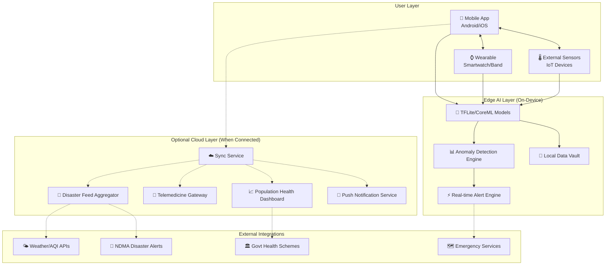
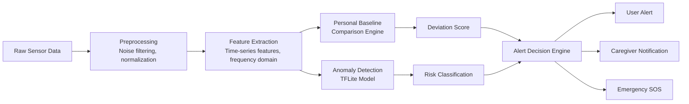
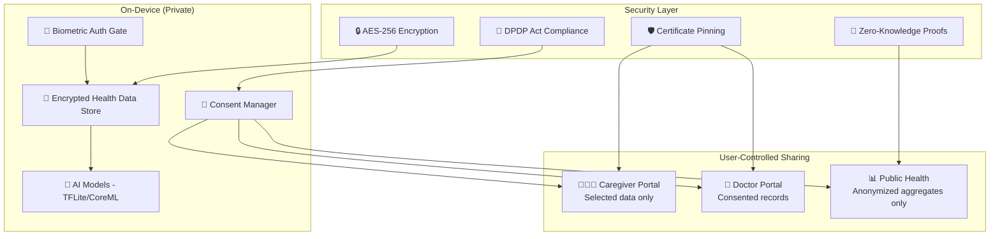
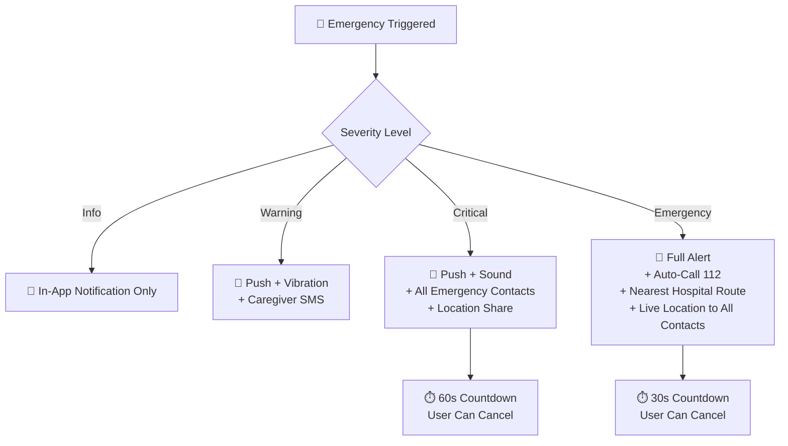
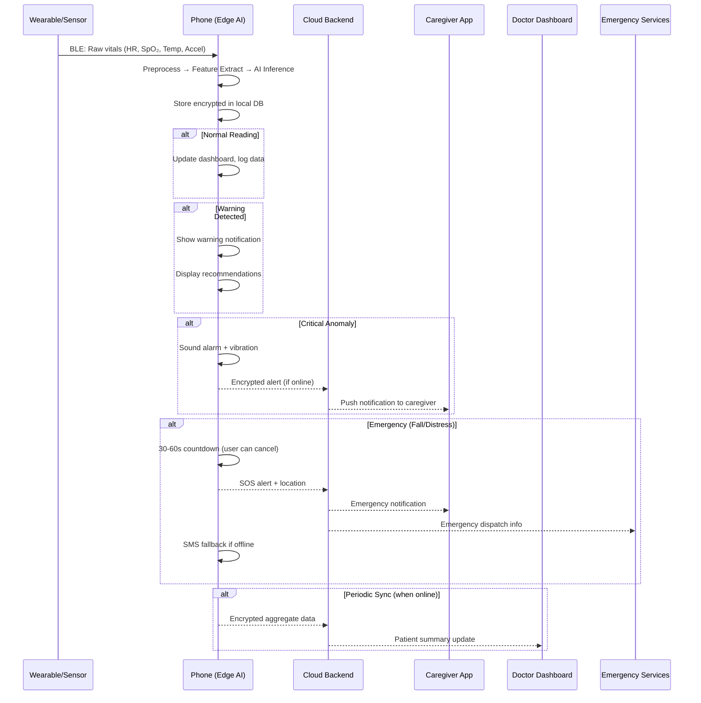

# 🏥 Personal Health Companion (PHC) — Comprehensive Analysis Report

---

## 1. Executive Summary

### What Is This App?

The **Personal Health Companion (PHC)** is a **privacy-first, AI-powered mobile and wearable health monitoring platform** purpose-built for **India's disaster-prone and underserved populations**. It continuously tracks an individual's vital signs and environmental conditions using on-device (edge) AI, detecting health anomalies — such as heat stress, dehydration, respiratory distress, and cardiac irregularities — **before they become emergencies**.

Unlike cloud-dependent health apps, PHC processes all sensitive health data **locally on the device**, ensuring it works even during **network outages, floods, and remote area deployments** where connectivity is unreliable or non-existent.

### The Core Problem It Solves

India experiences recurring disasters — heat waves killing thousands of outdoor workers, floods cutting off healthcare access, air pollution events triggering respiratory crises, and disease outbreaks following cyclones. The most vulnerable populations (rural, elderly, outdoor workers, chronic patients) are also the ones with the **least access** to early warning systems and continuous health monitoring.

PHC bridges this gap by turning **any smartphone or wearable** into an always-on health sentinel.

### Who Is This For?

| Target Audience | Why They Need It |
|---|---|
| **Outdoor Workers** (construction, agriculture, delivery) | Heat stress, dehydration, falls — need real-time alerts during labor |
| **Elderly Citizens** | Chronic conditions, fall detection, medication adherence, caregiver alerts |
| **Rural Populations** | Limited healthcare access, no internet, need offline-first monitoring |
| **Chronic Disease Patients** (diabetes, COPD, cardiovascular) | Continuous baseline tracking, anomaly detection, medication reminders |
| **Pregnant Women** | Vitals monitoring, high-risk pregnancy alerts, telemedicine access |
| **Caregivers & Family Members** | Remote monitoring dashboard, SOS notifications, health trend visibility |
| **Healthcare Providers** (Doctors, ASHA workers, nurses) | Patient monitoring panels, anomaly escalation, community health mapping |
| **Disaster Response Agencies** (NDMA, SDMA, NGOs) | Population-level health heatmaps, outbreak detection, resource deployment |
| **Public Health Officials** | Epidemiological surveillance, policy data, vaccination/scheme integration |
| **Corporate/Industrial Safety Officers** | Worker safety monitoring, OSHA-equivalent compliance, heat exposure tracking |

---

## 2. System Architecture Overview



### Architecture Principles

| Principle | Implementation |
|---|---|
| **Offline-First** | All AI inference, data storage, and alerting works without internet. Cloud sync is opportunistic. |
| **Privacy by Design** | Raw health data never leaves the device unless user explicitly consents. Only anonymized aggregates are sent for public health. |
| **Edge AI** | TensorFlow Lite (Android) / Core ML (iOS) models run on-device for <100ms inference. |
| **Progressive Enhancement** | Basic monitoring works on low-end phones. Advanced features unlock with wearables and sensors. |
| **Multi-Device Sync** | Phone acts as hub; wearable data syncs via BLE; IoT sensors connect via BLE/Wi-Fi. |
| **Battery Optimization** | Adaptive sampling rates — high during activity/risk, low during rest. Background processing uses Android WorkManager / iOS BackgroundTasks. |

---

## 3. User Roles & Permissions Matrix

| Feature | Individual User | Caregiver | Healthcare Provider | Emergency Responder | Public Health Admin | System Admin |
|---|---|---|---|---|---|---|
| View own vitals | ✅ | — | — | — | — | — |
| View dependent's vitals | — | ✅ (with consent) | ✅ (assigned patients) | ✅ (during emergency) | — | — |
| Receive personal alerts | ✅ | ✅ (proxy) | — | — | — | — |
| Modify alert thresholds | ✅ | ✅ (with consent) | ✅ | — | — | ✅ |
| SOS trigger | ✅ | ✅ (remote) | — | — | — | — |
| Receive SOS | — | ✅ | ✅ | ✅ | — | — |
| Patient monitoring panel | — | — | ✅ | ✅ | — | — |
| Community health heatmap | — | — | ✅ | ✅ | ✅ | — |
| Population analytics | — | — | — | — | ✅ | — |
| AI model management | — | — | — | — | — | ✅ |
| User management | — | — | — | — | — | ✅ |
| Disaster alert broadcast | — | — | — | ✅ | ✅ | ✅ |
| Data export | ✅ (own) | — | ✅ (anonymized) | — | ✅ (aggregate) | ✅ |
| Telemedicine consult | ✅ | ✅ (on behalf) | ✅ (provide) | — | — | — |

---

## 4. Comprehensive Feature Breakdown

### 4.1 Continuous Health Monitoring

#### What It Does
Continuously tracks the user's physiological data from phone sensors and connected wearables, establishing personal health baselines and detecting deviations.

#### Data Points Tracked

| Vital Sign | Source | Frequency | Baseline Window |
|---|---|---|---|
| **Heart Rate (HR)** | Wearable PPG sensor, phone camera PPG | Continuous (wearable), on-demand (phone) | 7-day rolling average |
| **Blood Oxygen (SpO₂)** | Wearable pulse oximeter | Every 15 min (adjustable) | 3-day rolling average |
| **Body Temperature** | Wearable skin temp sensor, external thermometer | Every 30 min | 7-day rolling average |
| **Activity Level** | Phone accelerometer, wearable IMU | Continuous | Daily pattern over 14 days |
| **Sleep Quality** | Wearable (movement + HR), phone (movement + ambient) | Nightly | 7-day rolling average |
| **Step Count** | Phone pedometer, wearable | Continuous | Daily target vs. actuals |
| **Respiratory Rate** | Derived from HR waveform (wearable) | Every 30 min | 3-day rolling average |
| **Blood Pressure** | External BLE cuff (optional) | Manual input or scheduled | Trend over 30 days |
| **Blood Glucose** | External BLE glucometer (optional) | Manual input or scheduled | Trend over 30 days |
| **ECG/HRV** | Advanced wearable (if supported) | On-demand or periodic | 14-day rolling average |
| **Hydration Level** | Estimated from HR, skin temp, activity, water intake log | Continuous estimate | Daily target |
| **Stress Level** | Derived from HRV + activity + sleep | Continuous | 7-day rolling average |

#### How It Works
1. **Sensor Abstraction Layer** — A unified SDK that normalizes data from different wearable brands (Fitbit, Mi Band, Samsung Galaxy Watch, Apple Watch, custom health bands) and phone sensors.
2. **Adaptive Sampling** — During high-risk periods (extreme heat, active disaster), sampling rates increase automatically. During sleep/rest, they decrease to conserve battery.
3. **Baseline Learning** — The on-device AI model spends the first 7 days building a personalized baseline for each user. After this, deviations are flagged relative to *their* normal, not population averages.
4. **Data Persistence** — All data is stored in an encrypted local SQLite/Realm database. Configurable retention (default: 90 days on device).

#### How to Make It Better
- **Cuffless Blood Pressure Estimation**: Use PPG waveform analysis from wearable to estimate BP trends without a cuff (research models available from Samsung, Google Health).
- **Sweat Analysis Integration**: Partner with next-gen wearables that analyze sweat for sodium/potassium (indicates dehydration before symptoms appear).
- **Menstrual Cycle Tracking**: For women's health — correlate cycle phase with vitals for more accurate anomaly detection.
- **Medication-Aware Baselines**: If the user logs medications (e.g., beta-blockers lower HR), adjust baselines accordingly so you don't get false anomalies.
- **Continuous Glucose Monitoring (CGM) Integration**: For diabetic users, integrate with devices like FreeStyle Libre via NFC.

---

### 4.2 AI-Based Health Anomaly Detection

#### What It Does
Uses on-device machine learning models to detect health anomalies in real-time, correlating multiple vital signs to identify risk patterns.

#### Anomalies Detected

| Anomaly | Signals Used | Alert Level | Response |
|---|---|---|---|
| **Tachycardia** | HR > personal threshold + 30% for > 5 min | ⚠️ Warning | Rest recommendation, hydrate |
| **Bradycardia** | HR < personal threshold - 30% for > 10 min | 🔴 Critical | Seek medical attention |
| **SpO₂ Drop** | SpO₂ < 92% sustained for > 3 min | 🔴 Critical | Emergency alert to caregiver |
| **Heat Stress** | Skin temp ↑ + HR ↑ + activity ↑ + ambient temp > 35°C | ⚠️ Warning → 🔴 | Move to shade, hydrate, cool down |
| **Dehydration** | HR ↑ + skin temp ↑ + low water intake + high activity | ⚠️ Warning | Hydration reminder with quantity |
| **Respiratory Distress** | Resp rate ↑ + SpO₂ ↓ + AQI > 200 | 🔴 Critical | Use mask, move indoors, medication |
| **Fall Detection** | Sudden acceleration spike + impact + no movement for 30s | 🔴 Critical | Auto-SOS with 30s cancel window |
| **Cardiac Arrhythmia** | Irregular RR intervals from HRV analysis | ⚠️ Warning | ECG recommended, consult doctor |
| **Sleep Apnea Indicators** | SpO₂ dips during sleep + irregular HR | ℹ️ Info | Recommend sleep study |
| **Fatigue/Exhaustion** | HRV ↓ + poor sleep + high activity hours | ⚠️ Warning | Rest recommendation |
| **Hypothermia Risk** | Skin temp ↓ + ambient temp < 10°C + low activity | ⚠️ Warning | Warm up, move, hot fluids |
| **Panic/Anxiety Attack** | HR spike + HRV crash + no physical activity | ℹ️ Info | Breathing exercise prompt |

#### AI Model Architecture (On-Device)



#### How It Works
1. **Preprocessing Pipeline** — Raw sensor data goes through noise filtering (Kalman filter for motion artifacts), normalization, and windowing (30-second to 5-minute windows depending on the signal).
2. **Feature Extraction** — Time-domain features (mean, std, min, max, slope), frequency-domain features (FFT for HRV analysis), and statistical features are computed on-device.
3. **Multi-Signal Correlation** — The AI model doesn't look at signals in isolation. It correlates HR + SpO₂ + temperature + activity + environment to reduce false positives. A high HR during running is normal; a high HR while sitting in 42°C heat is a heat stress warning.
4. **Personalized Thresholds** — Instead of fixed population thresholds, the model learns each user's personal normal range and flags deviations from *their* baseline.
5. **Inference Engine** — TensorFlow Lite (Android) or Core ML (iOS) runs inference in <50ms, consuming <5% battery per hour.
6. **Alert Severity Cascade** — Info → Warning → Critical → Emergency. Each level triggers progressively stronger responses (notification → vibration → sound → SOS).

#### How to Make It Better
- **Federated Learning**: While keeping data on-device, allow the model to improve by sending only model weight updates (not data) to a central server. This improves the model for everyone without compromising privacy.
- **Multi-Day Pattern Recognition**: Detect slow-onset conditions like gradual dehydration over days, not just acute events.
- **Contextual AI**: Integrate calendar data (user has outdoor work scheduled), weather forecasts, and medication schedules to predict risk *before* it happens.
- **Explainable AI (XAI)**: Show users *why* an alert was triggered ("Your heart rate has been 25% above your normal resting rate for the past 20 minutes while ambient temperature is 40°C").
- **Confidence Scoring**: Show the AI's confidence level so users and doctors can prioritize (e.g., "Heat stress risk: 87% confidence").

---

### 4.3 Disaster-Specific Health Alerts

#### What It Does
Integrates real-time disaster and weather data to provide proactive, personalized health advisories during extreme events.

#### Disaster Coverage Matrix

| Disaster Type | Health Risks | Data Sources | Alert Actions |
|---|---|---|---|
| **Heat Wave** | Heat stroke, dehydration, cardiac stress | IMD temperature forecasts, on-device temp sensor | Hydration schedule, shade-seeking reminders, activity restriction |
| **Air Pollution / Smog** | Respiratory distress, asthma attacks, COPD exacerbation | CPCB AQI data, local PM2.5 sensors | Mask reminders, indoor activity suggestion, medication alerts |
| **Flood** | Waterborne diseases, hypothermia, injury, mental stress | IMD flood warnings, local water level data | Evacuation guidance, safe water reminders, wound care tips |
| **Cyclone** | Physical injury, respiratory issues, waterborne diseases | IMD cyclone tracking, wind speed data | Shelter guidance, first-aid tips, post-cyclone disease prevention |
| **Cold Wave** | Hypothermia, cardiovascular stress, respiratory infections | IMD temperature data | Layering advice, indoor heating safety, warm fluid reminders |
| **Earthquake** | Physical trauma, panic, crush injuries | Seismic alerts (NCS/USGS) | Drop-cover-hold, post-quake first aid, structural safety |
| **Disease Outbreak** | Dengue, malaria, cholera, COVID-19 | IDSP surveillance data, WHO alerts | Symptom checklist, prevention measures, nearby facility info |
| **Industrial Disaster** | Chemical exposure, burns, respiratory damage | Local emergency broadcasts | Evacuation routes, decontamination steps, antidote info |

#### How It Works
1. **Disaster Feed Aggregator** — A cloud service pulls data from IMD, CPCB, NDMA, IDSP, and other government APIs, normalizes it, and pushes relevant alerts based on user's registered location.
2. **Geo-Fencing** — User's location (GPS when permitted, or manually set PIN code) determines which disaster alerts are relevant.
3. **Risk Personalization** — A 45-year-old diabetic outdoor worker gets a "high priority" heat wave alert; a 25-year-old indoor worker in the same area gets "moderate." Risk scoring uses age, health conditions, occupation, and medication data.
4. **Offline Disaster Cache** — The last 72 hours of disaster forecasts are cached locally. If the user goes offline during a flood, they still have the most recent advisories.
5. **Multi-Channel Delivery** — Alerts via push notification, in-app banner, SMS (as fallback), and audible alarm for critical events.

#### How to Make It Better
- **Predictive Disaster Health Modeling**: Don't just alert during a heatwave — alert 24-48 hours *before* based on weather forecast + user's current hydration/sleep status ("Heatwave expected tomorrow. Your hydration levels are already low. Start drinking extra water now").
- **Community Crowd-Sourcing**: Let users report local conditions (flooding in my area, power outage, road blocked) to create hyperlocal disaster maps.
- **Post-Disaster Health Tracking**: After a flood, track for waterborne disease symptoms (diarrhea, fever) for 2 weeks with daily health check-ins.
- **Disaster Preparedness Score**: Gamified readiness score — "You have 80% preparedness for cyclone season" based on emergency contacts set up, first-aid kit confirmed, evacuation route saved.

---

### 4.4 Environmental Awareness

#### What It Does
Collects and correlates environmental data with health data to provide context-aware health recommendations.

#### Environmental Data Sources

| Parameter | Source | Update Frequency | Health Relevance |
|---|---|---|---|
| **Ambient Temperature** | Phone sensor, wearable, weather API | Real-time + forecast | Heat stress, hypothermia risk |
| **Humidity** | Phone sensor (if available), weather API | Hourly | Heat index calculation, dehydration risk |
| **Air Quality Index (AQI)** | CPCB API, local PM2.5 sensors | Hourly | Respiratory risk, outdoor activity safety |
| **UV Index** | Weather API | Hourly | Sunburn risk, skin cancer prevention |
| **Pollen Count** | Third-party API (where available) | Daily | Allergy/asthma trigger |
| **Water Quality** | Crowd-sourced + govt data | Daily (where available) | Waterborne disease risk |
| **Noise Level** | Phone microphone (sampled) | Periodic | Hearing damage, stress |
| **Barometric Pressure** | Phone barometer | Real-time | Migraine trigger, weather change prediction |
| **Heat Index / Wet Bulb** | Calculated from temp + humidity | Real-time | True heat stress risk (more accurate than temp alone) |

#### How It Works
1. **Sensor Fusion** — Combines on-device sensors (temp, humidity, barometer) with API data (AQI, UV, weather forecast) for a comprehensive environmental picture.
2. **Health-Environment Correlation Engine** — Maps environmental conditions to health risks using a rule-based + ML hybrid approach. Example: AQI > 300 + user has asthma → immediate respiratory risk alert.
3. **Microclimate Detection** — In India, conditions can vary significantly within a few kilometers. The app uses hyperlocal weather data + device sensors to detect microclimates (e.g., urban heat island effect in cities).
4. **Personalized Risk Scoring** — The same environmental conditions produce different risk levels for different users based on their health profile, age, and activity.

#### How to Make It Better
- **Indoor vs. Outdoor Detection**: Use phone sensors (light level, Wi-Fi connectivity, GPS accuracy) to detect if user is indoors or outdoors and adjust environmental risk accordingly.
- **Route-Based Risk Assessment**: If the user is navigating somewhere, show health risks along the route (e.g., "High AQI zone ahead — consider alternate route").
- **Workplace Environmental Monitoring**: For factories/construction sites, connect to on-site IoT sensors for real-time workplace safety.
- **Seasonal Health Calendar**: Auto-generate monthly health advisories based on regional seasonal patterns (monsoon diseases, summer heat, winter respiratory issues).
- **Carbon Monoxide / Gas Detection**: Integration with home IoT gas sensors for indoor air quality.

---

### 4.5 Privacy-Preserving Edge AI

#### What It Does
Ensures all sensitive health data processing happens on-device, with user-controlled data sharing, end-to-end encryption, and compliance with Indian data protection laws.

#### Privacy Architecture



#### Privacy Features

| Feature | Implementation | Why It Matters |
|---|---|---|
| **On-Device Processing** | All AI inference via TFLite/CoreML | Raw health data never leaves the device |
| **End-to-End Encryption** | AES-256 for storage, TLS 1.3 for transit | Even if device is stolen, data is unreadable |
| **Biometric Authentication** | Fingerprint/Face ID to access health data | Prevents unauthorized access |
| **Granular Consent Management** | Per-data-type, per-recipient consent toggles | User controls exactly what is shared with whom |
| **Data Minimization** | Only aggregated/anonymized data sent to cloud | Compliant with DPDP Act's data minimization principle |
| **Right to Erasure** | One-tap delete all personal data | User can wipe everything instantly |
| **Differential Privacy** | Add noise to aggregated data before transmission | Even aggregates can't be traced back to individuals |
| **Zero-Knowledge Proofs** | Prove health status (e.g., "vaccinated") without revealing underlying data | Privacy-preserving health certificates |
| **Audit Log** | Complete log of all data access and sharing | User can see who accessed what and when |
| **Offline-Only Mode** | Optional mode where NO data ever leaves the device | Maximum privacy for paranoid users |

#### How to Make It Better
- **Homomorphic Encryption**: Enable cloud-based analytics on encrypted data without ever decrypting it.
- **Secure Enclaves**: Use hardware-based Trusted Execution Environments (TEE) on supported devices for model inference.
- **Decentralized Identity**: Use blockchain-based DIDs so users own their health identity across platforms.
- **Privacy Nutrition Labels**: Show clear, visual "privacy nutrition labels" (like Apple) explaining exactly what data is collected and how it's used.
- **Parental Controls**: For children's health data, additional consent layers and age-appropriate data handling.

---

### 4.6 Emergency Assistance Features

#### What It Does
Provides automatic and manual emergency response capabilities including fall detection, SOS alerts, location sharing, and emergency contact management.

#### Emergency Feature Matrix

| Feature | Trigger | Response Time | Actions |
|---|---|---|---|
| **Fall Detection** | Accelerometer spike + no movement 30s | Auto-SOS in 60s (with cancel) | Alert caregivers + emergency services + share location |
| **Manual SOS** | Physical button press (3x power) or in-app SOS | Immediate | Alert all emergency contacts + share location + call emergency number |
| **Medical Distress Auto-Detection** | SpO₂ < 85% or HR > 180 or HR < 35 sustained | Auto-SOS in 90s (with cancel) | Alert caregivers + suggest nearest hospital |
| **Panic Button** | In-app panic button | Immediate | Silent alert to emergency contacts with live location |
| **Inactivity Alert** | No movement/interaction for configurable period | Alert after timeout | Check-in prompt → escalate to caregiver if no response |
| **Voice-Activated SOS** | "Help me" / "Bachao" voice command | 5-10 seconds | Same as manual SOS |
| **Medication Emergency** | Missed critical medication for extended period | Alert after threshold | Caregiver notification + medication info for responders |

#### Emergency Contact Hierarchy



#### How It Works
1. **Multi-Sensor Fall Detection** — Uses accelerometer + gyroscope + barometer (altitude change) to distinguish falls from phone drops or sitting down quickly. ML model trained on fall datasets.
2. **Progressive Escalation** — Starts with on-device alert → if no user response → caregiver notification → if no caregiver response → emergency services.
3. **Emergency Card** — Pre-configured card with blood type, allergies, medications, emergency contacts, and medical conditions that emergency responders can access from the lock screen.
4. **Offline SOS** — Uses SMS and phone calls (which work without internet) as fallback for SOS alerts.
5. **Location Methods** — GPS → Cell tower triangulation → Last known location, in descending accuracy.

#### How to Make It Better
- **Peer Mesh Network**: During disasters when cellular networks fail, use Bluetooth/Wi-Fi Direct to create mesh networks where SOS signals hop between nearby PHC users until they reach someone with connectivity.
- **Smart Home Integration**: During medical emergency, auto-unlock smart locks, turn on lights, disable alarm systems for responder access.
- **Emergency Responder App**: Dedicated app for emergency responders that shows patient's emergency card + real-time vitals + location + medical history (with consent).
- **Post-Emergency Follow-Up**: After an emergency event, schedule automated check-ins for 72 hours to monitor recovery.
- **Nearest AED Locator**: Map of nearby Automated External Defibrillators for cardiac emergencies.
- **First-Aid AR Guides**: Augmented reality overlays showing CPR instructions, wound care, etc.

---

### 4.7 Personal Wellness Dashboard

#### What It Does
Provides comprehensive daily, weekly, and monthly health summaries with trend analysis, risk scores, and personalized recommendations.

#### Dashboard Components

| Component | Data Shown | Visualization | Update Frequency |
|---|---|---|---|
| **Today's Vitals Overview** | HR, SpO₂, Temp, Steps, Sleep, Stress | Circular gauges + status badges | Real-time |
| **Health Risk Score** | Composite 0-100 score (lower = safer) | Color-coded gauge (green/yellow/red) | Every 15 min |
| **Heat Stress Index** | Body temp + ambient temp + humidity + activity | Thermometer visualization | Real-time in summer |
| **Respiratory Risk Index** | SpO₂ + resp rate + AQI | Lung icon with color fill | Hourly |
| **Cardiovascular Risk Index** | HR + HRV + BP + activity | Heart icon with color fill | Hourly |
| **Hydration Status** | Estimated from vitals + water intake | Water bottle fill level | Real-time |
| **Sleep Analysis** | Duration, quality, stages (light/deep/REM), disturbances | Timeline + quality score | Morning |
| **Activity Summary** | Steps, active minutes, calories, distance | Ring/progress chart | Real-time |
| **Weekly Health Trends** | All vitals plotted over 7 days with baselines | Line charts with baseline bands | Daily |
| **Monthly Report** | Comprehensive health summary + insights + recommendations | PDF-style report | Monthly |
| **Medication Tracker** | Scheduled vs. taken, adherence rate | Checklist + adherence graph | Real-time |
| **Environmental Conditions** | Temperature, AQI, UV, humidity at user's location | Weather-card style | Hourly |
| **Recommendations** | AI-generated, personalized health tips | Cards with priority badges | Dynamic |

#### Risk Score Calculation

```
Health Risk Score (0-100) = Weighted combination of:
  ├── Vital Signs Deviation (35%)
  │     ├── HR deviation from baseline
  │     ├── SpO₂ deviation from baseline
  │     ├── Temperature deviation from baseline
  │     └── HRV deviation from baseline
  ├── Environmental Risk (25%)
  │     ├── Heat index / Wet bulb temperature
  │     ├── AQI level
  │     ├── Active disaster warnings
  │     └── UV index
  ├── Activity & Behavior (20%)
  │     ├── Physical activity vs. recommended
  │     ├── Hydration compliance
  │     ├── Sleep quality
  │     └── Medication adherence
  └── Personal Risk Factors (20%)
        ├── Age group risk multiplier
        ├── Chronic condition presence
        ├── Occupation risk (outdoor/indoor)
        └── Recent health events
```

#### How to Make It Better
- **Natural Language Summaries**: Instead of just charts, use on-device LLM (Gemini Nano) to generate natural language health summaries in the user's regional language ("आज आपकी सेहत अच्छी है, लेकिन पानी कम पिया है").
- **Comparative Analytics**: "Your sleep quality is better than 70% of people in your age group in your region" (using anonymized aggregate data).
- **Health Goals & Gamification**: Set goals (10k steps, 3L water, 7h sleep) with streaks, badges, and gentle nudges.
- **Doctor-Ready Reports**: One-tap export of health summary optimized for doctor consultations (printed or digital).
- **Family Dashboard View**: See all family members' health scores in one view.
- **Widget Support**: Home screen widgets showing live vitals, risk score, and next recommendation without opening the app.

---

### 4.8 Scalable Deployment

#### What It Does
Supports deployment across multiple device types, user segments, and organizational scales.

#### Deployment Matrix

| Platform | Min Requirements | Features Available | Target Users |
|---|---|---|---|
| **Android Phone (Basic)** | Android 8+, 2GB RAM | Phone-sensor monitoring, manual vitals input, alerts, dashboard, SOS | Mass market, rural users |
| **Android Phone (Advanced)** | Android 10+, 4GB RAM, NFC | All basic + wearable sync, edge AI, camera-based vitals | Urban users, tech-savvy |
| **iOS Phone** | iOS 14+, iPhone 8+ | Full feature set + Apple Health integration | Apple ecosystem users |
| **WearOS Smartwatch** | WearOS 3+ | Standalone vitals monitoring, SOS, basic alerts | Active individuals |
| **Apple Watch** | watchOS 8+ | Standalone vitals monitoring, SOS, HealthKit sync | Apple ecosystem users |
| **Fitness Bands** | BLE-compatible bands | Data collection, basic alerts on phone | Budget-conscious users |
| **Feature Phones** | KaiOS / SMS-capable | SMS-based alerts, manual check-ins, SOS via SMS | Rural elderly, low-tech users |
| **IoT Hub** | Raspberry Pi + sensors | Community health monitoring station | PHCs, community centers |
| **Web Dashboard** | Modern browser | Provider/admin dashboards, analytics, management | Healthcare providers, admins |

#### Deployment Models

| Model | Use Case | Scale | Key Features |
|---|---|---|---|
| **Individual Consumer** | Personal health tracking | 1 user | Full app, personal dashboard |
| **Family Plan** | Family health monitoring | 2-8 users | Shared dashboard, caregiver features |
| **Enterprise/Industrial** | Worker safety monitoring | 50-10,000 workers | Admin console, fleet management, compliance reports |
| **Healthcare Provider** | Patient remote monitoring | 50-500 patients per provider | Patient panels, anomaly escalation, telemedicine |
| **Public Health Program** | Government health initiatives | 100,000+ citizens | Population dashboards, outbreak detection, scheme integration |
| **Disaster Response** | Emergency deployment | Variable | Rapid onboarding, field kits, emergency triage |

#### How to Make It Better
- **Progressive Web App (PWA)**: Lightweight web version for users who can't install apps (storage-limited phones).
- **USSD/IVR Fallback**: For feature phones, provide a USSD menu (*123#) or IVR (phone call) based interface for basic health check-ins.
- **Raspberry Pi Community Kits**: Pre-configured health monitoring stations for rural Primary Health Centres with BLE range for 50m radius.
- **White-Label SDK**: Allow hospitals and NGOs to embed PHC monitoring into their own apps.
- **Multi-Tenancy**: Single backend supporting multiple organizations with data isolation.

---

## 5. Additional Features to Make It 10x Better

### 5.1 Telemedicine Integration

| Feature | Description |
|---|---|
| **Video Consultation** | In-app video call with registered doctors |
| **Vitals Sharing During Call** | Real-time vitals stream to doctor during consultation |
| **e-Prescription** | Doctor can send digital prescription within the app |
| **Lab Test Ordering** | Order tests from partner labs; results auto-import |
| **Follow-Up Scheduling** | AI-suggested follow-up based on condition |
| **ASHA Worker Connect** | Rural users can connect with local ASHA workers for guidance |

### 5.2 Mental Health Module

| Feature | Description |
|---|---|
| **Mood Tracking** | Daily mood check-in with emoji/slider |
| **Stress Detection** | HRV-based stress detection with breathing exercises |
| **Sleep-Anxiety Correlation** | Track how anxiety affects sleep and vice versa |
| **Guided Meditation** | Offline-available meditation and breathing exercises |
| **Crisis Helpline Quick Access** | One-tap access to mental health helplines (Vandrevala, iCall) |
| **PTSD Screening Post-Disaster** | Automated screening questionnaire after disaster events |

### 5.3 Nutrition & Hydration Intelligence

| Feature | Description |
|---|---|
| **Smart Water Reminders** | Adaptive reminders based on activity, temperature, and hydration status |
| **Meal Logging** | Photo-based meal logging with AI calorie estimation |
| **Regional Nutrition Advice** | Contextual nutrition tips using local Indian food database |
| **ORS Mixing Guide** | Step-by-step ORS preparation during dehydration events |
| **Fasting Mode** | Adjusted monitoring during religious fasts (Ramadan, Navratri) |

### 5.4 Women's Health

| Feature | Description |
|---|---|
| **Period Tracking** | Cycle tracking with vital sign correlation |
| **Pregnancy Monitoring** | Trimester-specific vitals monitoring and kick counting |
| **Anemia Risk Screening** | Nail bed photo analysis for pallor detection (research feature) |
| **Postpartum Health** | Post-delivery health monitoring for mother and newborn |

### 5.5 Child Health Module

| Feature | Description |
|---|---|
| **Growth Tracking** | WHO growth chart comparison (height, weight, head circumference) |
| **Vaccination Schedule** | Automated reminders per National Immunization Schedule |
| **Fever Monitor** | Continuous temp monitoring with febrile seizure risk alerts |
| **Developmental Milestones** | Age-appropriate milestone checklists |

### 5.6 Chronic Disease Management

| Feature | Description |
|---|---|
| **Diabetes Management** | Glucose logging, insulin reminders, HbA1c trend tracking |
| **Hypertension Management** | BP trending, salt intake tracking, medication adherence |
| **COPD/Asthma Management** | Peak flow logging, inhaler usage tracking, trigger avoidance |
| **Cardiac Rehab** | Post-surgery activity guidelines with heart rate zone monitoring |
| **Kidney Health** | Fluid intake/output tracking for CKD patients |

### 5.7 Government Scheme Integration

| Feature | Description |
|---|---|
| **Ayushman Bharat (AB-PMJAY)** | Check eligibility, find empaneled hospitals, track claims |
| **Jan Arogya Yojana** | Facilitate cashless treatment under the scheme |
| **ABHA Health ID** | Generate and link ABHA (Ayushman Bharat Health Account) ID |
| **e-Sanjeevani** | Direct link to government telemedicine platform |
| **CoWIN Integration** | Vaccination records import and reminders |
| **104 Health Helpline** | Quick-dial integration with state health helplines |

### 5.8 Community Health Features

| Feature | Description |
|---|---|
| **Health Heatmap** | Anonymized community health risk visualization |
| **Outbreak Early Warning** | Cluster detection of similar symptoms in a locality |
| **Peer Support Groups** | Connect users with similar conditions for support |
| **Health Camps Locator** | Find nearby health camps, blood donation drives, vaccination drives |
| **Community Health Score** | Neighborhood-level health resilience score |

### 5.9 Accessibility & Inclusivity

| Feature | Description |
|---|---|
| **22+ Indian Language Support** | Full UI + voice alerts in Hindi, Tamil, Telugu, Bengali, Marathi, etc. |
| **Voice-First Interface** | Complete app navigation via voice for low-literacy users |
| **Large Text / High Contrast Mode** | For elderly users with vision issues |
| **Screen Reader Compatibility** | Full TalkBack/VoiceOver support |
| **Simplified Mode** | Reduced interface showing only essential vitals and SOS |
| **Pictographic Interface** | Icon-heavy UI for users who can't read |

### 5.10 Offline Intelligence

| Feature | Description |
|---|---|
| **Offline Health Encyclopedia** | Cached first-aid guides, disease info, medication info |
| **Offline Maps** | Cached maps with hospital locations for emergency routing |
| **Offline AI Models** | All anomaly detection works without internet |
| **Store-and-Forward** | Queue all cloud-bound data and sync when connectivity returns |
| **P2P Data Sharing** | Share health data with nearby doctor via Bluetooth/NFC without internet |

---

## 6. Complete Screen Inventory by Role

### 6.1 Individual User (Patient) Screens

| # | Screen Name | Description | Key Elements |
|---|---|---|---|
| 1 | **Splash Screen** | App launch with PHC branding | Logo, loading animation, privacy badge |
| 2 | **Onboarding - Welcome** | App introduction carousel | 4-5 slides explaining core features |
| 3 | **Onboarding - Language Selection** | Choose preferred language | Grid of 22+ Indian languages + English |
| 4 | **Onboarding - Registration** | Create account | Phone number, OTP verification, basic details |
| 5 | **Onboarding - Health Profile** | Input health details | Age, gender, height, weight, blood type, medical conditions, allergies, medications |
| 6 | **Onboarding - Device Pairing** | Connect wearable/sensors | BLE scan, device list, pairing guide |
| 7 | **Onboarding - Emergency Contacts** | Set up emergency contacts | Add contacts, assign roles (primary/secondary), relationship |
| 8 | **Onboarding - Permissions** | Grant required permissions | Location, sensors, notifications, phone — with explanation for each |
| 9 | **Onboarding - Privacy Settings** | Configure data sharing preferences | Toggle switches for each data type and recipient |
| 10 | **Home Dashboard** | Main screen with live vitals overview | Health risk score gauge, current vitals cards, active alerts, weather card, quick actions |
| 11 | **Heart Rate Detail** | Detailed HR view | Live HR graph, today's range, baseline, resting HR, HR zones, 7-day trend |
| 12 | **SpO₂ Detail** | Blood oxygen details | Current SpO₂, 24h graph, alerts history, night-time SpO₂ |
| 13 | **Temperature Detail** | Body temperature view | Current temp, ambient temp, heat index, trend graph |
| 14 | **Activity Detail** | Physical activity view | Steps, distance, calories, active minutes, hourly activity graph |
| 15 | **Sleep Detail** | Sleep analysis view | Duration, quality score, sleep stages timeline, disturbances, 7-day trend |
| 16 | **Stress & HRV Detail** | Stress monitoring view | Current stress level, HRV graph, daily stress pattern, breathing exercises |
| 17 | **Hydration Tracker** | Water intake tracking | Daily goal progress, intake log, smart reminders, dehydration risk |
| 18 | **Environmental Dashboard** | Local environment data | Temperature, humidity, AQI (with pollutant breakdown), UV index, weather forecast |
| 19 | **Health Risk Assessment** | Comprehensive risk view | Heat stress index, respiratory risk, cardiac risk, composite score with explanations |
| 20 | **Alerts Center** | All alerts and notifications | Filterable list (by type, severity, date), mark as read, alert details |
| 21 | **Alert Detail** | Individual alert view | What triggered it, severity, raw data, recommended actions, "Call Doctor" button |
| 22 | **Disaster Alerts** | Active disaster warnings | Map view of affected areas, severity, health advisories, preparation checklist |
| 23 | **SOS Screen** | Emergency SOS trigger | Large SOS button, countdown timer, cancel button, emergency contact status |
| 24 | **SOS Active** | During active SOS | Live location sharing status, contact notification status, emergency number dialer, medical ID |
| 25 | **Emergency Medical ID** | Lock-screen accessible card | Name, blood type, allergies, medications, conditions, emergency contacts |
| 26 | **Medication Tracker** | Medication management | Medication list, schedule, reminders, adherence graph, refill alerts |
| 27 | **Add/Edit Medication** | Medication form | Drug name (with autocomplete), dosage, frequency, timing, notes, photo of prescription |
| 28 | **Wellness Recommendations** | AI-generated health tips | Personalized cards for hydration, rest, activity, diet, based on current health data |
| 29 | **Weekly Health Report** | 7-day summary | All vital trends, notable events, achievement badges, AI-generated summary |
| 30 | **Monthly Health Report** | 30-day comprehensive report | Printable/shareable PDF with all metrics, trends, risks, and recommendations |
| 31 | **Telemedicine Home** | Telemedicine landing | Available doctors, upcoming appointments, recent consultations |
| 32 | **Doctor Search & Booking** | Find and book doctor | Specialty filter, location, ratings, availability, price, book appointment |
| 33 | **Video Consultation** | Live video call with doctor | Video feed, vitals panel (shared with doctor), chat, prescription area |
| 34 | **Prescription View** | View e-prescription | Medication list, dosage, duration, lab tests ordered, follow-up date |
| 35 | **Health Records** | Personal health records vault | Lab reports, prescriptions, discharge summaries, vaccination records — all encrypted |
| 36 | **Add Health Record** | Upload/scan health records | Camera capture, PDF upload, auto-categorization |
| 37 | **Family Health Hub** | Family members overview | Family member cards with health scores, quick-add dependent |
| 38 | **Settings - Profile** | Edit personal profile | Name, age, contact, health conditions, medications |
| 39 | **Settings - Devices** | Manage connected devices | List of paired devices, connection status, battery, re-pair, remove |
| 40 | **Settings - Privacy** | Data sharing controls | Per-data-type toggles, data export, data deletion, audit log |
| 41 | **Settings - Notifications** | Alert preferences | Toggle/configure each alert type, quiet hours, sound selection |
| 42 | **Settings - Emergency** | Emergency settings | Emergency contacts management, SOS configuration, medical ID edit |
| 43 | **Settings - Language** | Change language | Language selector with preview |
| 44 | **Settings - Accessibility** | Accessibility options | Text size, contrast, simplified mode, voice navigation toggle |
| 45 | **Health Encyclopedia** | Offline health info | Searchable health topics, first-aid guides, disease info, medication info |
| 46 | **Government Schemes** | Healthcare schemes info | Eligibility checker, nearby hospitals, scheme details, application links |
| 47 | **About & Help** | App info and support | FAQ, tutorial videos, contact support, privacy policy, terms |

### 6.2 Caregiver Screens

| # | Screen Name | Description | Key Elements |
|---|---|---|---|
| 1 | **Caregiver Dashboard** | Overview of all dependents | Dependent cards with health scores, active alerts, quick actions |
| 2 | **Dependent Detail** | Individual dependent's health view | Live vitals, risk score, recent alerts, trend graphs |
| 3 | **Dependent Alerts** | Alerts for a specific dependent | Alert list with severity, actions taken, escalation options |
| 4 | **Remote SOS Trigger** | Trigger SOS for dependent | Confirm SOS trigger, select dependent, add context note |
| 5 | **Dependent History** | Health timeline for dependent | Chronological health events, vitals trends, doctor visits |
| 6 | **Add Dependent** | Link a new dependent | Invite via phone/QR code, set permissions, configure alerts |
| 7 | **Caregiver Settings** | Notification preferences | Alert thresholds per dependent, quiet hours, escalation rules |
| 8 | **Check-In Screen** | Request/send check-in to dependent | Send "Are you okay?" prompt, view response, escalate if no response |

### 6.3 Healthcare Provider Screens

| # | Screen Name | Description | Key Elements |
|---|---|---|---|
| 1 | **Provider Dashboard** | Patient management overview | Active patients count, active alerts, high-risk patients list, today's appointments |
| 2 | **Patient List** | All assigned patients | Searchable/filterable list with health scores, conditions, last check-in |
| 3 | **Patient Detail** | Individual patient deep-dive | Current vitals, trend graphs, health history, medications, notes |
| 4 | **Patient Vitals Timeline** | Chronological vitals view | Scrollable timeline with all vitals, events, and anomalies plotted |
| 5 | **Anomaly Review** | Review AI-detected anomalies | Anomaly details, raw data, AI confidence, dismiss/escalate/note options |
| 6 | **Telemedicine Console** | Video consultation (provider side) | Video feed, patient vitals panel, prescription writing, note-taking |
| 7 | **Prescription Writer** | Write e-prescription | Drug search with interaction checker, dosage calculator, lab test ordering |
| 8 | **Community Health Map** | Geographic health overview | Map with anonymized health heatmap, active alerts, disease clusters |
| 9 | **Patient Reports** | Generate patient reports | Configurable date range, metrics selection, PDF/CSV export |
| 10 | **Provider Settings** | Practice configuration | Availability schedule, consultation pricing, specialization |

### 6.4 Emergency Responder Screens

| # | Screen Name | Description | Key Elements |
|---|---|---|---|
| 1 | **Responder Dashboard** | Active emergencies overview | Map with active SOS signals, severity, ETA, assignment status |
| 2 | **Emergency Detail** | Individual emergency info | Patient location, medical ID, live vitals, nearby hospital route |
| 3 | **Triage Screen** | Multi-casualty triage | List of affected individuals, health severity sorting, assignment |
| 4 | **Disaster Zone Map** | Disaster impact visualization | Affected area overlay, population density, health risk heatmap, resource locations |
| 5 | **Mass Alert Composer** | Send alerts to area | Geo-fenced alert targeting, template selection, severity level |
| 6 | **Field Reports** | Log field observations | Photo/video, GPS-tagged reports, health conditions observed |

### 6.5 Public Health Admin Screens

| # | Screen Name | Description | Key Elements |
|---|---|---|---|
| 1 | **Population Dashboard** | Region-level health overview | Population health KPIs, active disaster count, disease trend charts |
| 2 | **Epidemiological Surveillance** | Disease outbreak tracking | Disease-wise case counts, geographic spread, growth rate, prediction |
| 3 | **Environmental Monitoring** | Regional environmental data | AQI heatmap, temperature map, flood/cyclone zones, risk assessment |
| 4 | **Campaign Management** | Health campaign tools | Create/manage awareness campaigns, target demographics, reach analytics |
| 5 | **Scheme Analytics** | Government scheme usage | Enrollment stats, claim patterns, beneficiary demographics |
| 6 | **Data Export & Reporting** | Comprehensive analytics | Custom report builder, scheduled reports, API access management |
| 7 | **Alert Management** | Disaster alert configuration | Create/edit alert rules, geographic targeting, severity thresholds |

### 6.6 System Admin Screens

| # | Screen Name | Description | Key Elements |
|---|---|---|---|
| 1 | **System Dashboard** | Platform health overview | Active users, server health, AI model performance, error rates |
| 2 | **User Management** | User administration | User search, role assignment, suspension, activity logs |
| 3 | **AI Model Management** | ML model lifecycle | Model versions, performance metrics, A/B test results, deployment |
| 4 | **Content Management** | App content control | Health encyclopedia, alerts templates, recommendation templates |
| 5 | **Configuration** | System settings | Feature flags, rate limits, API keys, integration configs |
| 6 | **Audit Logs** | Security audit trail | Complete activity log, data access log, anomalous access detection |
| 7 | **Analytics Dashboard** | Platform analytics | User engagement, feature usage, retention, crash analytics |

---

## 7. Complete API Inventory

### 7.1 Authentication & User Management APIs

| # | API Endpoint | Method | Description | Auth |
|---|---|---|---|---|
| 1 | `/api/v1/auth/send-otp` | POST | Send OTP to phone number for login/registration | Public |
| 2 | `/api/v1/auth/verify-otp` | POST | Verify OTP and return JWT tokens | Public |
| 3 | `/api/v1/auth/refresh-token` | POST | Refresh expired JWT access token | Refresh Token |
| 4 | `/api/v1/auth/logout` | POST | Invalidate current session | JWT |
| 5 | `/api/v1/auth/logout-all` | POST | Invalidate all sessions for user | JWT |
| 6 | `/api/v1/users/profile` | GET | Get current user profile | JWT |
| 7 | `/api/v1/users/profile` | PUT | Update user profile | JWT |
| 8 | `/api/v1/users/profile/photo` | PUT | Upload profile photo | JWT |
| 9 | `/api/v1/users/health-profile` | GET | Get user's health profile (conditions, allergies, etc.) | JWT |
| 10 | `/api/v1/users/health-profile` | PUT | Update health profile | JWT |
| 11 | `/api/v1/users/delete-account` | DELETE | Delete user account and all data | JWT + OTP |
| 12 | `/api/v1/users/export-data` | POST | Export all user data (DPDP compliance) | JWT |
| 13 | `/api/v1/users/preferences` | GET | Get user preferences (language, notifications, privacy) | JWT |
| 14 | `/api/v1/users/preferences` | PUT | Update preferences | JWT |
| 15 | `/api/v1/users/abha-link` | POST | Link ABHA Health ID | JWT |

### 7.2 Health Data APIs

| # | API Endpoint | Method | Description | Auth |
|---|---|---|---|---|
| 16 | `/api/v1/health/vitals/sync` | POST | Batch sync vitals data from device (encrypted) | JWT |
| 17 | `/api/v1/health/vitals/latest` | GET | Get latest vitals snapshot | JWT |
| 18 | `/api/v1/health/vitals/history` | GET | Get vitals history (with date range, type filters) | JWT |
| 19 | `/api/v1/health/vitals/trends` | GET | Get vitals trend analysis (7d, 30d, 90d) | JWT |
| 20 | `/api/v1/health/baseline` | GET | Get user's personal baselines for all vitals | JWT |
| 21 | `/api/v1/health/baseline` | PUT | Update/override baseline values | JWT |
| 22 | `/api/v1/health/risk-score` | GET | Get current composite health risk score | JWT |
| 23 | `/api/v1/health/risk-score/history` | GET | Get risk score history | JWT |
| 24 | `/api/v1/health/sleep/log` | POST | Log sleep session data | JWT |
| 25 | `/api/v1/health/sleep/history` | GET | Get sleep history and analysis | JWT |
| 26 | `/api/v1/health/activity/log` | POST | Log activity session data | JWT |
| 27 | `/api/v1/health/activity/history` | GET | Get activity history | JWT |
| 28 | `/api/v1/health/hydration/log` | POST | Log water intake | JWT |
| 29 | `/api/v1/health/hydration/today` | GET | Get today's hydration status | JWT |
| 30 | `/api/v1/health/mood/log` | POST | Log mood entry | JWT |
| 31 | `/api/v1/health/mood/history` | GET | Get mood history | JWT |
| 32 | `/api/v1/health/reports/weekly` | GET | Get weekly health report | JWT |
| 33 | `/api/v1/health/reports/monthly` | GET | Get monthly health report | JWT |
| 34 | `/api/v1/health/reports/export` | POST | Export health report as PDF | JWT |

### 7.3 Anomaly Detection & Alerts APIs

| # | API Endpoint | Method | Description | Auth |
|---|---|---|---|---|
| 35 | `/api/v1/anomalies` | GET | Get detected anomalies list | JWT |
| 36 | `/api/v1/anomalies/{id}` | GET | Get anomaly details with raw data | JWT |
| 37 | `/api/v1/anomalies/{id}/dismiss` | POST | Dismiss/acknowledge anomaly | JWT |
| 38 | `/api/v1/anomalies/{id}/escalate` | POST | Escalate anomaly to caregiver/doctor | JWT |
| 39 | `/api/v1/alerts` | GET | Get all alerts (paginated, filterable) | JWT |
| 40 | `/api/v1/alerts/{id}` | GET | Get alert details | JWT |
| 41 | `/api/v1/alerts/{id}/read` | PUT | Mark alert as read | JWT |
| 42 | `/api/v1/alerts/settings` | GET | Get alert threshold settings | JWT |
| 43 | `/api/v1/alerts/settings` | PUT | Update alert thresholds | JWT |
| 44 | `/api/v1/alerts/disaster` | GET | Get active disaster alerts for user's location | JWT |
| 45 | `/api/v1/alerts/disaster/history` | GET | Get past disaster alerts | JWT |

### 7.4 Emergency & SOS APIs

| # | API Endpoint | Method | Description | Auth |
|---|---|---|---|---|
| 46 | `/api/v1/emergency/sos/trigger` | POST | Trigger SOS alert | JWT |
| 47 | `/api/v1/emergency/sos/cancel` | POST | Cancel active SOS | JWT |
| 48 | `/api/v1/emergency/sos/status` | GET | Get current SOS status | JWT |
| 49 | `/api/v1/emergency/sos/location` | PUT | Update SOS live location | JWT |
| 50 | `/api/v1/emergency/contacts` | GET | Get emergency contacts list | JWT |
| 51 | `/api/v1/emergency/contacts` | POST | Add emergency contact | JWT |
| 52 | `/api/v1/emergency/contacts/{id}` | PUT | Update emergency contact | JWT |
| 53 | `/api/v1/emergency/contacts/{id}` | DELETE | Remove emergency contact | JWT |
| 54 | `/api/v1/emergency/medical-id` | GET | Get emergency medical ID card | JWT |
| 55 | `/api/v1/emergency/medical-id` | PUT | Update medical ID | JWT |
| 56 | `/api/v1/emergency/nearby-hospitals` | GET | Get nearby hospitals (lat/lng, radius) | JWT |
| 57 | `/api/v1/emergency/fall-detected` | POST | Report auto-detected fall event | JWT |
| 58 | `/api/v1/emergency/distress-detected` | POST | Report auto-detected medical distress | JWT |

### 7.5 Environmental Data APIs

| # | API Endpoint | Method | Description | Auth |
|---|---|---|---|---|
| 59 | `/api/v1/environment/current` | GET | Get current environmental conditions at location | JWT |
| 60 | `/api/v1/environment/forecast` | GET | Get environmental forecast (24h/72h/7d) | JWT |
| 61 | `/api/v1/environment/aqi` | GET | Get detailed AQI with pollutant breakdown | JWT |
| 62 | `/api/v1/environment/aqi/history` | GET | Get historical AQI data | JWT |
| 63 | `/api/v1/environment/heat-index` | GET | Get heat index / wet bulb temperature | JWT |
| 64 | `/api/v1/environment/uv` | GET | Get UV index | JWT |
| 65 | `/api/v1/environment/water-quality` | GET | Get local water quality data | JWT |
| 66 | `/api/v1/environment/risk-assessment` | GET | Get personalized environmental risk assessment | JWT |

### 7.6 Device & Sensor Management APIs

| # | API Endpoint | Method | Description | Auth |
|---|---|---|---|---|
| 67 | `/api/v1/devices` | GET | Get list of paired devices | JWT |
| 68 | `/api/v1/devices/register` | POST | Register new device | JWT |
| 69 | `/api/v1/devices/{id}` | GET | Get device details (battery, firmware, status) | JWT |
| 70 | `/api/v1/devices/{id}` | DELETE | Unpair/remove device | JWT |
| 71 | `/api/v1/devices/{id}/firmware` | GET | Check for firmware updates | JWT |
| 72 | `/api/v1/devices/{id}/sync-status` | GET | Get last sync time and data freshness | JWT |

### 7.7 Medication Management APIs

| # | API Endpoint | Method | Description | Auth |
|---|---|---|---|---|
| 73 | `/api/v1/medications` | GET | Get medication list | JWT |
| 74 | `/api/v1/medications` | POST | Add medication | JWT |
| 75 | `/api/v1/medications/{id}` | PUT | Update medication | JWT |
| 76 | `/api/v1/medications/{id}` | DELETE | Remove medication | JWT |
| 77 | `/api/v1/medications/{id}/log` | POST | Log medication taken/skipped | JWT |
| 78 | `/api/v1/medications/adherence` | GET | Get medication adherence stats | JWT |
| 79 | `/api/v1/medications/interactions` | POST | Check drug interactions | JWT |
| 80 | `/api/v1/medications/search` | GET | Search drug database (for autocomplete) | JWT |
| 81 | `/api/v1/medications/reminders` | GET | Get reminder schedule | JWT |
| 82 | `/api/v1/medications/reminders` | PUT | Update reminder settings | JWT |

### 7.8 Caregiver APIs

| # | API Endpoint | Method | Description | Auth |
|---|---|---|---|---|
| 83 | `/api/v1/caregiver/dependents` | GET | Get list of dependents | JWT (Caregiver) |
| 84 | `/api/v1/caregiver/dependents/{id}/vitals` | GET | Get dependent's vitals (consented data only) | JWT (Caregiver) |
| 85 | `/api/v1/caregiver/dependents/{id}/alerts` | GET | Get dependent's alerts | JWT (Caregiver) |
| 86 | `/api/v1/caregiver/dependents/{id}/risk-score` | GET | Get dependent's risk score | JWT (Caregiver) |
| 87 | `/api/v1/caregiver/dependents/{id}/sos` | POST | Trigger remote SOS for dependent | JWT (Caregiver) |
| 88 | `/api/v1/caregiver/dependents/{id}/check-in` | POST | Send check-in request to dependent | JWT (Caregiver) |
| 89 | `/api/v1/caregiver/invitations` | POST | Send caregiver invitation to a user | JWT |
| 90 | `/api/v1/caregiver/invitations/{id}/accept` | POST | Accept caregiver invitation | JWT |
| 91 | `/api/v1/caregiver/invitations/{id}/reject` | POST | Reject caregiver invitation | JWT |
| 92 | `/api/v1/caregiver/permissions` | GET | Get caregiver permission levels | JWT (Caregiver) |

### 7.9 Healthcare Provider APIs

| # | API Endpoint | Method | Description | Auth |
|---|---|---|---|---|
| 93 | `/api/v1/provider/patients` | GET | Get assigned patients list | JWT (Provider) |
| 94 | `/api/v1/provider/patients/{id}/vitals` | GET | Get patient vitals (full clinical view) | JWT (Provider) |
| 95 | `/api/v1/provider/patients/{id}/history` | GET | Get patient health history | JWT (Provider) |
| 96 | `/api/v1/provider/patients/{id}/anomalies` | GET | Get patient anomalies | JWT (Provider) |
| 97 | `/api/v1/provider/patients/{id}/notes` | POST | Add clinical notes | JWT (Provider) |
| 98 | `/api/v1/provider/patients/{id}/prescription` | POST | Create e-prescription | JWT (Provider) |
| 99 | `/api/v1/provider/patients/{id}/lab-order` | POST | Order lab tests | JWT (Provider) |
| 100 | `/api/v1/provider/patients/{id}/refer` | POST | Refer patient to specialist | JWT (Provider) |
| 101 | `/api/v1/provider/community/heatmap` | GET | Get community health heatmap data | JWT (Provider) |
| 102 | `/api/v1/provider/analytics` | GET | Get practice analytics | JWT (Provider) |

### 7.10 Telemedicine APIs

| # | API Endpoint | Method | Description | Auth |
|---|---|---|---|---|
| 103 | `/api/v1/telemedicine/doctors` | GET | Search available doctors | JWT |
| 104 | `/api/v1/telemedicine/doctors/{id}` | GET | Get doctor profile and availability | JWT |
| 105 | `/api/v1/telemedicine/appointments` | POST | Book appointment | JWT |
| 106 | `/api/v1/telemedicine/appointments` | GET | Get user's appointments | JWT |
| 107 | `/api/v1/telemedicine/appointments/{id}` | PUT | Reschedule/cancel appointment | JWT |
| 108 | `/api/v1/telemedicine/sessions/{id}/join` | POST | Join video consultation session | JWT |
| 109 | `/api/v1/telemedicine/sessions/{id}/vitals-stream` | WSS | WebSocket for real-time vitals sharing during consultation | JWT |
| 110 | `/api/v1/telemedicine/sessions/{id}/end` | POST | End consultation session | JWT |
| 111 | `/api/v1/telemedicine/sessions/{id}/summary` | GET | Get consultation summary | JWT |

### 7.11 Health Records APIs

| # | API Endpoint | Method | Description | Auth |
|---|---|---|---|---|
| 112 | `/api/v1/records` | GET | Get all health records | JWT |
| 113 | `/api/v1/records` | POST | Upload health record (lab report, prescription, etc.) | JWT |
| 114 | `/api/v1/records/{id}` | GET | Get specific health record | JWT |
| 115 | `/api/v1/records/{id}` | DELETE | Delete health record | JWT |
| 116 | `/api/v1/records/{id}/share` | POST | Share record with doctor/caregiver | JWT |
| 117 | `/api/v1/records/categories` | GET | Get record categories | JWT |
| 118 | `/api/v1/records/ocr` | POST | OCR scan physical document | JWT |

### 7.12 Emergency Responder APIs

| # | API Endpoint | Method | Description | Auth |
|---|---|---|---|---|
| 119 | `/api/v1/responder/active-emergencies` | GET | Get active emergencies in area | JWT (Responder) |
| 120 | `/api/v1/responder/emergencies/{id}` | GET | Get emergency details + patient medical ID | JWT (Responder) |
| 121 | `/api/v1/responder/emergencies/{id}/respond` | POST | Assign self to emergency | JWT (Responder) |
| 122 | `/api/v1/responder/emergencies/{id}/resolve` | POST | Resolve emergency | JWT (Responder) |
| 123 | `/api/v1/responder/disaster-zone` | GET | Get disaster zone data for area | JWT (Responder) |
| 124 | `/api/v1/responder/mass-alert` | POST | Send geo-fenced mass alert | JWT (Responder) |
| 125 | `/api/v1/responder/triage` | GET | Get triage queue for area | JWT (Responder) |
| 126 | `/api/v1/responder/field-report` | POST | Submit field report with media | JWT (Responder) |

### 7.13 Public Health Admin APIs

| # | API Endpoint | Method | Description | Auth |
|---|---|---|---|---|
| 127 | `/api/v1/admin/public-health/dashboard` | GET | Get population health KPIs | JWT (Admin) |
| 128 | `/api/v1/admin/public-health/surveillance` | GET | Get disease surveillance data | JWT (Admin) |
| 129 | `/api/v1/admin/public-health/heatmap` | GET | Get regional health risk heatmap | JWT (Admin) |
| 130 | `/api/v1/admin/public-health/outbreak-detection` | GET | Get outbreak detection alerts | JWT (Admin) |
| 131 | `/api/v1/admin/public-health/campaigns` | GET | Get health campaigns | JWT (Admin) |
| 132 | `/api/v1/admin/public-health/campaigns` | POST | Create health campaign | JWT (Admin) |
| 133 | `/api/v1/admin/public-health/reports` | POST | Generate custom analytics report | JWT (Admin) |
| 134 | `/api/v1/admin/public-health/export` | POST | Export aggregate data (CSV/JSON) | JWT (Admin) |

### 7.14 System Admin APIs

| # | API Endpoint | Method | Description | Auth |
|---|---|---|---|---|
| 135 | `/api/v1/admin/system/dashboard` | GET | Get system health metrics | JWT (SysAdmin) |
| 136 | `/api/v1/admin/system/users` | GET | Get users list (admin view) | JWT (SysAdmin) |
| 137 | `/api/v1/admin/system/users/{id}/role` | PUT | Update user role | JWT (SysAdmin) |
| 138 | `/api/v1/admin/system/users/{id}/suspend` | POST | Suspend user account | JWT (SysAdmin) |
| 139 | `/api/v1/admin/system/ai-models` | GET | Get AI model versions and performance | JWT (SysAdmin) |
| 140 | `/api/v1/admin/system/ai-models/{id}/deploy` | POST | Deploy AI model update | JWT (SysAdmin) |
| 141 | `/api/v1/admin/system/content` | GET | Get CMS content list | JWT (SysAdmin) |
| 142 | `/api/v1/admin/system/content` | POST | Create/update CMS content | JWT (SysAdmin) |
| 143 | `/api/v1/admin/system/config` | GET | Get system configuration | JWT (SysAdmin) |
| 144 | `/api/v1/admin/system/config` | PUT | Update system configuration | JWT (SysAdmin) |
| 145 | `/api/v1/admin/system/audit-logs` | GET | Get audit logs | JWT (SysAdmin) |
| 146 | `/api/v1/admin/system/analytics` | GET | Get platform analytics | JWT (SysAdmin) |

### 7.15 Notification & Messaging APIs

| # | API Endpoint | Method | Description | Auth |
|---|---|---|---|---|
| 147 | `/api/v1/notifications` | GET | Get notification history | JWT |
| 148 | `/api/v1/notifications/{id}/read` | PUT | Mark notification as read | JWT |
| 149 | `/api/v1/notifications/settings` | GET | Get notification preferences | JWT |
| 150 | `/api/v1/notifications/settings` | PUT | Update notification preferences | JWT |
| 151 | `/api/v1/notifications/fcm-token` | PUT | Register/update FCM token | JWT |

### 7.16 Government Scheme Integration APIs

| # | API Endpoint | Method | Description | Auth |
|---|---|---|---|---|
| 152 | `/api/v1/schemes/eligibility` | GET | Check eligibility for health schemes | JWT |
| 153 | `/api/v1/schemes/abha/generate` | POST | Generate ABHA Health ID | JWT |
| 154 | `/api/v1/schemes/abha/link` | POST | Link existing ABHA ID | JWT |
| 155 | `/api/v1/schemes/hospitals` | GET | Find scheme-empaneled hospitals | JWT |
| 156 | `/api/v1/schemes/vaccination` | GET | Get vaccination records | JWT |

### 7.17 Content & Search APIs

| # | API Endpoint | Method | Description | Auth |
|---|---|---|---|---|
| 157 | `/api/v1/content/encyclopedia` | GET | Get health encyclopedia articles (with offline cache) | JWT |
| 158 | `/api/v1/content/encyclopedia/{id}` | GET | Get specific article | JWT |
| 159 | `/api/v1/content/first-aid` | GET | Get first-aid guides | JWT |
| 160 | `/api/v1/content/search` | GET | Full-text search across content | JWT |
| 161 | `/api/v1/content/recommendations` | GET | Get AI-generated wellness recommendations | JWT |

---

## 8. External API Integrations Required

| # | External Service | API/Source | Purpose |
|---|---|---|---|
| 1 | **India Meteorological Department (IMD)** | IMD Open Data / RSS feeds | Weather forecasts, cyclone tracking, heat wave alerts |
| 2 | **Central Pollution Control Board (CPCB)** | CPCB CAAQMS API | Real-time AQI data from 800+ monitoring stations |
| 3 | **National Disaster Management Authority (NDMA)** | NDMA alerts API / feeds | Disaster warnings and advisories |
| 4 | **Integrated Disease Surveillance Programme (IDSP)** | IDSP data portal | Disease outbreak data |
| 5 | **Google Maps Platform** | Maps, Directions, Places API | Hospital search, emergency routing, geolocation |
| 6 | **OpenWeatherMap / WeatherAPI** | REST API | Backup weather data, UV index, air quality |
| 7 | **Firebase Cloud Messaging (FCM)** | Firebase SDK | Push notifications |
| 8 | **Twilio / MSG91** | SMS API | OTP delivery, SMS fallback for alerts |
| 9 | **Agora / WebRTC** | Video calling SDK | Telemedicine video consultations |
| 10 | **Google Cloud Healthcare API** | FHIR API | Health data interoperability (FHIR R4) |
| 11 | **ABHA (Ayushman Bharat Health Account)** | NHA API | Health ID generation and linking |
| 12 | **DigiLocker** | DigiLocker API | Government document verification |
| 13 | **e-Sanjeevani** | Integration API | Government telemedicine platform |
| 14 | **Drug Database (CDSCO)** | Drug lookup API | Medication search, interaction checking |
| 15 | **Google Fit / Apple HealthKit** | Native SDK | Health data sync with platform health stores |
| 16 | **Samsung Health** | Samsung Health SDK | Samsung wearable data integration |
| 17 | **Fitbit / Garmin** | OAuth API | Third-party wearable data import |
| 18 | **Razorpay / PhonePe** | Payment SDK | Telemedicine payment processing |
| 19 | **Firebase Analytics** | Firebase SDK | App analytics and crash reporting |
| 20 | **TensorFlow Lite** | On-device ML framework | Edge AI inference engine |

---

## 9. Technology Stack Recommendation

| Layer | Technology | Why |
|---|---|---|
| **Mobile App (Android)** | Kotlin + Jetpack Compose | Modern, performant, Google-recommended |
| **Mobile App (iOS)** | Swift + SwiftUI | Native performance, Apple ecosystem integration |
| **Cross-Platform Option** | Flutter (Dart) | Single codebase for both platforms, fast development |
| **Wearable (WearOS)** | Kotlin + WearOS Compose | Native WearOS development |
| **Wearable (watchOS)** | Swift + WatchKit | Native Apple Watch development |
| **Edge AI (Android)** | TensorFlow Lite | Optimized on-device ML inference |
| **Edge AI (iOS)** | Core ML | Apple-optimized on-device ML |
| **On-Device LLM** | Gemini Nano (via AICore) | Natural language health summaries |
| **Local Database** | SQLite (Room on Android) / Core Data | Encrypted local storage |
| **BLE Communication** | Android BLE API / CoreBluetooth | Wearable and sensor connectivity |
| **Backend** | Node.js (NestJS) or Python (FastAPI) | Scalable REST API |
| **Database (Cloud)** | PostgreSQL + TimescaleDB | Relational data + time-series optimization |
| **Cache** | Redis | Session management, real-time data caching |
| **Message Queue** | Apache Kafka or RabbitMQ | Event-driven architecture, alert processing |
| **Cloud Infrastructure** | Google Cloud Platform (GCP) | Compute, storage, AI/ML services |
| **API Gateway** | Kong or GCP API Gateway | Rate limiting, auth, routing |
| **Web Dashboard** | React / Next.js | Provider and admin dashboards |
| **Video Calling** | Agora SDK or WebRTC | Telemedicine consultations |
| **Push Notifications** | Firebase Cloud Messaging | Cross-platform push delivery |
| **CI/CD** | GitHub Actions + Fastlane | Automated build and deployment |
| **Monitoring** | Grafana + Prometheus | Backend monitoring and alerting |

---

## 10. Data Flow Summary



---

## 11. Non-Functional Requirements

| Category | Requirement | Target |
|---|---|---|
| **Performance** | AI inference latency | < 100ms on mid-range device |
| **Performance** | App launch to dashboard | < 2 seconds |
| **Performance** | Alert delivery (on-device) | < 500ms from detection |
| **Battery** | Background monitoring drain | < 5% per hour (with wearable) |
| **Battery** | Standalone phone monitoring | < 8% per hour |
| **Storage** | 90-day data retention on device | < 500MB |
| **Storage** | App size (base) | < 50MB |
| **Offline** | Full functionality without internet | All monitoring, alerts, SOS (via SMS) |
| **Scalability** | Concurrent users (cloud) | 10M+ users |
| **Availability** | Cloud backend uptime | 99.9% |
| **Security** | Data encryption at rest | AES-256 |
| **Security** | Data encryption in transit | TLS 1.3 |
| **Security** | Authentication | JWT + biometric |
| **Compliance** | India DPDP Act 2023 | Full compliance |
| **Compliance** | HIPAA (for international) | Compliant architecture |
| **Accessibility** | WCAG level | AA |
| **Localization** | Languages supported | 22+ Indian languages |
| **Compatibility** | Min Android version | Android 8.0 (API 26) |
| **Compatibility** | Min iOS version | iOS 14 |

---

## 12. Key Differentiators vs. Competitors

| Feature | PHC | Google Fit | Apple Health | Practo | 1mg |
|---|---|---|---|---|---|
| Edge AI anomaly detection | ✅ | ❌ | ⚠️ (basic) | ❌ | ❌ |
| Disaster-specific health alerts | ✅ | ❌ | ❌ | ❌ | ❌ |
| Offline-first architecture | ✅ | ❌ | ✅ | ❌ | ❌ |
| Privacy-preserving (all on-device) | ✅ | ❌ | ⚠️ | ❌ | ❌ |
| India-specific (AQI, IMD, NDMA) | ✅ | ❌ | ❌ | ⚠️ | ⚠️ |
| Multi-device (phone + wearable + IoT) | ✅ | ✅ | ✅ | ❌ | ❌ |
| Caregiver monitoring | ✅ | ❌ | ⚠️ | ❌ | ❌ |
| Telemedicine integration | ✅ | ❌ | ❌ | ✅ | ✅ |
| Government scheme integration | ✅ | ❌ | ❌ | ❌ | ❌ |
| Emergency SOS with auto-detection | ✅ | ❌ | ✅ | ❌ | ❌ |
| Community health heatmap | ✅ | ❌ | ❌ | ❌ | ❌ |
| 22+ Indian languages | ✅ | ❌ | ❌ | ⚠️ | ⚠️ |

---

## 13. Implementation Phases

### Phase 1 — MVP (3-4 months)
- Core vitals monitoring (HR, SpO₂, temperature)
- Basic anomaly detection (threshold-based)
- SOS / emergency contacts
- Environmental dashboard (temperature, AQI)
- Offline storage and basic dashboard
- Android app + 1-2 wearable integrations

### Phase 2 — AI & Alerts (2-3 months)
- On-device ML anomaly detection (TFLite)
- Personalized baselines
- Disaster alerts integration (IMD, NDMA, CPCB)
- Sleep and activity tracking
- Caregiver features
- iOS app

### Phase 3 — Health Ecosystem (2-3 months)
- Telemedicine integration
- Medication management
- Health records vault
- Government scheme integration (ABHA)
- Provider dashboard (web)
- Multi-language support (top 8 languages)

### Phase 4 — Scale & Intelligence (2-3 months)
- Federated learning
- Community health features
- Mental health module
- Advanced AI models (predictive risk)
- Responder and admin dashboards
- All 22+ languages
- Feature phone support (SMS/USSD)

---

> [!IMPORTANT]
> This report covers **156+ API endpoints**, **47+ individual user screens**, **8 caregiver screens**, **10 provider screens**, **6 responder screens**, **7 admin screens**, **6 system admin screens**, and **30+ enhancement suggestions**. It is designed to be a complete handoff document for any development team or AI agent to begin implementation.
