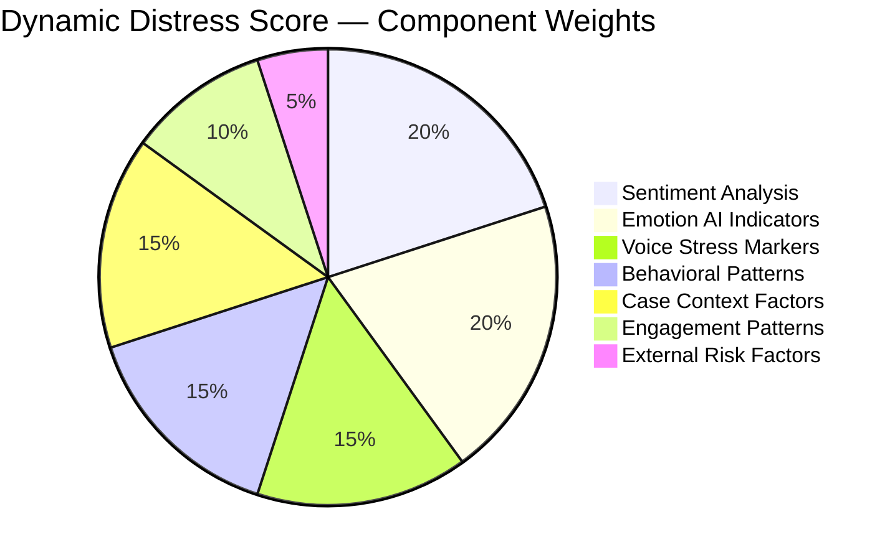
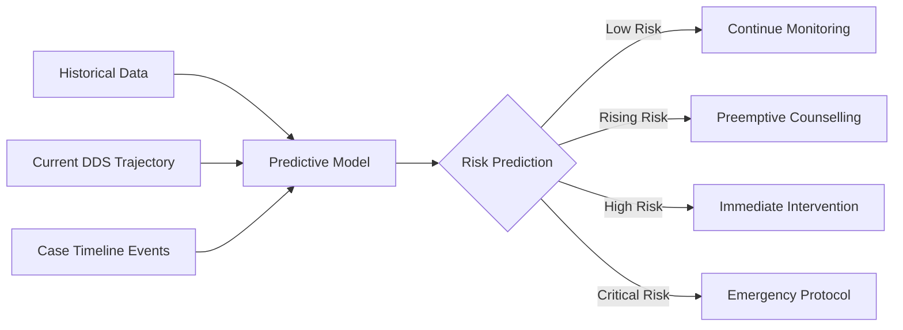
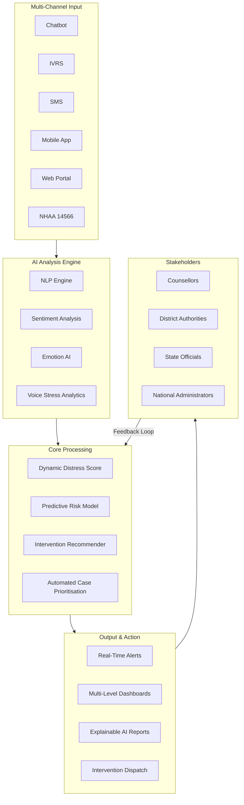

# AI-Based Dynamic Mental Health Monitoring & Distress Prediction System
## Comprehensive Analytical Report

---

## 1. What Is This App About?

This is a **government-scale AI-powered mental health surveillance and early-warning system** designed specifically for **victims of caste-based atrocities** in India. It operates under the framework of the **Scheduled Castes and Scheduled Tribes (Prevention of Atrocities) Act, 1989** (commonly known as the **SC/ST (PoA) Act**).

The system addresses a critical gap in the Indian justice system: **after a victim files a complaint, the state provides legal and financial support, but nobody continuously monitors whether the victim is psychologically deteriorating** — from threats, delays, social ostracism, economic ruin, or the trauma of the crime itself.

This app is essentially a **"digital mental health companion + predictive crisis prevention engine"** that:

1. **Reaches out** to victims periodically through multiple channels (chatbot, phone calls, SMS, mobile app)
2. **Listens and analyses** their voice, text, and behavioral patterns using AI
3. **Scores their distress** on a dynamic, evolving scale
4. **Predicts** when someone is about to reach a breaking point — *before* the crisis happens
5. **Alerts** the right people (counsellors, district officials, protection officers) to intervene
6. **Recommends** specific interventions (therapy, relocation, financial aid, witness protection)
7. **Reports** aggregated data to district, state, and national dashboards for policy-making

> [!IMPORTANT]
> This is NOT a generic mental health app. It is a **justice-system-integrated, government-operated, multi-agency coordination platform** for some of India's most vulnerable citizens — victims of rape, murder, arson, and caste-based violence.

---

## 2. Who Is It For?

### 2.1 Primary Beneficiaries (Victims & Complainants)

| Beneficiary Category | Description |
|---|---|
| **Victims of rape and gang rape** | Survivors registered through NHAA (14566), Integrated Portal, or other approved channels |
| **Victims of murder (surviving family)** | Families of murder victims, particularly those facing ongoing threats |
| **Victims of grievous hurt and arson** | Individuals who suffered physical violence or property destruction |
| **Intimidated witnesses** | Witnesses facing threats, coercion, or retaliation for testifying |
| **Families affected by caste-based violence** | Extended family units displaced or ostracized due to atrocity incidents |
| **SC/ST Act beneficiaries** | Anyone receiving relief, compensation, rehabilitation, or protection under the PoA Act, 1989 |

### 2.2 Operational Users (System Operators)

| User Role | How They Use the System |
|---|---|
| **Counsellors** | Receive alerts, view distress scores, conduct follow-up sessions, log intervention outcomes |
| **District Authorities (DM/DC)** | Monitor district-level dashboards, approve interventions, coordinate multi-agency responses |
| **State SC/ST Welfare Officers** | View state-level trends, allocate resources, identify high-risk districts |
| **National-Level Administrators** | Policy dashboards, evidence-based decision-making, national trend analysis |
| **Designated Officials (under PoA Act)** | Case-specific alerts, witness protection decisions, compensation tracking |
| **Law Enforcement** | Threat assessment alerts, witness protection coordination |
| **NHAA Helpline Operators** | Initial registration, follow-up scheduling, escalation handling |

### 2.3 Institutional Stakeholders

- **Ministry of Social Justice and Empowerment** — Policy oversight and funding
- **National Commission for Scheduled Castes / Scheduled Tribes** — Monitoring and accountability
- **State SC/ST Welfare Departments** — Operational execution
- **District Magistrate offices** — Ground-level coordination
- **Legal Services Authorities** — Legal aid referrals
- **NIMHANS / District Mental Health Programme (DMHP)** — Clinical mental health support

---

## 3. Complete Feature Breakdown

### 3.1 Multi-Channel Victim Interaction Engine

The system doesn't wait for victims to reach out — it **proactively contacts them** through whichever channel they prefer:

| Channel | Description | Use Case |
|---|---|---|
| **Chatbot (Web/App)** | AI-driven conversational interface in multiple Indian languages | Urban/semi-urban victims with smartphone access |
| **IVRS Calls** | Automated voice-based check-ins using Interactive Voice Response System | Rural victims, low-literacy populations, feature phone users |
| **SMS** | Periodic text-based wellness check-ins and surveys | Universal reach, minimal data requirements |
| **Mobile Application** | Dedicated Android/iOS app with chat, mood logging, and SOS features | Smartphone users wanting active engagement |
| **Web Portal** | Browser-based interface for detailed interaction | Desktop users, NGO-assisted interactions |
| **NHAA Helpline (14566)** | Human-assisted follow-up calls scheduled by the system | High-risk cases needing human touch |
| **Integrated Portal** | Government's unified atrocity complaint portal integration | Seamless case data flow |

**Key Design Principle:** The system adapts to the victim's digital literacy, language preference, and accessibility needs — not the other way around.

---

### 3.2 AI Analysis Engine (Core Intelligence Layer)

This is the technological heart of the system, composed of four interconnected AI modules:

#### 3.2.1 Natural Language Processing (NLP)

```
Input: Text from chat, SMS, or transcribed voice
Output: Semantic understanding of victim's expressed concerns
```

- **Multilingual text analysis** — Hindi, English, Tamil, Telugu, Kannada, Bengali, Marathi, and other scheduled languages
- **Intent classification** — Distinguishing between routine updates, distress signals, help requests, and crisis indicators
- **Topic extraction** — Identifying whether distress is related to threats, court delays, economic hardship, social ostracism, health issues, etc.
- **Contextual understanding** — Recognizing euphemisms, cultural expressions of distress, and indirect cries for help
- **Code-mixing handling** — Processing Hinglish, Tanglish, and other mixed-language inputs common in Indian digital communication

#### 3.2.2 Sentiment Analysis

```
Input: Text and voice transcripts
Output: Polarity scores (positive/negative/neutral) + intensity metrics
```

- **Granular sentiment scoring** — Beyond positive/negative to capture nuances like hopelessness, anger, fear, resignation, and anxiety
- **Temporal sentiment tracking** — How sentiment changes over days, weeks, and months
- **Comparative analysis** — Sentiment relative to case milestones (FIR filing, chargesheet, trial dates, verdict)
- **Baseline deviation detection** — Alerting when a previously stable victim shows sudden negative shift

#### 3.2.3 Emotion AI (Affective Computing)

```
Input: Voice recordings, facial expressions (if video-enabled), text patterns
Output: Emotional state classification with confidence scores
```

- **Voice emotion detection** — Analyzing pitch, tone, speaking rate, pauses, tremors, and vocal energy
- **Text-based emotion inference** — Detecting emotions from word choice, punctuation patterns, message length, and response latency
- **Micro-expression analysis** (future/optional) — Video-based emotional state assessment during counselling sessions
- **Emotion trajectory mapping** — Plotting emotional states over time to identify patterns

#### 3.2.4 Voice Stress Analytics (VSA)

```
Input: Voice recordings from IVRS calls, helpline calls, or app voice notes
Output: Stress level indicators, deception markers, suppressed emotion flags
```

- **Micro-tremor analysis** — Detecting involuntary vocal muscle tremors associated with stress
- **Fundamental frequency (F0) variation** — Tracking pitch changes that correlate with anxiety and fear
- **Speech rate anomalies** — Identifying unusually fast/slow speech as distress indicators
- **Silence pattern analysis** — Long pauses, hesitation markers, and breath patterns
- **Suppressed emotion detection** — Identifying when victims are concealing distress (common due to social pressure or fear of retaliation)

---

### 3.3 Dynamic Distress Score (DDS)

The flagship output of the system — a **composite, continuously-updated numerical score** representing the victim's overall psychological well-being.

#### Score Composition



#### Score Components Explained

| Component | What It Measures | Example Indicators |
|---|---|---|
| **Sentiment Analysis** | Polarity and intensity of expressed feelings | Increasingly negative language, hopelessness keywords |
| **Emotion AI** | Detected emotional states | Sustained fear, anger escalation, emotional flatness |
| **Voice Stress** | Physiological stress markers in voice | High micro-tremor frequency, pitch instability |
| **Behavioral Patterns** | Changes in interaction behavior | Missed check-ins, shorter responses, late-night contacts |
| **Case Context** | External justice-system events | Upcoming trial, bail granted to accused, case delay |
| **Engagement Patterns** | How the victim interacts with the system | Declining engagement, SOS feature usage, help-seeking frequency |
| **External Risk** | Environmental and social factors | Festival seasons (heightened tension), geographic risk zones, recent atrocity incidents in area |

#### Risk Tiers

| Score Range | Risk Level | Color Code | Response Protocol |
|---|---|---|---|
| 0–25 | **Low** | 🟢 Green | Routine periodic check-ins |
| 26–50 | **Moderate** | 🟡 Yellow | Increased check-in frequency, counsellor notification |
| 51–75 | **High** | 🟠 Orange | Immediate counsellor outreach, district authority alert |
| 76–100 | **Critical** | 🔴 Red | Emergency intervention — all stakeholders alerted, immediate human contact |

---

### 3.4 Predictive Risk Modelling

The system doesn't just measure current distress — it **predicts future crisis points**.

#### Prediction Methodology



- **Trajectory analysis** — Is the distress score trending upward, stable, or improving?
- **Pattern matching** — Comparing current victim's trajectory against anonymized historical patterns of victims who reached crisis
- **Event-driven prediction** — Anticipating distress spikes around known triggers (trial dates, anniversaries, accused's release)
- **Seasonal and contextual modelling** — Accounting for regional festivals, election periods, and social events that may increase risk
- **Lead-time optimization** — Aiming to predict crises **7–14 days in advance** to allow meaningful intervention

---

### 3.5 Alert and Escalation System

When risk thresholds are crossed, the system **automatically triggers a cascade of notifications**:

#### Escalation Matrix

| Trigger | Alert Recipients | Response Time Target | Action Required |
|---|---|---|---|
| DDS crosses 50 (High) | Assigned Counsellor | 24 hours | Outreach call, assessment |
| DDS crosses 75 (Critical) | Counsellor + District Welfare Officer | 4 hours | Emergency counselling, safety assessment |
| DDS crosses 90 (Extreme) | Counsellor + DM/DC + SP + State Welfare | 1 hour | Immediate physical intervention, witness protection evaluation |
| Sudden spike (>20 points in 48hrs) | Counsellor + District Authority | 2 hours | Urgent assessment, threat evaluation |
| Missed 3+ consecutive check-ins | Case Officer | 48 hours | Welfare check, verify victim safety |
| Explicit crisis keywords detected | Counsellor + Emergency Services | Immediate | Suicide prevention protocol, emergency contact |
| Threat/intimidation reported | SP + Witness Protection Unit | 2 hours | Security assessment, protection measures |

---

### 3.6 Intervention Recommendation Engine

The system doesn't just detect problems — it **recommends specific, actionable interventions**:

| Detected Situation | Recommended Intervention |
|---|---|
| Sustained anxiety, fear of accused | Witness protection measures, relocation support |
| Depression indicators, hopelessness | Counselling referral (DMHP), psychiatric evaluation |
| Economic distress, inability to afford treatment | Financial assistance under PoA Act, expedited compensation |
| Social isolation, community ostracism | Community reintegration support, NGO referral |
| Legal frustration, case delay anxiety | Legal aid referral, case status update, magistrate notification |
| Physical health deterioration (reported) | Medical treatment referral, health camp enrollment |
| Children's education disruption | Educational support scheme enrollment |
| Livelihood loss | Skill development program, employment assistance |
| Trauma from repeated court appearances | Victim-friendly court procedures, video testimony |
| Family conflict due to case | Family counselling, mediation services |

---

### 3.7 Multi-Level Dashboards

#### 3.7.1 District Dashboard

- Total registered victims and their current risk distribution (Green/Yellow/Orange/Red)
- Active alerts and pending interventions
- Counsellor workload and response time metrics
- Case-wise distress trends correlated with investigation/trial milestones
- Geospatial heatmap of victim locations and risk concentrations
- Intervention effectiveness metrics (did the counselling reduce the DDS?)

#### 3.7.2 State Dashboard

- District-wise comparative analysis
- High-risk district identification
- Resource allocation insights (counsellor-to-victim ratios, intervention budgets)
- Trend analysis across victim categories (rape, murder, arson, etc.)
- Policy impact metrics (do certain interventions work better than others?)
- Compliance monitoring (are district officials responding within target times?)

#### 3.7.3 National Dashboard

- State-wise comparative analysis and rankings
- National trend lines and seasonal patterns
- Policy effectiveness evaluation across states
- Budget utilization vs. outcome correlation
- Aggregate statistics for parliamentary reporting
- Early warning indicators for systemic issues

---

### 3.8 Explainable AI (XAI) Module

> [!IMPORTANT]
> Given the sensitivity of the domain (vulnerable victims, government decisions), the system MUST explain **why** it made every prediction and recommendation.

- **Score decomposition** — Showing which factors contributed most to a victim's DDS ("70% of the score increase is due to detected voice stress during the last IVRS call")
- **Prediction rationale** — Explaining why a crisis is predicted ("Similar trajectory to 85% of historical cases that escalated within 14 days")
- **Recommendation justification** — Why a specific intervention is suggested ("Counselling recommended because NLP detected hopelessness language in 4 of last 5 interactions")
- **Audit trail** — Complete log of all AI decisions for legal and ethical accountability
- **Human override capability** — Counsellors and officials can override AI recommendations with documented reasons

---

### 3.9 Privacy, Security & Compliance

| Requirement | Implementation |
|---|---|
| **Data Encryption** | End-to-end encryption for all victim communications; AES-256 at rest, TLS 1.3 in transit |
| **Access Control** | Role-based access (RBAC); counsellors see only their assigned cases; district officials see only their district |
| **Anonymization** | All data used for model training is fully anonymized and de-identified |
| **Consent Management** | Explicit informed consent before enrollment; right to opt-out at any time |
| **Data Retention** | Defined retention periods aligned with case lifecycle; secure deletion after case closure + buffer period |
| **Audit Logging** | Every data access, AI decision, and human action is logged immutably |
| **Legal Compliance** | IT Act 2000, Digital Personal Data Protection Act 2023, SC/ST (PoA) Act 1989, Mental Healthcare Act 2017 |
| **Ethical Oversight** | AI Ethics Committee review, bias testing across caste/gender/region/language, regular fairness audits |
| **Data Localization** | All data stored within India on government-approved cloud infrastructure |

---

### 3.10 Multilingual Conversational AI

Given India's linguistic diversity and the target population (often rural, marginalized communities), **multilingual support is not a feature — it is a foundational requirement**.

- **Supported languages** — All 22 Scheduled Languages + major dialects
- **Script handling** — Devanagari, Tamil, Telugu, Kannada, Bengali, Gurmukhi, Odia, Malayalam, etc.
- **Voice-first design** — Primary interaction mode for low-literacy users
- **Code-mixing support** — Handling mixed-language inputs naturally
- **Cultural sensitivity** — AI trained on culturally appropriate expressions of distress across regions
- **Dialect awareness** — Understanding regional variations in expressing emotional states

---

## 4. System Architecture Overview



---

## 5. Innovation Components Summary

| Innovation | What It Does | Why It Matters |
|---|---|---|
| **Emotion AI** | Detects emotional states from voice, text, and behavior | Goes beyond words to understand how someone truly feels |
| **Voice Stress Analytics** | Identifies physiological stress markers in voice | Detects concealed distress, especially in victims afraid to speak openly |
| **Sentiment Analysis** | Tracks polarity and intensity of expressed feelings over time | Provides objective, continuous measurement of well-being trajectory |
| **Predictive Risk Modelling** | Forecasts future crisis points before they occur | Shifts from reactive to preventive mental health support |
| **Multilingual Conversational AI** | Engages victims in their own language and dialect | Ensures no victim is excluded due to language barriers |
| **Explainable AI** | Makes every AI decision transparent and auditable | Builds trust, enables accountability, meets legal requirements |
| **Automated Case Prioritisation** | Ranks cases by urgency for resource allocation | Ensures the most vulnerable get help first when resources are limited |
| **Real-Time Risk Alerts** | Instant notifications when thresholds are crossed | Enables rapid response, potentially saving lives |

---

## 6. Expected Impact

### For Victims
- **Feeling heard** — Regular check-ins show the system cares beyond the FIR
- **Early intervention** — Crises prevented before they become irreversible
- **Appropriate support** — Right type of help at the right time
- **Restored confidence** — Trust in the justice system strengthened

### For the Justice System
- **Evidence-based decisions** — Data-driven resource allocation instead of guesswork
- **Accountability** — Documented trail of victim welfare actions
- **Inter-agency coordination** — Unified platform connecting welfare, legal, police, and health agencies
- **Policy intelligence** — National-level insights for legislative and policy improvements

### For Society
- **Preventive approach** — Moving from post-crisis response to pre-crisis prevention
- **Reduced secondary victimization** — System actively counteracts the trauma of the justice process itself
- **Scalable model** — Framework can extend to other vulnerable populations (domestic violence, trafficking, communal violence)

---

## 7. Critical Considerations

> [!WARNING]
> ### Risks That Must Be Addressed
> - **AI Bias** — Models trained on skewed data could systematically under-detect distress in certain communities, genders, or linguistic groups
> - **False Positives** — Over-alerting could desensitize responders and waste scarce resources
> - **False Negatives** — Missing genuine distress could have fatal consequences
> - **Digital Divide** — The most vulnerable victims may lack smartphone/internet access
> - **Privacy vs. Surveillance** — Continuous monitoring of vulnerable populations raises serious ethical questions about consent, autonomy, and state overreach
> - **Cultural Sensitivity** — Expressions of distress vary dramatically across India's regions, castes, and communities
> - **Data Security** — A breach of this database would expose the most vulnerable people to further harm
> - **Dependency Risk** — System must complement, not replace, human counsellors and social workers

---

## 8. Legal Framework

The system operates at the intersection of multiple Indian laws:

| Legislation | Relevance |
|---|---|
| **SC/ST (Prevention of Atrocities) Act, 1989** | Primary statutory framework; defines victims, relief, and rehabilitation mechanisms |
| **SC/ST (PoA) Rules, 1995 (amended 2016)** | Specifies compensation, relief, and rehabilitation duties of district authorities |
| **Digital Personal Data Protection Act, 2023** | Governs collection, processing, and storage of victim data |
| **Information Technology Act, 2000** | Cybersecurity requirements, data protection standards |
| **Mental Healthcare Act, 2017** | Right to mental healthcare, informed consent, confidentiality requirements |
| **Indian Evidence Act / Bharatiya Sakshya Adhiniyam, 2023** | Admissibility of AI-generated evidence and reports |
| **Right to Information Act, 2005** | Transparency obligations (balanced against victim privacy) |

---

## 9. Conclusion

This system represents a **paradigm shift** in how India supports atrocity victims — moving from a **reactive, paperwork-driven, complaint-based model** to a **proactive, AI-powered, continuous-care model**.

It is not merely a mental health app. It is a **government-scale victim welfare platform** that combines:
- **Clinical psychology** (distress assessment frameworks)
- **Artificial intelligence** (NLP, emotion detection, predictive modelling)
- **Public administration** (multi-level governance dashboards)
- **Social justice** (targeted support for India's most marginalized communities)
- **Legal compliance** (operating within the SC/ST Act and data protection laws)

The ultimate goal is simple but profound: **No victim of a caste-based atrocity should suffer a mental health crisis in silence while the state looks the other way.**

---

*Report generated: 18 September 2026*
