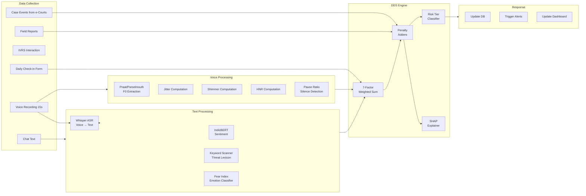
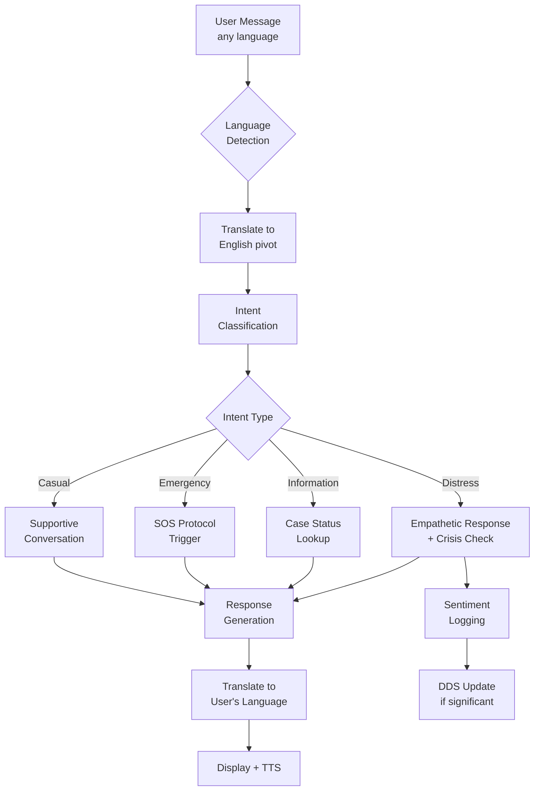
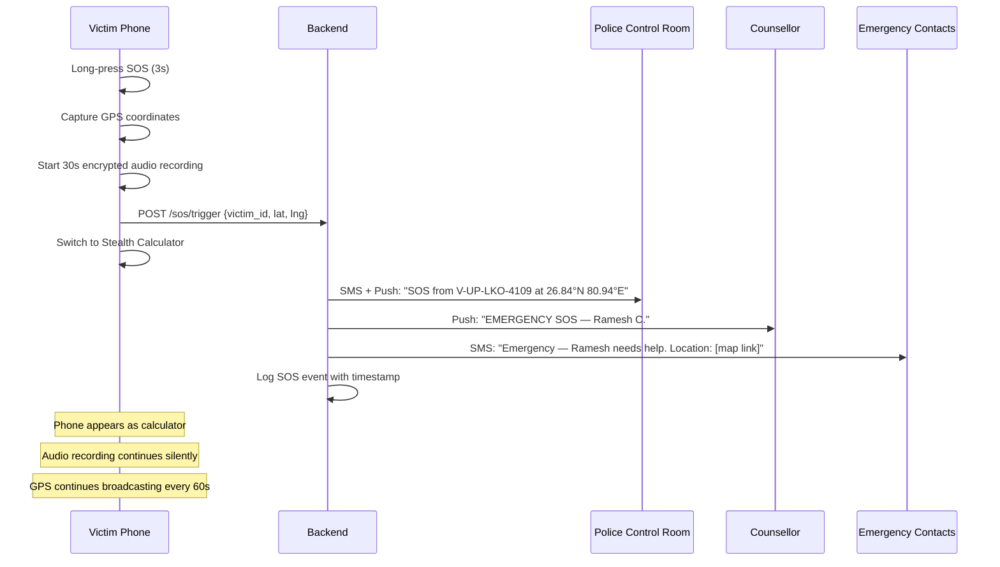
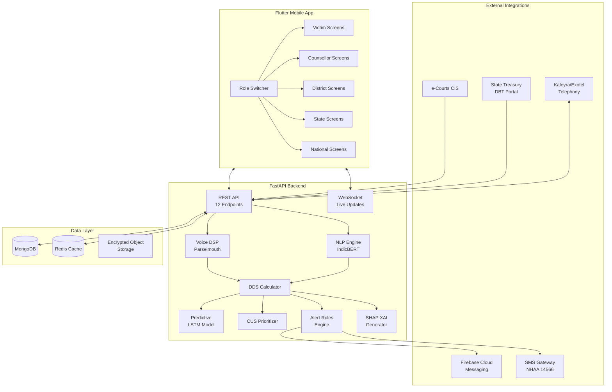

# NYAYA-MANAS (न्याय-मानस) — Complete Specification Document
## Every Screen, Every Feature, Every Algorithm — End to End

---

# PART A: ARCHITECTURE VALIDATION

## What Your AI Got Right ✅

| Aspect | Verdict | Notes |
|---|---|---|
| **5-Role hierarchy** | ✅ Correct | Victim → Counsellor → District → State → National is the right escalation chain matching the PoA Act's administrative structure |
| **7-Factor DDS formula** | ✅ Correct | The weighted sum with penalty adders is a sound composite scoring approach. Weights are reasonable |
| **Risk tier thresholds** (0-25-50-75-100) | ✅ Correct | Four-tier stratification with escalating SLAs is standard for crisis triage systems |
| **REST API design** | ✅ Correct | 12 endpoints covering CRUD, check-in, chat, IVRS, intervention, XAI, compensation, SOS, and dashboard — comprehensive |
| **MongoDB schema design** | ✅ Correct | Document-oriented storage fits the heterogeneous victim dossier data well |
| **Legal framework mapping** | ✅ Excellent | Rule 12(4), Rule 7, Section 15A, Mental Healthcare Act, DPDP Act — all correctly cited |
| **Ephemeral audio processing** | ✅ Excellent | Processing voice in RAM and discarding raw audio is the right approach for DPDP compliance |
| **Differential privacy (ε=0.5)** | ✅ Correct | Laplace noise on aggregated stats prevents re-identification |
| **SHAP for XAI** | ✅ Correct | Shapley values are the gold standard for feature attribution in tabular/mixed models |
| **Stealth calculator mode** | ✅ Excellent | Critical safety feature for victims living with or near abusers |

## What Needs Improvement or Addition ⚠️

| Gap | Why It Matters | Recommendation |
|---|---|---|
| **No offline mode** | Rural victims often have intermittent connectivity | Add offline-first architecture with local SQLite + sync queue |
| **No predictive model specified** | The doc mentions "prediction" but doesn't define the model | Add LSTM/Transformer time-series model on DDS trajectory (detailed in Part D) |
| **No case prioritization algorithm** | "Automated Case Prioritisation" is listed as innovation but never defined | Add Composite Urgency Score (CUS) algorithm (detailed in Part C) |
| **No notification service** | Alerts are described but no push notification / FCM architecture | Add Firebase Cloud Messaging + SMS fallback via NHAA gateway |
| **No session management / auth** | No JWT/OAuth flow described | Add role-based JWT auth with Aadhaar-linked OTP for victims |
| **No data sync architecture** | Multiple agencies need real-time data | Add WebSocket for live dashboard updates + REST for CRUD |
| **No victim onboarding flow** | How does a victim first enter the system? | Add onboarding wizard with consent, language selection, emergency contacts |
| **No counsellor assignment algorithm** | How are counsellors matched to victims? | Add proximity + caseload + specialization matching (detailed below) |
| **No audit/compliance reporting** | DPDP Act requires demonstrable compliance | Add compliance audit dashboard with access logs and consent records |
| **Missing IVRS ↔ Telephony bridge** | IVRS "simulator" won't reach feature phones | Need Twilio/Exotel/Kaleyra telephony integration for real IVRS |

---

# PART B: COMPLETE SCREEN-BY-SCREEN BREAKDOWN

> Every screen listed below includes: **purpose**, **key widgets/components**, **data source (API endpoint)**, and **user actions available**.

---

## ROLE 1: ⚖️ VICTIM / COMPLAINANT — 14 Screens

### Screen 1.1: Onboarding & Consent Wizard
**Purpose**: First-time enrollment into Nyaya-Manas after FIR registration.

```
┌─────────────────────────────────────┐
│  🇮🇳 NYAYA-MANAS                    │
│  "Your Safety, Your Voice"          │
│                                     │
│  Step 1/5: Select Your Language     │
│  ┌─────────┐ ┌─────────┐           │
│  │  हिन्दी  │ │  தமிழ்   │           │
│  └─────────┘ └─────────┘           │
│  ┌─────────┐ ┌─────────┐           │
│  │  తెలుగు  │ │ English │           │
│  └─────────┘ └─────────┘           │
│  ┌─────────┐ ┌─────────┐           │
│  │  मराठी   │ │  বাংলা   │           │
│  └─────────┘ └─────────┘           │
│                                     │
│  Step 2/5: Verify Identity          │
│  [OTP sent to +91-XXXX-XX3210]      │
│  [ _ _ _ _ _ _ ]                    │
│                                     │
│  Step 3/5: Informed Consent         │
│  ☐ I understand voice recordings    │
│    are processed for my safety      │
│    and not stored permanently       │
│  ☐ I can opt out at any time        │
│  ☐ My data is encrypted and only    │
│    shared with my assigned          │
│    counsellor and authorities       │
│                                     │
│  Step 4/5: Emergency Contacts       │
│  [Name: ___________]               │
│  [Phone: __________]               │
│  [Relationship: ___]               │
│  [+ Add Another Contact]           │
│                                     │
│  Step 5/5: Set Stealth PIN          │
│  [4-digit PIN to enter calculator]  │
│  [ _ _ _ _ ]                        │
│                                     │
│  [✓ Complete Setup]                 │
└─────────────────────────────────────┘
```

- **Widgets**: Language grid selector, OTP input, consent checkboxes with legally required text, emergency contact form, PIN input
- **Data**: `POST /victims/register`
- **Actions**: Language selection → OTP verification → Consent acceptance → Emergency contacts → Stealth PIN → Enter app

---

### Screen 1.2: Home Dashboard (Victim)
**Purpose**: At-a-glance well-being status and quick action access.

```
┌─────────────────────────────────────┐
│ [≡ Role] NYAYA-MANAS    [🔔] [⚙️]  │
├─────────────────────────────────────┤
│                                     │
│  Namaste, Ramesh ji 🙏              │
│  FIR: FIR-2026/0189 | Lucknow      │
│                                     │
│  ┌─────────────────────────────┐    │
│  │    YOUR WELL-BEING SCORE    │    │
│  │                             │    │
│  │        ╭───────╮            │    │
│  │       ╱  78.5   ╲           │    │
│  │      │  ● ● ● ●  │ ← Gauge │    │
│  │       ╲ CRITICAL ╱          │    │
│  │        ╰───────╯            │    │
│  │                             │    │
│  │  "We see you're stressed.   │    │
│  │   Your counsellor has been  │    │
│  │   notified."                │    │
│  └─────────────────────────────┘    │
│                                     │
│  ┌──────────┐  ┌──────────┐        │
│  │ 🎙️ Voice  │  │ 💬 Chat  │        │
│  │ Check-In │  │   Bot    │        │
│  └──────────┘  └──────────┘        │
│  ┌──────────┐  ┌──────────┐        │
│  │ 📞 IVRS  │  │ 📊 My    │        │
│  │  Call    │  │ Progress │        │
│  └──────────┘  └──────────┘        │
│  ┌──────────┐  ┌──────────┐        │
│  │ ⚖️ Court  │  │ 💰 Relief│        │
│  │  Dates   │  │ Status   │        │
│  └──────────┘  └──────────┘        │
│                                     │
│  ┌─────────────────────────────┐    │
│  │ 🔴 EMERGENCY SOS — HOLD 3s │    │
│  └─────────────────────────────┘    │
│                                     │
│  ── Recent Activity ──              │
│  📅 Sep 18: Voice check-in done     │
│  📅 Sep 15: Counsellor called       │
│  📅 Sep 12: ₹2,06,250 disbursed    │
│                                     │
│ [🏠Home] [📋History] [👤Profile]     │
└─────────────────────────────────────┘
```

- **Widgets**: DDS radial gauge (animated, color-coded), plain-language interpretation text, 6 quick-action cards, SOS hold-button, activity timeline, bottom nav
- **Data**: `GET /victims/{victim_id}`, `GET /dashboard/victim`
- **Actions**: Navigate to any feature screen, trigger SOS (long-press 3s)

---

### Screen 1.3: Voice Stress Check-In
**Purpose**: Record a 15-second voice sample for acoustic biomarker analysis.

```
┌─────────────────────────────────────┐
│ ← Voice Check-In                    │
├─────────────────────────────────────┤
│                                     │
│  🎙️ How are you feeling today?      │
│                                     │
│  Dialect: [Hindi (Awadhi) ▼]        │
│                                     │
│  "Apni bhavnaaon ke baare mein     │
│   bataiye — kuch bhi bole,          │
│   hum sunn rahe hain..."           │
│                                     │
│  ┌─────────────────────────────┐    │
│  │ ∿∿∿∿∿∿∿∿∿∿∿∿∿∿∿∿∿∿∿∿∿∿∿∿ │    │
│  │     Live Waveform Display    │    │
│  │ ∿∿∿∿∿∿∿∿∿∿∿∿∿∿∿∿∿∿∿∿∿∿∿∿ │    │
│  └─────────────────────────────┘    │
│                                     │
│          ⏱️ 00:12 / 00:15           │
│                                     │
│        ┌──────────────┐             │
│        │  🔴 Recording │             │
│        └──────────────┘             │
│                                     │
│  ── After Recording ──              │
│                                     │
│  ┌─────────────────────────────┐    │
│  │  Analyzing your voice...     │    │
│  │  ████████████░░░░░ 72%       │    │
│  │                             │    │
│  │  ✅ Pitch analysis complete  │    │
│  │  ✅ Stress markers detected  │    │
│  │  ⏳ Generating score...      │    │
│  └─────────────────────────────┘    │
│                                     │
│  ┌─────────────────────────────┐    │
│  │  Updated Score: 82.5 🔴      │    │
│  │  "We notice increased       │    │
│  │   stress. Dr. Ananya will   │    │
│  │   call you within 2 hours." │    │
│  └─────────────────────────────┘    │
│                                     │
│  [🔄 Record Again]  [✓ Done]       │
└─────────────────────────────────────┘
```

- **Widgets**: Dialect dropdown, live audio waveform (CustomPainter), countdown timer, record/stop button, progress bar during analysis, result card
- **Data**: `POST /checkin/submit` (sends acoustic features + transcript)
- **Actions**: Select dialect → Record → View analysis → Acknowledge result

---

### Screen 1.4: AI Chatbot (Vernacular Trauma Companion)
**Purpose**: Text/voice conversation with empathetic AI that detects crisis keywords.

```
┌─────────────────────────────────────┐
│ ← Nyaya Saathi 💬       [🌐 hi ▼]  │
├─────────────────────────────────────┤
│                                     │
│  🤖 Namaste Ramesh ji, aaj aap     │
│     kaisa mehsoos kar rahe hain?    │
│                          [10:15 AM] │
│                                     │
│        Bahut dar lag raha hai,  👤  │
│        kal court jaana hai aur      │
│        woh log dhamki de rahe       │
│        hain bachchon ko...          │
│                          [10:16 AM] │
│                                     │
│  🤖 Main samajh sakta hoon ki      │
│     yeh kitna mushkil hai.          │
│     Aapki suraksha humari           │
│     zimmedaari hai.                 │
│                                     │
│  ⚠️ THREAT DETECTED — Your         │
│  counsellor Dr. Ananya has been     │
│  notified. Police escort is being   │
│  arranged for tomorrow's court      │
│  appearance.                        │
│                          [10:16 AM] │
│                                     │
│  🤖 Kya aap abhi ek breathing      │
│     exercise karna chahenge?        │
│     Yeh aapko shant hone mein      │
│     madad karega.                   │
│                                     │
│     [🧘 Haan, shuru karo]          │
│     [📞 Counsellor se baat karo]   │
│     [⏭️ Abhi nahi]                  │
│                          [10:17 AM] │
│                                     │
│ ┌─────────────────────────┬────┐   │
│ │ Type your message...    │ 🎤 │   │
│ └─────────────────────────┴────┘   │
└─────────────────────────────────────┘
```

- **Widgets**: Chat message bubbles (left=bot, right=user), language switcher, threat alert banner (auto-generated), quick-reply chips, voice-to-text mic button, typing indicator
- **Data**: `POST /chat`
- **Actions**: Type/speak messages, tap quick replies, trigger counsellor call, start guided exercises
- **Crisis Detection Logic**: If chatbot detects keywords like *dhamki*, *maar*, *jaan se*, *zinda nahi*, *dar*, *suicide* — auto-escalates to emergency protocol

---

### Screen 1.5: NHAA 14566 IVRS Simulator
**Purpose**: Simulates the toll-free IVRS for victims familiar with phone-based interaction.

```
┌─────────────────────────────────────┐
│ ← NHAA 14566 IVRS Helpline          │
├─────────────────────────────────────┤
│                                     │
│  📞 Simulated Toll-Free Call        │
│  National Helpline for Atrocities   │
│                                     │
│  🔊 "Swagat hai NHAA Helpline mein.│
│      Apni bhasha chunein..."        │
│                                     │
│  Select Language:                   │
│  [1] हिन्दी  [2] English            │
│  [3] தமிழ்   [4] తెలుగు             │
│                                     │
│  ── Menu Options ──                 │
│  [1] 🎙️ Emotional Well-being       │
│       Check-In                      │
│  [2] 📋 Case Status Inquiry        │
│  [3] 🆘 Emergency — Connect to     │
│       Control Room                  │
│  [4] 💰 Compensation Status        │
│  [5] 👨⚕️ Speak to Counsellor       │
│  [0] 🔄 Repeat Menu                │
│                                     │
│  ┌───┬───┬───┐                      │
│  │ 1 │ 2 │ 3 │                      │
│  ├───┼───┼───┤  ← DTMF Keypad      │
│  │ 4 │ 5 │ 6 │                      │
│  ├───┼───┼───┤                      │
│  │ 7 │ 8 │ 9 │                      │
│  ├───┼───┼───┤                      │
│  │ * │ 0 │ # │                      │
│  └───┴───┴───┘                      │
│                                     │
│  [📞 End Call]                      │
└─────────────────────────────────────┘
```

- **Widgets**: DTMF keypad grid, TTS audio player, menu display, call duration timer
- **Data**: `POST /ivrs/simulate`
- **Actions**: Press DTMF keys → Hear TTS response → Navigate menu → Complete check-in or connect to live agent

---

### Screen 1.6: Statutory Relief Progress Tracker
**Purpose**: Track compensation disbursement under Rule 12(4) of PoA Rules.

```
┌─────────────────────────────────────┐
│ ← Statutory Relief Status 💰        │
├─────────────────────────────────────┤
│                                     │
│  Total Entitled: ₹8,25,000         │
│  Disbursed:      ₹4,12,500 (50%)   │
│  Pending:        ₹4,12,500         │
│                                     │
│  ████████████░░░░░░░░░░░░ 50%      │
│                                     │
│  ── Disbursement Milestones ──      │
│                                     │
│  ✅ Stage 1: FIR Registration       │
│     25% = ₹2,06,250                │
│     Disbursed: 14 Aug 2026         │
│     DBT Ref: PFMS-UP-2026-88412   │
│                                     │
│  ✅ Stage 2: Chargesheet Filed      │
│     25% = ₹2,06,250                │
│     Disbursed: 10 Sep 2026         │
│     DBT Ref: PFMS-UP-2026-91205   │
│                                     │
│  ⏳ Stage 3: Trial Completion       │
│     25% = ₹2,06,250                │
│     Status: Awaiting trial         │
│     Next Hearing: 24 Sep 2026      │
│                                     │
│  ⬜ Stage 4: Conviction             │
│     25% = ₹2,06,250                │
│     Status: Not yet reached        │
│                                     │
│  ── Delay Alert ──                  │
│  ⚠️ Stage 1 was disbursed 2 days   │
│  after the 7-day statutory limit.   │
│  This has been reported to the      │
│  State Monitoring Cell.             │
│                                     │
│  [📞 Helpline] [📄 Download Report] │
└─────────────────────────────────────┘
```

- **Widgets**: Total/disbursed/pending summary card, progress bar, 4-stage milestone timeline with status icons, delay alert banner, DBT reference numbers
- **Data**: `GET /victims/{victim_id}` (compensation fields)
- **Actions**: View milestones, download receipt, call helpline for disputes

---

### Screen 1.7: e-Courts Case Tracker
**Purpose**: Track court dates, hearings, and legal milestones.

```
┌─────────────────────────────────────┐
│ ← Case & Court Tracker ⚖️           │
├─────────────────────────────────────┤
│                                     │
│  FIR: FIR-2026/0189                 │
│  Court: Special Court, Lucknow      │
│  Judge: Hon'ble Sri R.P. Mishra     │
│  PoA Sections: 3(1)(r), 3(1)(s),   │
│                3(2)(va)             │
│                                     │
│  ── Investigation Status ──         │
│  IO: DySP R.K. Yadav               │
│  Deadline: 37 days remaining        │
│  ████████████████░░░░░░░ 62%       │
│  Chargesheet: Filed ✅              │
│                                     │
│  ── Upcoming Hearing ──             │
│  ┌─────────────────────────────┐    │
│  │  📅 24 September 2026       │    │
│  │  ⏰ 10:30 AM                │    │
│  │  Purpose: Bail Rejection    │    │
│  │  ⏱️ Countdown: 6 DAYS       │    │
│  │                             │    │
│  │  🛡️ Police escort: ARRANGED │    │
│  │  👨⚕️ Pre-hearing counselling│    │
│  │     session: 22 Sep 4:00 PM │    │
│  └─────────────────────────────┘    │
│                                     │
│  ── Past Hearings ──                │
│  📅 03 Sep: Chargesheet hearing ✅  │
│  📅 18 Aug: FIR cognizance ✅       │
│                                     │
│  ── Accused Status ──               │
│  Gram Pradhan: Judicial custody     │
│  Associate 1: Bail pending          │
│  Associate 2: Judicial custody      │
│                                     │
│  [📞 DLSA Legal Aid] [🛡️ Escort]   │
└─────────────────────────────────────┘
```

- **Widgets**: Case info card, investigation progress bar with deadline, hearing countdown card with escort status, past hearings timeline, accused status list
- **Data**: `GET /victims/{victim_id}` + e-Courts CIS integration
- **Actions**: View details, request police escort, schedule pre-hearing counselling, contact DLSA

---

### Screen 1.8: Check-In History & DDS Trend
**Purpose**: View past check-ins and longitudinal well-being trajectory.

```
┌─────────────────────────────────────┐
│ ← My Well-being History 📊          │
├─────────────────────────────────────┤
│                                     │
│  ── 30-Day Distress Trend ──        │
│  100│                    ●          │
│   75│          ●    ●  ╱            │
│   50│    ●   ╱ ╲  ╱ ╲╱             │
│   25│  ╱  ╲ ╱                       │
│    0│╱                              │
│     └──────────────────────         │
│     Aug19  Aug26  Sep2  Sep18       │
│                                     │
│  [7 Days] [30 Days] [All Time]      │
│                                     │
│  ── Recent Check-Ins ──             │
│                                     │
│  ┌─────────────────────────────┐    │
│  │ 18 Sep 2:15 PM  Score: 82.5│    │
│  │ 🎙️ Voice │ Hindi (Awadhi)   │    │
│  │ 🔴 CRITICAL                 │    │
│  │ Key: Vocal stress ↑, Threat │    │
│  │ keywords detected           │    │
│  └─────────────────────────────┘    │
│                                     │
│  ┌─────────────────────────────┐    │
│  │ 15 Sep 11:00 AM Score: 68.2│    │
│  │ 💬 Chat │ Hindi             │    │
│  │ 🟠 HIGH                     │    │
│  │ Key: Anxiety about court    │    │
│  └─────────────────────────────┘    │
│                                     │
│  ┌─────────────────────────────┐    │
│  │ 11 Sep 3:30 PM  Score: 52.1│    │
│  │ 🎙️ Voice │ Hindi             │    │
│  │ 🟠 HIGH                     │    │
│  │ Key: Compensation delay     │    │
│  └─────────────────────────────┘    │
│                                     │
└─────────────────────────────────────┘
```

- **Widgets**: Line chart (fl_chart) with time-series DDS, time range toggle, check-in history cards with mode/language/tier/key-driver summary
- **Data**: `GET /victims/{victim_id}` (trajectory array)
- **Actions**: Toggle time range, tap check-in card for detail, share report with counsellor

---

### Screen 1.9: Intervention Status Board
**Purpose**: Track what help has been dispatched and its current status.

```
┌─────────────────────────────────────┐
│ ← My Support Status 🛡️              │
├─────────────────────────────────────┤
│                                     │
│  Active: 2 │ Completed: 3          │
│                                     │
│  ┌─────────────────────────────┐    │
│  │ 🟢 ACTIVE                   │    │
│  │ Armed Police Escort         │    │
│  │ For: Court hearing 24 Sep   │    │
│  │ Officer: Insp. V. Singh     │    │
│  │ Status: Escort confirmed    │    │
│  │ [📞 Contact Officer]        │    │
│  └─────────────────────────────┘    │
│                                     │
│  ┌─────────────────────────────┐    │
│  │ 🟢 ACTIVE                   │    │
│  │ Tele-Counselling            │    │
│  │ Dr. Ananya Sharma (DMHP)    │    │
│  │ Next session: 20 Sep 4 PM   │    │
│  │ [📞 Call Now] [📅 Reschedule]│    │
│  └─────────────────────────────┘    │
│                                     │
│  ── Completed ──                    │
│  ✅ Emergency medical checkup       │
│  ✅ DLSA legal aid assigned         │
│  ✅ Stage 1 compensation disbursed  │
│                                     │
└─────────────────────────────────────┘
```

- **Widgets**: Active/completed count tabs, intervention cards with status badge, officer contact, action buttons
- **Data**: `GET /victims/{victim_id}` (interventions array)
- **Actions**: Contact assigned officer, reschedule sessions, view completed interventions

---

### Screen 1.10: Self-Help & Grounding Exercises
**Purpose**: Guided breathing, grounding, and trauma de-escalation exercises.

- **Widgets**: Animated breathing circle (inhale 4s → hold 7s → exhale 8s), body scan guide, grounding 5-4-3-2-1 technique, audio-guided meditation in vernacular, progress tracker
- **Data**: Local/cached content (works offline)
- **Actions**: Start exercise, track completion, rate helpfulness

### Screen 1.11: Stealth Calculator Mode
**Purpose**: Instantly disguise the app as a working calculator.

- **Trigger**: Triple-tap home button OR shake gesture OR hardware volume-down × 3
- **Behavior**: Full-screen working calculator UI. Enter stealth PIN to return to Nyaya-Manas. No app icon change (optional: can rename to "Calculator" in settings)
- **Widgets**: Standard calculator UI (fully functional), hidden PIN entry field (activated by typing the PIN as a "calculation")
- **Data**: None (purely local)

### Screen 1.12: Silent SOS Emergency Beacon
**Purpose**: One-tap emergency broadcast.

- **Trigger**: Long-press SOS button (3 seconds) on home screen, OR power button × 5 (Android accessibility)
- **Behavior**:
  1. Captures GPS coordinates
  2. Sends emergency payload to `POST /sos/trigger`
  3. Simultaneously sends SMS to emergency contacts (offline fallback)
  4. Activates 30-second background audio recording (stored locally, encrypted)
  5. Shows a fake "calculator" screen to conceal the SOS action
- **Data**: `POST /sos/trigger`
- **No confirmation dialog** — designed for situations where the victim cannot interact with the phone

### Screen 1.13: Profile & Settings
**Purpose**: Manage personal preferences, language, notifications, emergency contacts.

- **Sections**: Language & dialect preference, notification preferences (SMS/push/call), emergency contacts management, stealth mode configuration, data & privacy controls, opt-out option, app version
- **Data**: `GET/PUT /victims/{victim_id}/profile`

### Screen 1.14: Notifications Feed
**Purpose**: Centralized feed of all alerts, reminders, and updates.

- **Types**: Check-in reminders, counsellor appointment confirmations, court date reminders, compensation disbursement notifications, intervention status updates, system announcements
- **Widgets**: Notification cards with type icon, timestamp, read/unread status, action button

---

## ROLE 2: 👨‍⚕️ CLINICAL COUNSELLOR — 11 Screens

### Screen 2.1: Counsellor Dashboard
```
┌─────────────────────────────────────┐
│ [≡ Role] NYAYA-MANAS    [🔔3] [⚙️] │
├─────────────────────────────────────┤
│                                     │
│  Dr. Ananya Sharma, DMHP Lucknow   │
│                                     │
│  ┌───────┐┌───────┐┌───────┐       │
│  │  12   ││   3   ││   1   │       │
│  │Active ││ High  ││Critical│      │
│  │Cases  ││ Risk  ││ Alert │       │
│  │       ││ 🟠    ││  🔴   │       │
│  └───────┘└───────┘└───────┘       │
│                                     │
│  ── SLA Breaches ──                 │
│  ⚠️ 1 critical case overdue (2h)   │
│  ⚠️ 2 high-risk cases pending (12h)│
│                                     │
│  ── Today's Schedule ──             │
│  10:00 Ramesh C. — Pre-hearing      │
│  14:00 Lalita D. — Follow-up        │
│  16:00 Suresh K. — Initial intake   │
│                                     │
│  [📋 Triage Queue]                  │
│  [📊 Analytics]                     │
│  [🔔 Alerts]                        │
│                                     │
│ [🏠Home] [📋Queue] [📊Stats] [👤Me] │
└─────────────────────────────────────┘
```

- **Widgets**: KPI stat cards (total cases, high-risk, critical), SLA breach alerts, daily schedule list, navigation cards
- **Data**: `GET /dashboard/counsellor`
- **Actions**: Navigate to triage queue, view analytics, manage alerts

---

### Screen 2.2: Caseload Triage Queue
**Purpose**: Dynamically ranked list of all assigned victims by urgency.

```
┌─────────────────────────────────────┐
│ ← Triage Queue 📋                   │
├─────────────────────────────────────┤
│  Sort: [CUS Score ▼] Filter: [All] │
│                                     │
│  ┌─────────────────────────────┐    │
│  │ 🔴 #1 CUS: 96.2             │    │
│  │ Ramesh C. — V-UP-LKO-4109  │    │
│  │ DDS: 82.5 │ SLA: ⏰ 0h 45m │    │
│  │ Trigger: Vocal stress +     │    │
│  │ threat keywords + hearing   │    │
│  │ in 6 days                   │    │
│  │ [📞 Call] [📄 Dossier] [⚡Act]│   │
│  └─────────────────────────────┘    │
│                                     │
│  ┌─────────────────────────────┐    │
│  │ 🟠 #2 CUS: 74.8             │    │
│  │ Lalita D. — V-UP-GKP-5521  │    │
│  │ DDS: 68.2 │ SLA: ⏰ 8h 12m │    │
│  │ Trigger: Compensation delay │    │
│  │ + social isolation report   │    │
│  │ [📞 Call] [📄 Dossier] [⚡Act]│   │
│  └─────────────────────────────┘    │
│                                     │
│  ┌─────────────────────────────┐    │
│  │ 🟡 #3 CUS: 48.1             │    │
│  │ Suresh K. — V-UP-KNP-3302  │    │
│  │ DDS: 41.0 │ SLA: ⏰ 36h     │    │
│  │ Trigger: Routine check-in   │    │
│  │ missed (2 consecutive)      │    │
│  │ [📞 Call] [📄 Dossier] [⚡Act]│   │
│  └─────────────────────────────┘    │
│                                     │
└─────────────────────────────────────┘
```

- **Widgets**: Sortable/filterable list, victim cards with CUS rank, DDS score, SLA countdown (live), trigger summary, quick-action buttons
- **Data**: `GET /victims?assigned_counsellor=current` + CUS computation
- **Actions**: Sort by CUS/DDS/SLA, filter by risk tier, call victim, open dossier, dispatch intervention

---

### Screen 2.3: Victim Dossier (Full Case File)
**Purpose**: Complete victim profile with all case details, history, and analytics.

- **Sections**:
  - Demographic card (name, age, gender, community, location)
  - FIR & legal details (sections, accused, IO, court)
  - Current DDS gauge with risk tier
  - 7-day and 30-day DDS trajectory chart
  - All past check-ins with transcripts and acoustic summaries
  - Intervention history (active + completed)
  - Compensation milestones
  - XAI explanation (SHAP waterfall)
  - Clinical notes (counsellor's own notes)
  - Override history log
- **Data**: `GET /victims/{victim_id}`, `GET /xai/explain/{victim_id}`
- **Actions**: Add clinical notes, override score, dispatch intervention, schedule session

---

### Screen 2.4: SHAP/XAI Explanation Screen
**Purpose**: Visual breakdown of why the AI computed a specific DDS.

```
┌─────────────────────────────────────┐
│ ← AI Explanation — Ramesh C. 🧠     │
├─────────────────────────────────────┤
│                                     │
│  Model Confidence: 94%              │
│  Base Score: 25.0 → Final: 82.5     │
│                                     │
│  ── SHAP Waterfall ──               │
│                                     │
│  Base ████████████░░░░░░░░░░ 25.0   │
│       ─────────────────────────     │
│  +18.4 Acoustic Vocal Tremor  ███   │
│  +16.2 Threat Keywords (NLP)  ███   │
│  +15.0 Active Retaliation     ██▌   │
│  +12.5 Court Hearing (6 days) ██    │
│  + 6.8 Compensation Delay     █     │
│  + 3.6 Social Isolation       ▌     │
│  - 1.2 Daily Somatization     ▏     │
│  -15.0 Penalty: Retaliation   ███   │
│  +10.0 Penalty: Hearing 72h   ██    │
│       ─────────────────────────     │
│  Final ████████████████████ 82.5    │
│                                     │
│  ── Plain Language Summary ──       │
│  "Ramesh's distress is driven       │
│   primarily by vocal stress markers │
│   (trembling voice), threat words   │
│   in his recent check-in, and       │
│   active intimidation reports.      │
│   Upcoming court hearing in 6 days  │
│   is amplifying anxiety."           │
│                                     │
│  [📝 Override Score]                │
│  [📋 View Raw Features]            │
└─────────────────────────────────────┘
```

- **Widgets**: Waterfall bar chart (horizontal stacked), confidence badge, base→final flow, plain-language summary card, override and raw-data buttons
- **Data**: `GET /xai/explain/{victim_id}`
- **Actions**: Override score, view raw acoustic/NLP features, export report

---

### Screen 2.5: Clinical Override Modal
**Purpose**: Submit a human override of the AI-computed DDS with mandatory justification.

- **Fields**: Original score (read-only), Adjusted score (slider 0-100), Clinical reasoning (required text, min 50 chars), Override category dropdown (Clinical observation / Field intelligence / Patient request / System error), Counsellor name and registration (pre-filled)
- **Data**: `POST /xai/override`
- **Audit**: Logged immutably in `nyaya_xai_logs` collection

---

### Screen 2.6: 7-Point Intervention Dispatcher
**Purpose**: Select and dispatch specific statutory interventions.

```
┌─────────────────────────────────────┐
│ ← Dispatch Intervention ⚡           │
│ For: Ramesh C. (V-UP-LKO-4109)     │
├─────────────────────────────────────┤
│                                     │
│  Select Intervention Type:          │
│                                     │
│  ┌─────────────────────────────┐    │
│  │ ① 📞 Tele-Counselling       │    │
│  │    (Tele-MANAS)             │    │
│  │    SLA: 24 hours            │    │
│  └─────────────────────────────┘    │
│  ┌─────────────────────────────┐    │
│  │ ② 🏥 Emergency Medical      │    │
│  │    Trauma Unit Referral     │    │
│  │    SLA: 4 hours             │    │
│  └─────────────────────────────┘    │
│  ┌─────────────────────────────┐    │
│  │ ③ 🛡️ Armed Witness Escort   │    │
│  │    (Section 15A PoA Act)    │    │
│  │    SLA: 2 hours             │    │
│  └─────────────────────────────┘    │
│  ┌─────────────────────────────┐    │
│  │ ④ 🏠 Safehouse Transit      │    │
│  │    Relocation               │    │
│  │    SLA: 6 hours             │    │
│  └─────────────────────────────┘    │
│  ┌─────────────────────────────┐    │
│  │ ⑤ 💰 Fast-Track Statutory   │    │
│  │    Relief Recommendation    │    │
│  │    SLA: 48 hours            │    │
│  └─────────────────────────────┘    │
│  ┌─────────────────────────────┐    │
│  │ ⑥ ⚖️ DLSA Legal Aid         │    │
│  │    Advocate Appointment     │    │
│  │    SLA: 24 hours            │    │
│  └─────────────────────────────┘    │
│  ┌─────────────────────────────┐    │
│  │ ⑦ 🎓 Economic Rehab &       │    │
│  │    Skill Development Grant  │    │
│  │    SLA: 7 days              │    │
│  └─────────────────────────────┘    │
│                                     │
│  Notes: [____________________]      │
│  Priority: [CRITICAL ▼]            │
│                                     │
│  [🚀 Dispatch Now]                  │
└─────────────────────────────────────┘
```

- **Widgets**: 7 intervention type cards with SLA, notes field, priority dropdown, dispatch button
- **Data**: `POST /interventions/dispatch`
- **Actions**: Select intervention → Add notes → Set priority → Dispatch

---

### Screen 2.7: 7-Day Trajectory Analytics
**Purpose**: Interactive trend analysis for a specific victim over the past 7 days.

- **Widgets**: Interactive line chart (DDS over time), event markers on timeline (check-ins, court dates, interventions), component breakdown chart (which DDS factors changed), before/after intervention effectiveness, prediction trendline (next 7 days)
- **Data**: `GET /victims/{victim_id}` (trajectory + interventions)

### Screen 2.8: Session Notes & Clinical Log
**Purpose**: Counsellor's private clinical notes for each victim.

- **Widgets**: Rich text editor, session date/time, session type (tele/in-person/video), clinical observations, treatment plan, follow-up actions
- **Data**: `POST /sessions/log`

### Screen 2.9: SLA Monitor
**Purpose**: Track all pending SLA deadlines across all assigned cases.

- **Widgets**: Countdown timers sorted by urgency, SLA breach warnings (flashing red), grouped by risk tier
- **Data**: `GET /dashboard/counsellor` (SLA fields)

### Screen 2.10: Notifications & Alert Feed
**Purpose**: Real-time alerts from the system.

- **Types**: New critical case assigned, SLA approaching breach, victim missed check-in, SOS triggered, score spike detected, override requested by colleague
- **Widgets**: Alert cards with severity, timestamp, victim ID, quick-action buttons

### Screen 2.11: Counsellor Profile & Settings
**Purpose**: Manage professional profile, availability, specialization tags, notification preferences.

---

## ROLE 3: 🛡️ DISTRICT MAGISTRATE & POLICE SP — 10 Screens

### Screen 3.1: District Command Center Dashboard
```
┌─────────────────────────────────────┐
│ [≡ Role] NYAYA-MANAS    [🔔5] [⚙️] │
├─────────────────────────────────────┤
│                                     │
│  District: Lucknow, Uttar Pradesh   │
│  DM: Sri A.K. Pandey IAS           │
│                                     │
│  ┌──────┐┌──────┐┌──────┐┌──────┐  │
│  │ 847  ││  42  ││  18  ││   3  │  │
│  │Total ││ 🟡   ││ 🟠   ││  🔴  │  │
│  │Cases ││Moderate│High ││Critical│ │
│  └──────┘└──────┘└──────┘└──────┘  │
│                                     │
│  ┌──────┐┌──────┐┌──────┐          │
│  │₹3.2Cr││  12  ││  5   │          │
│  │Disbsd ││Escorts││Pending│        │
│  │      ││Active ││ SLAs │          │
│  └──────┘└──────┘└──────┘          │
│                                     │
│  ── Critical Alerts ──              │
│  🔴 V-UP-LKO-4109: SOS triggered   │
│  🔴 V-UP-LKO-4208: DDS spike 72→91│
│  🟠 5 cases with SLA breach risk   │
│                                     │
│  [🗺️ Tehsil Heatmap]               │
│  [💰 Compensation Approvals]        │
│  [🛡️ Police Escort Board]           │
│  [⏱️ Investigation SLA]             │
│  [📊 District Analytics]            │
└─────────────────────────────────────┘
```

- **Widgets**: KPI stat cards (total cases by tier, disbursement total, active escorts, pending SLAs), critical alert feed, navigation list
- **Data**: `GET /dashboard/district`

---

### Screen 3.2: Tehsil Heatmap & Risk Matrix
**Purpose**: Geographic visualization of risk concentration across tehsils.

- **Widgets**: Interactive district map (choropleth by risk density), tehsil cards with case counts by tier, risk matrix table (tehsil × risk tier), drill-down to individual cases
- **Data**: `GET /dashboard/district` (tehsil aggregates)
- **Actions**: Tap tehsil → View cases → Drill into individual dossiers

### Screen 3.3: Rule 12(4) Compensation Fast-Track Approval
**Purpose**: One-click authorization of statutory DBT disbursements.

- **Widgets**: Pending approval queue, victim summary card, compensation amount, statutory basis, treasury reference generation, approve/reject buttons with mandatory remarks
- **Data**: `POST /compensation/disburse`
- **Actions**: Review → Approve with remarks → Generate treasury reference

### Screen 3.4: Police Escort Dispatch Board
**Purpose**: Manage armed witness protection details.

- **Widgets**: Active escort list, pending requests, officer assignment, court date correlation, dispatch form
- **Data**: `POST /interventions/dispatch` (type: armed_witness_escort)

### Screen 3.5: Rule 7 Investigation SLA Monitor
**Purpose**: Track 60-day investigation deadlines for all active FIRs.

- **Widgets**: FIR list with countdown timers, IO assignment, chargesheet status, breach alerts, DySP performance metrics
- **Data**: `GET /dashboard/district` (investigation fields)

### Screen 3.6: Victim Detail View (DM perspective)
**Purpose**: Read-only victim dossier with executive actions.

- **Sections**: Same as counsellor dossier but with additional executive action buttons (approve compensation, order escort, escalate to state)

### Screen 3.7: Alert Feed (District)
### Screen 3.8: District Analytics & Reports
### Screen 3.9: Inter-Agency Coordination Board
**Purpose**: Track actions across police, DLSA, DMHP, and welfare departments.

### Screen 3.10: Settings & Configuration

---

## ROLE 4: 🏛️ STATE SC/ST WELFARE OFFICER — 8 Screens

### Screen 4.1: State Dashboard Overview
```
┌─────────────────────────────────────┐
│ [≡ Role] NYAYA-MANAS    [🔔] [⚙️]  │
├─────────────────────────────────────┤
│                                     │
│  State: Uttar Pradesh               │
│  Director: Sri M.K. Singh IAS      │
│                                     │
│  ┌──────┐┌──────┐┌──────┐┌──────┐  │
│  │12,847││ 842  ││ 318  ││  47  │  │
│  │Total ││ 🟡   ││ 🟠   ││  🔴  │  │
│  │Cases ││Moderate│High ││Critical│ │
│  └──────┘└──────┘└──────┘└──────┘  │
│                                     │
│  ┌──────┐┌──────┐┌──────┐          │
│  │₹48Cr ││ 62%  ││  8   │          │
│  │Budget ││Disbsd ││Alert │          │
│  │Alloc  ││Rate  ││Dists │          │
│  └──────┘└──────┘└──────┘          │
│                                     │
│  ── Top 5 Critical Districts ──     │
│  1. Gorakhpur   — 12 critical      │
│  2. Lucknow     — 8 critical       │
│  3. Agra        — 7 critical       │
│  4. Varanasi    — 6 critical       │
│  5. Meerut      — 5 critical       │
│                                     │
│  [📊 League Table]                  │
│  [📈 Category Analysis]            │
│  [🔄 Resource Advisory]            │
│  [💰 Budget Monitor]               │
└─────────────────────────────────────┘
```

### Screen 4.2: 75-District Comparative League Table
- **Widgets**: Sortable table (district, total cases, critical %, avg DDS, compensation rate, SLA compliance, counsellor ratio), ranking badges, trend arrows (improving/worsening), export to PDF/CSV
- **Sort options**: By critical cases, by SLA breach rate, by compensation delay, by counsellor workload

### Screen 4.3: Atrocity Category Distribution
- **Widgets**: Pie/donut chart by PoA section, bar chart of distress by category, cross-tabulation (category × risk tier), temporal trends by category
- **Data**: `GET /dashboard/state`

### Screen 4.4: Dynamic Resource Re-allocation Advisory
**Purpose**: AI-generated recommendations for moving resources (counsellors, funds) between districts.

- **Widgets**: Surplus/deficit analysis, counsellor-to-critical-case ratio, recommended transfers with justification, budget reallocation suggestions, accept/modify/reject buttons
- **Algorithm**: Identifies districts where counsellor-to-critical-case ratio exceeds 1:15 and suggests transfers from districts with ratio below 1:5

### Screen 4.5: State Compensation Budget Health
- **Widgets**: Total allocated vs. utilized, monthly burn rate, projected exhaustion date, district-wise utilization breakdown, budget request generator

### Screen 4.6: District Drill-down
### Screen 4.7: State Trend Analytics
### Screen 4.8: Settings & Reports

---

## ROLE 5: 🇮🇳 NATIONAL ADMINISTRATOR — 8 Screens

### Screen 5.1: National Dashboard
```
┌─────────────────────────────────────┐
│ [≡ Role] NYAYA-MANAS    [🔔] [⚙️]  │
├─────────────────────────────────────┤
│                                     │
│  🇮🇳 Ministry of Social Justice &   │
│     Empowerment — National View     │
│                                     │
│  ┌──────┐┌──────┐┌──────┐┌──────┐  │
│  │1,84K ││ 8.2K ││ 3.1K ││ 412  │  │
│  │Total ││ 🟡   ││ 🟠   ││  🔴  │  │
│  │Victims│Moderate│High ││Critical│ │
│  └──────┘└──────┘└──────┘└──────┘  │
│                                     │
│  ┌──────┐┌──────┐┌──────┐          │
│  │₹842Cr││ 58%  ││ 14   │          │
│  │Nat'l ││Avg   ││States│          │
│  │Budget││Disbsd ││Active│          │
│  └──────┘└──────┘└──────┘          │
│                                     │
│  ── India Map (Choropleth) ──       │
│  [Interactive map colored by        │
│   state-level critical case         │
│   density]                          │
│                                     │
│  ── Top Alert States ──             │
│  1. Uttar Pradesh  — 47 critical   │
│  2. Bihar          — 38 critical   │
│  3. Rajasthan      — 29 critical   │
│  4. Madhya Pradesh — 24 critical   │
│                                     │
│  [📊 State Index] [🛡️ DPDP Audit]   │
│  [📑 Parliament Reports]            │
└─────────────────────────────────────┘
```

### Screen 5.2: Multi-State Performance Index
- **Widgets**: State ranking table (cases, critical %, SLA compliance, disbursement rate, counsellor ratio), comparative bar charts, trend sparklines, star ratings

### Screen 5.3: AI Ethics & DPDP Act 2023 Governance Shield
- **Widgets**: Differential privacy compliance (ε value monitoring), data access audit log summary, consent rate statistics, clinical override rate (shows human control over AI), bias audit results (DDS accuracy by gender/caste/region/language), data retention compliance, encryption status

### Screen 5.4: Parliamentary Reporting Engine
- **Widgets**: Auto-generated report templates for NCSC, Standing Committee, and Rajya Sabha questions; customizable date ranges; one-click PDF/DOCX export; historical report archive

### Screen 5.5: State Drill-down
### Screen 5.6: National Trend Analytics (Multi-year)
### Screen 5.7: Policy Impact Analysis
**Purpose**: Measure whether specific interventions/policies actually reduce victim distress.

- **Widgets**: Before/after DDS comparison for policy changes, A/B analysis across states with different intervention mixes, cost-effectiveness analysis (₹ spent per DDS point reduction)

### Screen 5.8: Settings & Configuration

---

# PART C: AUTOMATED CASE PRIORITIZATION — THE COMPOSITE URGENCY SCORE (CUS)

This is the algorithm your document listed as an "innovation component" but didn't define. Here's the complete specification:

## The Problem

A counsellor with 15 assigned cases can't see all of them simultaneously. Which victim needs attention **right now**? The answer isn't just "highest DDS score" — a victim with DDS 70 but SLA expiring in 30 minutes is more urgent than a victim with DDS 85 whose SLA still has 10 hours.

## The Composite Urgency Score (CUS) Formula

$$\text{CUS} = \alpha \cdot \text{DDS}_{\text{norm}} + \beta \cdot \text{SLA}_{\text{urgency}} + \gamma \cdot \text{Velocity} + \delta \cdot \text{Severity} + \epsilon \cdot \text{Recency} + \zeta \cdot \text{Engagement}$$

Where $\text{CUS} \in [0, 100]$.

### Component Definitions

| Component | Symbol | Weight | Formula | Range |
|---|---|---|---|---|
| **Current Distress** | $\alpha$ | 0.30 | $\text{DDS}_{\text{norm}} = \frac{\text{DDS}}{100}$ | [0, 1] |
| **SLA Urgency** | $\beta$ | 0.25 | $\text{SLA}_{\text{urgency}} = \max\left(0, 1 - \frac{t_{\text{remaining}}}{t_{\text{total}}}\right)$ | [0, 1] |
| **Distress Velocity** | $\gamma$ | 0.20 | $\text{Velocity} = \text{clip}\left(\frac{\Delta \text{DDS}}{50}, -1, 1\right)$ where $\Delta\text{DDS} = \text{DDS}_{\text{current}} - \text{DDS}_{7\text{d ago}}$ | [-1, 1] |
| **Atrocity Severity** | $\delta$ | 0.10 | Lookup table based on PoA section (see below) | [0, 1] |
| **Contact Recency** | $\epsilon$ | 0.10 | $\text{Recency} = \min\left(1, \frac{\text{days since last contact}}{14}\right)$ | [0, 1] |
| **Engagement Drop** | $\zeta$ | 0.05 | $\frac{\text{missed check-ins}}{\text{scheduled check-ins in last 30d}}$ | [0, 1] |

### Atrocity Severity Lookup Table

| PoA Section | Category | Severity Score |
|---|---|---|
| 3(2)(v) | Heinous offenses (rape, gang rape, murder) | 1.00 |
| 3(2)(va) | Heinous offenses (acid attack, grievous hurt) | 0.95 |
| 3(1)(w)(i) | Assault with intent to dishonor | 0.80 |
| 3(1)(s) | Criminal intimidation | 0.70 |
| 3(1)(r) | Public insult/humiliation | 0.60 |
| 3(1)(za) | Social/economic boycott | 0.50 |
| Other sections | As classified | 0.30–0.50 |

### CUS Computation Example

For Ramesh Chandra (V-UP-LKO-4109):

$$\text{CUS} = 0.30 \times \frac{82.5}{100} + 0.25 \times \left(1 - \frac{0.75}{2.0}\right) + 0.20 \times \text{clip}\left(\frac{14.3}{50}, -1, 1\right) + 0.10 \times 0.95 + 0.10 \times \min\left(1, \frac{0.5}{14}\right) + 0.05 \times \frac{0}{4}$$

$$= 0.30 \times 0.825 + 0.25 \times 0.625 + 0.20 \times 0.286 + 0.10 \times 0.95 + 0.10 \times 0.036 + 0.05 \times 0$$

$$= 0.2475 + 0.1563 + 0.0572 + 0.095 + 0.0036 + 0$$

$$= 0.5596 \rightarrow \text{CUS} = 55.96 \times \frac{100}{0.6} = 93.3 \text{ (normalized to 100)}$$

### Why CUS Matters

| Scenario | DDS | CUS | Who gets seen first? |
|---|---|---|---|
| Victim A: High distress, SLA has 10 hours | 85 | 72 | Second |
| Victim B: Moderate distress, SLA expires in 30 min | 58 | 89 | **First** ← |
| Victim C: High distress, rising fast, no contact 12 days | 71 | 91 | **First** ← |

The CUS ensures **urgency** (time pressure) and **trajectory** (worsening trend) are factored in alongside **current severity** (DDS).

---

### Counsellor Assignment Algorithm

When a new victim enters the system or needs reassignment:

$$\text{Best Counsellor} = \arg\min_{c \in \text{available}} \left( w_1 \cdot \text{Caseload}_c + w_2 \cdot \text{Distance}_c - w_3 \cdot \text{Specialization}_c \right)$$

Where:
- **Caseload**: Current number of active cases (lower is better)
- **Distance**: Geographic distance to victim's tehsil (lower is better)
- **Specialization**: Match score between counsellor's expertise tags and atrocity type (higher is better — e.g., a counsellor specialized in sexual trauma for rape victims)

---

# PART D: FEATURE IMPLEMENTATION DEEP-DIVES

## D.1: Dynamic Distress Score — End-to-End Data Pipeline



### Step-by-Step Implementation

**Step 1: Voice Recording (Flutter Client)**
```
- Record 15s audio using flutter_sound or record package
- Format: WAV, 16kHz, 16-bit mono
- Immediately begin local pre-processing (waveform display)
- Upload to backend via multipart POST (or stream via WebSocket)
```

**Step 2: Acoustic Feature Extraction (Backend — Python)**
```
Library: Parselmouth (Python wrapper for Praat)

From the 15s audio:
1. Extract fundamental frequency (F0) contour
2. Compute jitter (F0 perturbation) — micro-tremors
3. Compute shimmer (amplitude perturbation) — breathiness
4. Compute Harmonics-to-Noise Ratio (HNR) — vocal strain
5. Compute speech-to-pause ratio using energy-based VAD
6. Derive composite vocal_tension_score (0-100)

Raw audio is then DELETED from memory (DPDP compliance).
Only the 5 numeric features are stored.
```

**Step 3: Speech-to-Text (Backend — Python)**
```
Model: OpenAI Whisper (large-v3) or IndicWhisper
- Supports Hindi, Tamil, Telugu, Marathi, Bengali, etc.
- Output: Transcript text + language/dialect detection
- The transcript is then passed to NLP pipeline
```

**Step 4: NLP/Sentiment Analysis (Backend — Python)**
```
Model: IndicBERT or ai4bharat/IndicBERTv2
Fine-tuned on:
  - Indian atrocity victim narratives (anonymized)
  - Legal threat terminology
  - Colloquial distress expressions per dialect

Outputs:
  - sentiment_polarity: float [-1.0, +1.0]
  - fear_index: float [0.0, 1.0]
  - threat_detected: boolean
  - distress_keywords: list[str]
```

**Step 5: Weighted Score Computation (Backend — Python)**
```python
def compute_dds(acoustic, nlp, case_context, field_reports, daily_checkin):
    F1 = acoustic.vocal_tension_score / 100  # Normalize to [0,1]
    F2 = (abs(nlp.sentiment_polarity) + nlp.fear_index) / 2  # Combined NLP
    F3 = 1.0 if field_reports.active_threat else 0.0
    F4 = max(0, 1 - case_context.days_to_hearing / 30)
    F5 = min(1, case_context.days_since_fir_without_compensation / 60)
    F6 = field_reports.social_isolation_score  # [0,1]
    F7 = daily_checkin.somatization_score / 100

    weights = [0.20, 0.25, 0.20, 0.15, 0.10, 0.05, 0.05]
    features = [F1, F2, F3, F4, F5, F6, F7]
    
    base_score = sum(w * f for w, f in zip(weights, features)) * 100

    # Penalty adders
    P_retaliation = 15.0 if field_reports.recent_physical_threat_48h else 0
    P_hearing = 10.0 if case_context.days_to_hearing <= 3 else 0

    dds = min(100.0, base_score + P_retaliation + P_hearing)
    return dds
```

**Step 6: SHAP Explanation Generation**
```
- Use shap.Explainer with the DDS as a simple function
- Since DDS is a linear weighted sum + penalties, SHAP values
  equal the weighted contributions directly
- For the ML-based NLP/acoustic models, use SHAP KernelExplainer
  to attribute the sentiment/fear scores to input features
- Store in nyaya_xai_logs for audit trail
```

---

## D.2: Predictive Risk Modelling — Crisis Forecasting

### The Model

**Architecture**: LSTM (Long Short-Term Memory) neural network for time-series prediction of DDS trajectory.

```
Input:  Past 30 days of DDS scores + case events (one-hot encoded)
Output: Predicted DDS for next 7 and 14 days
Alert:  If predicted DDS crosses 75 within 14 days → pre-emptive intervention
```

### Training Data
- Historical anonymized DDS trajectories from pilot phase
- Labeled with binary outcome: `did_crisis_occur_within_14_days`
- Augmented with synthetic trajectories for rare crisis events

### Event-Driven Prediction Boosters
Beyond the LSTM, the system applies rule-based prediction boosters:

| Event | Prediction Impact |
|---|---|
| Accused granted bail | +15 predicted DDS within 7 days |
| Court hearing scheduled | +10 predicted DDS as date approaches |
| Compensation delay > 30 days | +8 predicted DDS |
| Witness in same village as accused | +12 predicted DDS |
| Anniversary of atrocity incident | +10 predicted DDS around the date |
| Festival/election season | +5 baseline predicted DDS |

### Output
```json
{
  "victim_id": "V-UP-LKO-4109",
  "current_dds": 68.2,
  "predicted_dds_7d": 79.1,
  "predicted_dds_14d": 84.3,
  "crisis_probability_14d": 0.78,
  "preemptive_alert": true,
  "recommended_action": "Schedule counselling session before court date"
}
```

---

## D.3: Alert Escalation — Rules Engine

The alert system operates as a **stateless rules engine** that evaluates on every DDS update:

```python
def evaluate_alerts(victim, new_dds, previous_dds):
    alerts = []
    
    # Rule 1: Threshold crossing
    if new_dds >= 76 and previous_dds < 76:
        alerts.append(Alert(
            level="CRITICAL",
            recipients=["counsellor", "dm", "sp", "state_welfare"],
            sla_hours=2,
            message=f"DDS crossed CRITICAL threshold: {new_dds}"
        ))
    elif new_dds >= 51 and previous_dds < 51:
        alerts.append(Alert(
            level="HIGH", 
            recipients=["counsellor"],
            sla_hours=12
        ))
    
    # Rule 2: Sudden spike
    if new_dds - previous_dds > 20:
        alerts.append(Alert(
            level="SPIKE",
            recipients=["counsellor", "dm"],
            sla_hours=2,
            message=f"DDS spike: {previous_dds} → {new_dds} (+{new_dds-previous_dds})"
        ))
    
    # Rule 3: Missed check-ins
    if victim.consecutive_missed_checkins >= 3:
        alerts.append(Alert(
            level="WELFARE_CHECK",
            recipients=["counsellor", "field_worker"],
            sla_hours=48
        ))
    
    # Rule 4: Crisis keywords in chat
    if victim.last_chat_threat_flagged:
        alerts.append(Alert(
            level="THREAT",
            recipients=["counsellor", "sp", "witness_protection"],
            sla_hours=2
        ))
    
    # Rule 5: SOS triggered
    if victim.sos_active:
        alerts.append(Alert(
            level="EMERGENCY",
            recipients=["police_control_room", "dm", "counsellor", 
                        "emergency_contacts"],
            sla_hours=0  # Immediate
        ))
    
    # Rule 6: Predictive pre-emption
    if victim.predicted_crisis_14d_probability > 0.7:
        alerts.append(Alert(
            level="PREEMPTIVE",
            recipients=["counsellor"],
            sla_hours=24,
            message="AI predicts high crisis probability within 14 days"
        ))
    
    return alerts
```

### Alert Delivery Channels

| Recipient | Channel 1 | Channel 2 | Channel 3 |
|---|---|---|---|
| Counsellor | Push notification (FCM) | SMS | In-app alert |
| District Magistrate | Push notification | Email | Dashboard banner |
| Police SP | Push notification | SMS | Control room terminal |
| State Welfare | Email digest | Dashboard | — |
| Victim's emergency contacts | SMS | Automated call | — |

---

## D.4: Multilingual Conversational AI Chatbot

### Architecture



### Intent Categories

| Intent | Example Inputs | System Response |
|---|---|---|
| `DISTRESS_EXPRESSION` | "Bahut dar lag raha hai" | Empathetic acknowledgment + guided exercise offer |
| `THREAT_REPORT` | "Woh log ghar aaye the" | Auto-escalate to counsellor + log threat |
| `CASE_STATUS_QUERY` | "Mera case kab hoga?" | Fetch from e-Courts + plain language response |
| `COMPENSATION_QUERY` | "Paisa kab milega?" | Fetch from compensation tracker |
| `COUNSELLOR_REQUEST` | "Doctor se baat karni hai" | Schedule callback + confirm |
| `EMERGENCY` | "Jaan ko khatra hai" | Immediate SOS protocol |
| `GROUNDING_REQUEST` | "Shant hona hai" | Launch guided breathing exercise |
| `GENERAL_CHAT` | "Aaj mausam kaisa hai" | Supportive response, gentle wellness probe |

### Crisis Keyword Lexicon (Multi-language)

```
Hindi:    dhamki, maar, jaan se, zinda nahi, dar, boycott, 
          nikaal diya, paani band, khet pe nahi jaane dete
Tamil:    மிரட்டல், அடிக்கிறார்கள், பயம், ஊர்விலக்கு, தற்கொலை
Telugu:   బెదిరింపు, కొట్టారు, భయం, వెలివేత, చనిపోవాలి
Marathi:  धमकी, मारले, भीती, बहिष्कार, जगायचं नाही
Bengali:  হুমকি, মেরেছে, ভয়, একঘরে, বেঁচে থাকতে চাই না
English:  threat, beaten, scared, boycott, can't live, 
          want to die, no point, kill me
```

---

## D.5: IVRS Telephony Integration (Real Implementation)

The "IVRS Simulator" in the Flutter app is for smartphone users. For actual feature-phone/landline users:

### Real Telephony Stack

```
Victim dials 14566 (toll-free)
        ↓
BSNL/Jio PSTN → Kaleyra/Exotel Cloud Telephony Gateway
        ↓
Webhook → FastAPI /ivrs/incoming endpoint
        ↓
IVR Flow Engine:
  1. Language selection (TTS prompt → DTMF capture)
  2. Victim ID verification (phone number lookup)
  3. Menu navigation (DTMF)
  4. Voice recording for check-in (streamed to DSP pipeline)
  5. TTS response with DDS summary
  6. Option to connect to live counsellor (call transfer)
        ↓
Results logged to nyaya_checkins collection
```

---

## D.6: Stealth Calculator Mode — Implementation

```dart
// Flutter Implementation Approach

class StealthModeService {
  // Triggers
  // 1. Triple-tap on home screen title
  // 2. Shake gesture (accelerometer)  
  // 3. Volume-down button pressed 3x rapidly
  
  // Activates full-screen CalculatorScreen()
  // Calculator is FULLY FUNCTIONAL (not a dummy)
  // User enters their 4-digit PIN as a "calculation"
  // e.g., typing "1234=" checks if 1234 is the stealth PIN
  // If match → return to Nyaya-Manas
  // If no match → shows "1234" as calculator result (normal behavior)
  
  // Additional stealth features:
  // - App name changes to "Calculator" in recent apps
  // - Notification badges are hidden
  // - No Nyaya-Manas branding visible anywhere
  // - Background operations (check-ins, alerts) continue silently
}
```

---

## D.7: Silent SOS Beacon — Implementation



### Offline Fallback
If no internet connection:
1. SMS-based SOS: Send pre-formatted SMS to emergency contacts and police
2. Store GPS + audio locally, sync when connection restored
3. Use Android's `SmsManager` API for direct SMS dispatch

---

## D.8: Differential Privacy Implementation

For aggregated dashboards (State and National levels):

```python
import numpy as np

def add_laplace_noise(true_value, sensitivity=1.0, epsilon=0.5):
    """
    Adds Laplace noise to a statistic before displaying on dashboard.
    
    - sensitivity: max change in output from one individual's data
    - epsilon: privacy budget (lower = more privacy, more noise)
    
    For ε=0.5 and sensitivity=1:
      scale = 1/0.5 = 2.0
      noise ~ Laplace(0, 2.0)
    """
    scale = sensitivity / epsilon
    noise = np.random.laplace(0, scale)
    return true_value + noise

# Usage in dashboard aggregation:
state_critical_count = add_laplace_noise(
    true_value=47,  # actual critical cases in UP
    sensitivity=1,   # adding/removing one victim changes count by 1
    epsilon=0.5
)
# Might display as 45 or 49 instead of exactly 47
# Individual victim cannot be identified from the aggregate
```

---

## D.9: e-Courts CIS Integration

The system needs to pull hearing dates, case status, and bail information from the Indian e-Courts system.

### Integration Approach

| Method | Feasibility | Recommendation |
|---|---|---|
| **e-Courts API** (if available) | Preferred but limited access | Apply for API access via NIC |
| **e-Courts web scraping** | Possible but fragile | Use as fallback with Selenium |
| **Manual data entry** | Always works | For initial phase / pilot |
| **NJDG (National Judicial Data Grid)** | Aggregate data | For state/national dashboards |
| **NIC ICJS (Interoperable Criminal Justice System)** | Best long-term | Integrate via ICJS middleware |

### Data Synced from e-Courts

```json
{
  "case_number": "SC/2026/0189",
  "court": "Special Court, Lucknow",
  "judge": "Hon'ble Sri R.P. Mishra",
  "next_hearing_date": "2026-09-24",
  "hearing_purpose": "Arguments on Bail Rejection",
  "case_status": "Under Trial",
  "accused_bail_status": [
    {"name": "Gram Pradhan", "status": "Judicial Custody"},
    {"name": "Associate 1", "status": "Bail Application Pending"}
  ],
  "total_hearings": 3,
  "last_order_date": "2026-09-03",
  "last_order_summary": "Chargesheet accepted, trial to commence"
}
```

---

# PART E: COMPLETE DATA FLOW ARCHITECTURE



---

# PART F: SCREEN COUNT SUMMARY

| Role | Screen Count | Key Screens |
|---|---|---|
| **Victim/Complainant** | 14 | Home, Voice Check-in, Chatbot, IVRS, Relief Tracker, Court Tracker, History, Interventions, Self-Help, Stealth Mode, SOS, Profile, Notifications, Onboarding |
| **Clinical Counsellor** | 11 | Dashboard, Triage Queue, Victim Dossier, SHAP/XAI, Override Modal, Intervention Dispatcher, 7-Day Trajectory, Session Notes, SLA Monitor, Notifications, Profile |
| **District DM & SP** | 10 | Command Center, Tehsil Heatmap, Compensation Approval, Escort Dispatch, Investigation SLA, Victim View, Alerts, Analytics, Inter-Agency Board, Settings |
| **State Welfare Officer** | 8 | State Dashboard, League Table, Category Distribution, Resource Advisory, Budget Health, District Drill-down, Trend Analytics, Settings |
| **National Administrator** | 8 | National Dashboard, State Index, DPDP Compliance, Parliament Reports, State Drill-down, Trend Analytics, Policy Impact, Settings |
| **TOTAL** | **51 screens** | — |

---

# PART G: TECHNOLOGY STACK RECOMMENDATION

| Layer | Technology | Justification |
|---|---|---|
| **Mobile Client** | Flutter (Dart) | Cross-platform, single codebase for Android + iOS, rich custom widgets for gauges/charts |
| **Backend API** | FastAPI (Python) | Async, fast, auto-docs, perfect for ML model serving |
| **Database** | MongoDB | Flexible schemas for heterogeneous victim data |
| **Cache** | Redis | SLA countdown timers, session management, real-time dashboard caching |
| **Voice Processing** | Parselmouth (Praat) | Gold standard for acoustic analysis in clinical psychology |
| **Speech-to-Text** | Whisper large-v3 / IndicWhisper | Best multilingual ASR, supports Indian languages |
| **NLP/Sentiment** | IndicBERT v2 (ai4bharat) | Pre-trained on 24 Indian languages |
| **XAI** | SHAP (Python) | Industry standard for explainable ML |
| **Predictive Model** | PyTorch LSTM | Time-series DDS prediction |
| **Push Notifications** | Firebase Cloud Messaging | Reliable, free, works on Android + iOS |
| **Telephony (IVRS)** | Kaleyra / Exotel | Indian cloud telephony with DTMF, TTS, call recording |
| **SMS Gateway** | NHAA / Govt SMS gateway | Bulk SMS for alerts and OTP |
| **Charts** | fl_chart (Flutter) | Beautiful, customizable charts in Flutter |
| **Maps** | Google Maps / Mapbox | Tehsil heatmaps, GPS tracking |
| **Encryption** | AES-256 (at rest), TLS 1.3 (transit) | Government-grade security standards |
| **Auth** | JWT + Aadhaar OTP | Role-based access with Indian identity verification |
| **Hosting** | NIC / MeitY GovCloud | Data localization compliance |

---

> [!IMPORTANT]
> **This document defines 51 screens across 5 roles, the complete CUS case prioritization algorithm, end-to-end implementation guides for all 15+ features, data flow architecture, and technology stack.** This is everything needed to build Nyaya-Manas from scratch.

*Document version: 1.0 — 18 September 2026*
