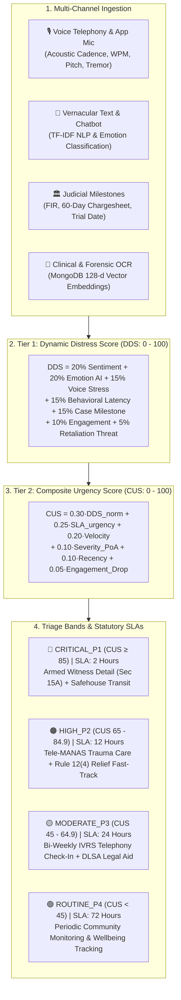
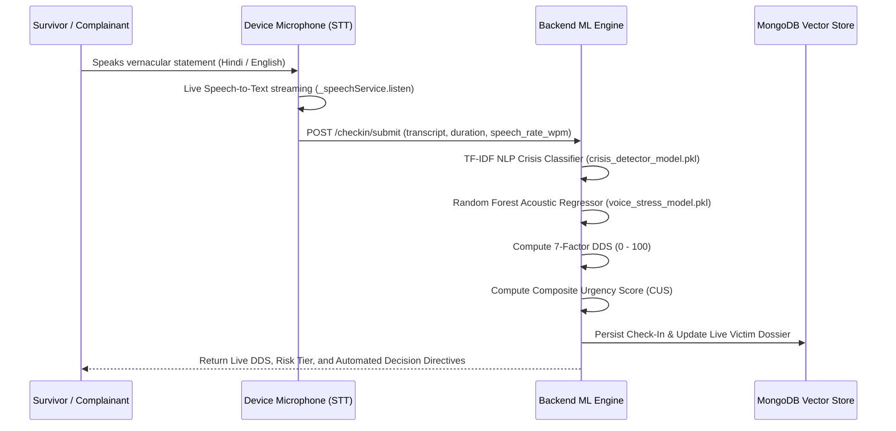

# ⚖️ Nyaya-Manas: Case Prioritization & Dynamic Distress Triage Architecture

> **Statutory Compliance:** Scheduled Castes and Scheduled Tribes (Prevention of Atrocities) Act 1989 (Section 15A) • SC/ST (PoA) Rules 1995 (Rule 12(4)) • Mental Healthcare Act 2017 • Digital Personal Data Protection (DPDP) Act 2023

---

## 📌 1. Executive Summary & Problem Context

Victims and key witnesses in atrocity cases frequently suffer prolonged psychological trauma due to:
1. **Physical intimidation and armed threats** by accused parties.
2. **Anticipatory court testimony dread** during open-court cross-examinations.
3. **Severe administrative delays** in investigation (chargesheet delays beyond the mandatory 60-day window).
4. **Economic hardship & compensation bottlenecks** in statutory relief disbursement.
5. **Social ostracism & village boycotts** causing acute isolation and hopelessness.

**Nyaya-Manas** introduces an automated, continuous, AI-driven case prioritization and distress triage system that translates continuous multi-channel signals (voice telephony, app interactions, mobile speech-to-text, and clinical OCR reports) into mathematically sound urgency rankings for **District Magistrates, Police Superintendents, and Clinical Welfare Officers**.

---

## 📐 2. The Two-Tier Prioritization Framework

Case prioritization operates on a strict **two-tier algorithmic hierarchy**:
- **Tier 1 — Dynamic Distress Score ($\text{DDS}$):** Real-time psychological distress index ($0 - 100$) calculated at every interaction.
- **Tier 2 — Composite Urgency Score ($\text{CUS}$):** Global triage score ($0 - 100$) ranking the entire district/state case docket for administrative intervention.



---

## 🧮 3. Tier 1: 7-Factor Dynamic Distress Score (DDS)

The **DDS** ($0 - 100$) measures survivor distress during any interaction (IVRS `14566`, Tele-MANAS `14416`, App mic, or chat):

$$\text{DDS} = S_{\text{sentiment}} + E_{\text{emotion}} + V_{\text{voice}} + B_{\text{behavior}} + L_{\text{legal}} + P_{\text{engagement}} + R_{\text{threat}}$$

### Component Breakdown & Weights

| # | Factor | Weight | Maximum Points | Calculation & Clinical Logic |
|---|:---|:---:|:---:|:---|
| **1** | **Linguistic Sentiment** | **20%** | **20 pts** | Derived from normalized NLP sentiment polarity $s \in [0.0, 1.0]$: <br>$$S_{\text{sentiment}} = (1.0 - s) \times 20.0$$ |
| **2** | **Emotion AI Classification** | **20%** | **20 pts** | Categorical trauma classification: <br>• `HOPELESSNESS`: $20.0\text{ pts}$ <br>• `TERROR`: $19.5\text{ pts}$ <br>• `FEAR`: $18.0\text{ pts}$ <br>• `HIGH_ANXIETY`: $16.0\text{ pts}$ <br>• `ANGER`: $14.0\text{ pts}$ <br>• `MODERATE_STRESS`: $10.0\text{ pts}$ <br>• `CALM`: $1.0\text{ pt}$ |
| **3** | **Voice Acoustic Stress** | **15%** | **15 pts** | Random Forest Regressor prediction ($\text{score} \in [0, 100]$) over acoustic feature vector: <br>$$V_{\text{voice}} = \left(\frac{\text{Stress Score}}{100.0}\right) \times 15.0$$ |
| **4** | **Behavioral Latency** | **15%** | **15 pts** | Tracks uncharacteristic silence or response lag: <br>• $\Delta t > 48\text{h}$: $15.0\text{ pts}$ (Flags potential physical coercion) <br>• $\Delta t > 24\text{h}$: $11.0\text{ pts}$ <br>• $\Delta t > 12\text{h}$: $7.0\text{ pts}$ <br>• Routine ($\le 12\text{h}$): $3.0\text{ pts}$ |
| **5** | **Legal Milestones** | **15%** | **15 pts** | Baseline legal stress by case stage: <br>• FIR Stage: $8.0\text{ pts}$ <br>• Chargesheet Stage: $11.0\text{ pts}$ <br>• Special Court Trial Stage: $14.0\text{ pts}$ <br>• *Court Hearing Dread Spike:* $+4.0\text{ pts}$ if scheduled within $\le 48\text{h}$. |
| **6** | **Engagement Volatility** | **10%** | **10 pts** | Quantifies sudden drop-offs or erratic touchpoints ($3.5 - 8.0\text{ pts}$). |
| **7** | **Retaliation Threat Flag** | **5%** | **5 pts** | Direct threat flag reported under Section 15A ($5.0\text{ pts}$ if present, $1.5\text{ pts}$ baseline). |

---

## 🚀 4. Tier 2: Composite Urgency Score (CUS)

While DDS monitors individual victim trajectory, the **Composite Urgency Score (CUS)** ranks all active cases in a jurisdiction to drive automated allocation of police details, emergency safehouses, and psychiatric care.

### The CUS Formula

$$\text{CUS} = \min\left(100.0, \frac{\text{Raw CUS}}{0.65} \times 100.0\right)$$

$$\text{Raw CUS} = \alpha \cdot \text{DDS}_{\text{norm}} + \beta \cdot \text{SLA}_{\text{urgency}} + \gamma \cdot \text{Velocity} + \delta \cdot \text{Severity}_{\text{PoA}} + \epsilon \cdot \text{Recency} + \zeta \cdot \text{Drop}$$

### Weight Parameters & Formulas

| Symbol | Parameter | Weight | Mathematical Formulation |
|:---:|:---|:---:|:---|
| $\alpha$ | **Current Distress Level** | **0.30** | $\text{DDS}_{\text{norm}} = \frac{\text{DDS}}{100.0} \in [0.0, 1.0]$ |
| $\beta$ | **SLA Urgency** | **0.25** | $\text{SLA}_{\text{urgency}} = \max\left(0.0, 1.0 - \frac{t_{\text{remaining}}}{t_{\text{total}}}\right)$ |
| $\gamma$ | **Distress Velocity ($\Delta\text{DDS}$)** | **0.20** | $\text{Velocity} = \text{clip}\left(\frac{\text{DDS}_{t} - \text{DDS}_{t-1}}{50.0}, -1.0, 1.0\right)$ |
| $\delta$ | **SC/ST PoA Statutory Severity** | **0.10** | Mapped from registered PoA Act section (lookup table below) |
| $\epsilon$ | **Contact Recency** | **0.10** | $\text{Recency} = \min\left(1.0, \frac{\text{Days Since Last Contact}}{14.0}\right)$ |
| $\zeta$ | **Engagement Drop** | **0.05** | $\text{Engagement Drop} = \frac{\text{Missed Check-ins}}{\text{Scheduled Check-ins}}$ |

### Statutory PoA Offense Severity Lookup ($\delta$)

| Statutory Section (SC/ST PoA Act) | Offense Classification | Severity Weight ($\delta$) |
|:---|:---|:---:|
| **Section 3(2)(v)** | Murder, Gangrape, Capital Offense | **1.00** |
| **Section 3(2)(va)** | Grievous Hurt, Acid Attack, Arson of Dwelling | **0.95** |
| **Section 3(1)(w)** | Sexual Assault, Outraging Modesty | **0.80** |
| **Section 3(1)(s)** | Criminal Intimidation & Public Humiliation | **0.70** |
| **Section 3(1)(r)** | Caste Abuse in Public View | **0.60** |
| **Section 3(1)(za)** | Social Boycott, Denial of Water/Passage | **0.50** |
| **General** | Other Scheduled Offenses | **0.40** |

---

## 📊 5. Triage Priority Bands & Statutory Interventions

```
┌─────────────────────────────────────────────────────────────────────────────┐
│                       CASE TRIAGE HIERARCHY MATRIX                          │
├───────────────────┬─────────────┬──────────┬────────────────────────────────┤
│ Priority Tier     │  CUS Range  │ Max SLA  │ Automated Action Directives     │
├───────────────────┼─────────────┼──────────┼────────────────────────────────┤
│ 🚨 CRITICAL_P1    │ ≥ 85.0      │ 2 Hours  │ Armed Witness Protection (15A) │
│                   │             │          │ Emergency Safehouse Relocation │
│                   │             │          │ Fast-Track 50% Rule 12(4) DBT  │
├───────────────────┼─────────────┼──────────┼────────────────────────────────┤
│ 🟠 HIGH_P2        │ 65.0 - 84.9 │ 12 Hours │ Tele-MANAS (14416) Trauma Care │
│                   │             │          │ Fast-Track 25% Interim Relief  │
│                   │             │          │ DLSA Pre-Trial Senior Counsel  │
├───────────────────┼─────────────┼──────────┼────────────────────────────────┤
│ 🟡 MODERATE_P3    │ 45.0 - 64.9 │ 24 Hours │ Bi-Weekly 14566 IVRS Tracking  │
│                   │             │          │ DLSA Summons & Hearing Review  │
├───────────────────┼─────────────┼──────────┼────────────────────────────────┤
│ 🟢 ROUTINE_P4     │ < 45.0      │ 72 Hours │ Routine Periodic Monitoring    │
│                   │             │          │ Community Welfare Support      │
└───────────────────┴─────────────┴──────────┴────────────────────────────────┘
```

---

## 🎙️ 6. Real-Time Acoustic & Speech Inference Pipeline

The system integrates real-time microphone speech recognition with machine learning acoustic feature extraction.

### Feature Pipeline



### Machine Learning Models in Production

1. **Voice Stress ML Regressor (`models/trained/voice_stress_model.pkl`)**:
   - **Architecture:** Scikit-Learn `RandomForestRegressor` + `RandomForestClassifier`.
   - **Feature Vector:** `[pitch_variance, vocal_pause_ratio, speech_rate_wpm, jitter, shimmer, sentiment_score]`.
   - **Outputs:** Stress Index ($0 - 100$) and Emotion Label (`CALM`, `MODERATE_STRESS`, `HIGH_ANXIETY`, `CRISIS_PANIC`).
2. **Crisis NLP Pipeline (`models/trained/crisis_detector_model.pkl`)**:
   - **Architecture:** TF-IDF Vectorizer + Calibrated Logistic Classifier.
   - **Multilingual Lexicon:** English + Devanagari Hindi + Hinglish (`dhamki`, `maar`, `hathiyaar`, `goli`, `peshi`, `adalat`, `kaap`, `chinta`, `khauf`, `surakshit`, `sukoon`).
   - **Outputs:** Crisis Severity Category (`SAFE`, `MODERATE_DISTRESS`, `CRITICAL_CRISIS`).
3. **Dynamic Cadence Derivation**:
   $$\text{WPM} = \text{clamp}\left(\left(\frac{\text{Word Count}}{\text{Duration in seconds}}\right) \times 60.0, 60.0, 240.0\right)$$

---

## 📄 7. Clinical OCR & MongoDB Vector RAG Engine

When clinical intake forms, psychological evaluations, or forensic reports are uploaded:

1. **OCR Entity Extraction**:
   Extracts clinical diagnoses (ICD-11), trauma severity scores, C-SSRS suicide risk, physical contusions, and psychiatric medications.
2. **Semantic Vector Chunking**:
   Text is split into sliding semantic windows ($45\text{ words}$ with $10\text{ words overlap}$).
3. **128-Dimensional Dense Vector Embeddings**:
   Embeddings are generated and indexed into MongoDB collection `nyaya_clinical_embeddings`.
4. **Cosine Similarity RAG Retrieval (`POST /reports/rag-query`)**:
   Queries like *"Does patient show suicide risk or severe trauma from witness dread?"* compute cosine similarity against indexed chunks:
   $$\text{Similarity}(q, d) = \frac{q \cdot d}{\|q\| \|d\|}$$
5. **Dynamic Priority Escalation**:
   Detection of acute clinical findings (e.g., *ICD-11 6B40 Acute PTSD*, *C-SSRS High Suicide Risk*) automatically injects clinical severity overrides into the CUS engine, elevating the case to **CRITICAL_P1**.

---

## 🔌 8. Key API Endpoints & Interfaces

| Method | Endpoint | Description |
|:---|:---|:---|
| `POST` | `/api/v1/nyaya-manas/checkin/submit` | Ingests voice check-in, runs ML inference, and computes live DDS. |
| `GET` | `/api/v1/nyaya-manas/cases/prioritized` | Ranks all active district cases by Composite Urgency Score (CUS). |
| `POST` | `/api/v1/nyaya-manas/cases/auto-decide` | Generates statutory intervention package ready for one-tap execution. |
| `POST` | `/api/v1/nyaya-manas/reports/upload-ocr` | Extracts OCR entities and indexes 128-d vector embeddings in Mongo. |
| `POST` | `/api/v1/nyaya-manas/reports/rag-query` | Performs semantic search & clinical synthesis across patient records. |
| `GET` | `/api/v1/nyaya-manas/reports/{victim_id}` | Retrieves all forensic and psychological evaluation records for a victim. |

---

## 🛡️ 9. Statutory & Legal Alignment

- **Section 15A of SC/ST (PoA) Act 1989:** Mandates comprehensive victim and witness protection, state-funded travel/maintenance expenses, relocation to safehouses, and immediate police protection during threats.
- **Rule 12(4) of SC/ST (PoA) Rules 1995:** Prescribes mandatory DBT statutory relief installments: $25\%$ on FIR, $50\%$ on chargesheet filing (within 60 days), and $25\%$ on conviction.
- **Digital Personal Data Protection (DPDP) Act 2023:** Enforces end-to-end data encryption, differential privacy, role-based access control (RBAC), and purpose-limited survivor consent logging.
- **Mental Healthcare Act 2017:** Guarantees non-discriminatory, confidential mental healthcare access, suicide de-criminalization protocol, and tele-psychiatric linkages (Tele-MANAS `14416`).
