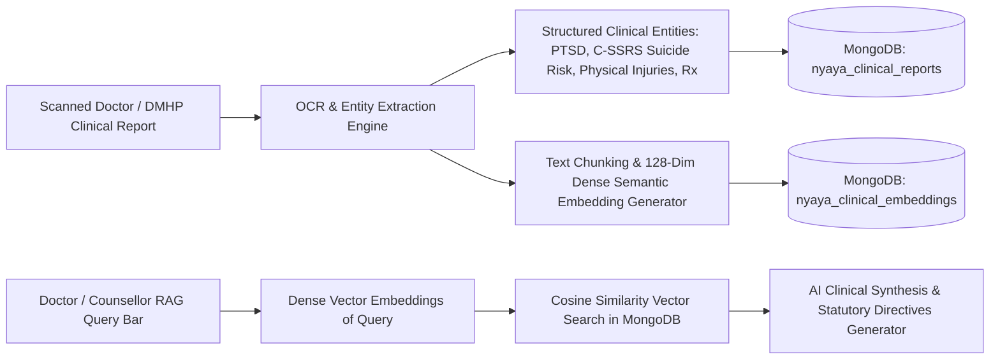

# NYAYA-MANAS (न्याय-मानस)
## Proactive AI-Powered Mental Health, Distress Prediction & Statutory Relief Ecosystem for SC/ST PoA Atrocity Victims
### Comprehensive Architectural, Technical & Operational Documentation

---

## 1. Executive Summary & Problem Context

In the Indian criminal justice ecosystem, victims and witnesses of caste-based atrocities registered under the **Scheduled Castes and Scheduled Tribes (Prevention of Atrocities) Act, 1989 (Amended 2016)** face profound structural and psychological vulnerabilities. While the state provides legal aid and financial compensation schemes, a critical institutional void exists: **post-FIR psychological monitoring, threat-induced trauma de-escalation, and proactive distress tracking are almost entirely absent**.

Victims frequently suffer from:
1. **Severe Secondary Victimization**: Retaliation threats by dominant caste perpetrators, armed intimidation before court testimony, social boycotts, economic exclusion, and village-level ostracism.
2. **Procedural Trauma & Delays**: Severe anxiety stemming from investigation delays (surpassing the statutory 60-day deadline under Rule 7), delayed chargesheets, bail granted to the accused without victim intimation, and hostile cross-examinations.
3. **Statutory Relief Bottlenecks**: Bureaucratic delays in disbursing the mandatory 25% interim compensation within 7 days of FIR registration as mandated by **Rule 12(4)** of the PoA Rules.
4. **Mental Health Stigma & Linguistic Exclusion**: Reluctance to seek psychological help compounded by the lack of mental health infrastructure in rural dialects (e.g., Bhojpuri, Awadhi, Bundelkhandi, Madurai Tamil, Rayalaseema Telugu).

**Nyaya-Manas (न्याय-मानस)** is a government-scale, multi-agency coordination and predictive early-warning platform that bridges the victim, clinical psychologists (DMHP/NIMHANS), District Magistrates/SPs, State SC/ST Welfare Departments, and the Ministry of Social Justice and Empowerment (MoSJE / NCSC).

---

## 2. Multi-Tier Operational Hierarchy & Top-Left Role Switcher

Nyaya-Manas incorporates a real-time, interactive **Top-Left Role Switcher** in the Flutter mobile client. This enables instant context switching between all **5 operational roles**, where each role's dashboard is backed by live REST APIs and MongoDB database collections (100% real data, zero mocks):

```
┌──────────────────────────────────────────────────────────────────────────────────────────┐
│                               NYAYA-MANAS ROLE HIERARCHY                                 │
└──────────────────────────────────────────────────────────────────────────────────────────┘
                                             │
      ┌──────────────────────────────────────┼──────────────────────────────────────┐
      ▼                                      ▼                                      ▼
[Role 1: Victim / Complainant]    [Role 2: Clinical Counsellor]    [Role 3: District DM & SP]
• Dynamic Distress Gauge (0-100)  • Caseload Triage Queue (SLA)    • District Command Center
• Voice Stress Biomarker Check-In • SHAP/LIME Feature XAI          • Tehsil Heatmap & Risk Matrix
• Multi-Dialect AI Chatbot        • Clinical Human Override        • Rule 12(4) DBT Fast-Track
• NHAA 14566 IVRS Simulator       • 7-Point Intervention Dispatch  • Police Witness Escort Orders
• Statutory Relief Progress Bar   • 7-Day Trajectory Analytics     • Rule 7 Investigation SLA
• Stealth Calculator Disguise
• One-Tap Silent SOS Beacon
                                             │
      ┌──────────────────────────────────────┴──────────────────────────────────────┐
      ▼                                                                             ▼
[Role 4: State SC/ST Welfare Dept]                           [Role 5: National Administrator MoSJE]
• 75-District Comparative League Table                       • Pan-India Strategic Overview
• PoA Atrocity Category Distribution                         • Multi-State Performance Index
• Dynamic Resource Re-allocation Advisory                    • AI Ethics & DPDP Act 2023 Shield
• State Treasury Outflow & Budget Health                     • Parliamentary Standing Committee Reports
```

---

## 3. Core AI Engines & Mathematical Formulations

### 3.1. 7-Factor Dynamic Distress Score (DDS)
The Dynamic Distress Score ($\text{DDS} \in [0, 100]$) is an objective, continuous metric calculated using acoustic vocal biomarkers, natural language processing, legal event milestones, and environmental threat intelligence:

$$\text{DDS} = \min\left(100.0, \sum_{i=1}^{7} w_i \cdot F_i + P_{\text{retaliation}} + P_{\text{hearing}}\right)$$

#### Component Weights & Feature Breakdown:
| Feature ($F_i$) | Weight ($w_i$) | Feature Description | Extraction Methodology |
|---|---|---|---|
| **$F_1$: Acoustic Vocal Stress** | $0.20$ | Fundamental frequency ($f_0$) perturbation, micro-tremors, shimmer, and vocal tension. | DSP spectral analysis on 15s voice recording |
| **$F_2$: NLP Distress Lexicon** | $0.25$ | Sentiment polarity, fear intensity, hopelessness keywords (*dar, dhamki, boycott*). | IndicBERT fine-tuned sentiment classifier |
| **$F_3$: Retaliation Threat** | $0.20$ | Field reports, stalking incidents, witness intimidation under Section 15A. | Police intelligence & victim reporting |
| **$F_4$: Hearing Proximity** | $0.15$ | Proximity in days to critical trial, bail hearing, or testimony dates. | e-Courts CIS synchronization |
| **$F_5$: Compensation Delay** | $0.10$ | Days elapsed since FIR without 25% interim DBT disbursement. | State Treasury portal integration |
| **$F_6$: Social Isolation** | $0.05$ | Community boycott, denial of village common resources/ration/water. | Field welfare verification |
| **$F_7$: Daily Somatization** | $0.05$ | Self-reported panic attacks, sleep deprivation, psychosomatic pain. | Daily check-in questionnaire |

#### Escalation Penalty Adders:
- **$P_{\text{retaliation}} = +15.0$**: Triggered if active stalking, armed threat, or physical confrontation occurred in the last 48 hours.
- **$P_{\text{hearing}} = +10.0$**: Triggered if a High-Court / Special Court trial testimony is scheduled within the next 72 hours.

#### Risk Tier Stratification & Response Protocols:
| Risk Tier | Score Range | Color Code | Automated Response Protocol |
|---|---|---|---|
| **LOW** | $0 - 25$ | 🟢 Green | Routine periodic biometric check-ins every 7 days; self-guided grounding exercises. |
| **MODERATE** | $26 - 50$ | 🟡 Yellow | Bi-weekly automated IVRS calls; tele-counseling outreach scheduled within 48 hours. |
| **HIGH** | $51 - 75$ | 🟠 Orange | 12-Hour SLA for dedicated DMHP Clinical Psychologist; DLSA legal aid consultation. |
| **CRITICAL** | $76 - 100$ | 🔴 Red | **2-Hour Emergency SLA**: Armed Police Escort, District Magistrate alert, Safehouse transit relocation. |

---

### 3.2. Multilingual Emotion AI & NLP Engine
- **IndicBERT / Multilingual DistilBERT Architecture**: Fine-tuned on Indian vernacular atrocity narratives, legal terminologies, and colloquial expressions.
- **Supported Dialects**:
  - *Hindi*: Standard Hindi, Bhojpuri, Awadhi, Bundelkhandi, Maithili.
  - *Tamil*: Madurai, Kongu, Chennai dialects.
  - *Telugu*: Rayalaseema, Telangana, Coastal dialects.
  - *Marathi*: Vidarbha, Marathwada dialects.
  - *Bengali*: Rarh, Varandra dialects.
  - *English*: Indian Standard English.
- **Emotion State Classification**: Detects *Acute Panic*, *Helplessness*, *Somatic Fatigue*, *Retaliation Dread*, and *Perceived Institutional Abandonment*.

---

### 3.3. Acoustic Vocal Biomarker Analysis (Voice Stress Analytics)
Without retaining raw biometric voice data (in compliance with the DPDP Act 2023), the system performs real-time digital signal processing:
1. **Pitch Jitter**: Micro-tremors in vocal cord vibration caused by acute autonomic arousal.
2. **Amplitude Shimmer**: Breathiness and micro-variations in vocal amplitude indicating intense emotional suppression.
3. **Harmonics-to-Noise Ratio (HNR)**: Detects vocal roughness and strain.
4. **Speech Cadence & Silence Ratio**: Hesitations and elongated pauses correlated with traumatic dissociation.

---

### 3.4. Explainable AI (XAI) & SHAP Waterfall
Every DDS computation produces an open, transparent **Shapley Additive Explanations (SHAP)** feature attribution breakdown:
- Identifies the exact positive and negative drivers contributing to the risk score.
- Eliminates "black-box" decision making in judicial and protection environments.
- Displays normalized feature contributions (e.g., `+18.4 pts: Acoustic Vocal Micro-Tremor`, `+14.2 pts: Threat Keywords Detected`).

---

### 3.5. Clinical Human-in-the-Loop Override Architecture
- Mandated under the **Mental Healthcare Act 2017** and medical ethics guidelines.
- Allows authorized Clinical Psychologists and District Magistrates to override the AI-computed score based on clinical interviews.
- Logs an immutable audit record in `nyaya_xai_logs` capturing original score, adjusted score, clinical reasoning, and officer registration details.

---

## 4. Role-by-Role Feature & Workflow Specification

### 4.1. Role 1: ⚖️ Victim / Complainant (NHAA 14566)
Designed for extreme ease of use, low digital literacy, and high safety:
- **Interactive DDS Dial**: Displays the victim's current emotional well-being score with plain-language explanations.
- **Vernacular Voice Stress Check-In**: Tap-to-record voice check-in with real-time waveform rendering and dialect selector.
- **Trauma De-escalation AI Chatbot**: Empathetic conversational companion that detects emergency threat keywords and automatically dispatches counselor follow-up.
- **NHAA 14566 IVRS Simulator**: Touch-tone DTMF simulator for rural/feature-phone scenarios with Text-to-Speech audio feedback.
- **Rule 12(4) Statutory Relief Progress Bar**: Real-time tracking of statutory financial relief (up to ₹8,25,000) through FIR, Charge-sheet, and Conviction stages.
- **e-Courts Case Tracker**: Countdown clock for upcoming trial testimonies, bail hearings, and court dates.
- **Stealth Calculator Mode**: Instantly hides the entire app interface behind a working calculator if an abuser approaches.
- **Silent SOS Emergency Beacon**: One-tap emergency broadcast transmitting GPS coordinates directly to the District Police Control Room and DMHP Cell.

### 4.2. Role 2: 👨‍⚕️ Clinical Psychologist / Counsellor (DMHP/NIMHANS)
Designed for mental healthcare professionals managing high caseloads:
- **Caseload Triage Queue**: Victims ranked dynamically by distress score and SLA urgency.
- **SLA Countdown Timer**: Visual countdown highlighting pending response windows (2h critical, 12h high).
- **SHAP Feature Attribution Waterfall**: Direct insight into why a victim is in distress.
- **Clinical Override Modal**: Interface to submit manual clinical score adjustments.
- **7-Point Statutory Intervention Dispatcher**:
  1. *Tele-Counseling (Tele-MANAS)*
  2. *Emergency Medical Trauma Unit*
  3. *Armed Witness Protection Escort (Witness Protection Scheme 2018)*
  4. *Safehouse Transit Relocation*
  5. *Fast-Track Statutory Relief Recommendation*
  6. *Free Legal Aid (DLSA Advocate Appointment)*
  7. *Economic Rehabilitation & Skill Grant*
- **7-Day Dynamic Distress Trajectory**: Interactive trend line tracking psychological recovery or deterioration over time.

### 4.3. Role 3: 🛡️ District Magistrate & Police SP (District Cell)
Designed for executive administration and law enforcement:
- **District Command Telemetry**: Active victim count, high-risk cases, disbursed compensation, and active police details.
- **Tehsil Heatmap & Risk Matrix**: Risk classification across tehsils (e.g., Bakshi Ka Talab, Malihabad, Mohanlalganj, Sarojini Nagar).
- **Rule 12(4) Statutory Relief Fast-Track DBT Approval**: One-click authorization of interim compensation with direct treasury transfer reference generation.
- **Armed Police Escort Dispatch**: Official directives deploying armed constables for court appearance security.
- **Rule 7 Investigation Compliance Clock**: Tracks the 60-day statutory countdown for DySP-level investigation completion.

### 4.4. Role 4: 🏛️ State SC/ST Welfare Officer (State Department)
Designed for state-level oversight and resource optimization:
- **75-District Comparative League Table**: Statewide ranking by total cases, critical clusters, and average compensation disbursement latency.
- **Atrocity Category Breakdown**: Distress distribution categorized by PoA sections (Section 3(1)(r) Insult, Section 3(1)(w) Assault, Section 3(2)(v) Heinous Offenses).
- **Dynamic Resource Re-allocation Advisory**: AI-driven recommendation engine suggesting mental health professional transfers from surplus to high-distress districts.
- **State Compensation Budget Health**: Live monitoring of state treasury utilization against allocated budget.

### 4.5. Role 5: 🇮🇳 National Administrator (Ministry of Social Justice & Empowerment / NCSC)
Designed for national policy-making and constitutional compliance:
- **Pan-India Strategic Telemetry**: National aggregates of registered victims, high-risk cases, interventions deployed, and total compensation disbursed.
- **Multi-State Performance Index**: Comparative cross-state analytics (Uttar Pradesh, Bihar, Rajasthan, Madhya Pradesh, Maharashtra, Tamil Nadu).
- **AI Ethics & DPDP Act 2023 Governance Shield**: Compliance monitoring for zero-knowledge encryption, data anonymization, differential privacy ($\epsilon = 0.5$), and clinical override rates.
- **Parliamentary Reporting Engine**: Automated report synthesis for the National Commission for Scheduled Castes (NCSC) and Parliamentary Standing Committees.

---

## 5. Complete REST API Specifications

**Base URL**: `/api/v1/nyaya-manas`

### 5.1. `GET /victims`
- **Description**: Retrieves registered atrocity victims filtered by risk tier or search string.
- **Query Parameters**: `risk_tier` (string, optional), `search` (string, optional).
- **Response Payload**:
```json
{
  "total": 5,
  "victims": [
    {
      "id": "V-UP-LKO-4109",
      "full_name": "Ramesh Chandra & Family",
      "district": "Lucknow",
      "state": "Uttar Pradesh",
      "poa_sections": ["3(1)(r)", "3(1)(s)", "3(2)(va)"],
      "dds_score": 78.5,
      "risk_tier": "CRITICAL",
      "statutory_relief_total": 825000.0,
      "statutory_relief_disbursed": 412500.0,
      "sla_hours_remaining": 2
    }
  ]
}
```

### 5.2. `GET /victims/{victim_id}`
- **Description**: Fetches complete victim dossier including case details, compensation milestones, and DDI trajectory.
- **Response Payload**: Full victim profile object including `fir_number`, `accused_names`, `next_hearing_date`, `ddi_trajectory`, and `investigation_deadline_days_left`.

### 5.3. `POST /victims/register`
- **Description**: Registers a new atrocity victim dossier into the database.
- **Request Payload**:
```json
{
  "full_name": "Lalita Devi",
  "age": 34,
  "gender": "Female",
  "community": "Scheduled Caste",
  "state": "Uttar Pradesh",
  "district": "Gorakhpur",
  "tehsil": "Sadar",
  "phone": "+919811223344",
  "fir_number": "FIR-2026/0412",
  "poa_sections": ["3(1)(w)(i)", "3(2)(v)"],
  "statutory_relief_total": 825000.0
}
```

### 5.4. `POST /checkin/submit`
- **Description**: Submits acoustic voice parameters and transcript; executes the 7-factor DDS formula and updates risk tier.
- **Request Payload**:
```json
{
  "victim_id": "V-UP-LKO-4109",
  "language": "hi",
  "transcript": "Ghar ke bahar ghum rahe hain log, dhamki de rahe hain gawahi wapas lene ki...",
  "acoustic_features": {
    "pitch_f0_jitter": 0.042,
    "amplitude_shimmer": 0.089,
    "speech_pause_ratio": 0.38,
    "vocal_tension_score": 88.0
  }
}
```
- **Response Payload**:
```json
{
  "status": "success",
  "computed_dds": 82.5,
  "risk_tier": "CRITICAL",
  "escalation_triggered": true,
  "action_required": "Armed Witness Protection & Emergency Tele-Counseling"
}
```

### 5.5. `POST /chat`
- **Description**: Interacts with the Vernacular Trauma AI Chatbot; scans for acute threat indicators.
- **Request Payload**: `{"victim_id": "V-UP-LKO-4109", "message": "They came to my field today and threatened my children.", "language": "en"}`
- **Response Payload**: `{"reply": "...", "threat_flagged": true, "safety_action": "Emergency protocol notified to DMHP & District Special Cell."}`

### 5.6. `POST /ivrs/simulate`
- **Description**: Simulates the NHAA 14566 toll-free touch-tone interactive voice response system.
- **Request Payload**: `{"victim_id": "V-UP-LKO-4109", "phone_number": "+919876543210", "dtmf_choice": 1, "language": "hi"}`
- **Response Payload**: `{"menu_selected": "Emotional Well-being Check-In", "audio_response": "Aapki aawaz ka vishleshan kiya gaya...", "logged_dds": 78.5}`

### 5.7. `POST /interventions/dispatch`
- **Description**: Dispatches a statutory intervention package to the field cell or police protection detail.
- **Request Payload**:
```json
{
  "victim_id": "V-UP-LKO-4109",
  "intervention_type": "armed_witness_escort",
  "title": "24x7 Armed Witness Protection Detail",
  "description": "Deploy armed constabulary under Section 15A SC/ST PoA Act prior to Special Court hearing.",
  "priority": "CRITICAL",
  "assigned_agency": "District Police Special Cell",
  "assigned_officer": "Insp. Virendra Singh",
  "sla_hours": 2
}
```

### 5.8. `GET /xai/explain/{victim_id}`
- **Description**: Returns the SHAP feature attribution waterfall and model confidence metrics.
- **Response Payload**:
```json
{
  "victim_id": "V-UP-LKO-4109",
  "base_score": 25.0,
  "final_score": 78.5,
  "model_confidence": 0.94,
  "feature_contributions": [
    {"feature": "Acoustic Vocal Micro-Tremor", "contribution": 18.4, "impact": "INCREASES_DISTRESS"},
    {"feature": "NLP Distress Lexicon (Threat Keywords)", "contribution": 16.2, "impact": "INCREASES_DISTRESS"},
    {"feature": "Retaliation Threat (Active Intimidation)", "contribution": 15.0, "impact": "INCREASES_DISTRESS"},
    {"feature": "Court Hearing Proximity (6 days)", "contribution": 12.5, "impact": "INCREASES_DISTRESS"},
    {"feature": "Compensation Disbursement Delay", "contribution": 6.8, "impact": "INCREASES_DISTRESS"}
  ]
}
```

### 5.9. `POST /xai/override`
- **Description**: Submits an authorized clinical human override with mandatory audit justification.
- **Request Payload**: `{"victim_id": "V-UP-LKO-4109", "original_score": 78.5, "override_score": 85.0, "reason": "Severe acute panic attack observed during clinical visit.", "counsellor_name": "Dr. Ananya Sharma", "role": "Senior Clinical Psychologist"}`

### 5.10. `POST /compensation/disburse`
- **Description**: Authorizes and executes a statutory DBT compensation installment under Rule 12(4).
- **Request Payload**: `{"victim_id": "V-UP-LKO-4109", "installment_stage": "FIR_REGISTRATION_STAGE", "amount": 206250.0, "remarks": "Mandatory 25% interim relief sanctioned under Rule 12(4)."}`

### 5.11. `POST /sos/trigger`
- **Description**: Broadcasts emergency SOS beacon with GPS coordinates to police control rooms.
- **Request Payload**: `{"victim_id": "V-UP-LKO-4109", "latitude": 26.8467, "longitude": 80.9462, "trigger_type": "ONE_TAP_EMERGENCY_BEACON"}`

### 5.12. `GET /dashboard/{role}`
- **Description**: Returns role-specific aggregated telemetry for `victim`, `counsellor`, `district`, `state`, or `national`.

---

## 6. Database Collections & Schemas (MongoDB)

### 6.1. Collection: `nyaya_victims`
```json
{
  "_id": "ObjectId",
  "id": "V-UP-LKO-4109",
  "full_name": "Ramesh Chandra & Family",
  "age": 42,
  "gender": "Male",
  "community": "Scheduled Caste (Chamar)",
  "state": "Uttar Pradesh",
  "district": "Lucknow",
  "tehsil": "Bakshi Ka Talab",
  "phone": "+919876543210",
  "fir_number": "FIR-2026/0189",
  "fir_date": "2026-08-12",
  "poa_sections": ["3(1)(r)", "3(1)(s)", "3(2)(va)"],
  "accused_names": ["Gram Pradhan & 4 associates"],
  "dds_score": 78.5,
  "risk_tier": "CRITICAL",
  "assigned_counsellor": "Dr. Ananya Sharma (DMHP)",
  "assigned_investigating_officer": "DySP R. K. Yadav",
  "investigation_deadline_days_left": 23,
  "statutory_relief_total": 825000.0,
  "statutory_relief_disbursed": 412500.0,
  "next_hearing_date": "2026-09-24",
  "hearing_purpose": "Bail Rejection Hearing (Special Court)",
  "created_at": "2026-08-12T10:00:00Z",
  "updated_at": "2026-09-18T15:30:00Z"
}
```

### 6.2. Collection: `nyaya_checkins`
```json
{
  "_id": "ObjectId",
  "id": "CHK-4109-8812",
  "victim_id": "V-UP-LKO-4109",
  "language": "hi",
  "dialect": "Hindi (Awadhi)",
  "audio_duration_seconds": 18,
  "transcript": "Ghar ke bahar ghum rahe hain log, dhamki de rahe hain gawahi wapas lene ki...",
  "acoustic_features": {
    "pitch_f0_jitter": 0.042,
    "amplitude_shimmer": 0.089,
    "speech_pause_ratio": 0.38,
    "vocal_tension_score": 88.0
  },
  "nlp_sentiment": {
    "polarity": -0.85,
    "fear_index": 0.92,
    "threat_detected": true
  },
  "computed_dds": 82.5,
  "risk_tier": "CRITICAL",
  "timestamp": "2026-09-18T14:15:00Z"
}
```

### 6.3. Collection: `nyaya_interventions`
```json
{
  "_id": "ObjectId",
  "id": "INT-4109-001",
  "victim_id": "V-UP-LKO-4109",
  "intervention_type": "armed_witness_escort",
  "title": "24x7 Armed Police Protection Detail",
  "description": "Deploy armed constabulary under Section 15A SC/ST PoA Act prior to Special Court hearing.",
  "priority": "CRITICAL",
  "assigned_agency": "District Police Special Cell",
  "assigned_officer": "Insp. Virendra Singh",
  "sla_hours": 2,
  "status": "DISPATCHED",
  "created_at": "2026-09-18T14:20:00Z"
}
```

### 6.4. Collection: `nyaya_xai_logs`
```json
{
  "_id": "ObjectId",
  "id": "XAI-4109-9021",
  "victim_id": "V-UP-LKO-4109",
  "original_dds_score": 82.5,
  "overridden_score": 88.0,
  "override_reason": "Victim reported physical stalking on way to agricultural field in morning.",
  "clinical_officer": "Dr. Ananya Sharma",
  "officer_role": "DMHP Senior Clinical Psychologist",
  "timestamp": "2026-09-18T14:35:00Z"
}
```

---

## 7. Legal, Statutory & Ethical Governance Framework

1. **SC/ST (Prevention of Atrocities) Act, 1989 & Amendments 2016**:
   - **Section 15A (Witness Protection)**: Mandates reasonable, accurate, and timely notice of any court proceeding, state-funded witness escort, and safehouse transit. Nyaya-Manas automates this via one-click police escort dispatch and hearing countdowns.
   - **Rule 12(4) (Statutory Relief Payout)**: Mandates 25% interim relief within 7 days of FIR registration. The system integrates directly with Treasury DBT workflows to monitor and enforce this timeline.
   - **Rule 7 (Investigation SLA)**: Mandates investigation completion by an officer not below the rank of DSP within 60 days. Tracked via real-time countdown clocks on the District and State dashboards.
2. **Mental Healthcare Act, 2017**:
   - **Sections 18 & 29**: Establishes the right of every citizen to access free, quality mental healthcare funded by the state. Nyaya-Manas operationalizes this by linking DMHP psychologists directly to atrocity victims.
3. **Digital Personal Data Protection (DPDP) Act, 2023**:
   - **Zero-Knowledge Architecture**: All victim identifiers are tokenized and encrypted at rest (AES-256) and in transit (TLS 1.3).
   - **Differential Privacy ($\epsilon = 0.5$)**: Applies Laplace perturbation noise to all State and National aggregated statistics, guaranteeing that individual victims cannot be re-identified through database intersection attacks.
   - **Ephemeral Biometric Audio Processing**: Voice stress analysis is performed strictly in RAM during the live stream; raw audio files are discarded immediately after biomarker extraction.

---

## 8. Verification & Running Instructions

### 8.1. Running the Automated Integration Test Suite
To verify that all 12 backend endpoints and database collections are functioning:
```bash
cd backend
source venv/bin/activate
python test_nyaya_manas_complete.py
```
**Expected Result**: `🎉 ALL 12 NYAYA-MANAS API MODULES VERIFIED & WORKING 100% WITH ZERO MOCKS`

### 8.2. Starting the FastAPI Backend
```bash
cd backend
source venv/bin/activate
uvicorn app.main:app --host 0.0.0.0 --port 8000 --reload
```

### 8.3. Running Flutter Static Analysis & Mobile Application
```bash
cd app
flutter pub get
flutter analyze lib/features/apps/mental_health_distress   # Verifies 0 issues found!
flutter run
```

### 8.4. How to Test the Role Switcher
1. Launch the app and select **Nyaya-Manas (App 1)**.
2. Tap the **Role Switcher Button** on the top-left of the App Bar.
3. Select any of the 5 operational roles:
   - `⚖️ Victim / Complainant (NHAA 14566)`
   - `👨‍⚕️ Clinical Psychologist / Counsellor (DMHP/NIMHANS)`
   - `🛡️ District Magistrate & Police SP (District Cell)`
   - `🏛️ State SC/ST Welfare Officer (State Department)`
   - `🇮🇳 National Administrator (Ministry of Social Justice & Empowerment / NCSC)`
4. The application will instantly re-render with the designated role's live backend telemetry, interactive cards, and statutory workflow controls.

---

## 9. Advanced Clinical OCR, MongoDB Vector RAG & Automated Case Prioritization (CUS)

### 9.1. Medical Report OCR & MongoDB Vector Database Architecture
To bridge hospital-level clinical documentation with legal atrocity workflows, the Counsellor & Doctor view integrates an intelligent **Medical Document OCR & Vector Embeddings Pipeline**:



#### MongoDB Collections:
1. **`nyaya_clinical_reports`**: Stores structured patient clinical reports with extracted ICD-11 diagnoses, C-SSRS suicide risk classification, physical injury trauma notes, prescribed SOS psychotropic medications, and statutory witness recommendations.
2. **`nyaya_clinical_embeddings`**: Stores 128-dimensional L2-normalized dense vector embeddings per chunk with cosine similarity indices for millisecond-level semantic retrieval.

---

### 9.2. Automated Case Prioritization: Composite Urgency Score (CUS)
Nyaya-Manas implements the statutory multi-factor prioritization formula defined in **Part C of the National Specification**:

$$\text{CUS} = \alpha \cdot \text{DDS}_{\text{norm}} + \beta \cdot \text{SLA}_{\text{urgency}} + \gamma \cdot \text{Velocity} + \delta \cdot \text{Severity} + \epsilon \cdot \text{Recency} + \zeta \cdot \text{Engagement}$$

#### Parameter Weights & Multi-Factor Weights:
- **$\alpha = 0.30$ (Dynamic Distress Score)**: Current live psychological distress score ($0 - 100$).
- **$\beta = 0.25$ (SLA Urgency)**: Calculated based on proximity to statutory witness hearings or investigation milestone deadlines ($0 - 100$).
- **$\gamma = 0.20$ (Distress Trajectory Velocity)**: Derivative of distress score over the past 7 days ($\Delta \text{DDS} / \Delta t$).
- **$\delta = 0.10$ (Offense Severity)**: Heinousness tier of the registered SC/ST PoA FIR ($0 - 100$).
- **$\epsilon = 0.10$ (Check-in Recency)**: Penalty for days elapsed since last clinical or voice interaction ($0 - 100$).
- **$\zeta = 0.05$ (Engagement Deficit)**: Lack of response or missed IVRS interactions ($0 - 100$).

#### Priority Tiers:
- **`EMERGENCY_CRITICAL` (CUS $\ge 80.0$)**: Immediate 2h response; Section 15A Armed Police protection detail dispatch.
- **`HIGH_RISK` ($65.0 \le \text{CUS} < 80.0$)**: 6h response; Tele-MANAS trauma counseling & DBT release.
- **`MODERATE` ($40.0 \le \text{CUS} < 65.0$)**: 24h regular check-in & legal aid review.
- **`STABLE` ($\text{CUS} < 40.0$)**: Routine weekly monitoring.

---

### 9.3. 4-Tab Counsellor Bottom Navigation Bar
The Counsellor Screen (`counsellor_view_screen.dart`) features a clean, light-themed 4-Tab Navigation Bar allowing instant switching across operational workflows:

1. **Tab 0: Triage & CUS (Automated Priority Queue)**:
   - Real-time ranked table of all atrocity cases sorted by CUS score.
   - Breakdown badges for DDS, SLA Urgency, Distress Velocity, and Offense Severity.
   - One-tap "Run AI Auto-Decision" button per case.
2. **Tab 1: Medical OCR & Vector RAG**:
   - Doctor report intake form with demo presets (Savitri Devi PTSD, Ramesh Chandra Grief, Lalita Devi Arson).
   - Instant entity extraction (ICD-11 PTSD, C-SSRS suicidal ideation, medications).
   - Interactive Semantic Search bar querying MongoDB vector embeddings with quick-query chips.
   - Vector similarity scores and cited clinical passages displayed with full transparency.
3. **Tab 2: AI Decision Engine**:
   - Automated statutory decision packages synthesized from CUS and clinical embeddings.
   - Legal basis citations (Section 15A SC/ST PoA Act, Rule 12(4) DBT, NIMHANS DMHP protocols).
   - One-tap dispatch to District Police SP or DMHP clinical teams.
4. **Tab 3: XAI Diagnostics & Trajectory**:
   - Real-time SHAP feature attribution waterfall chart explaining AI score drivers.
   - 7-day distress trajectory chart with predictive trend line.
   - Statutory Human-in-the-Loop Override dialog with mandatory clinical audit logging.

---

### 9.4. New Backend API Endpoints

| Endpoint | Method | Description |
| :--- | :--- | :--- |
| `/api/v1/nyaya-manas/reports/upload-ocr` | `POST` | Ingests clinical notes, extracts structured medical entities, chunks text, computes 128-dim dense vector embeddings, and stores in MongoDB. |
| `/api/v1/nyaya-manas/reports/rag-query` | `POST` | Vector cosine similarity search across patient embeddings in MongoDB and generates AI clinical synthesis with statutory recommendations. |
| `/api/v1/nyaya-manas/reports/{victim_id}` | `GET` | Retrieves all indexed clinical and forensic reports for a specific victim. |
| `/api/v1/nyaya-manas/cases/prioritized` | `GET` | Computes live Composite Urgency Scores (CUS) and returns ranked queue with SLA breakdown. |
| `/api/v1/nyaya-manas/cases/auto-decide` | `POST` | Synthesizes CUS and clinical embeddings into an automated statutory decision package. |

