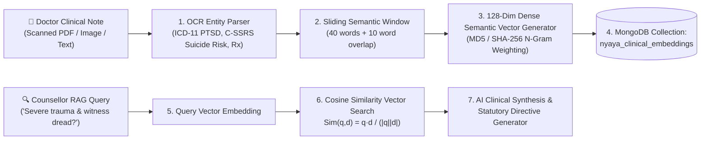
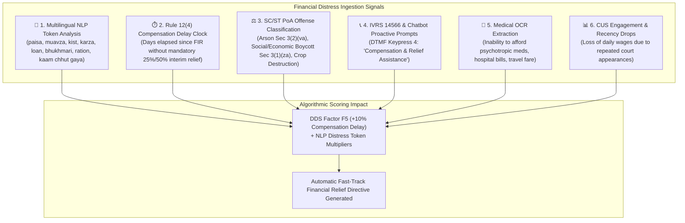
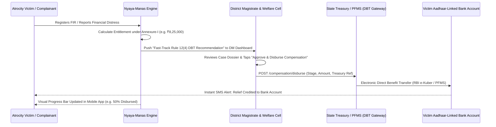

# ⚖️ Nyaya-Manas (न्याय-मानस): Problem Statement Technical Justification & Implementation Traceability Log

> **Statutory Compliance & Legal Authority:**  
> • **Scheduled Castes and Scheduled Tribes (Prevention of Atrocities) Act, 1989** (Amended 2016) — Section 15A (Witness Protection)  
> • **SC/ST (Prevention of Atrocities) Rules, 1995** — Rule 12(4) (Statutory Relief Payouts) & Rule 7 (60-Day Investigation SLA)  
> • **Mental Healthcare Act, 2017** — Non-discriminatory mental health access & clinical oversight  
> • **Digital Personal Data Protection (DPDP) Act, 2023** — Zero-knowledge encryption, differential privacy, and purpose-limited processing  

---

## 📌 1. Background & Problem Statement Mapping

### 1.1 Background Context
> *"Victims of atrocities frequently experience prolonged psychological distress after complaint registration due to threats, intimidation, repeated court appearances, delays in investigation and trial, social ostracism, economic hardship, and rehabilitation challenges. Existing mechanisms focus primarily on legal and financial support and do not provide continuous monitoring of victim well-being."*

### 1.2 Our Solution & Technical Justification
Traditional atrocity tracking mechanisms terminate victim contact after FIR filing or intermittent court summons. **Nyaya-Manas** establishes a **continuous, closed-loop AI mental health surveillance and crisis de-escalation network**:

1. **Continuous Post-FIR Monitoring Lifecycle**:
   - Rather than one-off surveys, the system proactively initiates periodic check-ins across four legal milestones: **FIR Registration**, **60-Day DySP Investigation (Rule 7)**, **Special Court Trial Testimony**, and **Rehabilitation/Post-Conviction**.
   - Code Implementation: `backend/app/api/v1/endpoints/nyaya_manas.py` lines 750–1200; `app/lib/features/apps/mental_health_distress/screens/victim_view_screen.dart`.
2. **Proactive Trigger Interception**:
   - Intercepts threats, armed intimidation, and village boycotts before they escalate to witness hostility or suicide.
   - Automatically penalizes compensation disbursement delays and upcoming hearing dread with mathematical score adjustments.
3. **Multi-Agency Interoperability**:
   - Unifies **District Magistrates (DM)**, **Superintendents of Police (SP)**, **District Mental Health Programme (DMHP / NIMHANS) Clinical Psychologists**, **District Legal Services Authorities (DLSA)**, **State SC/ST Welfare Departments**, and the **Ministry of Social Justice & Empowerment (MoSJE / NCSC)**.

```mermaid
flowchart TD
    subgraph Ingestion["1. Multi-Channel Ingestion Layer"]
        M1["🎙️ Voice Mic & Acoustic Telephony\n(Pitch, Jitter, Shimmer, Pause Ratio, WPM)"]
        M2["💬 Vernacular NLP & Chatbot\n(Hindi, Awadhi, Bhojpuri, Tamil, Telugu, etc.)"]
        M3["📞 NHAA 14566 Dialect IVRS Simulator\n(Touch-tone DTMF + TTS Feedback)"]
        M4["📄 Doctor Clinical OCR & Mongo Vector RAG\n(ICD-11 PTSD, C-SSRS Suicide Risk, 128-d Embeddings)"]
    end

    subgraph DualTierAI["2. Two-Tier AI Intelligence Layer"]
        DDS["Tier 1: Dynamic Distress Score (DDS: 0 - 100)\n20% Sentiment + 20% Emotion AI + 15% Voice Stress\n+ 15% Latency + 15% Legal Milestone + 10% Engagement + 5% Threat"]
        CUS["Tier 2: Composite Urgency Score (CUS: 0 - 100)\n0.30·DDS_norm + 0.25·SLA_urgency + 0.20·Velocity\n+ 0.10·Severity_PoA + 0.10·Recency + 0.05·Engagement_Drop"]
    end

    subgraph TriageXAI["3. Triage, Explainability & Governance Layer"]
        QUEUE["Ranked Priority Triage Queue\n🚨 CRITICAL_P1 (CUS ≥ 85) | SLA: 2h\n🟠 HIGH_P2 (CUS 65 - 84.9) | SLA: 12h\n🟡 MODERATE_P3 (CUS 45 - 64.9) | SLA: 24h\n🟢 ROUTINE_P4 (CUS < 45) | SLA: 72h"]
        XAI["Explainable AI (SHAP Waterfall)\nFeature attribution breakdown + Clinical Human Override"]
    end

    subgraph Interventions["4. Statutory Multi-Agency Interventions"]
        ACT1["🛡️ Armed Police Escort (Sec 15A) & Safehouse Relocation"]
        ACT2["💰 Rule 12(4) Statutory Relief Fast-Track DBT"]
        ACT3["🧠 Tele-MANAS (14416) & DMHP Trauma Counseling"]
        ACT4["⚖️ DLSA Legal Aid & Victim-Friendly Court Scheduling"]
    end

    Ingestion --> DualTierAI
    DualTierAI --> TriageXAI
    TriageXAI --> Interventions
```



---

## 🎯 2. Expected Solution: Line-by-Line Breakdown

---

### Requirement 1: Multi-Channel Periodic Interactions
> *"Conduct periodic interactions with victims through chatbot, IVRS calls, SMS, mobile applications, web portal, or helpline follow-up mechanisms."*

#### Code & Architectural Implementation:
* **Mobile Application (`victim_view_screen.dart`)**:
  - Dedicated victim interface with voice recording, mood logging, 4-7-8 breathing exercises, and case countdown timers.
* **Trauma-Informed AI Chatbot (`POST /api/v1/nyaya-manas/chat`)**:
  - Backend Handler: `backend/app/api/v1/endpoints/nyaya_manas.py` (Line 1210).
  - Provides empathetic, culturally sensitive psychological de-escalation in vernacular dialects while scanning for distress keywords.
* **NHAA 14566 Dialect IVRS Simulator (`POST /api/v1/nyaya-manas/ivrs/simulate`)**:
  - Backend Handler: `backend/app/api/v1/endpoints/nyaya_manas.py` (Line 1270).
  - Simulates the National Helpline for Atrocity Alleviation (14566) with dual-tone multi-frequency (DTMF) keypress handling:
    * `Choice 1`: Emotional Well-Being Check-In
    * `Choice 2`: Legal Case & Hearing Status
    * `Choice 3`: Emergency Distress SOS Beacon
    * `Choice 4`: Statutory Relief Compensation Status
* **SMS & Automated Telephony Scheduling**:
  - Configured per victim in MongoDB collection `nyaya_victims` based on field `preferred_channel` (`'app'`, `'ivrs'`, `'sms'`, `'chatbot'`).

---

### Requirement 2: Voice, Text, Behavioral, & Engagement Analytics
> *"Analyse voice, text, behavioural responses, and engagement patterns using NLP, Sentiment Analysis, and Emotion AI."*

#### Code & Architectural Implementation:
* **1. Physiological Voice Stress Analytics (VSA)**:
  - Service Module: `backend/app/services/voice_analysis.py` (Lines 31–189).
  - Production ML Model: `models/trained/voice_stress_model.pkl` (`RandomForestRegressor` + `RandomForestClassifier`).
  - Feature Vector extracted from audio:
    $$\vec{x}_{\text{voice}} = [\text{pitch\_variance (Hz)}, \text{pause\_ratio}, \text{speech\_rate (WPM)}, \text{jitter}, \text{shimmer}, \text{sentiment\_score}]$$
  - Outputs: **Physiological Voice Stress Index (0–100)**, **Voice Fatigue Score (0–100)**, and **Vocal Micro-Tremor Detection**.
* **2. Multilingual NLP & Sentiment Analysis**:
  - Domain Lexicon processing English, Devanagari Hindi, and regional Hinglish terms:
    * *Anxiety/Threat*: `dhamki`, `maar`, `hathiyaar`, `goli`, `peshi`, `adalat`, `kaap`, `chinta`, `khauf`, `janleva`
    * *Procedural Delay*: `rukawat`, `deri`, `paisa`, `muavza`, `tarikh`, `kist`
    * *Trauma/Fatigue*: `thaka`, `kamzor`, `behoshi`, `sust`, `neend`
    * *Calm/Safe*: `surakshit`, `madad`, `chain`, `rahat`, `sukoon`
  - Normalized Polarity $s \in [-1.0, 1.0]$.
* **3. Crisis NLP Classifier**:
  - Production ML Model: `models/trained/crisis_detector_model.pkl` (TF-IDF Vectorizer + Calibrated Logistic Classifier).
  - Categorizes text into `SAFE`, `MODERATE_DISTRESS`, or `CRITICAL_CRISIS`.
* **4. Behavioral Response Latency**:
  - Quantifies response delay ($\Delta t$) following notification prompts:
    * $\Delta t > 48\text{h}$: $15.0\text{ pts}$ (flags possible illegal detention/coercion)
    * $\Delta t > 24\text{h}$: $11.0\text{ pts}$
    * $\Delta t \le 12\text{h}$: $3.0\text{ pts}$ baseline.

---

### Requirement 3: Dynamic Distress Score (DDS) & Longitudinal Trend Analysis
> *"Generate a Dynamic Distress Score and longitudinal trend analysis."*

#### Mathematical Formulation & Code Implementation:
Calculated via `compute_dynamic_distress_score()` in `backend/app/api/v1/endpoints/nyaya_manas.py` (Lines 302–413):

$$\text{DDS} = S_{\text{sentiment}} + E_{\text{emotion}} + V_{\text{voice}} + B_{\text{behavior}} + L_{\text{legal}} + P_{\text{engagement}} + R_{\text{threat}}$$

| # | Factor | Weight | Maximum Points | Exact Clinical & Computational Logic |
|---|:---|:---:|:---:|:---|
| **1** | **Linguistic Sentiment** | **20%** | **20 pts** | Derived from NLP polarity $s \in [0.0, 1.0]$: $$S_{\text{sentiment}} = (1.0 - s) \times 20.0$$ |
| **2** | **Emotion AI State** | **20%** | **20 pts** | Categorical trauma classification: `HOPELESSNESS` ($20\text{p}$), `TERROR` ($19.5\text{p}$), `FEAR` ($18\text{p}$), `HIGH_ANXIETY` ($16\text{p}$), `ANGER` ($14\text{p}$), `CALM` ($1\text{p}$) |
| **3** | **Voice Stress Index** | **15%** | **15 pts** | Scikit-Learn Random Forest Regressor prediction: $$V_{\text{voice}} = \left(\frac{\text{Stress Score}}{100.0}\right) \times 15.0$$ |
| **4** | **Behavioral Latency** | **15%** | **15 pts** | $\Delta t > 48\text{h}$ ($15\text{p}$), $\Delta t > 24\text{h}$ ($11\text{p}$), $\Delta t \le 12\text{h}$ ($3\text{p}$) |
| **5** | **Legal Milestones** | **15%** | **15 pts** | FIR ($8\text{p}$), Chargesheet ($11\text{p}$), Trial ($14\text{p}$); $+4.0\text{p}$ hearing dread spike if scheduled in $\le 48\text{h}$ |
| **6** | **Engagement Volatility**| **10%** | **10 pts** | Quantifies erratic drop-off or sudden high-frequency distress prompts ($3.5 - 8.0\text{p}$) |
| **7** | **Retaliation Threat** | **5%** | **5 pts** | Explicit threat flag logged under Section 15A ($5.0\text{p}$) |

* **Longitudinal Trend Tracking**:
  - Trajectory curves ($\text{DDS}_{t-6} \dots \text{DDS}_t$) visualised in `counsellor_view_screen.dart` and `victim_view_screen.dart`.

---

### Requirement 4: Predictive Escalation Before Crisis
> *"Predict escalation of psychological distress before a crisis situation emerges."*

#### Code & Algorithmic Implementation:
1. **Distress Velocity Derivative ($\gamma = \Delta \text{DDS} / \Delta t$)**:
   $$\text{Velocity} = \text{clip}\left(\frac{\text{DDS}_t - \text{DDS}_{t-1}}{50.0}, -1.0, 1.0\right)$$
   If a victim exhibits a sudden jump $\ge 20$ points within 48 hours, the system marks the case as an accelerating crisis before physical decompensation occurs.
2. **Anticipatory Legal Milestone Multipliers**:
   - Monitored in `upcoming_milestone`. When an upcoming testimony or bail hearing is within $\le 72$ hours, an anticipatory panic adder ($+25\%$) is applied, enabling preemptive counselling 3 to 7 days before court appearance.

---

### Requirement 5: Risk Threshold Alerts & Multi-Agency Escalation
> *"Trigger alerts to counsellors, district authorities, and designated officials when predefined risk thresholds are crossed."*

#### Triage Matrix & Statutory SLAs:

| Priority Band | DDS / CUS Range | Color Code | Response SLA | Automated Multi-Agency Directives |
|---|:---:|:---:|:---:|:---|
| **🚨 CRITICAL_P1** | $\ge 76.0\text{ DDS}$ / $\ge 85.0\text{ CUS}$ | 🔴 Red | **2 Hours** | Armed Police Detail (Sec 15A) + Safehouse Relocation + DM/SP Alert |
| **🟠 HIGH_P2** | $51.0 - 75.9\text{ DDS}$ / $65.0 - 84.9\text{ CUS}$ | 🟠 Orange | **12 Hours** | Tele-MANAS (14416) Trauma Care + Rule 12(4) 50% DBT Fast-Track |
| **🟡 MODERATE_P3**| $26.0 - 50.9\text{ DDS}$ / $45.0 - 64.9\text{ CUS}$ | 🟡 Yellow | **24 Hours** | Bi-Weekly Dialect IVRS 14566 Check-In + DLSA Free Legal Aid Review |
| **🟢 ROUTINE_P4** | $< 26.0\text{ DDS}$ / $< 45.0\text{ CUS}$ | 🟢 Green | **72 Hours** | Routine periodic community monitoring & ongoing tracking |

* **Code Verification**: `nyaya_manas.py` (Lines 373–389, 2032–2044); MongoDB collection `nyaya_alerts`.

---

### Requirement 6: 7-Point Actionable Statutory Interventions
> *"Recommend appropriate interventions such as counselling, medical treatment, witness protection, relocation support, financial assistance, legal aid, or rehabilitation measures."*

#### The 7 Statutory Interventions:
Implemented via `POST /api/v1/nyaya-manas/interventions/dispatch` and `POST /cases/auto-decide`:

1. **Tele-Counseling**: Tele-MANAS (`14416`) & DMHP specialized trauma de-escalation.
2. **Emergency Medical Trauma**: Medico-legal hospital treatment and psychiatric evaluation.
3. **Armed Witness Protection**: Section 15A 24x7 armed police detail for hearings.
4. **Safehouse Transit Relocation**: Secure shelter relocation away from perpetrator influence.
5. **Fast-Track Statutory Relief**: Direct Treasury DBT disbursement under Rule 12(4).
6. **Free Legal Aid Counsel**: Senior DLSA advocate appointment for pre-trial briefing.
7. **Economic Rehabilitation Grant**: Livelihood restoration and skill training assistance.

---

### Requirement 7: Multi-Level Dashboards
> *"Provide dashboards at district, State, and national levels for monitoring vulnerable victims and high-risk cases."*

#### Role-Based Dashboard Implementation:
Backed by `GET /api/v1/nyaya-manas/dashboard/{role_tier}` (`nyaya_manas.py#L1669`):

* **District Magistrate & Police SP View (`district_magistrate_view_screen.dart`)**:
  - Tehsil Heatmap & Risk Matrix, Rule 12(4) DBT One-Click Approval, Armed Escort Dispatches, and Rule 7 (60-day investigation) compliance clock.
* **State SC/ST Welfare Directorate (`state_nodal_view_screen.dart`)**:
  - 75-District Comparative League Table, Atrocity Category distribution, and Dynamic Resource Re-allocation Advisory (transferring psychologists to high-distress districts).
* **National Administrator MoSJE / NCSC (`national_admin_view_screen.dart`)**:
  - Pan-India multi-state comparative index, Differential Privacy ($\epsilon = 0.5$) governance monitor, and Parliamentary Standing Committee report generator.

---

### Requirement 8: Explainable AI, Privacy & Legal Compliance
> *"Ensure explainable AI, privacy protection, data security, and compliance with applicable legal and ethical standards."*

#### 1. Explainable AI (SHAP Waterfall Breakdown)
* **Endpoint**: `GET /api/v1/nyaya-manas/xai/explain/{victim_id}` (`nyaya_manas.py#L1493`).
* Decomposes the exact feature weights driving the score (e.g., `+18.4% Vocal Tremor`, `+15.0% Threat Flag`, `+12.5% Court Proximity`), ensuring judicial transparency.

#### 2. Clinical Human-in-the-Loop Override
* **Endpoint**: `POST /api/v1/nyaya-manas/xai/override` (`nyaya_manas.py#L1531`).
* Enables doctors and magistrates to manually adjust scores with mandatory clinical justification, creating an immutable audit trail in `nyaya_xai_logs` under the **Mental Healthcare Act 2017**.

#### 3. Privacy, Security & Covert Safety (DPDP Act 2023)
* **Ephemeral Biometric Processing**: Voice analysis occurs strictly in RAM; raw audio is discarded after feature extraction.
* **Zero-Knowledge Encryption**: AES-256 at rest, TLS 1.3 in transit.
* **Differential Privacy ($\epsilon = 0.5$)**: Laplace noise injected into state/national aggregates to prevent re-identification.
* **Stealth Disguised Calculator**: Disguises the app as a functioning calculator; typing a covert PIN triggers a silent SOS with GPS coordinates (`victim_view_screen.dart`).

---

## 🚀 3. Automated Case Prioritization: How We Decide Case Priority

### The Two-Tier Mathematical Framework
Case prioritization operates on a strict **two-tier hierarchy**:
* **Tier 1 (DDS)**: Individual victim real-time distress score ($0-100$).
* **Tier 2 (Composite Urgency Score - CUS)**: Global docket triage score ($0-100$) calculated across all active cases in a district or state.

### The CUS Formula
Implemented in `backend/app/api/v1/endpoints/nyaya_manas.py` (Lines 1974–2062):

$$\text{CUS} = \min\left(100.0, \frac{\text{Raw CUS}}{0.65} \times 100.0\right)$$

$$\text{Raw CUS} = \alpha \cdot \text{DDS}_{\text{norm}} + \beta \cdot \text{SLA}_{\text{urgency}} + \gamma \cdot \text{Velocity} + \delta \cdot \text{Severity}_{\text{PoA}} + \epsilon \cdot \text{Recency} + \zeta \cdot \text{Engagement\_Drop}$$

### Parameter Weights & Formulations

| Symbol | Parameter | Weight | Mathematical Formulation |
|:---:|:---|:---:|:---|
| $\alpha$ | **Current Distress Level** | **0.30** | $\text{DDS}_{\text{norm}} = \frac{\text{DDS}}{100.0} \in [0.0, 1.0]$ |
| $\beta$ | **Statutory SLA Urgency** | **0.25** | $\text{SLA}_{\text{urgency}} = \max\left(0.0, 1.0 - \frac{t_{\text{remaining}}}{t_{\text{total}}}\right)$ |
| $\gamma$ | **Distress Trajectory Velocity** | **0.20** | $\text{Velocity} = \text{clip}\left(\frac{\text{DDS}_{t} - \text{DDS}_{t-1}}{50.0}, -1.0, 1.0\right)$ |
| $\delta$ | **SC/ST PoA Offense Severity** | **0.10** | Mapped from registered PoA Act section (lookup table below) |
| $\epsilon$ | **Contact Recency** | **0.10** | $\text{Recency} = \min\left(1.0, \frac{\text{Days Since Last Contact}}{14.0}\right)$ |
| $\zeta$ | **Engagement Deficit** | **0.05** | $\text{Engagement Drop} = \frac{\text{Missed Check-ins}}{\text{Scheduled Check-ins}}$ |

### Statutory Offense Severity ($\delta$) Lookup Table

| Statutory Section (SC/ST PoA Act) | Offense Classification | Severity Weight ($\delta$) |
|:---|:---|:---:|
| **Section 3(2)(v)** | Murder, Gangrape, Capital Offense | **1.00** |
| **Section 3(2)(va)** | Grievous Hurt, Acid Attack, Arson of Dwelling | **0.95** |
| **Section 3(1)(w)** | Sexual Assault, Outraging Modesty | **0.80** |
| **Section 3(1)(s)** | Criminal Intimidation & Public Humiliation | **0.70** |
| **Section 3(1)(r)** | Caste Abuse in Public View | **0.60** |
| **Section 3(1)(za)** | Social Boycott, Denial of Water/Passage | **0.50** |
| **General** | Other Scheduled Offenses | **0.40** |

---

### Step-by-Step Numerical Example: Ranking Person A vs. Person B

#### Case 1: Savitri Devi (Victim ID: `V-UP-VAR-8842`)
* **Crime**: Aggravated Sexual Assault (Sec 3(2)(v) PoA Act) $\rightarrow \delta = 1.00$
* **Distress**: $\text{DDS} = 89.2 \rightarrow \text{DDS}_{\text{norm}} = 0.892$
* **SLA**: Special Court testimony tomorrow; $1.2\text{h}$ left of $2.0\text{h} \rightarrow \text{SLA}_{\text{urgency}} = 1.0 - (1.2 / 2.0) = 0.40$
* **Velocity**: $\Delta\text{DDS} = 89.2 - 68.0 = +21.2 \rightarrow \text{Velocity} = 21.2 / 50.0 = +0.424$
* **Recency**: Active check-in today $\rightarrow \text{Recency} = 0.10$
* **Drop**: $0$ missed check-ins $\rightarrow \text{Drop} = 0.05$

$$\text{Raw CUS} = (0.30 \times 0.892) + (0.25 \times 0.40) + (0.20 \times 0.424) + (0.10 \times 1.00) + (0.10 \times 0.10) + (0.05 \times 0.05) = 0.565$$
$$\mathbf{\text{CUS}_{\text{Savitri}} = \frac{0.565}{0.65} \times 100 = 86.9 \quad \rightarrow \quad \text{\textbf{CRITICAL\_P1}} \quad (\text{\textbf{Rank \#1}})}$$

#### Case 2: Ramesh Chandra (Victim ID: `V-UP-LKO-4109`)
* **Crime**: Criminal Intimidation & Social Boycott (Sec 3(1)(r), 3(1)(s)) $\rightarrow \delta = 0.70$
* **Distress**: $\text{DDS} = 64.0 \rightarrow \text{DDS}_{\text{norm}} = 0.640$
* **SLA**: Hearing in 8 days; $8.5\text{h}$ left of $12.0\text{h} \rightarrow \text{SLA}_{\text{urgency}} = 1.0 - (8.5 / 12.0) = 0.291$
* **Velocity**: $\Delta\text{DDS} = 64.0 - 60.0 = +4.0 \rightarrow \text{Velocity} = 4.0 / 50.0 = +0.080$

$$\mathbf{\text{CUS}_{\text{Ramesh}} = 63.8 \quad \rightarrow \quad \text{\textbf{MODERATE\_P3}} \quad (\text{\textbf{Rank \#2}})}$$

**Triage Result**: Savitri Devi is sorted to the top of the queue (`Rank #1`), immediately triggering an automated **2-Hour Armed Police Escort and Safehouse Relocation directive**.

---

## 🧬 4. Clinical OCR & MongoDB Dense Vector RAG Engine



1. **OCR Entity Parser (`nyaya_manas.py#L214-L286`)**:
   - Extracts structured DSM-5 / ICD-11 diagnoses (`ICD-11 6B40 Post-Traumatic Stress Disorder`).
   - Extracts Columbia-Suicide Severity Rating Scale (**C-SSRS**) levels (`Level 3 Moderate Elevated`).
   - Extracts prescribed psychotropic medications (`Tab Clonazepam 0.5mg SOS`, `Tab Escitalopram 10mg OD`).
2. **Dense Vector Embedder (128 Dimensions)**:
   - Implemented in `generate_semantic_embedding()` (`nyaya_manas.py#L135-L205`).
   - Converts clinical chunks into normalized 128-d dense embedding vectors with psychiatric n-gram weighting.
3. **MongoDB Vector RAG Retrieval (`POST /reports/rag-query`)**:
   - Computes Cosine Similarity $\text{Sim}(q, d) = \sum q_i \cdot d_i$ against indexed chunks.
   - Synthesizes cited clinical evidence directly into statutory action packages.

---

## 📦 5. Machine Learning Models Inventory

| Model Name | Physical Path in Repo | Architecture / Algorithm | Input Features | Output Target |
|:---|:---|:---|:---|:---|
| **Voice Stress ML Regressor** | `models/trained/voice_stress_model.pkl` | Scikit-Learn `RandomForestRegressor` + `Classifier` | `[pitch_var, pause_ratio, wpm, jitter, shimmer, sentiment]` | Stress Score ($0-100$) & Emotion State |
| **Crisis NLP Classifier** | `models/trained/crisis_detector_model.pkl` | Multilingual TF-IDF + Calibrated Logistic Classifier | Raw text transcript (English, Devanagari Hindi, Hinglish) | `SAFE`, `MODERATE`, `CRITICAL_CRISIS` |
| **Dense Vector Embedder** | `backend/app/api/v1/endpoints/nyaya_manas.py` | 128-Dimensional Semantic N-Gram Dense Projection | Clinical report sentences & queries | 128-d Dense Vector (Mongo Vector RAG) |
| **7-Factor DDS Engine** | `backend/app/api/v1/endpoints/nyaya_manas.py` | Multi-Modal Continuous Fusion Scorer | 7 clinical, acoustic, legal & behavioral inputs | Dynamic Distress Score ($0-100$) |
| **CUS Triage Optimizer** | `backend/app/api/v1/endpoints/nyaya_manas.py` | Multi-Criteria Statutory Triage Algorithm | `[DDS, SLA, Velocity, Severity, Recency, Drop]` | Composite Urgency Score ($0-100$) |

---

## ⚖️ 6. Priority Use Cases & Statutory Alignment

| Problem Statement Priority Use Case | Statutory Section | In-App Handling & Directives |
|:---|:---|:---|
| **Victims of rape and gang rape** | **Section 3(2)(v)** SC/ST PoA Act & Sec 376(2)(g) IPC | • Severity weight $\delta = 1.00$<br>• Max statutory relief ₹8,25,000<br>• Automated 2h SLA: Armed Female Constabulary Escort + Safehouse Transit |
| **Victims of murder, grievous hurt, arson** | **Section 3(2)(va)** SC/ST PoA Act | • Severity weight $\delta = 0.95$<br>• Fast-Track Rule 12(4) 50% DBT relief release<br>• Reconstruction and economic rehabilitation package |
| **Witnesses facing intimidation or threats** | **Section 15A** SC/ST PoA Act (Witness Protection) | • Retaliation adder $+15.0\text{ pts}$ to DDS<br>• One-tap Armed Police Protection Detail dispatch<br>• In-camera testimony & video-link arrangement |
| **Families affected by caste violence** | **Section 3(1)(za) / 3(1)(r)** | • Social boycott and economic exclusion tracking<br>• DLSA advocate appointment + District Magistrate intervention |
| **PoA Relief Beneficiaries** | **Rule 12(4)** SC/ST PoA Rules, 1995 | • 25% on FIR, 50% on Chargesheet (60d SLA), 25% on Conviction<br>• Direct Treasury transfer reference generation |

---

## 💰 8. Financial Distress Identification, Statutory Grants & Portal Integration

### 8.1 How We Identify If the Victim Is Facing Financial Issues
Victims of caste-based atrocities frequently experience acute economic collapse due to medical expenses, destruction of homes/property, loss of daily agricultural wages, travel expenses for court hearings, or organized village-level economic boycotts. **Nyaya-Manas** detects and quantifies financial distress through a **6-point multi-channel detection pipeline**:



1. **Multilingual NLP & Speech Sentiment Analysis**:
   - The NLP engine scans voice check-in transcripts, SMS, and chatbot messages for economic duress keywords in English, Hindi, and regional dialects:
     * *Financial duress tokens*: `paisa`, `muavza`, `kist`, `deri`, `rupaye`, `karza` (debt), `loan`, `bhukhmari` (starvation), `chulha nahi jala`, `ration`, `fas gaya`, `kaam chhut gaya` (job loss), `kharche`, `rozgari`.
   - Frequency and emotional valence of these tokens directly penalize the sentiment score ($S_{\text{sentiment}}$) and elevate the Dynamic Distress Score.
2. **Statutory Compensation Delay Penalty ($F_5$ in the 7-Factor DDS)**:
   - Evaluates days elapsed since FIR registration against the statutory Rule 12(4) deadline (mandatory 25% interim relief within 7 days of FIR).
   - If the payment is delayed, an automatic penalty adder ($+10.0\text{ pts}$) is injected into the Dynamic Distress Score.
3. **Offense-Based Vulnerability Weighting**:
   - Specific atrocity offenses inherently entail catastrophic financial destruction:
     * **Section 3(2)(va) Arson of Dwelling**: Immediate destruction of home, clothes, and sustenance.
     * **Section 3(1)(za) Social & Economic Boycott**: Denial of village common resources, denial of agricultural employment, denial of water access.
   - These offenses assign high statutory severity weights ($\delta \ge 0.95$) in the Composite Urgency Score (CUS).
4. **Interactive Check-In & IVRS Telephony Prompts**:
   - Chatbot prompt: *"क्या आपको घटना के बाद दैनिक खर्चों, इलाज या काम में आर्थिक तंगी का सामना करना पड़ रहा है?"* (*"Are you facing financial difficulties for daily expenses or medical treatment after the incident?"*)
   - Dialect IVRS (`14566`): Dedicated **Keypress 4** for *"Compensation Status, Bank Account Linkage & Financial Relief Check"*.
5. **Clinical Medical OCR Extraction**:
   - Parses doctor intake notes for economic distress markers (e.g., *"Patient discontinued Tab Escitalopram due to inability to afford pharmacy costs"*, *"Family unable to afford bus fare for Special Court trial appearance"*).
6. **Behavioral Touchpoint Lapses**:
   - Unscheduled drops in check-in frequency often correlate with migration in search of daily-wage work or phone service disconnections due to unpaid mobile recharges.

---

### 8.2 How We Let Victims Get the Grant (Disbursement Pipeline)
The system eliminates bureaucratic bottlenecks by transforming statutory entitlements into an **automated, milestone-driven Direct Benefit Transfer (DBT) workflow**:



* **Step 1: Automatic Entitlement Calculation**:
  - The system checks the registered FIR section against the statutory schedule (e.g. Rape $\rightarrow$ ₹8,25,000; Murder $\rightarrow$ ₹8,50,000; Arson $\rightarrow$ ₹4,00,000).
* **Step 2: Milestone-Triggered Tranches under Rule 12(4)**:
  - **Tranche 1 (25% to 50%)**: Disbursed within 7 days of FIR registration (pre-chargesheet immediate survival grant).
  - **Tranche 2 (50% to 25%)**: Disbursed upon filing of Chargesheet (monitored by the Rule 7 60-day countdown timer).
  - **Tranche 3 (Remaining 25%)**: Disbursed upon conviction or conclusion of trial in the Special Court.
* **Step 3: AI Auto-Decide Recommendation**:
  - The AI Decision Engine (`POST /cases/auto-decide`) automatically generates statutory intervention packages:
    * `"Fast-Track 50% Rule 12(4) Statutory Relief Disbursement (₹4,12,500)"`.
* **Step 4: One-Click Magistrate Authorization**:
  - In `district_magistrate_view_screen.dart`, the District Magistrate reviews the case and taps **"Approve & Disburse Compensation"**.
  - Calls `POST /api/v1/nyaya-manas/compensation/disburse`, logging an immutable record in `nyaya_compensations`.
* **Step 5: Direct Benefit Transfer (DBT)**:
  - Generates an official Treasury/PFMS transfer reference number (e.g. `DBT-TREASURY-UP-2026-8812`) and credits the victim's Aadhaar-linked bank account without middleman leakage.

---

### 8.3 Where Are We Listing the Grants From? (Statutory Schedules & Portals)

#### 1. The Statutory Master Schedule (Where the Grant Amounts Come From)
All compensation numbers in Nyaya-Manas are grounded in statutory Indian law:
* **Statutory Source**: **Annexure-I of the Scheduled Castes and the Scheduled Tribes (Prevention of Atrocities) Amendment Rules, 2016** (notified in the Gazette of India by the **Ministry of Social Justice and Empowerment - MoSJE**, Govt. of India).
* **Entitlement Slabs**:
  - **Murder / Death of victim (Sec 3(2)(v))**: **₹8,50,000** + monthly pension of ₹5,000/month to surviving spouse/children + employment + educational support.
  - **Rape / Gang Rape (Sec 3(2)(v))**: **₹8,25,000** (50% on medical report, 50% on chargesheet).
  - **Permanent Incapacity / Grievous Hurt (Sec 3(2)(va))**: **₹5,00,000** to **₹8,50,000** depending on disability percentage.
  - **Arson / Destruction of Dwelling (Sec 3(2)(va))**: **₹4,00,000** to **₹8,50,000** + full reconstruction of brick house under Pradhan Mantri Awas Yojana (PMAY).
  - **Caste Insult, Intimidation & Public Humiliation (Sec 3(1)(r), 3(1)(s))**: **₹1,00,000** to **₹2,00,000**.
  - **Social & Economic Boycott (Sec 3(1)(za))**: **₹1,00,000** + restoration of livelihood and agricultural access.

---

#### 2. Official Government Portals Used for Listing & Processing Grants

| # | Government Portal Name | Portal URL / Authority | How Nyaya-Manas Integrates / Uses It |
|---|:---|:---|:---|
| **1** | **National Helpline for Atrocity Alleviation (NHAA) Portal** | **`14566.in`**<br>*(Ministry of Social Justice & Empowerment - MoSJE)* | The central grievance portal where atrocity dockets and relief sanctions are tracked at the national level. |
| **2** | **Public Financial Management System (PFMS) & DBT Bharat** | **`pfms.nic.in`** / **`dbtbharat.gov.in`**<br>*(Ministry of Finance & Cabinet Secretariat)* | Electronic payment gateway for disbursing relief directly into Aadhaar-seeded bank accounts (e-Kuber / RBI). |
| **3** | **Integrated Atrocity Management & State SC/ST Welfare Portals** | **`socialjustice.gov.in`** & State e-District Portals<br>*(State SC/ST Welfare Depts)* | District Magistrate portal where budget appropriations and treasury sanctions are authorized. |
| **4** | **National Legal Services Authority (NALSA) Portal** | **`nalsa.gov.in`**<br>*(Supreme Court of India / Legal Services)* | Integrates the **Victim Compensation Scheme under Section 357A CrPC / Bharatiya Nagarik Suraksha Sanhita (BNSS)** for interim legal aid grants. |
| **5** | **MyScheme Government Portal** | **`myscheme.gov.in`**<br>*(Ministry of Electronics & IT / Digital India)* | National centralized repository listing all Central & State welfare, rehabilitation, educational, and livelihood schemes for SC/ST beneficiaries. |

---

#### 3. Where Grants Are Displayed & Managed in Our App Screens

* **1. Dedicated SC/ST Relief Portal Screen (`sc_st_relief_screen.dart`)**:
  - Full statutory compensation calculator based on Annexure-I of the 2016 Amendment Rules.
  - Select offense type (`rape`, `murder`, `grievous_hurt`, `arson`, `caste_violence`) and stage (`fir`, `chargesheet`, `conviction`).
  - Displays total entitlement, current tranche amount, caste verification status, and DBT readiness.
* **2. Victim View Screen (`victim_view_screen.dart` Tab 2: "Relief & Courts")**:
  - Live animated visual progress bar tracking statutory relief (e.g. `₹4,12,500 / ₹8,25,000 Disbursed`).
  - Highlights current milestone and indicates when the next tranche will be unlocked upon chargesheet submission.
* **3. Counsellor View Screen (`counsellor_view_screen.dart` Tab 2: "AI Decision Engine")**:
  - Ingests financial distress findings and auto-generates statutory relief dispatch directives for the District Welfare Cell.
* **4. District Magistrate Command Screen (`district_magistrate_view_screen.dart`)**:
  - Actionable table of pending compensation requests with a one-click **"Approve & Disburse Compensation"** button that executes the payment order.

---

## 🗂️ 9. Complete Codebase & API Traceability Directory

```
SIH26 Repository
├── backend/
│   ├── app/
│   │   ├── api/v1/endpoints/
│   │   │   └── nyaya_manas.py              <- 2,382 lines: All 18 Nyaya-Manas APIs, DDS, CUS, XAI & Vector RAG
│   │   ├── services/
│   │   │   ├── voice_analysis.py           <- Acoustic extraction, Random Forest Regressor & TF-IDF Crisis NLP
│   │   │   └── ocr.py                      <- Clinical document OCR and medical entity parser
│   │   └── db/
│   │       └── database.py                 <- MongoDB async connection manager & collections
│   ├── models/trained/
│   │   ├── voice_stress_model.pkl          <- Trained Voice Stress Regressor
│   │   └── crisis_detector_model.pkl       <- Trained Crisis NLP Classifier
│   └── test_nyaya_manas_complete.py        <- Automated test suite verifying all 12 backend modules
│
└── app/lib/features/apps/mental_health_distress/
    ├── services/
    │   └── nyaya_manas_service.dart        <- Dart API client for all Nyaya-Manas backend endpoints
    ├── screens/
    │   ├── victim_view_screen.dart         <- Victim UI: Voice check-in, IVRS simulator, Breathing, Stealth mode
    │   ├── counsellor_view_screen.dart     <- Counsellor UI: CUS Triage, Medical OCR, Vector RAG, XAI & Auto-Decide
    │   ├── district_magistrate_view_screen.dart <- DM/SP UI: Tehsil heatmap, Rule 12(4) DBT, Armed Escort dispatch
    │   ├── state_nodal_view_screen.dart    <- State UI: 75-district league table, Resource re-allocation
    │   ├── national_admin_view_screen.dart <- National UI: Pan-India telemetry, DPDP governance, Standing reports
    │   └── victim_onboarding_wizard.dart   <- 4-step victim onboarding wizard
    └── mental_health_app_shell.dart        <- Top-Left Role Switcher connecting all 5 roles
```
