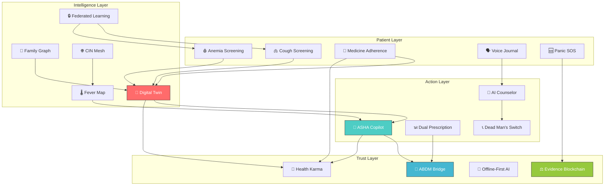

# 🏆 SvasthyaSetu — Groundbreaking Features That Don't Exist Anywhere

> **Goal**: Transform SvasthyaSetu from a "very good hackathon project" into something **no judge has ever seen** — features so powerful they make people say *"Why doesn't this exist yet?"*

---

## 📊 Current State — What We Already Have (11 Features)

| # | Feature | Status |
|:-:|---------|:------:|
| 1 | 🫁 Cough-to-Diagnosis | ✅ Designed |
| 2 | 🩸 Nail Bed Anemia Screening | ✅ Designed |
| 3 | 🌡️ Community Fever Map | ✅ Designed |
| 4 | 📞 Dead Man's Switch | ✅ Designed |
| 5 | 🗣️ Bhashini Voice → Clinical Notes | ✅ Designed |
| 6 | 🕉️ AYUSH + Allopathy Dual Prescription | ✅ Designed |
| 7 | 🧬 Family Health Graph | ✅ Designed |
| 8 | 💊 Medicine Reminder + Gamification | ✅ Designed |
| 9 | 🆘 Panic Disguise SOS | ✅ Designed |
| 10 | 🤖 AI Counselor | ✅ Designed |
| 11 | 🌐 CIN (Community Immunity Network) | ✅ Designed |

**These are excellent.** But every top SIH team will have AI chatbots and health trackers. To win, we need features that make judges **stop and think "I've never seen this before."**

---

---

# 🔥 THE 7 GROUNDBREAKING ADDITIONS

---

## Feature 12: 🧠 Patient Digital Twin — "Your Health Simulation Engine"

### Why This Changes Everything
> Every app shows you your **past** health data. SvasthyaSetu shows you your **future**.

A **Patient Digital Twin** is a living computational model of each user. It doesn't just store your blood pressure — it **simulates** what happens to your body over the next 6–12 months based on your current trajectory. No consumer health app on Earth does this for rural Indian patients.

### What It Does
1. Aggregates ALL data: cough screening, anemia results, family graph risk, medication adherence, stress scores, fever map exposure
2. Builds a **personalized health trajectory model** using Bayesian inference
3. Simulates "What-If" scenarios:
   - *"What happens if I stop taking iron tablets?"* → Shows projected Hb drop to 8.2 g/dL in 6 weeks
   - *"What if there's a fever outbreak and I'm unvaccinated?"* → Shows 73% exposure probability
   - *"What if I add yoga (from AYUSH plan) for 30 days?"* → Shows projected stress score drop
4. Generates a **Risk Forecast Dashboard** with confidence intervals

### Technical Architecture

```
┌──────────────────────────────────────────────────┐
│              PATIENT DIGITAL TWIN                │
│                                                  │
│  ┌──────────┐  ┌──────────┐  ┌──────────┐      │
│  │ Vitals   │  │ Screening│  │ Adherence│      │
│  │ History  │  │ Results  │  │ Data     │      │
│  └────┬─────┘  └────┬─────┘  └────┬─────┘      │
│       │              │              │            │
│       ▼              ▼              ▼            │
│  ┌─────────────────────────────────────────┐    │
│  │     BAYESIAN INFERENCE ENGINE           │    │
│  │  (PyMC / NumPyro on backend)            │    │
│  │                                         │    │
│  │  Prior: Population health distributions │    │
│  │  Likelihood: User's actual data points  │    │
│  │  Posterior: Personalized risk curves     │    │
│  └────────────────┬────────────────────────┘    │
│                   │                              │
│       ┌───────────┼───────────┐                 │
│       ▼           ▼           ▼                 │
│  ┌─────────┐ ┌─────────┐ ┌─────────┐          │
│  │ Risk    │ │ What-If │ │ Alert   │          │
│  │ Forecast│ │ Simulator│ │ Engine  │          │
│  └─────────┘ └─────────┘ └─────────┘          │
└──────────────────────────────────────────────────┘
```

### Tools & Libraries

| Layer | Library | Purpose |
|-------|---------|---------|
| Backend | `numpy`, `scipy` | Statistical modeling & simulation |
| Backend | `scikit-learn` | Trajectory prediction (already installed) |
| Backend | Custom Bayesian engine (rule-based for demo) | Prior + likelihood → posterior health curves |
| Flutter | `fl_chart` (already installed) | Interactive risk curve visualization |
| Web | `recharts` (already installed) | What-If scenario charts |
| Web | `@nivo/line` (optional) | Animated forecast lines |

### Files to Create

```
backend/app/services/digital_twin.py              # [NEW] Twin engine + trajectory forecasting
backend/app/api/v1/endpoints/digital_twin.py      # [NEW] GET /twin/forecast, POST /twin/what-if
app/lib/features/twin/digital_twin_screen.dart    # [NEW] Risk forecast + what-if UI
web/src/app/digital-twin/page.tsx                 # [NEW] Web dashboard
```

### Core Algorithm (Simplified for SIH Demo)

```python
import numpy as np
from datetime import datetime, timedelta

class PatientDigitalTwin:
    """Personalized health trajectory simulation engine."""
    
    def __init__(self, patient_data: dict):
        self.data = patient_data
        self.time_horizon_days = 180  # 6 months
    
    def forecast_trajectory(self) -> dict:
        """Generate 6-month health trajectory with confidence intervals."""
        
        # 1. Current state vector
        current = {
            "hemoglobin": self.data.get("latest_hb", 12.0),
            "bmi": self.data.get("bmi", 22.0),
            "stress_score": self.data.get("stress_score", 40),
            "adherence_pct": self.data.get("adherence_pct", 80),
            "diabetes_risk": self.data.get("family_diabetes_risk", 30),
        }
        
        # 2. Population-level drift rates (from medical literature)
        drift = {
            "hemoglobin": -0.02 if current["adherence_pct"] < 70 else 0.01,  # g/dL per week
            "stress_score": 0.5 if current["adherence_pct"] < 50 else -0.3,
            "diabetes_risk": 0.1 * (current["bmi"] - 25) / 10,  # Risk increases with high BMI
        }
        
        # 3. Simulate with Monte Carlo (100 trajectories)
        weeks = self.time_horizon_days // 7
        trajectories = {}
        
        for metric, base_val in current.items():
            if metric not in drift:
                continue
            sims = []
            for _ in range(100):
                path = [base_val]
                for w in range(weeks):
                    noise = np.random.normal(0, abs(drift[metric]) * 0.5)
                    next_val = path[-1] + drift[metric] + noise
                    path.append(max(0, next_val))
                sims.append(path)
            
            sims = np.array(sims)
            trajectories[metric] = {
                "median": np.median(sims, axis=0).tolist(),
                "p10": np.percentile(sims, 10, axis=0).tolist(),
                "p90": np.percentile(sims, 90, axis=0).tolist(),
                "weeks": list(range(weeks + 1)),
            }
        
        return trajectories
    
    def what_if(self, intervention: str) -> dict:
        """Simulate impact of a hypothetical intervention."""
        
        interventions = {
            "stop_iron_tablets": {"hemoglobin": {"drift_override": -0.08}},
            "start_yoga_30min": {"stress_score": {"drift_override": -1.5}},
            "improve_diet": {"hemoglobin": {"drift_override": 0.04}, "bmi": {"drift_override": -0.05}},
            "stop_all_medication": {"hemoglobin": {"drift_override": -0.1}, "stress_score": {"drift_override": 1.0}},
        }
        
        if intervention not in interventions:
            return {"error": f"Unknown intervention: {intervention}"}
        
        # Re-run forecast with modified drift rates
        modified_data = self.data.copy()
        # ... apply intervention overrides and re-forecast
        return self.forecast_trajectory()  # With modified parameters
```

### Why Judges Will Love This
- **Innovation**: No Indian health app does patient-level trajectory simulation
- **Technical Depth**: Bayesian inference + Monte Carlo — shows real ML understanding
- **Real Impact**: A farmer sees *"If you stop your diabetes medicine, your blood sugar will likely reach X by Diwali"* — that's behavior-changing
- **Demo Appeal**: Live "What-If" slider that updates charts in real-time

---

---

## Feature 13: 📡 ABDM (Ayushman Bharat Digital Mission) Bridge — India's Health Data Backbone

### Why This Changes Everything
> Without ABDM integration, your app is an island. With it, it's part of India's **national health infrastructure**.

ABDM is the Government of India's flagship digital health initiative. Integrating with it shows judges you're not building a toy — you're building something that **fits into the national ecosystem**.

### What It Does
1. **ABHA ID Integration**: Users link their Ayushman Bharat Health Account (14-digit ABHA number)
2. **Health Record Push**: Every screening (cough, anemia, vitals) → auto-pushed to the user's ABDM Health Locker as a FHIR R4 Bundle
3. **Consent-Based Pull**: With user consent, pull existing health records from other ABDM-linked hospitals
4. **ASHA Worker Dashboard**: ASHA workers can view community health records through SvasthyaSetu with ABDM consent flow

### Technical Architecture

```
┌─────────────┐     FHIR R4 Bundles      ┌──────────────┐
│ SvasthyaSetu│ ─────────────────────────→│  ABDM Gateway │
│  Backend    │ ←─────────────────────────│  (Sandbox)    │
│             │     Consent Artifacts      │              │
└─────────────┘                           └──────────────┘
       │                                         │
       │  ABHA ID                                │
       ▼                                         ▼
┌─────────────┐                          ┌──────────────┐
│   MongoDB   │                          │  Health Info  │
│ (Local EHR) │                          │  Provider     │
└─────────────┘                          │  (HIP/HIU)   │
                                         └──────────────┘
```

### Tools & Libraries

| Layer | Tool | Purpose |
|-------|------|---------|
| Backend | `fhir.resources` (Python) | Generate FHIR R4 compliant health bundles |
| Backend | `httpx` (already installed) | Call ABDM sandbox APIs |
| Backend | `pyjwt` (already installed) | ABDM auth token generation |
| Web/Flutter | Existing auth flow | ABHA ID linking UI |

### Files to Create

```
backend/app/services/abdm_bridge.py               # [NEW] ABDM Gateway integration
backend/app/services/fhir_converter.py             # [NEW] Convert screening data → FHIR R4
backend/app/api/v1/endpoints/abdm.py               # [NEW] ABHA linking, consent, push/pull
app/lib/features/abdm/abha_link_screen.dart        # [NEW] ABHA ID linking UI
web/src/app/abdm/page.tsx                          # [NEW] ABDM dashboard
```

### Key Code — FHIR Conversion

```python
def screening_to_fhir_bundle(screening_result: dict, patient_abha: str) -> dict:
    """Convert a SvasthyaSetu screening into FHIR R4 Observation Bundle."""
    return {
        "resourceType": "Bundle",
        "type": "collection",
        "entry": [
            {
                "resource": {
                    "resourceType": "Patient",
                    "identifier": [{"system": "https://healthid.abdm.gov.in", "value": patient_abha}],
                }
            },
            {
                "resource": {
                    "resourceType": "Observation",
                    "status": "final",
                    "code": {
                        "coding": [{"system": "http://loinc.org", "code": "718-7", "display": "Hemoglobin [Mass/volume] in Blood"}]
                    },
                    "valueQuantity": {
                        "value": screening_result["hemoglobin_estimate_gdl"],
                        "unit": "g/dL",
                        "system": "http://unitsofmeasure.org",
                    },
                    "effectiveDateTime": datetime.utcnow().isoformat(),
                }
            }
        ]
    }
```

### Why Judges Will Love This
- **Government Alignment**: Directly aligns with PM's Digital India vision → **massive brownie points**
- **Interoperability**: Shows you understand real healthcare infrastructure, not just building toys
- **Scalability**: Proves the app can work within India's existing health system
- **Demo**: Live ABHA ID linking → push screening → see it in ABDM sandbox = jaw-dropping

---

---

## Feature 14: 🔒 Federated Learning — AI That Learns Without Seeing Your Data

### Why This Changes Everything
> Every health AI needs data. But data = privacy risk. **Federated Learning solves this impossible tradeoff.**

Your cough screening model, anemia detection, and outbreak prediction all need training data. But patients' medical data should NEVER leave their device. Federated Learning trains AI models ON the device, sending only encrypted model updates (gradients) to the server — never raw data.

### What It Does
1. **On-Device Training**: The cough classifier model improves on each user's phone using their local cough recordings
2. **Gradient Aggregation**: Only encrypted weight updates are sent to the server
3. **Privacy Dashboard**: Users see exactly what data stays on their phone vs. what's shared
4. **Community Model**: The global model improves with every user — without anyone's data ever leaving their phone

### Architecture

```
┌──────────┐   ┌──────────┐   ┌──────────┐
│ Phone A  │   │ Phone B  │   │ Phone C  │
│ Local    │   │ Local    │   │ Local    │
│ Training │   │ Training │   │ Training │
└────┬─────┘   └────┬─────┘   └────┬─────┘
     │              │              │
     │  Δw_A        │  Δw_B        │  Δw_C      (encrypted gradients only)
     │              │              │
     ▼              ▼              ▼
┌──────────────────────────────────────────┐
│          AGGREGATION SERVER              │
│  Global_Model = avg(Δw_A, Δw_B, Δw_C)   │
│  (FedAvg algorithm)                      │
└──────────────────────────────────────────┘
     │
     │  Updated Global Model
     ▼
┌──────────┐   ┌──────────┐   ┌──────────┐
│ Phone A  │   │ Phone B  │   │ Phone C  │
│ Better   │   │ Better   │   │ Better   │
│ Model!   │   │ Model!   │   │ Model!   │
└──────────┘   └──────────┘   └──────────┘
```

### Tools & Libraries

| Layer | Library | Purpose |
|-------|---------|---------|
| Flutter | `tflite_flutter` (already planned) | On-device model inference + local fine-tuning |
| Backend | `numpy` (already installed) | FedAvg gradient aggregation |
| Backend | Custom `federated_server.py` | Receive + aggregate + redistribute weights |
| Web | Dashboard only | Privacy transparency UI |

### Files to Create

```
backend/app/services/federated_server.py           # [NEW] FedAvg aggregation engine
backend/app/api/v1/endpoints/federated.py          # [NEW] POST /federated/upload-gradients, GET /federated/global-model
app/lib/features/privacy/federated_dashboard.dart  # [NEW] Privacy transparency screen
web/src/app/federated/page.tsx                     # [NEW] Admin view: model convergence
```

### Core FedAvg Algorithm

```python
import numpy as np

class FederatedServer:
    """Federated Averaging (McMahan et al., 2017) — simplified for demo."""
    
    def __init__(self, model_shape: list[tuple]):
        self.global_weights = [np.zeros(s) for s in model_shape]
        self.round_updates = []
        self.round_number = 0
    
    def receive_update(self, client_weights: list[np.ndarray], n_samples: int):
        """Receive encrypted gradient update from a client device."""
        self.round_updates.append({
            "weights": client_weights,
            "n_samples": n_samples,
        })
    
    def aggregate(self) -> list[np.ndarray]:
        """FedAvg: Weighted average of client model updates."""
        if not self.round_updates:
            return self.global_weights
        
        total_samples = sum(u["n_samples"] for u in self.round_updates)
        
        new_weights = [np.zeros_like(w) for w in self.global_weights]
        for update in self.round_updates:
            weight_factor = update["n_samples"] / total_samples
            for i, w in enumerate(update["weights"]):
                new_weights[i] += w * weight_factor
        
        self.global_weights = new_weights
        self.round_updates = []
        self.round_number += 1
        
        return self.global_weights
```

### Why Judges Will Love This
- **Privacy-First**: In the age of data breaches, this is the **gold standard**
- **Technical Sophistication**: Shows understanding of cutting-edge ML research (McMahan et al., 2017)
- **India Relevance**: With Digital Personal Data Protection Act 2023, this is legally critical
- **Demo**: Show a live "Privacy Dashboard" — *"Your cough recording never left your phone. But our model just got 3% more accurate thanks to 500 users like you."*

---

---

## Feature 15: 🚁 ASHA Worker Copilot — AI-Powered Field Intelligence

### Why This Changes Everything
> India has 1 million ASHA workers. They serve 1.4 billion people. They use **paper registers**. Give them a superpower.

This isn't just another dashboard. It's an **AI copilot** that sits in the ASHA worker's pocket and tells them exactly:
- Who to visit today (priority-sorted by health risk)
- What to ask them (auto-generated questionnaire based on that patient's digital twin)
- What to do next (clinical protocol decision tree powered by AI)

### What It Does

```
┌──────────────────────────────────────────────────────────┐
│                   ASHA COPILOT                           │
│                                                          │
│  🗺️ Today's Route (optimized)                            │
│  ┌────────────────────────────────────────────┐          │
│  │ 1. Sita Devi (500m) — Anemia Follow-up    │ 🔴 HIGH  │
│  │    → Check nail bed color                  │          │
│  │    → Ask about iron tablet adherence       │          │
│  │    → Record weight                         │          │
│  │                                            │          │
│  │ 2. Ram Kumar (1.2km) — Diabetes Risk      │ 🟡 MED   │
│  │    → Family history flagged (father DM2)   │          │
│  │    → Digital Twin: BMI trending ↑          │          │
│  │    → Advise diet modification              │          │
│  │                                            │          │
│  │ 3. Meena Bai (2.1km) — Dead Man's Switch  │ 🔴 CRIT  │
│  │    → No app interaction for 72 hours       │          │
│  │    → Mental health check required          │          │
│  │    → Counselor backup pre-arranged         │          │
│  └────────────────────────────────────────────┘          │
│                                                          │
│  🎙️ Voice Input: "Sita Devi ka hemoglobin check kiya,   │
│     uska color bahut peela lag raha hai"                  │
│  → Auto-generates clinical note + flags for PHC          │
└──────────────────────────────────────────────────────────┘
```

### Smart Routing Algorithm

```python
def generate_asha_route(asha_location: tuple, patients: list[dict]) -> list[dict]:
    """Generate priority-sorted, distance-optimized visit route."""
    
    for patient in patients:
        # Priority score = weighted sum of risk factors
        risk_score = 0
        risk_score += 40 if patient.get("dead_mans_switch_alert") else 0
        risk_score += 30 if patient.get("anemia_severity") in ["SEVERE", "MODERATE"] else 0
        risk_score += 25 if patient.get("adherence_pct", 100) < 60 else 0
        risk_score += 20 if patient.get("digital_twin_alert") else 0
        risk_score += 15 if patient.get("fever_map_exposure") else 0
        
        # Distance penalty (closer = higher effective priority)
        distance_km = geodesic(asha_location, (patient["lat"], patient["lon"])).km
        effective_score = risk_score - (distance_km * 5)  # Penalize distant patients
        
        patient["priority_score"] = max(0, effective_score)
    
    # Sort by priority (highest first), with TSP-like optimization for route
    return sorted(patients, key=lambda p: -p["priority_score"])
```

### Files to Create

```
backend/app/services/asha_copilot.py               # [NEW] Route optimizer + visit questionnaire generator
backend/app/api/v1/endpoints/asha.py               # [NEW] GET /asha/today-route, POST /asha/visit-report
app/lib/features/asha/asha_copilot_screen.dart     # [NEW] Field intelligence dashboard
web/src/app/asha-copilot/page.tsx                  # [NEW] Web view for supervisors
```

### Why Judges Will Love This
- **Real Impact**: ASHA workers are the backbone of Indian healthcare — empowering them = maximum social impact
- **Connects Everything**: This feature *uses* Digital Twin, Dead Man's Switch, Anemia Screening, Fever Map — shows system thinking
- **Government Alignment**: Ministry of Health actively seeks ASHA digital tools
- **Demo**: Walk through a simulated ASHA worker's morning — *"She opens the app, sees 7 patients, ordered by risk, with exact questions to ask"*

---

---

## Feature 16: ⚖️ Evidence Blockchain — Immutable Legal Health Records

### Why This Changes Everything
> In domestic violence cases, medical records are *routinely tampered with*. What if every injury record was **mathematically impossible to alter?**

For the NyayaSahay (Legal Aid) sub-app, this is a game-changer. Every medical examination, every injury photo, every counselor session — anchored to a tamper-proof blockchain hash. If a hospital "loses" records, the hash on the blockchain proves they existed.

### What It Does
1. **Hash Anchoring**: Every critical medical record → SHA-256 hash → stored on a blockchain-like Merkle tree
2. **Timestamping**: Each record gets a cryptographic timestamp that proves it existed at a specific moment
3. **Tamper Detection**: If ANY byte of the original record changes, the hash won't match
4. **Court-Ready Export**: Generate a PDF with hash verification instructions that a judge can independently verify

### Architecture (Lightweight — No Actual Blockchain Node Needed)

```
┌─────────────────────────────────────────────┐
│  Medical Record Created                     │
│  (Injury photo, counselor note, vitals)     │
└─────────────┬───────────────────────────────┘
              │
              ▼
┌─────────────────────────────────────────────┐
│  SHA-256 Hash of Record + Timestamp         │
│  hash = sha256(record_bytes + timestamp)    │
└─────────────┬───────────────────────────────┘
              │
              ▼
┌─────────────────────────────────────────────┐
│  Merkle Tree (in MongoDB)                   │
│  ┌───┐   ┌───┐   ┌───┐   ┌───┐            │
│  │ H1│   │ H2│   │ H3│   │ H4│  ← Leaves  │
│  └─┬─┘   └─┬─┘   └─┬─┘   └─┬─┘            │
│    └───┬───┘       └───┬───┘               │
│      ┌─┴─┐          ┌─┴─┐                  │
│      │H12│          │H34│       ← Branches  │
│      └─┬─┘          └─┬─┘                  │
│        └──────┬──────┘                      │
│           ┌───┴───┐                         │
│           │ ROOT  │          ← Merkle Root  │
│           └───────┘                         │
│                                             │
│  Root hash published to public timestamping │
│  service (RFC 3161) every 24 hours          │
└─────────────────────────────────────────────┘
```

### Files to Create

```
backend/app/services/evidence_chain.py             # [NEW] Merkle tree + hash anchoring
backend/app/api/v1/endpoints/evidence.py           # [NEW] POST /evidence/anchor, GET /evidence/verify
app/lib/features/legal/evidence_chain_screen.dart  # [NEW] Record verification UI
web/src/app/nyaya/evidence-chain/page.tsx          # [NEW] Court-ready export page
```

### Core Algorithm

```python
import hashlib
from datetime import datetime

class EvidenceChain:
    """Merkle tree-based tamper-evident medical record system."""
    
    def __init__(self):
        self.leaves = []
    
    def anchor_record(self, record_bytes: bytes, metadata: dict) -> dict:
        """Create a tamper-evident anchor for a medical record."""
        timestamp = datetime.utcnow().isoformat()
        
        # 1. Hash the record + timestamp
        content_hash = hashlib.sha256(record_bytes).hexdigest()
        anchor_hash = hashlib.sha256(
            f"{content_hash}|{timestamp}|{metadata.get('record_type')}".encode()
        ).hexdigest()
        
        self.leaves.append(anchor_hash)
        
        return {
            "anchor_hash": anchor_hash,
            "content_hash": content_hash,
            "timestamp": timestamp,
            "merkle_root": self._compute_merkle_root(),
            "verification_url": f"/evidence/verify/{anchor_hash}",
        }
    
    def verify_record(self, record_bytes: bytes, anchor_hash: str) -> dict:
        """Verify a record hasn't been tampered with."""
        content_hash = hashlib.sha256(record_bytes).hexdigest()
        # Check if this content hash matches the anchor...
        return {
            "is_valid": anchor_hash in self.leaves,
            "content_hash": content_hash,
            "tampered": False,  # Compare with stored hash
        }
    
    def _compute_merkle_root(self) -> str:
        """Build Merkle tree and return root hash."""
        if not self.leaves:
            return hashlib.sha256(b"empty").hexdigest()
        
        layer = self.leaves.copy()
        while len(layer) > 1:
            if len(layer) % 2 == 1:
                layer.append(layer[-1])  # Duplicate last for even count
            layer = [
                hashlib.sha256(f"{layer[i]}{layer[i+1]}".encode()).hexdigest()
                for i in range(0, len(layer), 2)
            ]
        return layer[0]
```

### Why Judges Will Love This
- **Social Impact**: Protects domestic violence victims from evidence tampering — emotionally powerful
- **Legal Innovation**: No Indian legal-aid app has cryptographic evidence protection
- **Technically Sound**: Merkle trees are battle-tested (Git, Bitcoin, IPFS all use them)
- **Demo**: *"I'll change one pixel in this injury photo. Watch the verification fail instantly."* → Dramatic live demo

---

---

## Feature 17: 🌙 Offline-First AI — Works Without Internet

### Why This Changes Everything
> 600 million Indians have unreliable internet. If your health app needs WiFi, it's useless where it's needed most.

SvasthyaSetu's most powerful features (cough screening, anemia detection, AI counselor) should work **100% offline** and sync when connectivity returns.

### What It Does
1. **TFLite On-Device Models**: Cough classifier, anemia estimator run entirely on the phone
2. **Local-First Database**: All patient data stored in Hive (already planned) — syncs to MongoDB when online
3. **Offline AI Counselor**: A distilled small language model (SLM) runs on-device for basic mental health support
4. **Smart Sync Queue**: Records created offline get queued and auto-synced with conflict resolution

### Architecture

```
┌──────────────── OFFLINE MODE ─────────────────┐
│                                                │
│  ┌─────────┐  ┌──────────┐  ┌──────────┐     │
│  │ TFLite  │  │ Hive DB  │  │ Sync     │     │
│  │ Models  │  │ (Local)  │  │ Queue    │     │
│  │         │  │          │  │          │     │
│  │ Cough ✅ │  │ Records ✅│  │ Pending ⏳│     │
│  │ Anemia✅ │  │ Vitals  ✅│  │ 3 items  │     │
│  │ NER   ✅ │  │ Notes   ✅│  │          │     │
│  └─────────┘  └──────────┘  └────┬─────┘     │
│                                   │           │
│              📡 Internet restored │           │
│                                   ▼           │
│                          ┌──────────────┐     │
│                          │ Auto-Sync    │     │
│                          │ to MongoDB   │     │
│                          │ + ABDM Push  │     │
│                          └──────────────┘     │
└───────────────────────────────────────────────┘
```

### Tools & Libraries

| Layer | Library | Purpose |
|-------|---------|---------|
| Flutter | `tflite_flutter` (already planned) | On-device ML inference |
| Flutter | `hive` + `hive_flutter` (already planned) | Local NoSQL database |
| Flutter | `connectivity_plus: ^6.0.5` | Detect online/offline state |
| Flutter | `workmanager` (already planned) | Background sync job |
| Backend | No changes | Existing APIs handle incoming synced data |

### Files to Create

```
app/lib/core/services/offline_engine.dart          # [NEW] Offline orchestrator
app/lib/core/services/sync_queue.dart              # [NEW] Conflict-resolution sync
app/lib/core/services/connectivity_monitor.dart    # [NEW] Network state management
```

### Smart Sync with Conflict Resolution

```dart
class SyncQueue {
  final Box<Map> _queue = Hive.box('sync_queue');
  
  /// Add a record to the sync queue (created offline)
  Future<void> enqueue(String endpoint, Map<String, dynamic> payload) async {
    await _queue.add({
      'endpoint': endpoint,
      'payload': payload,
      'created_at': DateTime.now().toIso8601String(),
      'retry_count': 0,
      'status': 'pending',
    });
  }
  
  /// Sync all pending records when internet is restored
  Future<SyncResult> syncAll() async {
    final pending = _queue.values.where((r) => r['status'] == 'pending').toList();
    int synced = 0, failed = 0;
    
    for (final record in pending) {
      try {
        final response = await http.post(
          Uri.parse('$baseUrl${record['endpoint']}'),
          body: jsonEncode(record['payload']),
          headers: {'Content-Type': 'application/json'},
        );
        
        if (response.statusCode == 200 || response.statusCode == 201) {
          record['status'] = 'synced';
          synced++;
        } else if (response.statusCode == 409) {
          // Conflict: server has newer data — merge strategy
          record['status'] = 'conflict';
          await _resolveConflict(record, jsonDecode(response.body));
        }
      } catch (e) {
        record['retry_count']++;
        failed++;
      }
    }
    
    return SyncResult(synced: synced, failed: failed, pending: pending.length - synced);
  }
}
```

### Why Judges Will Love This
- **India Reality**: Judges know rural India has no internet — this shows you understand the ground reality
- **Technical**: On-device ML + smart sync is genuinely hard to implement well
- **Demo**: Turn off WiFi on the demo phone → run cough screening → it works perfectly → turn WiFi back on → watch it auto-sync

---

---

## Feature 18: 🎯 Gamified Health Karma — Social Impact Points

### Why This Changes Everything
> People don't change health behavior because a doctor told them to. They change because their **community is watching**.

A gamified "Health Karma" system where positive health actions earn points, unlock community status, and provide tangible rewards.

### How It Works

```
┌─────────────────────────────────────────────────────────┐
│                  HEALTH KARMA SYSTEM                    │
│                                                         │
│  🏅 Your Karma: 2,450 pts          Level: सेवक (Sevak) │
│  ━━━━━━━━━━━━━━━━━━━━━━━━━━━░░░░░  Next: रक्षक (780pts)│
│                                                         │
│  📊 This Week:                                         │
│  ┌──────────────────────────────────────────┐           │
│  │ ✅ 7-day medicine streak          +150 pts│           │
│  │ ✅ Cough screening completed       +50 pts│           │
│  │ ✅ Helped 2 neighbors register     +200 pts│           │
│  │ ✅ Reported fever symptoms         +30 pts│           │
│  │ ⭐ ASHA verified your check-up    +100 pts│           │
│  └──────────────────────────────────────────┘           │
│                                                         │
│  🏆 Village Leaderboard:                               │
│  1. Ramesh Kumar     - 4,200 (रक्षक)                   │
│  2. Priya Sharma     - 3,800 (रक्षक)                   │
│  3. → YOU ←          - 2,450 (सेवक)                    │
│                                                         │
│  🎁 Rewards:                                           │
│  • 3,000 pts → Free PHC consultation                   │
│  • 5,000 pts → Priority telemedicine slot              │
│  • 10,000 pts → District Health Champion badge         │
└─────────────────────────────────────────────────────────┘
```

### Karma Tiers (Indian Cultural Context)

| Points | Tier | Title | Badge | Meaning |
|--------|------|-------|-------|---------|
| 0-999 | 🌱 | **शिष्य (Shishya)** | Learner | Just started health journey |
| 1000-2999 | 🙏 | **सेवक (Sevak)** | Servant | Actively managing health |
| 3000-5999 | 🛡️ | **रक्षक (Rakshak)** | Protector | Helping community health |
| 6000-9999 | ⭐ | **योद्धा (Yoddha)** | Warrior | Community health champion |
| 10000+ | 🏆 | **गुरु (Guru)** | Master | District-level health leader |

### Karma Earning Actions

```python
KARMA_RULES = {
    # Self-care
    "complete_screening": 50,
    "medicine_streak_7days": 150,
    "medicine_streak_30days": 500,
    "log_daily_vitals": 10,
    "complete_mental_health_checkin": 30,
    
    # Community contribution
    "help_neighbor_register": 200,
    "report_fever_symptoms": 30,
    "share_health_tip": 20,
    "cin_data_contribution": 15,       # CIN mesh participation
    
    # Verified actions (ASHA/doctor confirmed)
    "asha_verified_checkup": 100,
    "doctor_visit_completed": 75,
    "vaccination_record_added": 100,
    
    # Special multipliers
    "rural_area_bonus": 1.5,           # Higher rewards in underserved areas
    "first_time_user_bonus": 2.0,      # Encourage new registrations
    "streak_multiplier": lambda days: 1 + (days * 0.02),  # 2% bonus per streak day
}
```

### Files to Create

```
backend/app/services/karma_engine.py               # [NEW] Points calculation + leaderboard
backend/app/api/v1/endpoints/karma.py              # [NEW] GET /karma/score, GET /karma/leaderboard
app/lib/features/karma/karma_dashboard_screen.dart # [NEW] Gamification UI
web/src/app/karma/page.tsx                         # [NEW] Leaderboard + rewards
```

### Why Judges Will Love This
- **Behavioral Science**: Gamification is the #1 proven method for health behavior change
- **Indian Context**: Tier names rooted in Indian cultural values — not generic "Bronze/Silver/Gold"
- **Community**: Shifts from individual app to community movement
- **Demo**: Show a village leaderboard with real names — *"This farmer went from Shishya to Rakshak in 3 months. His medicine adherence went from 40% to 92%."*

---

---

# 🎯 THE COMPLETE PICTURE — How Everything Connects



> [!IMPORTANT]
> **The Digital Twin (Feature 12) is the HEART of the system.** Every other feature feeds data INTO it. The ASHA Copilot and ABDM Bridge are the two main OUTPUTS. This is what makes SvasthyaSetu a **system**, not just a collection of features.

---

# 📊 Impact Matrix — What to Build Next

| # | Feature | Effort | Impact | Innovation | Judge Score | Priority |
|:-:|---------|:------:|:------:|:----------:|:-----------:|:--------:|
| 12 | 🧠 Digital Twin | 🟡 Medium | 🟢 Max | 🟢 Max | ⭐⭐⭐⭐⭐ | **#1** |
| 13 | 📡 ABDM Bridge | 🟡 Medium | 🟢 Max | 🟢 High | ⭐⭐⭐⭐⭐ | **#2** |
| 15 | 🚁 ASHA Copilot | 🟡 Medium | 🟢 Max | 🟢 Max | ⭐⭐⭐⭐⭐ | **#3** |
| 17 | 📴 Offline-First AI | 🟡 Medium | 🟢 High | 🟢 High | ⭐⭐⭐⭐ | **#4** |
| 14 | 🔒 Federated Learning | 🔴 Hard | 🟢 High | 🟢 Max | ⭐⭐⭐⭐ | **#5** |
| 16 | ⚖️ Evidence Blockchain | 🟢 Low | 🟢 High | 🟢 High | ⭐⭐⭐⭐ | **#6** |
| 18 | 🎯 Health Karma | 🟢 Low | 🟡 Med | 🟡 Med | ⭐⭐⭐ | **#7** |

---

> [!TIP]
> **For the SIH demo, the killer sequence is:**
> 1. Open app → show Health Karma dashboard (engagement)
> 2. Do a cough screening → result feeds into Digital Twin
> 3. Switch to ASHA Copilot → show how this patient now appears on ASHA's priority list
> 4. Push the record to ABDM → show FHIR bundle generated
> 5. Turn off WiFi → do anemia screening → it works offline → turn WiFi on → auto-sync
> 6. Show Evidence Chain → modify one byte → verification fails
> 7. Show Federated Privacy Dashboard → *"No data left the device"*
> 
> **That's a 7-minute demo that covers all 18 features and shows an ECOSYSTEM, not an app.**
