# SvasthyaSetu — Unified Platform for 4 Health Apps

> **स्वास्थ्य सेतु — "Bridge to Health"**
> One codebase. Four life-saving applications. Same foundation, different missions.

---

## 1. The Four Problem Statements

| # | App Name | Problem | Target Users |
|---|----------|---------|-------------|
| 1 | 🫀 **ArogyaSathi** | People die from preventable heat stress, dehydration, and respiratory issues during disasters — no continuous, privacy-preserving health monitoring exists for rural India | General public, elderly, outdoor workers, chronic patients |
| 2 | 🏥 **MediKiosk** | Doctors get 2 minutes per patient in Indian OPDs — no system captures structured clinical history before the patient enters the room | Hospital OPD patients, physicians, AYUSH practitioners |
| 3 | 🎖️ **RakshakMitra** | Soldier suicides and stress-related incidents are rising — stress identification depends on manual observation, no proactive early-warning system exists | CAPF/Armed Forces personnel, welfare officers, commanders |
| 4 | ⚖️ **NyayaSahay** | Atrocity victims suffer prolonged psychological distress post-complaint — no system continuously monitors their mental health through the justice process | SC/ST atrocity victims, counselors, district officials |

---

## 2. Common vs. Unique — The Complete Breakdown

### 2.1 The Shared Foundation (Used by ALL 4 Apps)

These modules are built **once** and used identically across all four applications:

| # | Shared Module | What It Does | How Each App Uses It |
|---|--------------|-------------|---------------------|
| 1 | **🔐 Auth & User Profile** | Login (phone/biometric), user registration, profile management | ArogyaSathi: patient profile. MediKiosk: patient+doctor profiles. RakshakMitra: soldier+officer profiles. NyayaSahay: victim+counselor profiles |
| 2 | **✅ Consent Engine** | Granular, purpose-bound data consent with audio explanation for low-literacy users. Revocable. | All 4 apps need explicit consent before collecting any health/wellness data. DPDP Act 2023 compliance |
| 3 | **🌐 Multilingual Engine** | UI translation (10+ Indian languages), Bhashini ASR (speech-to-text), Bhashini TTS (text-to-speech), IndicTrans2 (translation) | Every app must work for a non-English-speaking, potentially low-literacy user in any Indian state |
| 4 | **🧠 AI Engine (Abstraction Layer)** | Unified interface to AI backends — Gemini API (demo) / on-device TFLite (production). Prompt routing, response parsing, structured output | ArogyaSathi: health analysis. MediKiosk: clinical dialogue. RakshakMitra: behavioral prediction. NyayaSahay: distress detection |
| 5 | **📊 Risk Scoring Framework** | Generic engine that takes configurable risk factors + weights → outputs a normalized risk score (0-100) with severity tier and contributing factors | Each app plugs in different risk models (heat stress vs. burnout vs. clinical triage vs. distress) — same engine |
| 6 | **🚨 Alert & Notification System** | Multi-tier alerts: in-app banner → push notification → SMS → SOS call. Configurable severity routing and escalation timers | All 4 apps generate alerts at different thresholds to different recipients |
| 7 | **🆘 SOS / Emergency Module** | One-tap emergency: capture GPS + latest health snapshot → send to emergency contacts → trigger loud alarm | ArogyaSathi: medical emergency. MediKiosk: red-flag triage. RakshakMitra: personnel crisis. NyayaSahay: victim threat |
| 8 | **💾 Offline-First Local Storage** | Encrypted local DB (Hive + SQLite), works without internet, syncs when connected | All 4 apps must work in areas with no connectivity — rural India, border deployments, remote districts |
| 9 | **🛡️ Privacy & Encryption** | AES-256 encryption at rest, secure key storage (Android Keystore / iOS Secure Enclave), data anonymization for aggregates | All 4 apps handle sensitive health/mental health data — privacy is non-negotiable |
| 10 | **📈 Dashboard Base Components** | Reusable chart widgets (line, bar, radar, gauge), trend cards, score displays, timeline views | Every app has a dashboard — they share the same visual components with different data |
| 11 | **🔒 Role-Based Access Control** | Different views for different roles — user sees their data, supervisor sees anonymized aggregates, specialist sees detailed data with consent | ArogyaSathi: patient/caregiver. MediKiosk: patient/doctor. RakshakMitra: soldier/welfare officer/commander. NyayaSahay: victim/counselor/district official |
| 12 | **📋 Data Export & Reporting** | Generate PDF/JSON reports from health data, shareable via user's choice | All apps let users export their own data |
| 13 | **🎨 Design System & UI Kit** | Shared theme, typography (Outfit + Inter), glassmorphism cards, dark mode, micro-animations. Each app gets its own accent color | Consistent premium feel across all 4 apps |

---

### 2.2 Partially Shared Modules (Used by 2-3 Apps)

These modules are shared between specific apps but not all four:

| Module | ArogyaSathi | MediKiosk | RakshakMitra | NyayaSahay | What It Does |
|--------|:-----------:|:---------:|:------------:|:----------:|-------------|
| **🗣️ Conversational AI Engine** | ❌ | ✅ | ❌ | ✅ | Conducts structured AI-driven interviews — clinical history (MediKiosk) or wellbeing check-ins (NyayaSahay). Same dialogue framework, different question ontologies |
| **💬 Sentiment & Emotion Analysis** | ❌ | ❌ | ✅ | ✅ | Analyzes text/voice for emotional state — mood journals (RakshakMitra) or victim interactions (NyayaSahay). Same NLP pipeline, different risk thresholds |
| **⌚ Wearable/Sensor Integration** | ✅ | ❌ | ✅ (optional) | ❌ | Reads HR, SpO2, sleep, steps from Health Connect/HealthKit. Primary for ArogyaSathi, optional wellness data for RakshakMitra |
| **📱 Phone Sensor Utilization** | ✅ | ❌ | ❌ | ❌ | Accelerometer (fall detection), barometer, ambient light — only ArogyaSathi uses raw phone sensors, but the **sensor framework** could be reused |
| **📞 Multi-Channel Outreach** | ❌ | ❌ | ❌ | ✅ | Proactive check-ins via chatbot, IVRS, SMS, WhatsApp — primarily NyayaSahay, but the notification infrastructure is shared |
| **📝 Self-Assessment (Validated Instruments)** | ❌ | ❌ | ✅ | ✅ | PHQ-9, GAD-7, PSS-10 questionnaires — RakshakMitra (regular wellness checks) and NyayaSahay (distress assessment) use the same form engine with different scheduling |
| **👥 Anonymized Aggregate Dashboard** | ❌ | ❌ | ✅ | ✅ | Unit-level (RakshakMitra) or district-level (NyayaSahay) anonymized views for supervisors. Same anonymization engine, different hierarchy levels |

---

### 2.3 Truly Unique Features (Only One App)

These are the features that **define each app's identity** — what makes each one different from the others:

#### 🫀 ArogyaSathi — UNIQUE Features

| Unique Feature | What It Does | Why Only This App |
|---------------|-------------|-------------------|
| **🌡️ Environmental Monitoring** | Pulls real-time temperature, humidity, AQI from weather/CPCB APIs. Combines with body data for contextualized risk | Only ArogyaSathi cares about environmental conditions — it's a disaster-health app |
| **🔥 Heat Stress Index Algorithm** | Custom formula: body_temp × env_temp × humidity × activity_level × hydration_estimate → heat stress score | Specific to disaster health monitoring during Indian heat waves |
| **💧 Dehydration Risk Model** | Tracks HR variability + activity + temperature + time since water intake → dehydration probability | Unique clinical model for ArogyaSathi's disaster context |
| **🫁 Respiratory Risk from AQI** | Maps Air Quality Index to personalized respiratory risk based on user's medical history (asthma, COPD) | Pollution-specific — Delhi/NCR air quality health impact |
| **🌊 Disaster-Specific Advisory Engine** | Integrates NDMA alerts, IMD weather warnings → generates personalized health advisories for heat waves, floods, cyclones | No other app deals with disaster-health correlation |
| **📉 Continuous Baseline Tracking** | Learns user's "normal" vitals over time → detects anomalies as deviation from personal baseline, not population averages | ArogyaSathi does 24/7 continuous monitoring — others are periodic |
| **🤸 Fall Detection** | Accelerometer pattern recognition → detects fall signature → auto-triggers SOS after countdown | Physical safety feature unique to health companion |
| **🏃 Activity-Adjusted Alerts** | Knows if user is exercising (elevated HR is normal) vs. resting (elevated HR is concerning) | Contextual intelligence for continuous monitoring |

---

#### 🏥 MediKiosk — UNIQUE Features

| Unique Feature | What It Does | Why Only This App |
|---------------|-------------|-------------------|
| **🩺 Clinical History Ontology** | Structured clinical interview framework — SOCRATES for pain, OLDCARTS for symptoms, full ROS (Review of Systems) | Only MediKiosk conducts a medical-grade clinical interview |
| **📸 Medical Document OCR Pipeline** | Camera → image preprocessing → ML Kit OCR (printed) → custom model (handwritten) → text extraction | Only MediKiosk digitizes physical medical documents |
| **💊 Medical Entity Extraction (NER)** | From OCR text, extracts: medication names, dosages, frequencies, diagnoses, lab values with reference ranges | Medical-specific entity recognition unique to clinical intake |
| **⚠️ Abnormal Value Highlighting** | Flags out-of-range lab values and potential drug interactions from digitized documents | Clinical decision support from scanned documents |
| **📋 Structured Clinical Summary Generator** | Synthesizes conversation + scanned documents → CC → HPI → PMH → Drug/Allergy → Family → Personal → ROS | Standard clinical format output — only MediKiosk produces this |
| **🕉️ AYUSH History Mode** | Extended interview for Ayurvedic assessment: Dashavidha Pariksha (Prakriti, Vikriti, Sara, etc.) + Ahara-Vihara | AYUSH-specific — no other app needs traditional medicine history |
| **🔴 Red-Flag Clinical Triage** | Mid-interview detection of emergency symptoms (acute chest pain + dyspnea = possible MI) → priority escalation | Clinical triage logic unique to medical intake |
| **🏥 ABDM/FHIR Integration** | ABHA ID authentication, FHIR R4 bundle generation (Patient, Encounter, Condition, MedicationStatement, DiagnosticReport), consent artifact management | National health ID ecosystem — only MediKiosk connects to ABDM |
| **👨‍⚕️ Doctor View (Physician Terminal)** | Separate screen simulating what the doctor sees — complete structured history ready when patient walks in | Two-sided interface — patient-facing + doctor-facing |
| **📅 Chronological Medical Timeline** | Auto-dates and orders all digitized documents into a visual timeline | Medical record organization unique to clinical intake |

---

#### 🎖️ RakshakMitra — UNIQUE Features

| Unique Feature | What It Does | Why Only This App |
|---------------|-------------|-------------------|
| **📊 HRMS Data Integration** | Ingests leave patterns, deployment history, duty schedules, transfer frequency, posting types (field/peace/border) | Only RakshakMitra interfaces with personnel management systems |
| **🔥 Burnout Prediction Model** | Algorithm: deployment_duration × leave_gap_ratio × assessment_trend × duty_load × transfer_frequency → burnout risk | Military/paramilitary-specific burnout indicators |
| **📓 Voice Mood Journal** | Daily/weekly voice diary → transcribed → sentiment analyzed → emotional trajectory tracked over weeks/months | Voluntary self-expression tool unique to personnel welfare |
| **📈 Behavioral Pattern Detection** | Analyzes meta-patterns: declining app engagement, assessment avoidance, irregular leave requests → early warning signals | Behavioral proxy analysis for stress — unique to workforce monitoring |
| **🧑‍✈️ Commander Dashboard (Anonymized)** | Unit-level aggregated wellness heatmap — NO individual identification unless person consents | Military hierarchy-specific — commander sees unit health, not individual |
| **💡 AI Intervention Recommender** | Based on risk level + contributing factors → suggests specific actions: counseling referral, workload redistribution, leave, peer support, family connect | Actionable welfare interventions within a command structure |
| **🏋️ Workload Balance Optimizer** | Analyzes duty distribution across unit → identifies overloaded personnel → suggests rebalancing | Operational planning tool unique to uniformed forces |
| **🤝 Welfare-Not-Surveillance Design** | Entire UX communicates "this is for your support, not monitoring" — voluntary, non-punitive, transparent | Trust-building design philosophy critical for adoption in forces |

---

#### ⚖️ NyayaSahay — UNIQUE Features

| Unique Feature | What It Does | Why Only This App |
|---------------|-------------|-------------------|
| **📞 Proactive Multi-Channel Outreach** | System initiates periodic check-ins with victim via chatbot, IVRS calls, SMS, WhatsApp — not waiting for them to reach out | Only NyayaSahay does proactive outreach — others wait for user input |
| **🎙️ Voice Stress Analysis (VSA)** | Analyzes voice parameters: pitch variation, speech rate, pause patterns, vocal tremor → physiological stress markers | Goes beyond sentiment to physiological voice biomarkers — unique to victim monitoring |
| **📊 Dynamic Distress Score** | Composite score from: self-reported wellbeing + sentiment analysis + voice stress markers + engagement patterns + case stage | Longitudinal distress tracking tied to justice process — unique |
| **⚖️ Case Timeline Correlation** | Links mental health trajectory to case milestones: FIR → investigation → chargesheet → court dates → adjournments → verdict | Justice-system integration — distress spikes correlate with case events |
| **🚨 Multi-Tier Escalation Workflow** | Auto-escalation: counselor assignment (medium risk) → district authority notification (high risk) → emergency intervention (critical risk) | Government escalation hierarchy for victim protection |
| **📊 District/State/National Dashboard** | Hierarchical monitoring: district collector sees their cases, state sees district aggregates, national sees state aggregates | Government administrative hierarchy — unique to this system |
| **🔗 NHAA (14566) Integration** | Connects with the National Helpline Against Atrocities portal, chatbot, IVRS for registered victims | Specific government system integration |
| **🛡️ Witness Protection Triggers** | When distress correlates with intimidation patterns → recommends witness protection, relocation, legal aid | Safety-specific interventions for justice system context |
| **📈 Engagement Pattern Analysis** | Tracks if victim is declining calls, avoiding check-ins, reducing response length → predicts withdrawal/crisis | Disengagement as a distress signal — unique to outreach-based monitoring |
| **🏛️ SC/ST Act Compliance** | Aligned with provisions of SC/ST (Prevention of Atrocities) Act, 1989 — relief, compensation, rehabilitation tracking | Legal framework compliance unique to this problem |

---

## 3. Visual Architecture

```mermaid
graph TB
    subgraph "SHARED FOUNDATION — Built Once, Used by All 4 Apps"
        AUTH["🔐 Auth & Consent"]
        LANG["🌐 Multilingual\n(Bhashini ASR/TTS)"]
        AI["🧠 AI Engine\n(Gemini ↔ TFLite)"]
        RISK["📊 Risk Scoring\nFramework"]
        ALERT["🚨 Alert &\nNotification"]
        SOS["🆘 SOS\nEmergency"]
        DB["💾 Offline-First\nLocal Storage"]
        PRIVACY["🛡️ Privacy &\nEncryption"]
        RBAC["🔒 Role-Based\nAccess Control"]
        UI["🎨 Design System\n& UI Kit"]
        DASH["📈 Dashboard\nComponents"]
        EXPORT["📋 Data Export"]
    end

    subgraph "PARTIALLY SHARED — Used by 2-3 Apps"
        CONV["🗣️ Conversational AI\n(MediKiosk + NyayaSahay)"]
        SENT["💬 Sentiment Analysis\n(RakshakMitra + NyayaSahay)"]
        WEAR["⌚ Wearable Integration\n(ArogyaSathi + RakshakMitra)"]
        ASSESS["📝 Self-Assessment Forms\n(RakshakMitra + NyayaSahay)"]
        ANON["👥 Anonymized Aggregates\n(RakshakMitra + NyayaSahay)"]
    end

    subgraph "🫀 ArogyaSathi ONLY"
        A1["🌡️ Environmental\nMonitoring"]
        A2["🔥 Heat/Dehydration\nAlgorithms"]
        A3["🌊 Disaster\nAdvisory"]
        A4["🤸 Fall\nDetection"]
        A5["📉 Continuous\nBaseline Tracking"]
    end

    subgraph "🏥 MediKiosk ONLY"
        B1["🩺 Clinical History\nOntology"]
        B2["📸 Medical Doc\nOCR Pipeline"]
        B3["💊 Medical NER\n& Drug Interaction"]
        B4["🕉️ AYUSH\nHistory Mode"]
        B5["🏥 ABDM/FHIR\nIntegration"]
        B6["👨‍⚕️ Doctor\nView"]
    end

    subgraph "🎖️ RakshakMitra ONLY"
        C1["📊 HRMS Data\nIntegration"]
        C2["🔥 Burnout\nPredictor"]
        C3["📓 Voice Mood\nJournal"]
        C4["🧑‍✈️ Commander\nDashboard"]
        C5["💡 Intervention\nRecommender"]
    end

    subgraph "⚖️ NyayaSahay ONLY"
        D1["📞 Proactive\nOutreach"]
        D2["🎙️ Voice Stress\nAnalysis"]
        D3["📊 Dynamic\nDistress Score"]
        D4["⚖️ Case Timeline\nCorrelation"]
        D5["🚨 Escalation\nWorkflow"]
        D6["📊 District/State\nDashboard"]
    end

    AUTH & LANG & AI & RISK & ALERT --> A1 & B1 & C1 & D1
    CONV --> B1 & D1
    SENT --> C3 & D2
    WEAR --> A5 & C2
    ASSESS --> C2 & D3
```



---

## 4. Tech Stack

### Mobile App (Flutter)

| Layer | Technology | Used By |
|-------|-----------|---------|
| **Framework** | Flutter 3.x (Dart) | All 4 |
| **State Management** | Riverpod | All 4 |
| **Local DB** | Hive (KV) + Drift/SQLite (relational) | All 4 |
| **Charts** | fl_chart + syncfusion_flutter_charts | All 4 |
| **Wearable Sensors** | `health` package (Health Connect / HealthKit) | ArogyaSathi, RakshakMitra |
| **BLE Direct** | flutter_blue_plus | ArogyaSathi |
| **Phone Sensors** | sensors_plus (accelerometer, gyroscope) | ArogyaSathi |
| **Camera + OCR** | camera + google_mlkit_text_recognition | MediKiosk |
| **Speech-to-Text** | Bhashini API / speech_to_text | MediKiosk, NyayaSahay |
| **Text-to-Speech** | Bhashini API / flutter_tts | MediKiosk, NyayaSahay |
| **Location** | geolocator | All 4 (SOS) |
| **Notifications** | flutter_local_notifications | All 4 |
| **Audio Recording** | record package | RakshakMitra, NyayaSahay |

### AI Layer (Hybrid)

| Feature | Demo (Cloud API) | Production (On-Device) |
|---------|-----------------|----------------------|
| Clinical conversation | Gemini API | Fine-tuned Gemma-2B via LiteRT |
| Sentiment analysis | Gemini API | IndicBERT classifier via TFLite |
| Voice stress analysis | Gemini API (audio features extracted locally) | Custom CNN via TFLite |
| Health anomaly detection | Rule-based (already on-device ✅) | Same + TFLite autoencoder |
| Medical NER | Gemini API structured output | On-device NER model |
| Document OCR | Google ML Kit (already on-device ✅) | Same ✅ |
| Risk scoring | Dart algorithms (already on-device ✅) | Same ✅ |
| Recommendations | Gemini API | On-device SLM |

### External APIs

| API | Purpose | Used By |
|-----|---------|---------|
| Google Gemini | NLP, clinical AI, sentiment, recommendations | All 4 |
| Bhashini (ULCA) | Indian language ASR / TTS / Translation | All 4 |
| OpenWeatherMap | Temperature, humidity, weather alerts | ArogyaSathi |
| AQICN / OpenAQ | Air quality index | ArogyaSathi |
| ABDM Sandbox | ABHA ID, FHIR R4 (stretch goal) | MediKiosk |

---

## 5. Project Structure

```
svasthya_setu/
├── lib/
│   ├── main.dart
│   ├── router.dart
│   │
│   ├── core/                           # ━━━ SHARED (ALL 4 APPS) ━━━
│   │   ├── auth/                       # Auth & consent
│   │   ├── ai/                         # AI engine abstraction
│   │   │   ├── ai_engine.dart          #   Abstract interface
│   │   │   ├── gemini_provider.dart    #   Cloud implementation
│   │   │   └── edge_provider.dart      #   On-device stub
│   │   ├── i18n/                       # Multilingual + Bhashini
│   │   ├── risk/                       # Risk scoring framework
│   │   ├── alerts/                     # Alert + notification engine
│   │   ├── sos/                        # SOS emergency module
│   │   ├── storage/                    # Offline-first DB
│   │   ├── privacy/                    # Encryption + anonymization
│   │   ├── rbac/                       # Role-based access
│   │   └── ui/                         # Design system + shared widgets
│   │
│   ├── shared/                         # ━━━ PARTIALLY SHARED (2-3 APPS) ━━━
│   │   ├── conversational_ai/          # Dialogue engine (MediKiosk + NyayaSahay)
│   │   ├── sentiment/                  # Sentiment analysis (RakshakMitra + NyayaSahay)
│   │   ├── wearable/                   # Sensor integration (ArogyaSathi + RakshakMitra)
│   │   ├── assessments/                # PHQ-9, GAD-7 forms (RakshakMitra + NyayaSahay)
│   │   └── anonymized_dashboard/       # Aggregate views (RakshakMitra + NyayaSahay)
│   │
│   └── apps/                           # ━━━ UNIQUE PER APP ━━━
│       ├── arogya_sathi/               # 🫀 Environmental, disasters, fall detection
│       ├── medikiosk/                  # 🏥 Clinical ontology, OCR, FHIR, AYUSH
│       ├── rakshak_mitra/              # 🎖️ HRMS, burnout, mood journal, commander view
│       └── nyaya_sahay/                # ⚖️ Outreach, VSA, case timeline, escalation
│
└── pubspec.yaml
```

---

## 6. Summary Table — What's Built Where

| Layer | % of Code | # Modules | Examples |
|-------|:---------:|:---------:|---------|
| **Shared Core** (all 4) | ~50% | 13 | Auth, AI engine, risk scoring, alerts, SOS, storage, privacy, RBAC, multilingual, UI kit |
| **Partially Shared** (2-3 apps) | ~15% | 5 | Conversational AI, sentiment, wearable, self-assessments, anonymized dashboards |
| **ArogyaSathi Unique** | ~9% | 8 | Environmental monitoring, heat/dehydration algorithms, disaster advisory, fall detection, continuous baseline |
| **MediKiosk Unique** | ~11% | 10 | Clinical ontology, OCR pipeline, medical NER, AYUSH mode, ABDM/FHIR, doctor view, timeline |
| **RakshakMitra Unique** | ~8% | 7 | HRMS connector, burnout predictor, mood journal, commander dashboard, intervention recommender |
| **NyayaSahay Unique** | ~7% | 10 | Proactive outreach, voice stress analysis, dynamic distress score, case timeline, escalation workflow, district dashboard |

> [!TIP]
> **The punchline for judges**: 65% of the code is shared. Adding a 5th health app (e.g., maternal health, epidemic monitoring) would only require building ~10% new code — the platform does the rest.

---

## 7. Build Sequence

### Phase 1: Shared Foundation
1. Flutter project setup, folder structure, routing
2. Design system — dark theme, glassmorphism, 4 accent colors
3. App selector / launcher with all 4 apps
4. AI Engine abstraction + Gemini integration
5. Risk scoring framework
6. Alert & notification service
7. Auth + consent engine
8. Offline storage (Hive + Drift)
9. Privacy (encryption layer)
10. Multilingual setup (Hindi + English minimum)

### Phase 2: Partially Shared Modules
11. Wearable/sensor integration (Health Connect)
12. Conversational AI dialogue framework
13. Sentiment analysis pipeline
14. Self-assessment form engine (PHQ-9, GAD-7)
15. Anonymized aggregate dashboard base

### Phase 3: App-Specific Features (Parallel Tracks)
16. ArogyaSathi: vitals dashboard, env APIs, heat stress, fall detection, SOS
17. MediKiosk: clinical interview, camera OCR, medical NER, summary, doctor view
18. RakshakMitra: mock HRMS data, mood journal, burnout predictor, commander view
19. NyayaSahay: outreach engine, voice stress, distress score, case timeline, escalation

### Phase 4: Polish
20. Demo data seeding (realistic 30-day history for each app)
21. Transitions, animations, loading states
22. Offline mode verification
23. Presentation deck + architecture diagrams

---

## 8. Open Questions

> [!IMPORTANT]
> 1. **Smartwatch model?** Need to confirm Health Connect compatibility for live demo.
> 2. **Gemini API key ready?** Required for AI features.
> 3. **Shall I start building?** If this breakdown is clear, I'll begin with the Flutter project and shared foundation.
