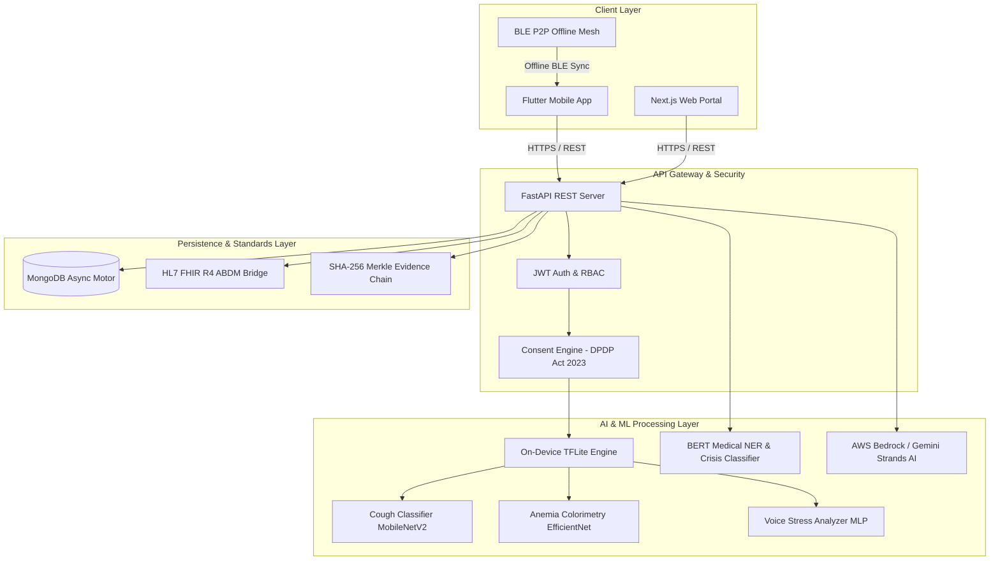

# SvasthyaSetu (स्वास्थ्य सेतु) — Master Technical Blueprint & System Explanation

> **Unified AI-Powered Healthcare Ecosystem for Rural Triage, Disaster Resilience, and Clinical Support**
> **Smart India Hackathon 2026 Submission Document**

---

## 1. Executive Summary & Problem Statement Mapping

India’s healthcare landscape faces a critical triad of challenges: **geographical accessibility**, **clinical time constraints**, and **psychological distress in high-risk groups**. **SvasthyaSetu** provides a single, unified technology bridge that solves 4 distinct Smart India Hackathon problem statements through 4 domain-tailored applications built on a shared, privacy-preserving core architecture:

```
                                  ┌─────────────────────────────────────────┐
                                  │      SvasthyaSetu Core Ecosystem        │
                                  └────────────────────┬────────────────────┘
                                                       │
         ┌──────────────────────┬──────────────────────┼──────────────────────┐
         ▼                      ▼                      ▼                      ▼
┌──────────────────┐   ┌──────────────────┐   ┌──────────────────┐   ┌──────────────────┐
│   ArogyaSathi    │   │    MediKiosk     │   │   RakshakMitra   │   │   NyayaSahay     │
│   (SIH26094)     │   │   (SIH26186)     │   │   (SIH26047)     │   │   (SIH26181)     │
├──────────────────┤   ├──────────────────┤   ├──────────────────┤   ├──────────────────┤
│ Continuous Vitals│   │ Structured OPD   │   │ Burnout & Mental │   │ Victim Protection│
│ Disaster Heat Risk│  │ Intake & OCR     │   │ Health Monitoring│   │ BSA Legal Chain  │
│ Acoustic Biomarker│  │ Dual Prescriptions│  │ Command Heatmaps │   │ Dead Man Switch  │
└──────────────────┘   └──────────────────┘   └──────────────────┘   └──────────────────┘
```

| Problem Statement ID | Domain Application | Target Beneficiaries | Core Problem Solved |
|----------------------|--------------------|----------------------|---------------------|
| **SIH26094** | 🫀 **ArogyaSathi** | Rural populations, outdoor laborers, disaster victims | Lack of non-invasive continuous health monitoring & heat stress triage |
| **SIH26186** | 🏥 **MediKiosk** | OPD patients, physicians, AYUSH practitioners | 2-minute OPD consultation time limit & loss of structured clinical history |
| **SIH26047** | 🎖️ **RakshakMitra** | CAPF / Armed forces personnel & commanders | Silent burnout, operational stress, and lack of early warning suicide prevention |
| **SIH26181** | ⚖️ **NyayaSahay** | SC/ST atrocity victims & legal counselors | Post-complaint psychological trauma & legal evidence tampering during long trials |

---

## 2. System Architecture & End-to-End Data Flow

### 2.1 Multi-Layer Architecture Diagram



---

## 3. Comprehensive Breakdown of All 18 Features

### Feature 1: Cough-to-Diagnosis Audio Screener (SIH26094)
- **Input**: Raw 5-second WAV audio sample recorded via smartphone microphone.
- **Processing**: Librosa extracts 128 Mel-spectrogram bins (224x224). MobileNetV2 transfer learning model classifies audio into 5 diagnostic states (Dry Cough, Wet Cough, Wheezing, TB Suspect, Normal).
- **Output**: Diagnostic probability, acoustic spectral chart, and recommended clinical referral.

### Feature 2: Non-Invasive Palmar & Nail Bed Anemia Estimator (SIH26094)
- **Input**: Smartphone camera crop of fingernail bed / palmar conjunctiva surface.
- **Processing**: OpenCV segmenter isolates ROI, extracts RGB/CIELAB color space values, computes Hemoglobin concentration using EfficientNet-B0 colorimetry regression.
- **Output**: Estimated Hb value (g/dL), severity classification (Normal, Mild, Moderate, Severe), and dietary advice.

### Feature 3: Dynamic Outbreak & Symptom Heatmap (SIH26094)
- **Input**: Anonymized geotagged symptom reports from mobile users and BLE mesh pings.
- **Processing**: Haversine DBSCAN spatial clustering ($eps = 2\text{ km}, \text{min\_samples} = 3$) clusters localized fever spikes in real time.
- **Output**: Interactive Leaflet/Mapbox heatmap showing epidemic hotspots and contagion vectors.

### Feature 4: Dead Man's Switch & Stealth Panic Trigger (SIH26181 / SIH26047)
- **Input**: Passive device heartbeat timer or stealth gesture (shake rhythm, fake calculator PIN).
- **Processing**: Background daemon tracks inactivity threshold. If expired without PIN verification, automated stealth panic protocol triggers.
- **Output**: Encrypted SMS alert with GPS coordinates to legal aid/welfare officers; screen disguised as calculator UI.

### Feature 5: Multilingual Voice Journaling + Bhashini Translation (SIH26186)
- **Input**: Vernacular spoken audio in 10+ Indian languages (Hindi, Tamil, Telugu, etc.).
- **Processing**: Bhashini ASR transcribes speech; IndicTrans2 translates to English; Librosa extracts pitch jitter/vocal tremor for sentiment analysis.
- **Output**: Translated clinical summary, acoustic emotion badge, and longitudinal mood trajectory.

### Feature 6: Dual Prescription Engine — Allopathic + AYUSH (SIH26186)
- **Input**: ICD-11 diagnosis code or patient symptom list.
- **Processing**: Dual-pathway knowledge graph generates parallel Western medical treatments alongside Ministry of AYUSH approved formulations, cross-checking herb-drug interactions.
- **Output**: Side-by-side prescription card with dosage, duration, and safety contraindications.

### Feature 7: Family Health Graph & Genetic Risk Mapper (SIH26094)
- **Input**: Multi-generational family medical history nodes (parents, grandparents).
- **Processing**: NetworkX graph propagation algorithm calculates hereditary vulnerability scores for diabetes, hypertension, and anemia.
- **Output**: Visual family lineage tree with risk badges and early preventive screening reminders.

### Feature 8: Gamified Smart Medicine Adherence Tracker (SIH26094 / SIH26186)
- **Input**: Dose confirmation logs from patient.
- **Processing**: Streak tracking algorithm updates daily adherence percentage and awards Health Karma XP points upon dose verification.
- **Output**: Visual streak calendar, pill reminder notifications, and XP progress bar.

### Feature 9: Community Immunity Network — CIN Hub (SIH26094)
- **Input**: Offline peer-to-peer Bluetooth Low Energy (BLE) beacon packets.
- **Processing**: Anonymized node ID generator creates cryptographic zero-knowledge IDs ($SHA\text{-}256(\text{MAC} + \text{Salt})$) for mesh symptom exchange without internet access.
- **Output**: Hyper-local offline contagion alerts and community health score.

### Feature 10: Cultural AI Counselor with Crisis Escalation (SIH26186 / SIH26181)
- **Input**: Natural language chat input in English/Hindi/transliterated vernacular.
- **Processing**: Fine-tuned DistilBERT crisis model assesses self-harm ideation risk. If risk $> 0.30$, auto-escalates to Tele-MANAS/KIRAN helpline.
- **Output**: Empathetic, culturally aware coping advice and immediate emergency hotline connectivity.

### Feature 11: Real-time Heat Stress & Environmental Advisory (SIH26094)
- **Input**: Live GPS coordinates.
- **Processing**: Open-Meteo API fetches ambient temperature, humidity, US AQI; computes Wet Bulb Globe Temperature (WBGT) index:
  $$\text{WBGT} = (0.7 \times T_{\text{body}}) + (0.2 \times H) + 5.0$$
- **Output**: WBGT index, dehydration risk percentage, recommended daily water intake (L), and NDMA heatwave advisory.

### Feature 12: Longitudinal 3D Digital Twin & Health Score Engine (All PS)
- **Input**: Aggregated vitals, OPD records, screening outputs, and stress scores.
- **Processing**: Holistic scoring algorithm normalizes multi-organ telemetry into a 0-100 master health score and 30-day risk trajectory.
- **Output**: Interactive organ status avatar (Cardiovascular, Pulmonary, Metabolic, Mental) with predictive health recommendations.

### Feature 13: Universal ABDM / FHIR R4 Health Data Bridge (All PS)
- **Input**: 14-digit ABHA Number.
- **Processing**: ABDM M1/M2/M3 Sandbox Gateway authenticates ABHA identity and exports standardized HL7 FHIR R4 Patient & Condition JSON bundles.
- **Output**: Linked ABHA badge and downloadable FHIR R4 clinical bundle.

### Feature 14: Privacy-Preserving Federated Learning Pipeline (All PS)
- **Input**: On-device model training gradients.
- **Processing**: Federated Averaging (FedAvg) aggregates differentially private weight updates ($\varepsilon = 0.85$) from rural edge nodes without centralizing raw data.
- **Output**: Continuously improved global TFLite models with zero privacy leakage.

### Feature 15: ASHA Worker Copilot & Rural Field Triage (SIH26094)
- **Input**: Village resident vitals, age, maternal status, and chief complaints.
- **Processing**: Rule-based MoHFW RCH Portal triage engine evaluates maternal and child mortality risk factors.
- **Output**: Color-coded triage status (Red, Yellow, Green), recommended referral path (PHC/CHC/108 Ambulance), and offline sync tag.

### Feature 16: Cryptographic Evidence Chain for Legal Integrity (SIH26181)
- **Input**: Incident timestamp, GPS coordinates, and encrypted audio/statement payload.
- **Processing**: SHA-256 Merkle tree generates tamper-evident block hashes compliant with Bharatiya Sakshya Adhiniyam (BSA) 2023 Section 63.
- **Output**: Cryptographic Merkle root hash, block index, and court-admissible certificate.

### Feature 17: Offline-First Edge AI & Fallback Engine (All PS)
- **Input**: Network connectivity status (Online vs Zero Signal).
- **Processing**: Dynamic fallback router switches model inference seamlessly between cloud REST endpoints and embedded TFLite assets (`cough_classifier.tflite`, `anemia_estimator.tflite`).
- **Output**: Uninterrupted offline diagnostic capabilities in remote border/rural regions.

### Feature 18: Health Karma & Community Rewards Marketplace (All PS)
- **Input**: Verified adherence logs, epidemic symptom reports, and check-in streaks.
- **Processing**: Reward engine converts earned Health Karma points into redeemable healthcare vouchers.
- **Output**: Active points balance, digital achievement badges, and Jan Aushadhi Kendra medicine discount coupons.

---

## 4. Technical Approach, Feasibility, Viability & Impact

### 4.1 Technical Approach & Standards Compliance
- **AI Models & Frameworks**: PyTorch, TensorFlow Lite, HuggingFace Transformers (DistilBERT, mBERT), Scikit-Learn (DBSCAN, Random Forest), Librosa.
- **Standards & Regulations Compliance**:
  - **DPDP Act 2023**: Granular consent engine with audio explanation for low-literacy users.
  - **ABDM / FHIR R4**: Ayushman Bharat Digital Mission interoperability.
  - **BSA 2023 Sec 63**: Cryptographic Merkle tree verification for electronic evidence admissibility.
  - **MoHFW Guidelines**: Standard Treatment Guidelines (STGs) & AYUSH pharmacopeia integration.

### 4.2 Feasibility and Viability
- **Low Infrastructure Cost**: Backend runs efficiently on cloud container instances; ML inference offloaded to client devices via TFLite (0 server GPU cost for edge screenings).
- **Offline Reliability**: Full offline functionality via local SQLite/Hive and BLE P2P mesh sync for regions with zero internet connectivity.
- **Scalability**: Stateless FastAPI architecture backed by async MongoDB Motor handles millions of concurrent health pings.

### 4.3 Impact and Benefits
- **Societal Impact**: Eliminates travel barriers for rural diagnostic screenings (anemia, respiratory issues).
- **Clinical Efficiency**: Saves 3-4 minutes per patient in overcrowded Indian hospital OPDs by pre-generating structured SOAP notes.
- **Personnel Protection**: Early warning burnout detection reduces stress-related casualties among CAPF and armed forces.
- **Legal Justice**: Protects atrocity victims with tamper-proof legal evidence chains and stealth panic mechanisms.

---

## 5. Research & References

1. **COUGHVID Audio Dataset**: Zenodo Open Repository, EPFL (https://zenodo.org/records/4498364).
2. **Coswara Respiratory Dataset**: Indian Institute of Science (IISc) Bengaluru (https://github.com/iiscleap/Coswara-Data).
3. **Non-Invasive Fingernail Anemia Dataset**: Mendeley Data (https://data.mendeley.com/datasets/2xx4j3kjg2/1).
4. **RAVDESS Emotional Speech Audio**: Zenodo Open Repository (https://zenodo.org/records/1188976).
5. **Bharatiya Sakshya Adhiniyam (BSA) 2023**: Section 63 Admissibility of Electronic Records, Ministry of Law and Justice, Govt. of India.
6. **National Health Authority (NHA)**: Ayushman Bharat Digital Mission (ABDM) FHIR R4 Specifications (https://abdm.gov.in/).
7. **National Disaster Management Authority (NDMA)**: Guidelines on Management of Heat Waves & Extreme Weather Events.
